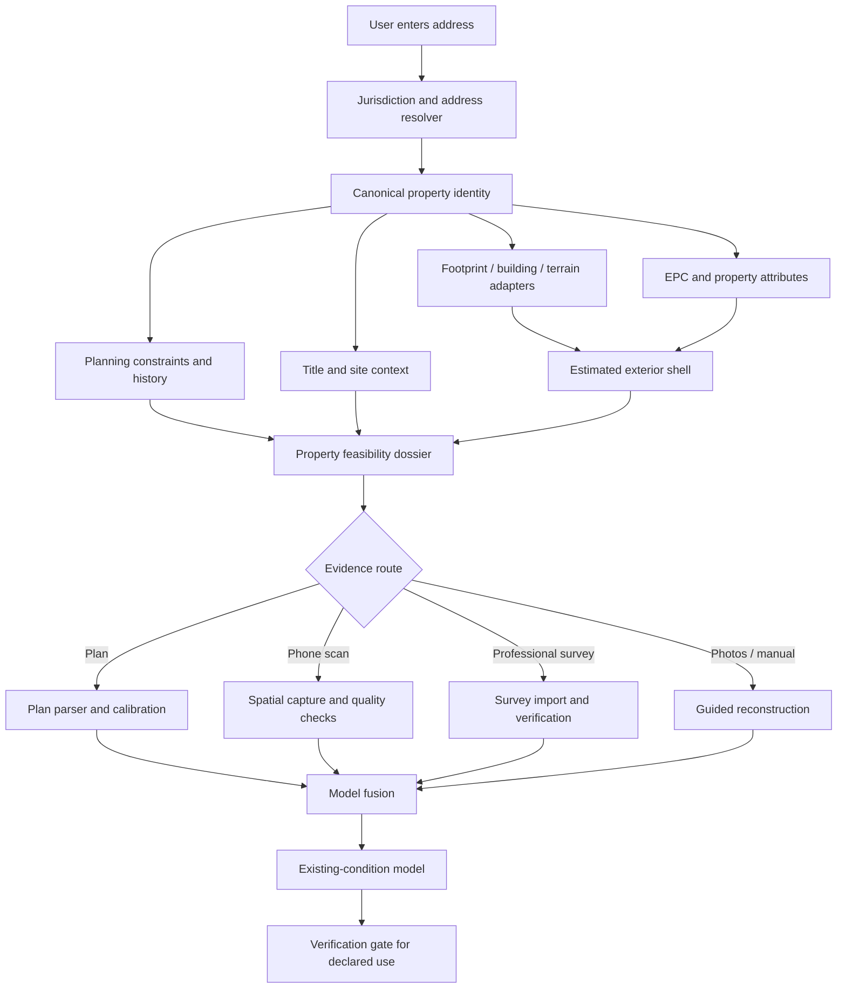

# 04 — UK Property Data and Address-to-3D

## 1. Critical conclusion

An address can create a valuable **property context and estimated shell**, but it cannot normally create an exact current interior model of a private UK home.

The address-to-3D promise must therefore be decomposed into two stages:

1. **Address-to-context:** identity, UPRN or national equivalent, footprint, site, terrain, height, floor-count evidence, EPC information, planning designations, application history, environmental context, and an estimated massing model.
2. **Evidence-to-existing-model:** floor plans, scans, photographs, key measurements, prior drawings, and professional survey are fused into a model suitable for a declared use.

The product’s trust depends on showing this distinction rather than presenting a probabilistic shell as measured truth.

## 2. UK data architecture: four jurisdiction adapters

The United Kingdom should not be implemented as one uniform planning and property-data jurisdiction. The target architecture should expose a common internal contract while using separate adapters for:

- England;
- Wales;
- Scotland;
- Northern Ireland.

Differences include:

- address and property identifiers;
- land-registration systems;
- planning portals and policy structures;
- EPC services;
- spatial-data portals;
- building standards and terminology;
- party-wall law;
- data licensing and availability.

An “England first” launch can be sensible, but the domain model and API must preserve jurisdiction from the beginning.

## 3. Canonical property identity

### 3.1 UPRN

The Unique Property Reference Number is a strong canonical join key across Great Britain. [OS Places API](https://www.ordnancesurvey.co.uk/products/os-places-api) supports address, postcode, partial-address, and UPRN searches, using licensed address data. It is not equivalent to an unrestricted free address API.

[OS Open UPRN](https://www.ordnancesurvey.co.uk/products/os-open-uprn) provides UPRNs and coordinates for roughly 40 million addressable locations across Great Britain under open terms, but it does not provide the complete address strings that premium address products provide.

### 3.2 AddressBase Premium

[AddressBase Premium](https://www.ordnancesurvey.co.uk/products/addressbase-premium) provides richer address and lifecycle information and may be needed for production-quality address resolution, sub-building handling, and change history.

### 3.3 Northern Ireland

Northern Ireland has distinct addressing infrastructure. The [Pointer address database](https://www.finance-ni.gov.uk/topics/pointer-address-database) is maintained separately and should be integrated through a jurisdiction-specific licensing and data contract.

### 3.4 Internal identity rules

A property record should not use the entered address string as its primary key. It should contain:

- platform property ID;
- jurisdiction;
- UPRN or jurisdiction-specific identifier where available;
- current and historical address strings with source/date;
- coordinates and coordinate reference system;
- land-title references where lawfully available;
- building IDs from licensed mapping where available;
- confidence and match method;
- sub-building and multi-unit relationships.

## 4. Building footprint and external geometry

### 4.1 Ordnance Survey building data

[OS National Geographic Database Buildings](https://docs.os.uk/osngd/data-structure/buildings) includes building and building-part features. Depending on the product and licence, attributes may include height, roof, age, material, floor-count, and functional information. The platform must review current licensing, attribution, storage, derivative-work, and redistribution terms before architecture decisions are finalised.

OS publishes [known limitations](https://docs.os.uk/osngd/using-os-ngd-data/os-ngd-buildings/known-limitations), which should be ingested into the platform’s data-quality catalogue rather than hidden from users.

[OS OpenMap Local](https://www.ordnancesurvey.co.uk/products/os-openmap-local) can support lower-cost open mapping and context but is not a substitute for the richest licensed building data.

### 4.2 What footprint data can support

- building outline and parts;
- relation to neighbouring buildings;
- approximate site coverage;
- initial roof/massing hypotheses;
- extension footprint comparisons;
- context maps and simple 3D extrusion;
- check that an uploaded plan broadly aligns with external evidence.

### 4.3 What it cannot establish

- exact wall thickness;
- internal partition locations;
- floor-to-floor heights unless separately evidenced;
- concealed extensions or unrecorded works;
- internal level changes;
- structural system;
- exact roof construction;
- current openings where the mapping source is not designed to capture them.

## 5. Terrain, roof, and surface context

### 5.1 England

The Environment Agency publishes open LiDAR products, including a [1 metre digital terrain model](https://environment.data.gov.uk/dataset/13787b9a-26a4-4775-8523-806d13af58fc) and [1 metre digital surface model](https://environment.data.gov.uk/dataset/9ba4d5ac-d596-445a-9056-dae3ddec0178). Coverage is reported at approximately 99% of England.

Potential uses:

- site slope;
- surrounding terrain;
- broad roof/surface height;
- drainage and access context;
- visual massing;
- comparison against licensed building height.

Limitations:

- one-metre resolution is not a measured building survey;
- acquisition date may differ from current condition;
- vegetation and roof complexity affect interpretation;
- internal levels cannot be derived reliably;
- coordinate and vertical datum handling must be explicit.

### 5.2 Wales

[DataMapWales](https://datamap.gov.wales/) provides national spatial datasets, including a [2020–2023 LiDAR tile catalogue](https://datamap.gov.wales/layers/geonode%3Awelsh_government_lidar_tile_catalogue_2020_2023), historic LiDAR, and planning/environmental layers.

### 5.3 Scotland

Scotland provides remote-sensing data through the [Scottish Remote Sensing Portal](https://remotesensingdata.gov.scot/data). Coverage, licensing, and acquisition dates should be tracked per tile.

### 5.4 Northern Ireland

[SpatialNI](https://www.spatialni.gov.uk/) and [Land & Property Services data](https://www.finance-ni.gov.uk/articles/land-property-services-lps-data-available-online) provide the starting points for NI-specific spatial information.

## 6. Site and title context

### 6.1 England and Wales: HMLR INSPIRE polygons

[HM Land Registry INSPIRE Index Polygons](https://www.gov.uk/guidance/inspire-index-polygons-spatial-data) show the indicative position and extent of registered freehold property. They are not the legal title plan and should not be used as a precise boundary survey.

Appropriate uses:

- initial site context;
- approximate title association;
- identifying potential mismatch requiring investigation;
- pre-feasibility mapping.

Inappropriate uses:

- asserting a legal boundary;
- setting out construction;
- resolving a boundary dispute;
- guaranteeing ownership of a strip of land.

HMLR provides [API information](https://use-land-property-data.service.gov.uk/api-information) for selected property datasets. Current terms and coverage must be checked per service.

### 6.2 Scotland and Northern Ireland

Registers of Scotland and Land & Property Services operate separate registration systems. The product should create country-specific title-context adapters and avoid projecting England/Wales concepts onto other jurisdictions.

## 7. EPC data

The [Energy Performance of Buildings Data service](https://get-energy-performance-data.communities.gov.uk/) provides bulk and API access to EPC data for England and Wales, subject to its terms and data-quality considerations.

Potential attributes include:

- property type;
- total floor area;
- age band;
- energy rating;
- heating and fabric descriptions;
- certificate date and status.

Uses:

- corroborating floor area;
- initial building archetype;
- energy-improvement opportunities;
- identifying outdated evidence;
- scenario modelling.

Limitations:

- EPC records can contain errors;
- the certificate may predate alterations;
- matching by address can be ambiguous;
- floor area is not a floor plan;
- descriptive fields should not be converted into construction truth without verification.

Scotland maintains a separate EPC register. Northern Ireland requires separate treatment. The platform should not silently display England/Wales EPC logic nationwide.

## 8. Planning data

### 8.1 Planning Data for England

[Planning Data](https://www.planning.data.gov.uk/docs) provides an API and more than 100 standardised planning and housing datasets for England. Relevant datasets include:

- conservation areas;
- listed buildings;
- Article 4 directions;
- tree preservation orders where available;
- planning applications and decisions where available;
- local planning authority and policy entities;
- green belt and other designations.

Important caveat: dataset completeness varies. For example, the [conservation-area dataset](https://www.planning.data.gov.uk/dataset/conservation-area) can contain incomplete or duplicate records, while the [listed-building dataset](https://www.planning.data.gov.uk/dataset/listed-building) may use point representations rather than a complete legal extent.

The platform should surface source coverage and, for consequential decisions, check the relevant local authority record.

### 8.2 Local planning portals

Local authorities publish application metadata and often supporting documents. Coverage, search interfaces, document availability, and historical depth vary considerably.

The platform can use planning portals for:

- application history;
- proposal descriptions;
- decisions and conditions;
- officer reports;
- local precedents;
- supporting drawings where use is lawful.

It should not assume every portal has a stable public API. A long-run integration strategy may include:

- official APIs where provided;
- Planning Data standardisation;
- licensed aggregators;
- user-authorised document retrieval;
- manual verification for high-consequence cases.

The [Planning Portal](https://www.planningportal.co.uk/applications) operates national application-submission services and has discussed moving integration from legacy XML/SOAP toward modern JSON/API approaches in its [local-authority integration material](https://www.planningportal.co.uk/local-authority-bulletins/we-want-to-work-with-local-planning-authorities-and-their-it-suppliers-to-improve-planning-software). This is a potential future integration route, not permission to automate submissions without commercial and technical agreements.

### 8.3 Historic drawing extraction

The UK government has explored AI-assisted digitisation of historic planning records through the [Extract programme](https://mhclgdigital.blog.gov.uk/2025/06/12/extract-using-ai-to-unlock-historic-planning-data/). This is strategically encouraging: planning evidence may become more machine-readable.

It does not remove copyright, data-protection, reliability, or local-authority validation requirements.

## 9. Planning drawings and copyright

A document visible on a planning portal is not automatically free for commercial reuse, model training, redistribution, or derivative product creation. Councils commonly state that plans and drawings are protected by copyright and may be used only for consultation, comparing current applications, or checking compliance without further permission. See, for example, East Suffolk Council’s [public-access guidance](https://www.eastsuffolk.gov.uk/planning-and-building-control/planning-applications/public-access/intro).

A lawful data strategy should distinguish:

- public metadata and decisions;
- open-licensed spatial data;
- documents viewable under a limited statutory/public-access purpose;
- user-uploaded documents with declared rights;
- licensed professional drawing datasets;
- internally created and consented project data;
- synthetic training data.

The platform should store rights metadata at asset level:

- source URL/provider;
- copyright owner if known;
- licence;
- permitted uses;
- training permission;
- derivative-work permission;
- retention requirement;
- sharing restrictions;
- deletion request status.

## 10. Price and market context

[HM Land Registry Price Paid Data](https://www.gov.uk/government/statistical-data-sets/price-paid-data-downloads) can provide transaction history for England and Wales. The [linked-data application](https://landregistry.data.gov.uk/app/ppd/) provides another access route.

Potential uses:

- broad value context;
- project-to-property-value ratios;
- neighbourhood trend analysis;
- customer education.

Limitations:

- sale price is not current valuation;
- transaction data should not be presented as formal valuation advice;
- renovation value uplift is highly uncertain and requires controlled analysis;
- personalisation and financial-advice implications must be reviewed.

## 11. Address-to-model pipeline



### 11.1 Step 1: resolve

- normalise the user’s entered address;
- query authoritative/licensed resolver;
- handle flats and sub-buildings;
- establish jurisdiction;
- store match alternatives and confidence;
- avoid silently choosing when ambiguous.

### 11.2 Step 2: enrich

Retrieve through policy-controlled adapters:

- building footprint/parts;
- terrain and surface tiles;
- height and floor-count evidence;
- EPC records;
- site/title context;
- planning constraints;
- planning applications;
- environmental data relevant to the declared product scope.

### 11.3 Step 3: estimate shell

Create a coarse massing model with:

- footprint geometry;
- estimated storeys;
- roof hypothesis;
- broad height;
- adjacency to neighbours;
- site and terrain.

Every generated element must be `INFERRED` unless directly supported.

### 11.4 Step 4: choose evidence route

The platform assesses whether the customer can self-capture or needs a professional survey based on:

- project stage;
- property complexity;
- device capability;
- floor count;
- scan completeness;
- required accuracy;
- intended downstream use;
- customer confidence.

### 11.5 Step 5: model fusion

Fuse plan, scan, manual, public, and survey evidence through constraints rather than averaging everything indiscriminately. Higher-authority evidence should not be overwritten by a weaker source without explicit review.

### 11.6 Step 6: quality report

The model should report:

- coverage by room/level;
- critical dimensions measured versus inferred;
- conflicts between sources;
- closure error;
- scan drift indicators;
- unobserved zones;
- likely external/internal mismatch;
- declared tolerance and intended use;
- required verification tasks.

## 12. Proposed property-dossier schema

```json
{
  "property_id": "prop_01J...",
  "jurisdiction": "england",
  "address": {
    "display": "10 Example Road, London, AB1 2CD",
    "uprn": "100000000000",
    "match_status": "matched",
    "source": "os_places",
    "retrieved_at": "2026-07-16T12:00:00Z"
  },
  "location": {
    "crs": "EPSG:27700",
    "easting": 530000.0,
    "northing": 180000.0
  },
  "building_context": {
    "footprint_asset_id": "asset_footprint_123",
    "height_m": {
      "value": 7.8,
      "status": "AUTHORITATIVE_EXTERNAL",
      "confidence": 0.82
    },
    "storeys": {
      "value": 2,
      "status": "INFERRED",
      "confidence": 0.71
    }
  },
  "planning": {
    "constraints": [],
    "coverage_warnings": [
      "Planning Data coverage may be incomplete; verify local authority source before consequential advice."
    ]
  },
  "interior": {
    "status": "UNKNOWN",
    "recommended_capture_route": "guided_roomplan"
  },
  "rights": {
    "shareable_with_customer": true,
    "model_training_allowed": false
  }
}
```

## 13. Data-quality and provenance policy

Every data adapter should publish:

- provider;
- product/dataset;
- licence version;
- access date;
- spatial/temporal coverage;
- expected update frequency;
- matching method;
- known limitations;
- transformation applied;
- retention and redistribution rights;
- downstream uses allowed;
- fallback source;
- user-visible warning template.

A value without this metadata should not be allowed into a consequential workflow.

## 14. Data acquisition sequence

### Phase 1

- licensed address resolution;
- OS Open UPRN for open cross-reference;
- basic open building/context data;
- Planning Data England;
- EPC England/Wales;
- Environment Agency LiDAR;
- user uploads and scans;
- manual local-authority checking for professional cases.

### Phase 2

- richer licensed OS NGD building attributes;
- planning aggregator APIs;
- automated local-portal adapters where lawful and stable;
- HMLR and additional environmental services;
- cost and product datasets;
- Wales adapter.

### Phase 3

- Scotland and Northern Ireland adapters;
- property-history and permission graph;
- licensed drawing partnerships;
- national planning precedent model;
- continuous data-quality reconciliation.

## 15. Data moat versus public data

Public and licensed data are inputs, not the moat. Competitors can obtain many of the same sources. The differentiated dataset becomes:

- corrected property identities;
- consented scans and plans;
- verified geometry;
- inferred-versus-actual comparisons;
- planning proposal geometry linked to outcomes;
- design decisions and selected options;
- quantities, bids, contracted price, and final cost;
- site discoveries;
- as-built models;
- defects and warranty outcomes.

This data is only valuable if:

- rights and consent are explicit;
- provenance is retained;
- models are comparable;
- project outcomes are structured;
- privacy and security are strong;
- customers can exercise relevant rights.

## 16. Critical research questions

- What exact OS licences allow storage, visualisation, derivative geometry, and customer export?
- How accurately can address, EPC, and building records be matched across property subdivisions and historical changes?
- What percentage of target homes have useful planning history and documents?
- Can planning-document metadata be standardised without ingesting restricted drawings?
- How often do floor-count, height, and EPC area disagree with survey evidence?
- Which property archetypes can be inferred reliably from external data?
- What capture evidence is needed for planning versus technical design versus pricing?
- How should users grant training and secondary-use consent separately from service processing?
- Which data sources have national versus local gaps that could create biased service quality?

The address-to-3D feature is credible when it is presented as an evidence-assembly and uncertainty-reduction system—not as clairvoyance.
