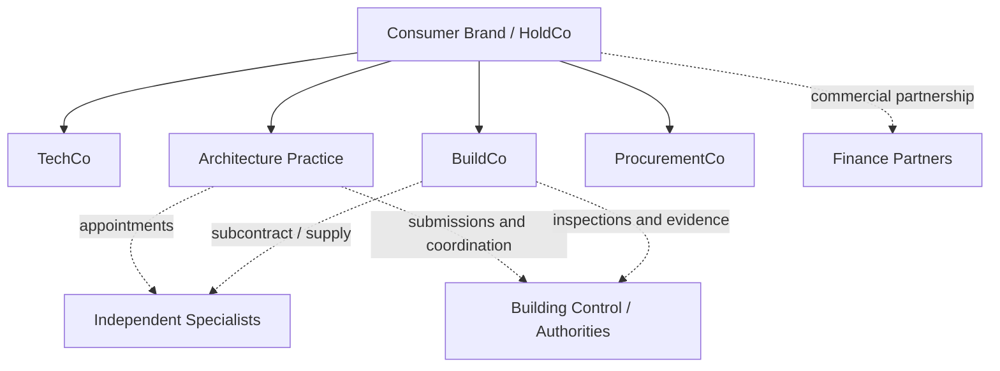

# 05 — Regulatory, Professional, and Data Governance

## 1. Purpose and caveat

This document identifies major UK legal, regulatory, professional, data, and consumer-protection issues that shape the product and operating model. It is not legal advice. The final structure requires current advice from UK counsel, registered architects, professional-indemnity advisers, building-safety specialists, data-protection professionals, finance-regulatory advisers, and relevant national/jurisdictional experts.

The product cannot treat regulation as a later legal review. Responsibility, evidence, status, permissions, and auditability affect the domain model, user interface, organisational design, and commercial promises from the first prototype.

## 2. The protected title “architect”

The Architects Registration Board explains that anyone may provide architectural services in the UK, but only a person on the Architects Register may use the protected title **architect** in business or practice. See ARB’s [public guidance](https://arb.org.uk/public-information/before-hiring-an-architect/who-can-use-the-title-architect/).

ARB also provides conditions for using “architect” in a company or business name, including registered-architect control and responsibility requirements. See [using the title within a company name](https://arb.org.uk/architect-information/using-title-architect-within-company-name/).

### Strategic implications

- A pure software company can provide design tools without describing unregistered people or the service misleadingly as an architect.
- A company aspiring to be a full-stack architecture agency should employ registered architects and operate an appropriately governed and insured architecture practice.
- “AI architect” is a risky customer phrase if it obscures who is registered, appointed, and responsible.
- The product should display the human professional responsible for each professional review.
- Acquiring an architecture practice is not equivalent to acquiring an insurance carrier licence. The protected-title and professional-practice regime does not create a single scarce corporate licence that unlocks the market nationally.

### Recommended positioning

Early consumer language may use:

- AI-native home design and renovation platform;
- residential transformation studio;
- architecture service delivered by registered architects;
- digital design assistant with professional review.

Use of “architect” should be reviewed and approved within the actual entity and professional-control structure.

## 3. Professional-indemnity insurance and liability

ARB requires architects to maintain adequate professional indemnity insurance for their work and publishes [PII guidance](https://arb.org.uk/architect-information/professional-indemnity-insurance/pii-guidance/). ARB materials indicate expected minimum cover and require adequacy relative to project scale and risk; the exact policy, exclusions, aggregation, retroactive date, and run-off position require specialist advice.

ARB also notes that professional liabilities may continue for years after completion. See its [setting-up-a-business guidance](https://arb.org.uk/architect-information/setting-up-own-business-for-the-first-time/).

### Product implications

- Every professional output must be versioned and attributable.
- The system must preserve the evidence available when a decision was made.
- Automated suggestions cannot silently become professional advice.
- Professional review must declare purpose and limitations.
- The model needs immutable records of approvals, superseded information, and downstream reliance.
- Subconsultants need controlled appointments, scope, insurance evidence, and document exchange.
- AI vendors and open-source components do not absorb the practice’s professional liability.
- A model update after issue must not erase the previously issued state.

### Insurance diligence for acquisitions

If acquiring a practice, investigate:

- historic project types and jurisdictions;
- claims and circumstances notified;
- PII policy history and exclusions;
- cladding/fire-safety exposure;
- collateral warranties and third-party rights;
- novations and design-and-build appointments;
- limitation periods;
- records and document retention;
- use of unlicensed data or software;
- employment and competence records;
- potential run-off cost.

An acquisition may import a professional-liability tail that is not visible in current revenue.

## 4. Building Regulations dutyholders

The post-Building Safety Act framework places duties on clients, designers, contractors, Principal Designers, and Principal Contractors. Government guidance on [meeting building requirements](https://www.gov.uk/guidance/design-and-building-work-meeting-building-requirements) explains the dutyholder framework, while the [Building Regulations etc. (Amendment) (England) Regulations 2023](https://www.legislation.gov.uk/uksi/2023/911/regulation/6) contain relevant legal provisions.

The exact application differs by jurisdiction and project. The product should never model “building regulations approved” as a single generic checkbox.

### Required system concepts

- project jurisdiction;
- dutyholder role;
- organisation and named competent person;
- appointment date and scope;
- competence evidence;
- design responsibility matrix;
- information requirement;
- review status;
- change notification;
- building-control interaction;
- completion evidence.

### Building Regulations Principal Designer

The Building Regulations Principal Designer role has statutory responsibilities distinct from ordinary architectural design services. The company should use a separate appointment/scope and should not imply that selecting an AI-generated option automatically satisfies the duty.

## 5. CDM 2015 and health and safety

The Health and Safety Executive explains the role of the [CDM Principal Designer](https://www.hse.gov.uk/construction/cdm/2015/principal-designers.htm), the treatment of [domestic clients](https://www.hse.gov.uk/construction/cdm/2015/domestic-clients.htm), and the broader [CDM framework](https://www.hse.gov.uk/construction/cdm/2015/summary.htm).

### Product requirements

The design and delivery system should support:

- pre-construction information;
- identified hazards and design-risk decisions;
- elimination/reduction/control reasoning;
- designer and contractor competence records;
- construction-phase information transfer;
- health and safety file inputs;
- versioned evidence of changes;
- alerts when a design operation creates a new risk.

AI can assist in identifying common hazards, but it must not turn health-and-safety review into a generic auto-completed checklist.

## 6. Planning permission and public decisions

Planning decisions remain with the relevant local authority or other competent body. The platform may:

- identify likely permission routes;
- retrieve policies and constraints;
- find relevant application precedent;
- generate and validate submission information;
- track authority questions;
- estimate relative risk.

It cannot guarantee permission.

The UK government’s 2026 AI planning work explicitly retains qualified planning-officer review. See the government announcement, [AI tool to support planning decisions](https://www.gov.uk/government/news/ai-tool-to-slash-planning-decision-times-as-government-accelerates-push-to-build-15-million-homes), and the MHCLG Digital explanation, [what it means for planners and residents](https://mhclgdigital.blog.gov.uk/2026/06/19/using-ai-to-support-planning-decisions-what-it-means-for-planners-and-residents/).

### Safe commercial promises

Potential promises:

- application completeness checks;
- planning-readiness review;
- transparent risk explanation;
- included revision rounds;
- resubmission support under stated conditions;
- money-back or service-credit policies based on the company’s service, not the authority’s decision.

Unsafe promise:

- guaranteed planning approval without narrowly defined terms that do not mislead customers.

## 7. Building control independence

Building control is a public-protection function. The commercial platform may prepare and submit information, coordinate responses, and track inspections. It should not obscure the independence or statutory function of building control.

A full-stack brand should resist the temptation to represent every participant as an internal approval function. Even if corporate ownership were technically possible in some service context, conflicts, statutory restrictions, and public trust require specialist legal analysis and strong independence. The safer default is to keep building control outside the commercial group.

## 8. Structural engineering

The system can identify likely structural questions and coordinate a structural engineer. It cannot responsibly certify:

- load-bearing status from imagery alone;
- beam sizes without design inputs and calculations;
- foundation suitability without evidence;
- concealed condition;
- stability of a modified structure;
- adequacy of construction work from a generative rendering.

### Mandatory structural escalation examples

- removing or widening an existing wall opening;
- altering roofs, chimneys, floors, or stairs affecting structure;
- adding storeys or significant loads;
- basement work;
- unusual spans;
- visible cracking, movement, or defects;
- uncertain construction type;
- retaining structures;
- works near neighbouring structures.

The model should distinguish a **structural concept assumption** from an **engineered design** and from **verified construction**.

## 9. Party Wall etc. Act 1996

The government’s [explanatory booklet](https://www.gov.uk/government/publications/preventing-and-resolving-disputes-in-relation-to-party-walls/the-party-wall-etc-act-1996-explanatory-booklet) explains the Party Wall etc. Act 1996 for England and Wales.

The platform can:

- flag likely triggers;
- explain the process;
- maintain notices and surveyor records;
- coordinate programme dependencies.

It should not offer generic UK-wide advice because the Act does not apply identically across all UK nations. Jurisdiction and case-specific professional review are required.

## 10. Listed buildings, conservation, and specialist work

Listed and heritage work should be excluded from the early automated underwriting box. Reasons include:

- additional consent regimes;
- significance assessment;
- fabric and material sensitivity;
- specialist conservation judgement;
- higher information and negotiation burden;
- professional-indemnity implications;
- potentially severe consequences of unauthorised work.

The platform may support such work later through a specialist pathway, but not by applying a standard house-extension model.

## 11. Consumer-protection law

The [Digital Markets, Competition and Consumers Act 2024](https://www.legislation.gov.uk/ukpga/2024/13) strengthened the UK consumer-protection regime, including direct enforcement powers. The CMA described the new regime coming into force in April 2025 in its [consumer-protection announcement](https://www.gov.uk/government/news/cma-to-boost-consumer-and-business-confidence-as-new-consumer-protection-regime-comes-into-force).

Government guidance covers [online and distance selling](https://www.gov.uk/online-and-distance-selling-for-businesses).

### Product implications

- Do not hide material exclusions behind technical language.
- Do not present illustrative AI media as a guaranteed outcome.
- Explain cancellation rights and when bespoke/digital/professional services begin.
- Present total price, taxes, fees, referral economics, and commissions clearly.
- Disclose when product recommendations are influenced by commercial relationships.
- Avoid countdowns, fake scarcity, manipulative defaults, and misleading “approval probability” claims.
- Preserve evidence of what the customer saw and accepted.
- Complaints and redress routes must be easy to find.

## 12. Consumer credit and project finance

Offering credit, broking finance, introducing customers to lenders, or exercising control over regulated activities may require Financial Conduct Authority permissions or an authorised arrangement. The FCA provides guidance for [consumer credit brokers](https://www.fca.org.uk/firms/authorisation/consumer-credit-brokers), [secondary credit brokers](https://www.fca.org.uk/firms/authorisation/consumer-credit-brokers/secondary-credit-brokers), and [consumer credit lenders](https://www.fca.org.uk/firms/authorisation/consumer-credit-lenders-hirers).

### Recommended sequence

1. Initially partner with appropriately authorised providers.
2. Disclose referral or commission arrangements.
3. Keep design recommendations from being distorted by finance incentives.
4. Obtain specialist advice before becoming an appointed representative, broker, or lender.
5. Treat customer affordability and vulnerability responsibly.

The Revolut analogy should not encourage the company to become a lender before it has solved the architecture and delivery problem.

## 13. Payments and customer money

A managed-delivery platform may handle deposits, milestone payments, retentions, refunds, and disputed sums. The structure should address:

- who holds customer money;
- safeguarding or trust arrangements;
- payment-services implications;
- contractor insolvency;
- chargebacks;
- milestone evidence;
- release authority;
- variation approval;
- final account and retention;
- fraud controls.

Use regulated payment providers and obtain legal advice rather than improvising an “escrow” label.

## 14. Data protection and privacy

The Information Commissioner’s Office provides guidance on [data protection by design and default](https://ico.org.uk/for-organisations/uk-gdpr-guidance-and-resources/accountability-and-governance/guide-to-accountability-and-governance/data-protection-by-design-and-by-default/), [what constitutes personal data](https://ico.org.uk/for-organisations/uk-gdpr-guidance-and-resources/personal-information-what-is-it/what-is-personal-data/what-is-personal-data/), and [AI and data protection](https://ico.org.uk/for-organisations/uk-gdpr-guidance-and-resources/artificial-intelligence/guidance-on-ai-and-data-protection/).

A home model may reveal:

- exact address and occupancy;
- room layout and access routes;
- security systems;
- valuable possessions;
- children’s rooms;
- disability and health information;
- household routines;
- financial position;
- images of people and documents;
- neighbour property information.

This is sensitive even when not every element is legally “special category” data.

### Required controls

- privacy impact assessment for capture and AI functions;
- clear controller/processor roles;
- purpose limitation;
- separate consent or lawful basis for model training and product improvement;
- minimum capture guidance;
- face, document, and screen redaction options;
- strong tenant isolation and access control;
- encrypted storage and transport;
- signed sharing links with expiry;
- household-member permissions;
- deletion and export workflows;
- breach response;
- retention schedules;
- limits on employee access;
- audit trails;
- controls for overseas model providers and transfers.

### Automated decisions

The [Data (Use and Access) Act 2025](https://www.legislation.gov.uk/ukpga/2025/18/contents) changed parts of the UK data framework, including automated decision-making provisions. The company needs current advice on how risk, eligibility, pricing, finance, and professional escalation decisions are governed.

Even where fully automated decisions are lawful, high-consequence project acceptance and safety decisions should have meaningful human review and appeal.

## 15. AI governance

The ICO publishes an [AI risk toolkit](https://ico.org.uk/for-organisations/uk-gdpr-guidance-and-resources/artificial-intelligence/) and guidance on [human review](https://ico.org.uk/for-organisations/advice-and-services/audits/data-protection-audit-framework/toolkits/artificial-intelligence/human-review/). The National Cyber Security Centre publishes [secure AI system development guidance](https://www.ncsc.gov.uk/collection/guidelines-secure-ai-system-development).

The platform should maintain:

- model inventory;
- intended and prohibited uses;
- training and evaluation datasets;
- model/version provenance;
- prompt/tool policies;
- benchmark results;
- bias and coverage analysis;
- incident and near-miss reporting;
- human-override and appeal mechanisms;
- rollback and kill switches;
- red-team evidence;
- supplier risk assessments.

AI-generated recommendations should be traceable to the model state and evidence used.

## 16. Copyright, database rights, and training data

The UK government published a 2026 [report on copyright and artificial intelligence](https://www.gov.uk/government/publications/report-and-impact-assessment-on-copyright-and-artificial-intelligence/report-on-copyright-and-artificial-intelligence). The policy area remains active and should be monitored.

Relevant rights may attach to:

- architectural drawings;
- floor plans;
- photographs;
- 3D models;
- product data;
- planning documents;
- databases;
- generated outputs;
- professional standard details;
- contractor method statements.

### Required asset-rights model

For every uploaded or acquired asset, record:

- uploader/source;
- claimed owner;
- licence or contractual permission;
- service-processing permission;
- customer-sharing permission;
- professional-sharing permission;
- model-training permission;
- commercial derivative permission;
- retention and deletion rules;
- disputed-rights status.

Do not combine “I can use this to complete your project” with “I can use this to train a commercial model” in one opaque acceptance.

## 17. Professional independence and conflicts

A vertically integrated company creates potential conflicts:

- the architect may feel pressure to select the company’s construction solution;
- the cost engine may favour products with higher margin;
- the company may understate risk to secure a build contract;
- an internal reviewer may be reluctant to reject profitable work;
- a contractor network may be presented as independent while paying referral fees.

### Controls

- disclose commercial relationships;
- separate professional review authority from sales targets;
- provide conflict escalation and refusal rights;
- use independent review for high-risk decisions;
- preserve the customer’s ability to export information and appoint alternatives;
- explain whether recommendations are whole-of-market, panel-based, or proprietary;
- create board-level professional and safety governance;
- audit overridden risk decisions.

## 18. Proposed entity and responsibility model

The exact structure requires tax, legal, insurance, and regulatory advice. Its conceptual purpose is to preserve:

- one customer experience;
- clear contracting entity per service;
- professional independence and insurance;
- construction risk containment;
- transparent commissions and referrals;
- statutory independence.

## 19. Mandatory human gates

At minimum, require human professional review before:

- representing an existing model as verified for planning or technical use;
- issuing architectural advice under a professional appointment;
- submitting planning information where the company is responsible for it;
- proposing structural intervention as feasible;
- issuing technical design for construction;
- declaring Building Regulations dutyholder compliance;
- accepting a project into a fixed-price construction product;
- authorising a safety-critical change;
- certifying completion or as-built status.

The gate may be supported by AI, but the named reviewer must have enough information, competence, independence, and time to perform a real review.

## 20. Governance bodies for a mature company

- **Professional Practice Board** — architects, engineers, insurance, standards, and competence.
- **Building Safety and Design Risk Committee** — incidents, near misses, overrides, and high-risk cases.
- **Data and AI Governance Committee** — data rights, privacy, model changes, benchmarks, and supplier risk.
- **Project Underwriting Committee** — eligibility changes, pricing, contingency, and loss experience.
- **Customer Outcomes Committee** — complaints, vulnerable customers, misleading interfaces, refunds, and remediation.
- **Construction Risk Committee** — contractor performance, defects, cash flow, warranties, and territory expansion.

These are not bureaucratic decoration. They are the institutional mechanisms that allow a high-trust full-stack product to scale without hiding risk inside software.
