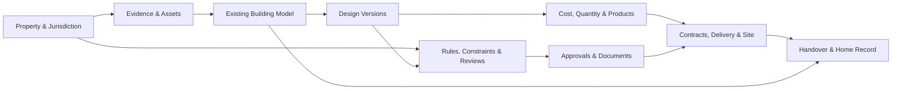
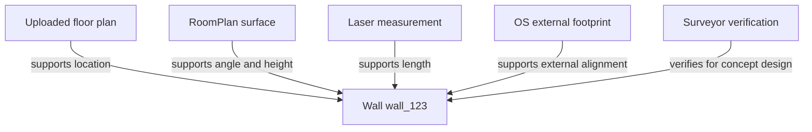
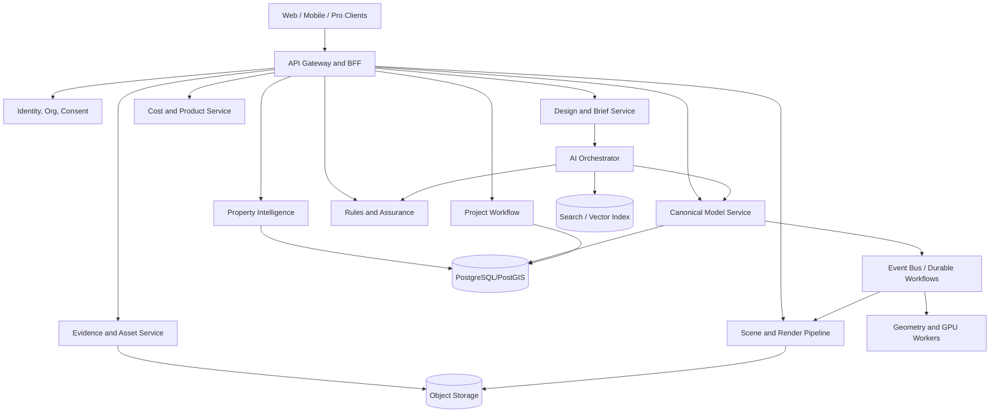

# 06 — Canonical Home Model and System Architecture

## 1. Architectural thesis

The platform requires a **canonical home and project model** that acts as the source of truth across capture, design, planning, technical coordination, cost, procurement, construction, and handover.

The canonical model is not:

- a rendered image;
- a point cloud;
- a Gaussian splat;
- a mesh with no semantics;
- an IFC file used as the live application database;
- a floor-plan bitmap;
- a chat transcript;
- a folder of PDFs.

Those are assets or exchange representations. The canonical model is a domain system that knows:

- what each object is;
- where it came from;
- which property and design version it belongs to;
- how certain it is;
- who has reviewed it;
- what other objects and decisions depend on it;
- which outputs were generated from it;
- whether it is existing, proposed, approved, issued, installed, or as built.

## 2. Non-negotiable model principles

### 2.1 Provenance before precision

A measurement of `3.400 m` is not trustworthy merely because it has three decimal places. The model must state whether it was:

- measured with a laser by a surveyor;
- extracted from a scaled drawing;
- estimated by RoomPlan;
- inferred from an external footprint;
- entered by a user;
- generated as a proposal;
- verified on site.

### 2.2 Unknown is a valid state

The system must preserve unknowns. It should not complete hidden geometry merely because downstream rendering prefers a closed mesh.

### 2.3 One object, multiple representations

A wall may have:

- semantic identity;
- centreline and faces;
- 2D plan geometry;
- 3D parametric geometry;
- display mesh;
- material layers;
- structural assumptions;
- fire/acoustic attributes;
- cost items;
- planning relevance;
- photographs and scan evidence;
- issue/review status.

These representations are linked but not identical.

### 2.4 Immutable history, mutable current state

Users need a simple current model, while the company needs an auditable history. Use append-only operations/events with periodic snapshots so that every issued state can be reconstructed.

### 2.5 Purpose-bound verification

“Verified” must specify **for what use**. A room model may be verified for concept design but not for steel fabrication or setting out.

### 2.6 Derived outputs are reproducible

A drawing, schedule, quantity, render, and video must identify:

- source model version;
- generation configuration;
- product/catalogue version;
- ruleset version;
- renderer/model version;
- date;
- human review status.

## 3. Provenance vocabulary

| State | Definition | Example |
|---|---|---|
| `OBSERVED` | Captured directly from a sensor or inspection, without implying accuracy beyond the capture method. | Point sample from LiDAR. |
| `AUTHORITATIVE_EXTERNAL` | Supplied by an identified official or licensed dataset. | OS building footprint. |
| `USER_PROVIDED` | Entered or uploaded by a customer or authorised participant. | User-entered ceiling height. |
| `INFERRED` | Estimated from other evidence or a model. | Likely second storey from height and EPC. |
| `PROPOSED` | Part of a design option, not existing condition. | New rear-extension wall. |
| `VERIFIED` | Reviewed against a declared method, tolerance, purpose, and responsible person. | Surveyor-verified opening width for planning design. |
| `UNKNOWN` | Not established or deliberately unresolved. | Foundation depth before trial pit. |

These states may coexist through evidence records. A model object should not lose the original source when later verified.

## 4. Domain boundaries



### 4.1 Property context bounded context

Owns:

- property identity;
- address and UPRN;
- jurisdiction;
- site and building external data;
- planning and environmental context;
- source licences and retrieval dates.

### 4.2 Evidence bounded context

Owns:

- uploads;
- scans;
- photographs;
- point clouds;
- drawings;
- measurements;
- calibration;
- rights and consent;
- derived assets;
- evidence relationships.

### 4.3 Building-model bounded context

Owns:

- spatial hierarchy;
- existing and proposed building elements;
- geometry constraints;
- topology;
- object attributes;
- provenance references;
- model versions and operations.

### 4.4 Design bounded context

Owns:

- brief;
- options;
- design rules;
- typed change operations;
- comparisons;
- decisions;
- design narratives;
- review requests.

### 4.5 Rules and assurance bounded context

Owns:

- planning constraints;
- design checks;
- professional reviews;
- dutyholder records;
- risk items;
- issue status;
- ruleset versions;
- evidence requirements.

### 4.6 Commercial bounded context

Owns:

- quantities;
- work breakdown;
- cost estimates;
- allowances;
- products;
- quotes;
- bids;
- purchase orders;
- margin and contingency assumptions.

### 4.7 Delivery bounded context

Owns:

- appointments and contracts;
- programme;
- tasks;
- RFIs;
- variations;
- site observations;
- inspections;
- payments;
- defects;
- handover.

## 5. Spatial hierarchy

A proposed hierarchy:

```text
Property
└── Site
    ├── ParcelContext[]
    ├── TerrainModel
    └── Building[]
        ├── BuildingPart[]
        ├── Level[]
        │   ├── Space[]
        │   ├── Zone[]
        │   └── Element[]
        │       ├── Wall
        │       ├── Slab
        │       ├── Roof
        │       ├── Door
        │       ├── Window
        │       ├── Opening
        │       ├── Stair
        │       ├── Column
        │       ├── Beam
        │       ├── Fixture
        │       ├── ServiceObject
        │       ├── Furniture
        │       └── ProductInstance
        └── System[]
            ├── StructuralSystem
            ├── EnvelopeSystem
            ├── HeatingSystem
            ├── VentilationSystem
            ├── ElectricalSystem
            └── WaterDrainageSystem
```

The early implementation does not need every class to be fully modelled. The schema should support progressive enrichment without pretending absent attributes are known.

## 6. Geometry model

### 6.1 Internal parametric representation

Use a lightweight domain representation optimised for residential editing:

- levels as horizontal or locally transformed reference planes;
- spaces as planar polygons plus vertical bounds;
- walls as constrained paths with thickness, height, and layer references;
- openings hosted in wall/roof/slab objects;
- stairs as parametric flight/landing systems;
- roofs as planes/surfaces with edge relations;
- products as typed parametric instances;
- constraints for alignment, dimensions, adjacency, and host relations.

The domain representation may use a geometry kernel such as Open Cascade or selected CGAL functionality through a service, but application code should not expose kernel-specific objects as public API contracts.

### 6.2 Topology

Maintain explicit topology:

- which spaces a wall bounds;
- which opening is hosted by which element;
- which spaces connect through a door;
- which elements intersect or depend on another;
- which room polygons are closed;
- which levels align through stairs and vertical openings.

Topology supports:

- circulation checks;
- room adjacency;
- quantity generation;
- change-impact analysis;
- plan generation;
- structural and compliance routing.

### 6.3 Coordinate systems

Support:

- global geospatial coordinates for site context;
- property local coordinate system;
- building and level transforms;
- scan coordinate systems;
- drawing coordinate systems;
- visual-engine coordinates.

Store transformations and precision explicitly. Never apply repeated lossy conversions without retaining source coordinates.

## 7. Model versioning

### 7.1 Version types

- `existing_capture`
- `existing_verified`
- `design_option`
- `selected_design`
- `planning_issue`
- `planning_approved`
- `technical_coordination`
- `construction_issue`
- `site_change`
- `as_built`

### 7.2 Branching

Design options should branch from a known base. A customer may compare Option A, B, and C without duplicating all unchanged objects physically. Use a graph or copy-on-write approach.

### 7.3 Operations

Examples:

```text
CreateWall
MoveWallPath
SetWallHeight
InsertOpening
ResizeOpening
DeleteElement
SplitSpace
MergeSpaces
AssignMaterial
PlaceProduct
ReplaceProduct
CreateExtensionEnvelope
SetDesignConstraint
AttachEvidence
MarkUnknown
VerifyAttribute
RequestProfessionalReview
IssueModelVersion
```

Each operation should include:

- actor;
- timestamp;
- base model version;
- affected object IDs;
- parameters;
- source request;
- validation result;
- reversible inverse or compensating operation where possible;
- AI model/tool context if generated;
- professional approval requirement.

## 8. Evidence graph

An element may be supported by multiple evidence items:



Evidence must specify which attribute it supports. A surveyor may verify wall length without verifying construction or load-bearing status.

## 9. Confidence and uncertainty

Avoid a single opaque confidence score. Represent:

- source reliability;
- measurement tolerance;
- model confidence;
- coverage completeness;
- conflict status;
- reviewer status;
- intended-use suitability.

Example:

```json
{
  "attribute": "width_mm",
  "value": 3620,
  "provenance": "OBSERVED",
  "evidence_id": "measurement_92",
  "method": "user_laser_measure",
  "declared_tolerance_mm": 10,
  "model_confidence": 0.91,
  "conflicts": [],
  "verification": {
    "status": "not_reviewed",
    "intended_use": "concept_design"
  }
}
```

A probability should not replace a declared tolerance or human status.

## 10. Relationship to IFC

[Industry Foundation Classes](https://www.buildingsmart.org/standards/bsi-standards/industry-foundation-classes/) are an essential interoperability standard. The platform should support current relevant IFC versions and model-view requirements through [IfcOpenShell](https://ifcopenshell.org/) or equivalent.

### Use IFC for

- professional exchange;
- model handoff;
- selected validation;
- long-term open access;
- integration with BIM tools;
- archiving at relevant gates.

### Do not use IFC alone as

- the event store;
- the complete application permission model;
- the customer conversation model;
- the product’s only design-operation representation;
- the entire commercial/project-management schema.

The internal model should map cleanly to IFC while retaining application-specific provenance, commercial, and workflow data.

## 11. Relationship to glTF and OpenUSD

[glTF](https://www.khronos.org/gltf/) is appropriate for efficient browser/mobile delivery. [OpenUSD](https://openusd.org/release/intro.html) supports rich scene composition and interchange for advanced visual and production workflows.

### Proposed usage

- glTF/GLB: browser walkthroughs, mobile previews, lightweight sharing.
- USD/USDZ: Apple ecosystem, advanced scene composition, rendering, and AR.
- IFC: professional semantic exchange.
- native canonical model: authoritative application state.
- point cloud/mesh/splat: evidence and visual context.

## 12. Derived outputs

The model compiler should generate:

- 2D plans;
- elevations and sections;
- room and area schedules;
- door/window schedules;
- product and finish schedules;
- quantities and work items;
- planning drawing packages;
- issue sheets;
- IFC/DXF/DWG-compatible exports;
- glTF/USD scene packages;
- renderer scenes;
- camera paths;
- change reports;
- professional review bundles;
- contractor scopes;
- as-built record packages.

Every compiler output should be deterministic where possible and content-addressed for reproducibility.

## 13. Model consistency checks

At each commit or issue gate, run checks such as:

- invalid or self-intersecting polygons;
- open room boundaries;
- zero/negative dimensions;
- wall/opening host mismatch;
- duplicate or overlapping elements;
- door clearance conflicts;
- stair continuity;
- level misalignment;
- external footprint discrepancy;
- unverified critical dimensions;
- stale derived outputs;
- missing product data;
- unresolved high-severity review issue;
- superseded document reference.

Rules should be versioned, explainable, and scoped to use. A failed rule should not be silently overridden by an AI agent.

## 14. Model access and permissions

Roles may include:

- homeowner owner;
- household collaborator;
- viewing guest;
- architect;
- surveyor;
- engineer;
- planning consultant;
- contractor estimator;
- appointed contractor;
- supplier;
- building-control viewer;
- support/operations;
- automated agent.

Permissions must be object/action aware. Examples:

- a contractor bidding may view scope and issue information but not private household photographs;
- a supplier may update its product data but not edit building geometry;
- an AI agent may propose operations but not issue a construction model;
- a reviewer may approve a fixed version but cannot retroactively alter it.

## 15. Target logical architecture



For the first implementation, these are bounded modules inside a modular monolith plus asynchronous workers, not necessarily separate network services.

## 16. Architecture decisions

### Decision: canonical model is proprietary domain schema

**Rationale:** it must integrate homeowner workflow, provenance, risk, and commercial information not naturally represented by one external standard.

**Consequence:** build and maintain robust IFC/glTF/USD adapters and avoid vendor lock-in.

### Decision: append-only operation log with snapshots

**Rationale:** auditability, branching, reproducibility, and professional issue history.

**Consequence:** more complexity than simple CRUD; requires schema/version discipline.

### Decision: AI may propose, not directly issue

**Rationale:** AI systems are probabilistic and can produce invalid or unsafe operations.

**Consequence:** typed tools, validation, permission checks, and human gates are mandatory.

### Decision: separate existing, proposed, and as-built states

**Rationale:** mixing them is a serious construction and professional risk.

**Consequence:** every object and drawing must declare phase/status.

### Decision: uncertainty is first-class

**Rationale:** existing buildings contain hidden and conflicting evidence.

**Consequence:** UI and APIs must support incomplete models rather than forcing false completeness.

## 17. Minimum canonical model for the first prototype

The prototype can restrict the model to:

- property;
- building;
- level;
- room/space;
- wall;
- door;
- window/opening;
- slab/ceiling plane;
- simple stair;
- furniture/product placeholder;
- material assignment;
- evidence item;
- dimension;
- design version;
- typed operation;
- review issue;
- render/camera.

It must still implement:

- stable IDs;
- provenance;
- confidence;
- versioning;
- existing/proposed state;
- deterministic export;
- permission and review status.

Those foundations should not be postponed in favour of a visually impressive but ungoverned demo.
