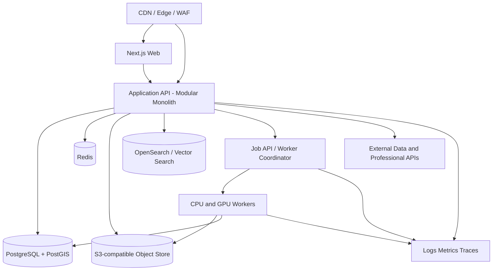

# 08 — Infrastructure, APIs, and Integrations

## 1. Infrastructure principles

The platform must support interactive product workflows, large spatial assets, geospatial data, durable multi-month project processes, GPU workloads, professional auditability, and eventually construction operations.

Core principles:

1. **Start as a modular monolith with isolated workers.** Do not create dozens of microservices before domain boundaries and load are proven.
2. **Design contracts before deployment boundaries.** Modules should have explicit APIs/events even when running in one process.
3. **Use asynchronous durable workflows for long-running work.** A renovation is not a request/response transaction.
4. **Keep raw evidence immutable.** Derived assets may be regenerated; source evidence and issued artefacts must remain traceable.
5. **Separate transactional, analytical, spatial, and asset storage.** Avoid forcing every workload into one database.
6. **Abstract model and cloud vendors.** AI and render providers will change.
7. **Build privacy, rights, and audit controls into the data plane.** Home data is highly sensitive.
8. **Optimise GPU use by job class.** Interactive editing, reconstruction, rendering, and model inference have different latency/cost profiles.
9. **Prefer open exchange formats.** Proprietary internal systems should not trap customers or professionals.
10. **Progressively increase operational complexity.** Kubernetes, multi-region, and sophisticated data platforms follow evidence, not fashion.

## 2. Recommended application stack

### Web

- TypeScript;
- React and Next.js or an equivalent React framework;
- React Three Fiber / Three.js for interactive 3D;
- a component system with strict accessibility standards;
- MapLibre GL or Cesium for geospatial/site context where needed;
- Web Workers and WASM for client-side geometry and IFC tasks;
- offline/resumable upload support.

### iOS capture

- Swift and SwiftUI;
- RoomPlan, ARKit, AVFoundation, and device sensor APIs;
- background/resumable upload;
- on-device quality checks and privacy preprocessing;
- shared API client generated from OpenAPI.

### Android

- Kotlin and Jetpack Compose for capture-critical surfaces;
- ARCore Depth where supported;
- device capability matrix;
- possibly React Native for shared non-capture application surfaces, but do not compromise native sensor reliability for code sharing.

### Backend application

A pragmatic division:

- TypeScript/Node.js or Kotlin for core product, identity, workflow, and commercial services;
- Python/FastAPI for ML, geospatial, document parsing, and scientific workflows;
- Rust/C++ for high-performance geometry, codecs, or WASM modules where justified.

A single language is not inherently more maintainable if it forces geometry and ML workloads into unsuitable tooling.

## 3. Initial deployment architecture



### Initial rule

Deploy managed infrastructure where it reduces undifferentiated operations. “Fully in-house” should mean control of strategic software and data, not operating custom object storage or identity infrastructure before needed.

## 4. Data stores

### PostgreSQL + PostGIS

[PostGIS](https://postgis.net/) extends PostgreSQL for spatial storage and queries.

Use for:

- property identity;
- organisations and permissions;
- projects and workflows;
- canonical model metadata and snapshots;
- geometry suitable for relational/spatial queries;
- planning/property data;
- cost and product references;
- audit indexes;
- transactional state.

Do not store multi-gigabyte point clouds or render sequences directly in database rows.

### Object storage

Store:

- original uploads;
- plan pages;
- scans and point clouds;
- photographs and video;
- IFC/CAD exports;
- glTF/USD assets;
- render outputs;
- generated documents;
- model snapshots;
- evidence bundles.

Requirements:

- immutable/versioned buckets for source and issued assets;
- malware scanning and content validation;
- encryption with managed or customer-specific keys where appropriate;
- signed URL access;
- retention and legal hold;
- content hashes;
- lifecycle tiers;
- region/data-residency policy.

### Redis

Use for:

- short-lived cache;
- session and rate-limit support;
- job coordination where appropriate;
- ephemeral collaboration presence.

Do not use Redis as the sole durable workflow or model store.

### Search and retrieval

Use OpenSearch/Elasticsearch, PostgreSQL full-text, or a dedicated search layer for:

- planning documents;
- project correspondence;
- products;
- policies;
- issues and decisions.

Use pgvector, Qdrant, or a similar vector store for semantic retrieval. Vectors are indexes, not authoritative records; every retrieval result must link to the original source and version.

### Analytical store

As scale grows, create a lakehouse/warehouse using open formats such as Parquet and possibly Iceberg/Delta for:

- model-evaluation datasets;
- project outcomes;
- cost and programme analysis;
- model telemetry;
- contractor performance;
- planning outcomes;
- experiments.

Transactional customer data should enter analytics through governed pipelines with purpose controls and minimisation.

## 5. Geospatial stack

Recommended components:

- PostGIS for vector query and property joins;
- GDAL/OGR for conversion;
- GeoParquet and FlatGeobuf for analytical/vector interchange;
- Cloud Optimized GeoTIFF for terrain/raster;
- TiTiler or equivalent for dynamic raster tiles;
- PMTiles/vector tiles for efficient client maps;
- MapLibre for browser maps;
- explicit CRS transformation service;
- data-source catalogue and lineage.

### Geospatial adapter contract

Each source adapter returns:

```text
SourceRecord
- provider
- dataset
- jurisdiction
- source_id
- geometry
- crs
- attributes
- valid_from / valid_to
- retrieved_at
- licence_id
- quality_flags
- raw_asset_reference
- transformation_lineage
```

## 6. Durable workflow orchestration

Project processes last weeks or years and contain reminders, external responses, human approvals, retries, and compensation logic. [Temporal](https://docs.temporal.io/) is a strong candidate for durable workflow orchestration.

Use workflows for:

- address dossier assembly;
- scan ingestion and reconstruction;
- design-option generation;
- professional review;
- planning submission and response tracking;
- tendering;
- product orders;
- construction milestones;
- handover;
- data deletion/export.

A durable workflow should persist state and survive deployments. Do not implement long-running project logic as a fragile chain of cron jobs and webhook flags.

## 7. Event architecture

### Early stage

Use a transactional outbox in PostgreSQL and a reliable worker queue.

### Scale stage

Introduce Kafka, Redpanda, or a managed event bus when there is demonstrated need for multiple consumers, replay, high throughput, or cross-domain decoupling.

### Core events

- `PropertyCreated`
- `PropertyIdentityMatched`
- `EvidenceUploaded`
- `ScanProcessed`
- `ModelVersionCommitted`
- `ModelIssueCreated`
- `DesignOptionGenerated`
- `ProfessionalReviewRequested`
- `ProfessionalReviewCompleted`
- `PlanningSubmissionCreated`
- `PlanningDecisionRecorded`
- `EstimateRecalculated`
- `BidReceived`
- `VariationProposed`
- `ConstructionMilestoneCompleted`
- `DefectRaised`
- `AsBuiltVersionIssued`

Events should contain identifiers and minimal necessary data, not unrestricted customer media.

## 8. GPU and compute platform

### Workload classes

| Class | Latency | Examples |
|---|---|---|
| Interactive | sub-second to seconds | object recognition assist, agent tool selection, material preview |
| Near-interactive | seconds to minutes | plan parsing, small design-option generation, low-res render |
| Batch | minutes to hours | reconstruction, Gaussian splat, high-res render, video |
| Offline research | hours/days | training, benchmark evaluation, synthetic data generation |

### Architecture

- containerised PyTorch and geometry workers;
- job metadata and idempotency keys;
- explicit GPU type requirements;
- autoscaling worker pools;
- pre-emption-aware checkpoints for batch jobs;
- model registry and artefact store;
- cost and carbon telemetry per job;
- confidential-data policy per model/provider;
- CPU fallbacks where sensible.

### Vendor abstraction

Create an internal model gateway:

```text
generate_text()
extract_document()
understand_image()
propose_design_operations()
render_image_variant()
generate_video_variant()
embed_document()
```

Each call records provider, model/version, region, data-retention policy, prompt/configuration hash, latency, cost, and safety result.

## 9. AI orchestration

The AI orchestrator should not have unrestricted database or geometry access. It should operate through a policy-controlled tool registry.

Tool definition includes:

- name and version;
- input/output schema;
- permission required;
- allowed project stages;
- validation function;
- side-effect class;
- human-confirmation requirement;
- audit payload;
- timeout and retry policy.

Side-effect classes:

- `READ_ONLY`
- `PROPOSE`
- `MUTATE_REVERSIBLE`
- `MUTATE_CONTROLLED`
- `ISSUE_PROFESSIONAL`
- `FINANCIAL`
- `SAFETY_CRITICAL`

An LLM should never invoke the last three classes without a deterministic permission and human gate.

## 10. External integrations

### Property and mapping

- OS Places / AddressBase;
- OS Open UPRN;
- OS NGD Buildings;
- HMLR datasets;
- Planning Data;
- EPC services;
- Environment Agency and national LiDAR portals;
- jurisdiction-specific planning and spatial adapters;
- licensed aggregators such as Searchland/LandTech/Nimbus where economical.

### Planning and authorities

- Planning Portal commercial/integration services where available;
- local-authority portals/APIs;
- email/document ingestion with consent;
- building-control submission interfaces;
- specialist forms and status adapters.

### Professional design

- IFC;
- DWG/DXF through licensed libraries/services;
- Revit-compatible workflows;
- Speckle;
- PDF generation and mark-up;
- BCF for model issues where useful;
- professional e-signature.

### Capture

- Apple RoomPlan;
- ARKit/ARCore;
- Matterport SDK and export services;
- Polycam export/import;
- laser-measure integrations where available;
- survey point-cloud formats such as E57/LAS/LAZ.

### Products and cost

- BCIS or licensed cost data;
- NBS Source;
- manufacturer APIs;
- merchant/product feeds;
- lead-time and stock providers;
- embodied-carbon databases;
- internal delivered-cost database.

### Commerce and operations

- identity verification where required;
- payments provider;
- accounting;
- e-signature;
- messaging/email/SMS;
- calendar and appointments;
- CRM/support;
- finance partners;
- warranty/insurance partners;
- contractor verification and insurance checks.

## 11. API style

### Public/application APIs

- REST/JSON for resource and workflow operations;
- WebSocket or server-sent events for collaboration and job progress;
- signed direct uploads to object storage;
- OpenAPI specification;
- cursor pagination;
- idempotency keys for mutations;
- optimistic concurrency with model version IDs;
- explicit jurisdiction and units;
- standard problem-details errors;
- request correlation IDs.

### Geometry payloads

Do not send full dense meshes in JSON. Use:

- typed compact geometry schemas for editable primitives;
- binary assets for mesh/point-cloud/scene payloads;
- content-addressed asset references;
- delta operations for collaborative editing.

## 12. Authentication and authorisation

- OIDC/OAuth 2.1;
- passkeys and multi-factor authentication;
- organisation and project roles;
- short-lived tokens;
- fine-grained server-side policy checks;
- device/session management;
- delegated professional access;
- time-limited guest sharing;
- break-glass support access with approval and audit;
- service identities for agents and workers.

Authorisation must be evaluated against project stage and object sensitivity, not merely “member of project.”

## 13. Security architecture

### Threats

- exposure of home layouts and valuables;
- malicious plan/CAD uploads;
- prompt injection through documents;
- model poisoning;
- unauthorised model edits;
- fraudulent contractor/payment changes;
- AI agent excessive permissions;
- supply-chain compromise;
- insider access;
- signed-link leakage;
- ransomware or deletion;
- tampering with issued drawings.

### Controls

- WAF and rate limiting;
- file-type validation and sandboxing;
- malware scanning;
- content disarm for documents where appropriate;
- prompt-injection isolation and source trust levels;
- least privilege;
- separate production/research datasets;
- immutable audit records;
- signed issue packages;
- key management and rotation;
- secret manager;
- software bill of materials;
- dependency scanning;
- backup and restoration tests;
- security reviews for AI agents;
- fraud detection for bank-detail changes;
- verified communication channels.

Follow the [NCSC secure AI system development guidance](https://www.ncsc.gov.uk/collection/guidelines-secure-ai-system-development).

## 14. Observability

[OpenTelemetry](https://opentelemetry.io/docs/) provides vendor-neutral traces, metrics, and logs.

Track:

- API latency and errors;
- job queue time and failure;
- GPU utilisation and cost;
- model/provider latency;
- design operation validation failures;
- data adapter freshness and coverage;
- model commit and conflict rates;
- render performance;
- professional review turnaround;
- customer workflow abandonment;
- security events;
- data-rights and deletion jobs;
- contractor/payment anomalies.

A mature stack may use Prometheus, Grafana, Loki, Tempo, or managed equivalents.

## 15. Deployment and infrastructure as code

### Early stage

- managed container/app platform;
- managed PostgreSQL/PostGIS;
- managed object storage;
- managed Redis;
- serverless or autoscaled workers;
- Terraform or OpenTofu;
- GitHub Actions;
- separate dev/staging/prod;
- feature flags;
- seeded demo properties with synthetic data.

### Scale stage

Use [Kubernetes](https://kubernetes.io/docs/setup/production-environment/) only when workload diversity, GPU scheduling, portability, or scale makes the operational cost worthwhile. Potentially add Argo CD/GitOps, service mesh only if justified, multi-region read paths, and dedicated data-plane controls.

## 16. Resilience and disaster recovery

Define recovery objectives by class:

- identity/project metadata: low RPO/RTO;
- issued professional artefacts: immutable and replicated;
- raw evidence: durable, versioned, geographically resilient;
- derived renders: reproducible and lower priority;
- analytics: rebuildable from source;
- live collaboration: acceptable transient loss.

Test:

- database point-in-time recovery;
- object-version restoration;
- accidental project deletion;
- ransomware scenario;
- vendor outage;
- AI provider outage;
- planning-data source outage;
- regional cloud outage;
- compromised professional account.

## 17. Cost controls

- per-project storage and GPU budgets;
- render quality tiers;
- caching of identical outputs;
- deduplicate assets by content hash;
- archive cold raw capture;
- provider routing based on sensitivity and task;
- user-visible quotas for expensive experiments;
- batch scheduling;
- explicit cost attribution to research, sales demo, and live project;
- alert on abnormal GPU or egress use.

AI and 3D compute must be part of unit economics from the first prototype.

## 18. Initial repository/workspace recommendation

```text
/apps
  /web
  /ios-capture
  /admin
/services
  /platform-api
  /ml-api
/workers
  /plan-parser
  /reconstruction
  /model-compiler
  /renderer
/packages
  /domain-model
  /geometry
  /api-contracts
  /ui
  /authz
  /provenance
  /rules
  /telemetry
/adapters
  /os
  /planning-data
  /epc
  /lidar
  /ifc
  /roomplan
  /cost
/infrastructure
  /terraform
  /environments
/research
  /benchmarks
  /notebooks
  /datasets
/docs
  /adr
  /runbooks
  /security
```

The `domain-model`, `provenance`, `api-contracts`, and geometry test fixtures should be treated as foundational packages.

## 19. Architecture evolution triggers

Split a module into a service when one or more are true:

- independent scaling is materially required;
- different reliability/security boundary;
- separate team ownership;
- incompatible runtime or deployment cadence;
- external customer API requires isolation;
- workload threatens core transaction latency;
- regulatory or data-residency boundary.

Do not split merely because a diagram looks more sophisticated.

## 20. Initial infrastructure acceptance criteria

The first platform increment should prove:

- reproducible local development;
- CI tests and schema validation;
- secure direct asset upload;
- property/project tenancy;
- append-only model operations;
- asynchronous plan-processing job;
- deterministic model snapshot and glTF export;
- complete trace from source asset to generated output;
- provider abstraction for at least two LLM paths or one provider plus deterministic fallback;
- audit record for every model mutation;
- deletion/export workflow prototype;
- restore from backup in a test environment.

This is enough to support serious experimentation without prematurely building the final national platform.
