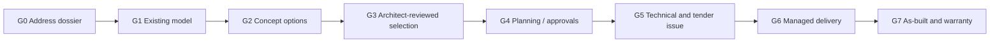

# 09 — Full-Stack Operating Model and Acquisition Strategy

## 1. Definition of “full stack”

For this company, full stack should mean:

- the customer can enter through one brand and remain in one coherent experience;
- the platform maintains one source of truth for property, design, decisions, cost, and delivery;
- responsibility is explicit rather than fragmented or hidden;
- the company captures enough of the economic and operational loop to improve future outcomes;
- the company can remedy failures inside the services it has promised;
- professional and statutory roles remain properly appointed, competent, insured, and independent where required.

It does not require every surveyor, engineer, contractor, manufacturer, lender, insurer, or authority to be an employee. The operating question is:

> Which responsibilities and capabilities must be controlled to produce a reliable customer outcome, and which can be provided by governed partners without losing accountability?

## 2. Project underwriting as the central operating system

A full-stack architecture company should decide which projects it accepts in the same disciplined way that a risk-bearing financial company defines an underwriting box.

### 2.1 Underwriting dimensions

#### Property identity risk

- address match confidence;
- tenure and ownership evidence;
- single dwelling versus subdivision;
- jurisdiction;
- prior alterations and record mismatch.

#### Geometry risk

- capture tier;
- model closure and conflicts;
- critical unknowns;
- irregularity;
- multi-level complexity;
- access for survey.

#### Planning risk

- listed/conservation/Article 4 status;
- planning history;
- local policy;
- neighbour context;
- design departure;
- permission route;
- incomplete source coverage.

#### Structural and condition risk

- likely construction type;
- proposed removals and spans;
- visible distress;
- roof/foundation uncertainty;
- drainage/services interaction;
- asbestos and hazardous-material possibility;
- required investigation.

#### Site and logistics risk

- access;
- parking and deliveries;
- neighbouring attachment;
- party-wall exposure;
- occupancy during works;
- storage;
- noise/time restrictions;
- ground and flood context.

#### Scope risk

- brief maturity;
- specification completeness;
- client decision latency;
- number of provisional items;
- bespoke products;
- interface with retained work;
- design freeze quality.

#### Cost and market risk

- regional labour capacity;
- contractor bid dispersion;
- volatile materials;
- long-lead products;
- inflation and programme;
- contingency sufficiency;
- tax/VAT treatment.

#### Delivery risk

- contractor performance history;
- site-manager capacity;
- subcontractor dependencies;
- programme complexity;
- specialist inspections;
- customer vulnerability;
- finance and payment reliability.

### 2.2 Underwriting outcomes

- **Eligible — instant design package:** low-risk project type, sufficient data for early services.
- **Eligible subject to evidence:** survey, structural inspection, drain survey, title check, or specialist input required.
- **Managed-service only:** the company can design and coordinate but will not offer fixed construction risk.
- **Specialist pathway:** heritage, basement, major structural, unusual construction, or high-complexity work.
- **Decline/refer:** outside competence, insurance, geography, project value, or risk appetite.

### 2.3 Risk price

Price should contain separate concepts:

- base professional/service cost;
- third-party professional cost;
- expected construction cost;
- uncertainty allowance;
- contingency;
- company risk margin;
- optional guarantee/warranty price;
- exclusions.

Hiding uncertainty inside one attractive number produces adverse selection and disputes.

## 3. Proposed group architecture

### 3.1 Consumer Brand / HoldCo

Responsibilities:

- brand and customer promise;
- product strategy;
- group governance;
- capital allocation;
- customer outcomes and complaints oversight;
- cross-entity data and consent framework.

### 3.2 TechCo

Responsibilities:

- applications and infrastructure;
- canonical model;
- AI/3D systems;
- property graph;
- workflow and data platform;
- product and contractor systems;
- information security;
- research and model evaluation.

TechCo may license software and data services to the professional and construction entities, but it should not obscure which entity provides the customer service.

### 3.3 Architecture Practice

Responsibilities:

- architect-controlled services;
- design leadership;
- planning and technical work within appointment;
- professional reviews;
- competence and quality management;
- professional-indemnity insurance;
- consultant appointments;
- design risk and dutyholder roles where appointed.

A registered Chief Architect or equivalent professional leader should have authority to stop unsafe or misleading delivery.

### 3.4 BuildCo

Responsibilities when activated:

- principal-contractor operations;
- subcontractor appointments;
- site management;
- construction safety;
- procurement and logistics;
- programme;
- quality inspection;
- defects and warranty;
- construction insurance;
- project cash flow.

BuildCo should have ring-fenced project accounting and should not use customer deposits to mask losses in other projects.

### 3.5 ProcurementCo

Potential responsibilities:

- supplier contracts;
- product catalogue and configuration;
- purchasing;
- logistics and returns;
- commercial rebates;
- substitution workflow;
- product warranty administration.

Commercial relationships must be disclosed in design recommendations.

### 3.6 Finance and warranty partnerships

Initially partner with authorised providers for:

- consumer finance;
- deposit/payment protection;
- structural or latent-defect warranty where relevant;
- home insurance interfaces;
- contractor bonds or guarantees.

Internalise only after the core architecture/delivery model and regulatory case are compelling.

## 4. Service and contract models

### Model A — Software only

Customer pays for design exploration; no professional appointment.

Best for:

- early ideas;
- low-cost acquisition;
- self-service plan/scan model;
- style and product experimentation.

Required warning:

- no professional advice or construction reliance unless explicitly upgraded.

### Model B — Architecture service

Architecture Practice contracts for a defined scope, supported by software.

Best initial revenue model because it creates trust, learning, and delivered professional outcomes without principal-contractor risk.

### Model C — Managed procurement

Customer contracts directly with selected contractors; platform manages scope, bid comparison, milestones, evidence, and communication under a separate service.

Risk:

- the brand may be blamed for contractor failures despite limited contractual control.

Control:

- transparent responsibility, high contractor standards, field verification, and customer remedies within the platform’s service.

### Model D — Agency construction management

The company acts as customer’s agent/manager while trade contracts remain with the customer. This can provide control but creates coordination and legal complexity. It requires expert contract design and is not automatically safer than a main contract.

### Model E — Design and build

BuildCo signs the main contract and assumes delivery responsibility.

Use only for underwritten project classes with verified information, mature specification, known contractors, and adequate capital.

### Model F — Productised renovation system

A fixed or configurable system—such as a standard extension shell, loft package, or kitchen/bathroom product—is designed, supplied, and installed through controlled partners or the group.

This offers the greatest predictability if the system genuinely fits the property and planning context.

## 5. Professional operating model

### 5.1 Team pods

A regional/project pod may include:

- homeowner project lead;
- architect/design lead;
- architectural technologist or technical lead;
- model/survey coordinator;
- planning specialist;
- structural-engineering partner;
- cost/procurement lead;
- build/project manager where applicable.

AI handles preparation, retrieval, model operations, drafting, checking, and summarisation. Humans own professional and commercial decisions.

### 5.2 Central centres of excellence

- property and planning data;
- scan and geometry quality;
- residential design systems;
- technical details and compliance;
- cost and procurement;
- professional practice and PII;
- contractor quality;
- AI safety and evaluation;
- customer outcomes.

### 5.3 Case conference

Complex cases should be reviewed in a structured case conference, with recorded:

- key unknowns;
- risk classification;
- professional responsibilities;
- required investigation;
- permitted promise;
- next gate;
- decline criteria.

## 6. Geographic operating strategy

### Why geography matters

- local planning policy and officer practice;
- housing archetypes;
- contractors and suppliers;
- wage and material rates;
- building-control routes;
- ground and drainage conditions;
- customer acquisition channels;
- site-management travel.

### Recommended launch

Start with one dense region and a small number of local authorities. Build:

- local planning-data quality;
- house-archetype library;
- consultant and contractor network;
- price book;
- delivery history;
- customer-referral density.

Expand when quality metrics remain stable, not when marketing demand alone appears.

### Territory gate

A new territory requires:

- named professional leadership;
- planning and data adapter validation;
- contractor capacity;
- cost calibration;
- survey coverage;
- insurance acceptance;
- escalation and emergency process;
- minimum project pipeline.

## 7. Project lifecycle and responsibility gates

At every gate, record:

- model version;
- evidence level;
- open risks;
- customer decisions;
- professional review;
- cost confidence;
- permitted downstream use;
- responsible entity.

## 8. Contractor network model

### Qualification

- identity and ownership;
- financial health;
- insurance;
- competence and training;
- relevant project history;
- references;
- safety record;
- subcontractor model;
- geographic capacity;
- dispute and defect history;
- data/evidence willingness.

### Ongoing performance

- bid completeness;
- price variance;
- programme performance;
- change-order frequency and cause;
- inspection outcomes;
- rework;
- defect closure;
- customer complaints;
- safety incidents;
- document quality;
- communication responsiveness.

### Network danger

A lead marketplace can attract contractors who need leads because they lack reputation or pipeline. The platform should avoid adverse selection by combining referrals with qualification, ongoing evidence, fair commercial terms, and real removal thresholds.

## 9. Quality system

### Design quality

- standard review checklists;
- automated model validation;
- peer review for defined risk levels;
- design critiques;
- issue status control;
- post-project lessons.

### Survey/model quality

- capture protocols;
- device calibration;
- sample remeasurement;
- conflict resolution;
- declared tolerances;
- error incident reporting.

### Construction quality

- inspection/test plans;
- hold points;
- photographic and scan evidence;
- product traceability;
- mock-ups where needed;
- non-conformance records;
- defect trends.

### Customer quality

- expectation confirmation;
- comprehension checks;
- decision deadlines;
- vulnerability support;
- complaint handling;
- outcome and satisfaction review.

## 10. Remediation and “claims” function

A full-stack operator needs a claims-like function even if it is not an insurer.

Cases include:

- model error;
- omitted scope;
- professional design error;
- planning-document error;
- contractor defect;
- product defect;
- delay;
- disputed variation;
- data breach;
- misleading visual or price.

The remediation system should:

1. receive and classify the issue;
2. preserve evidence;
3. stop unsafe work where appropriate;
4. determine responsible entity and policy/contract;
5. appoint independent review where needed;
6. communicate a resolution plan;
7. fund or coordinate remedy according to responsibility;
8. record root cause;
9. update underwriting and controls.

The company’s trust moat depends as much on this function as on design generation.

## 11. Acquisition strategy

### 11.1 Why acquire

Potential acquisition benefits:

- registered architect leadership and teams;
- professional practice systems;
- local planning expertise;
- existing customer pipeline;
- rights-cleared project archives;
- contractor and consultant relationships;
- regional brand;
- measured-survey operation;
- specialist technical capability;
- cost or procurement data.

### 11.2 Why not acquire too early

- legacy liabilities;
- inconsistent data and file structures;
- cultural mismatch;
- low technology adoption;
- key-person dependence;
- unprofitable fixed-fee work;
- PII tail;
- customer contracts that cannot be standardised;
- poor rights to historic data;
- inflated valuation based on revenue rather than transferable capability.

### 11.3 Architecture-practice acquisition is not a licence acquisition

Unlike an insurer acquiring a carrier, buying a UK architecture practice does not create a universal statutory right to approve planning or structure. The value is people, professional governance, reputation, data, and distribution.

An early company can instead:

- hire registered architects;
- create an appropriately governed architecture entity;
- obtain PII;
- establish quality and appointment systems;
- seek required ARB permission for naming/use of title.

Acquisition becomes attractive when it accelerates regional capability or brings exceptional data and professional systems.

### 11.4 Acquisition diligence checklist

#### Professional

- registration and competence;
- claims and circumstances;
- insurance history;
- appointment terms;
- dutyholder work;
- quality reviews;
- complaints;
- professional records.

#### Commercial

- revenue quality;
- stage mix;
- write-offs;
- unbilled work;
- customer concentration;
- project pipeline;
- staff utilisation;
- subcontractor dependence;
- cash collection.

#### Data/IP

- ownership of drawings/models;
- customer permissions;
- training rights;
- software licences;
- CAD/BIM standards;
- archive completeness;
- security and privacy;
- ability to migrate.

#### Construction exposure

- design-and-build novations;
- collateral warranties;
- contractor relationships;
- defect disputes;
- high-risk materials/projects;
- unfinished work;
- latent claims.

### 11.5 Preferred acquisition sequence

1. Hire founding registered architect and professional-practice lead.
2. Build software and operate a narrow service with partners.
3. Acquire or acqui-hire a measured-survey/model team if capture quality is a bottleneck.
4. Acquire a high-quality regional residential practice when integration economics are proven.
5. Acquire specialist technical, planning, or cost capability selectively.
6. Consider construction acquisition only after the company has a clear project-risk and cash-flow model.

## 12. Capital sequence

### Early capital

Fund:

- canonical model and product;
- data licences;
- small professional team;
- benchmark/property capture;
- initial customer projects;
- quality and insurance systems.

### Growth capital

Fund:

- geographic expansion;
- acquisitions;
- contractor and operations teams;
- product integrations;
- working capital for managed procurement;
- reserve and remediation functions.

### Construction-risk capital

Before direct design-and-build at scale, establish:

- project cash-flow models;
- separate capital and reserves;
- bonding/warranty/insurance;
- credit controls;
- subcontractor payment controls;
- loss and defect history;
- board construction-risk expertise.

Do not finance construction losses with software fundraising while reporting only gross project value.

## 13. Operating-model conclusion

The best early company is an AI-native architecture practice and model platform. The best mature company may be a selective full-stack residential transformation operator. The transition is not a branding change; it requires evidence, capital, professional systems, local delivery capability, and a claims/remediation function.

The company should earn each additional layer of responsibility by demonstrating that it can predict and control the relevant variance.
