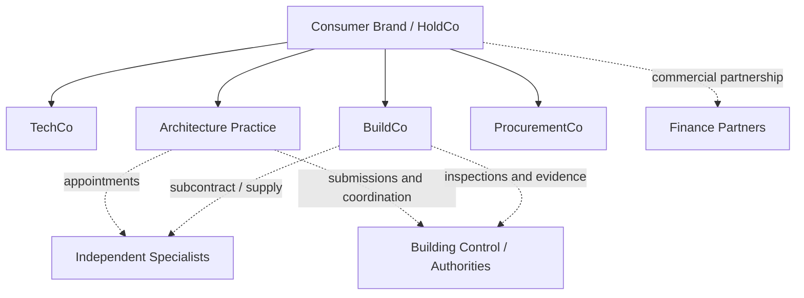
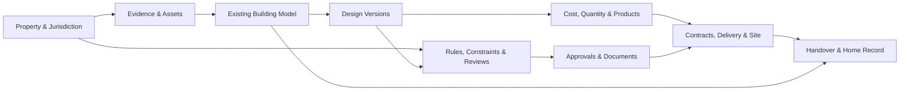
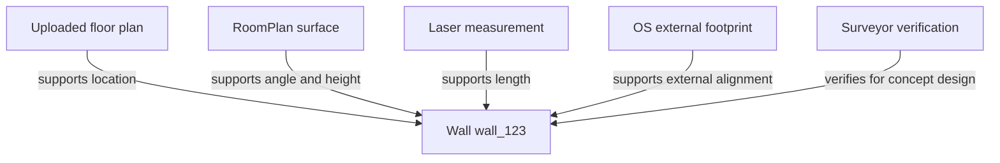
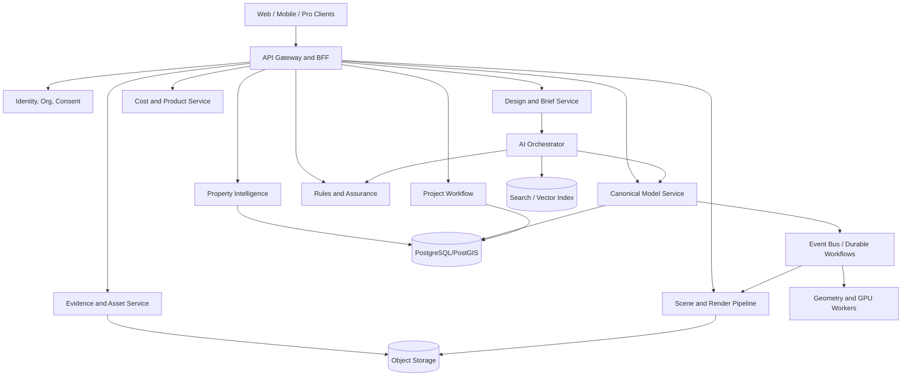
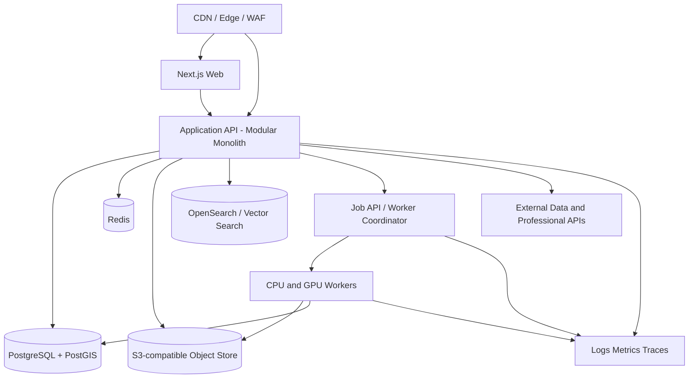
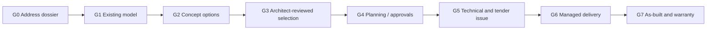

# Full Research Dossier

This file concatenates the core research, strategy, product, technical, regulatory, operating, execution, and frontier documents. The individual files remain the preferred source for editing and agent workflows.

## Contents

- [00 — Context and North Star](#00-context-and-north-star)
- [01 — Executive Thesis and Critical Verdict](#01-executive-thesis-and-critical-verdict)
- [02 — Product Vision and User Journeys](#02-product-vision-and-user-journeys)
- [03 — Market, Incumbents, and Competitor Map](#03-market-incumbents-and-competitor-map)
- [04 — UK Property Data and Address-to-3D](#04-uk-property-data-and-address-to-3d)
- [05 — Regulatory, Professional, and Data Governance](#05-regulatory-professional-and-data-governance)
- [06 — Canonical Home Model and System Architecture](#06-canonical-home-model-and-system-architecture)
- [07 — AI, 3D Reconstruction, Rendering, and Video](#07-ai-3d-reconstruction-rendering-and-video)
- [08 — Infrastructure, APIs, and Integrations](#08-infrastructure-apis-and-integrations)
- [09 — Full-Stack Operating Model and Acquisition Strategy](#09-full-stack-operating-model-and-acquisition-strategy)
- [10 — Build vs Buy vs Partner and In-House Strategy](#10-build-vs-buy-vs-partner-and-in-house-strategy)
- [11 — Feasibility, Limitations, Risk, and Safety Gates](#11-feasibility-limitations-risk-and-safety-gates)
- [12 — Execution Roadmap, Workstreams, and Stage Gates](#12-execution-roadmap-workstreams-and-stage-gates)
- [13 — Evaluation Metrics, Data Strategy, and Experiments](#13-evaluation-metrics-data-strategy-and-experiments)
- [14 — Business Model, Unit Economics, and Moat](#14-business-model-unit-economics-and-moat)
- [15 — Codex and Claude Code Implementation Brief](#15-codex-and-claude-code-implementation-brief)
- [16 — API and Domain Schema Reference](#16-api-and-domain-schema-reference)
- [17 — Research Bibliography](#17-research-bibliography)
- [18 — Blue-Sky Frontier Program](#18-blue-sky-frontier-program)
- [Decision Register](#decision-register)
- [Assumptions and Open Questions](#assumptions-and-open-questions)


---

# 00 — Context and North Star

## 1. Why this repository exists

The idea began as a note about automated interior design: create an accurate 3D model of a house, let a person walk through it, and allow real-time experimentation with furniture, colours, paintings, finishes, lighting, and structural changes. The concept then expanded in three important directions.

First, the product moved from visual inspiration to **measured spatial representation**. A compelling room image is useful, but it is not enough to decide whether a wall can move, whether a stair works, whether furniture clears a doorway, or whether a builder can price the job. The product therefore needs an editable and confidence-scored model of the property.

Second, the scope moved from a design application to an **architect-like service journey**. The homeowner should not have to understand separate tools for surveys, floor plans, 3D modelling, interior design, planning, building regulations, structural engineering, tendering, product selection, construction, and handover. The platform should guide the user through the decisions in a coherent sequence and explain why an option is good, risky, expensive, or incomplete.

Third, the strategic ambition became a **full-stack architecture and residential-transformation company**, analogous in customer experience—not regulatory structure—to a vertically integrated financial or insurance platform. The company should own the customer relationship and as much of the outcome as is economically and professionally sensible, rather than being a thin visualisation layer or referral marketplace.

This repository retains all three levels:

1. **Immersive design product** — model and visualise a house.
2. **AI-native architectural service** — turn a brief into professionally reviewed, approval-ready, technically coordinated design information.
3. **Full-stack residential transformation company** — coordinate or deliver procurement and construction, then retain the digital twin for the life of the property.

## 2. North-star statement

> Create the most trusted way for a UK homeowner to understand, design, approve, finance, and deliver a change to their home—from an address and initial idea to a verified as-built record—through one intelligent, visual, professionally accountable experience.

The word **trusted** is more important than the word **AI**. In this category, trust comes from:

- accurate representation of what is known;
- visible treatment of what is inferred or unknown;
- professional responsibility at the right stages;
- realistic cost and programme ranges;
- a complete record of decisions and versions;
- delivery evidence;
- remedies when the result deviates from the agreement.

## 3. The target problem

A homeowner planning a meaningful renovation faces a fragmented chain of uncertainty:

- They may not know the current property geometry.
- They do not know which options are physically or legally plausible.
- They struggle to imagine a plan in three dimensions.
- Different professionals produce disconnected drawings, spreadsheets, emails, and reports.
- Early cost advice is often too broad, while detailed pricing arrives after substantial design expenditure.
- Changes are poorly propagated across drawings, quantities, specifications, approvals, and contracts.
- The homeowner must coordinate parties with different incentives and vocabularies.
- Construction reveals hidden conditions that were not visible during design.
- There is rarely a durable, searchable, as-built record after completion.

The product should reduce uncertainty in the correct order rather than simply create more attractive imagery.

## 4. Target users

### 4.1 Primary initial user

A UK homeowner or prospective purchaser of a low-rise freehold house who is considering:

- a rear extension;
- a side-return extension;
- a loft conversion;
- a garage conversion;
- internal wall and room reconfiguration;
- a kitchen, utility, or principal-suite redesign;
- a combined renovation and energy-improvement project.

The best early customer has a meaningful project budget, a real address, a reasonably standard house type, and a need to make decisions before engaging or while coordinating professionals.

### 4.2 Secondary users

- residential architects and architectural technologists;
- interior designers;
- structural engineers;
- measured-survey teams;
- planning consultants;
- builders and design-and-build firms;
- kitchen, bathroom, glazing, flooring, lighting, and furniture suppliers;
- estate agents and buyer advisers;
- lenders, brokers, insurers, and warranty providers;
- local authorities and building-control bodies, only where appropriate and without compromising independence.

### 4.3 Long-run user relationship

The customer should not disappear after the renovation. The property model can support:

- maintenance and replacement schedules;
- warranty records;
- energy retrofit and operational monitoring;
- insurer or lender evidence;
- resale marketing and buyer due diligence;
- future extensions or adaptations;
- accessibility changes;
- emergency and repair history.

This creates the possibility of a persistent **property operating system**, but it must earn that position through accurate records and useful services rather than merely storing a decorative 3D model.

## 5. Jobs to be done

### Functional jobs

- Tell me what is known about my property from its address.
- Help me create or verify an accurate model of the existing home.
- Show me credible options that satisfy my priorities and constraints.
- Let me experience the proposal before I commit.
- Explain planning, structural, technical, cost, and programme implications.
- Help me choose products and materials with real dimensions and prices.
- Create the information required by professionals, authorities, and contractors.
- Help me compare and appoint delivery partners.
- Keep scope, design, cost, decisions, and evidence synchronised.
- Give me a reliable as-built record when the project is complete.

### Emotional jobs

- Reduce fear of making an expensive mistake.
- Make technical information understandable without making it falsely simple.
- Let household members explore and resolve disagreements.
- Replace opaque professional handoffs with a sense of progress and control.
- Build confidence that someone is accountable for the overall journey.

### Social jobs

- Share proposals easily with partners, family, neighbours, professionals, and contractors.
- Demonstrate design quality and value to a lender or future buyer.
- Make the renovation process feel considered rather than improvised.

## 6. Product ambition by horizon

### Horizon A — Design intelligence

- Address-based property dossier.
- Floor-plan upload and parsing.
- iPhone spatial capture.
- Editable 2D/3D model.
- Furniture, finish, lighting, and layout experimentation.
- Browser-based first-person walkthrough.
- AI-guided design review.
- Human architect review.

### Horizon B — Approval and technical coordination

- Planning-constraint and precedent analysis.
- Planning drawings and application workflows.
- Building-regulations information coordination.
- Structural and specialist review workflows.
- Product and specification schedules.
- Quantity and preliminary cost propagation.
- BIM/IFC and professional exports.

### Horizon C — Managed delivery

- Structured scopes of work.
- Contractor matching and bid normalisation.
- Change control.
- Milestone evidence and payments.
- Site capture and progress comparison.
- Procurement and delivery tracking.
- Snagging, handover, and warranty record.

### Horizon D — Selective outcome ownership

- Fixed design packages.
- Underwritten renovation products for known project classes.
- Direct design-and-build contracts in selected territories.
- Standard structural/envelope/product systems.
- Explicit service guarantees and remediation pathways.
- Project-risk reserves and disciplined exclusions.

### Horizon E — Property operating system

- Persistent as-built digital twin.
- Maintenance and retrofit planning.
- Energy and carbon scenarios.
- Insurance, valuation, and financing integrations.
- Product replacement and repair marketplace.
- Consent-based homeowner and property history.

## 7. Blue-sky scope

The blue-sky product may eventually include:

- automatic property context from address;
- guided room and whole-house scanning;
- reconstruction from plans, photographs, video, point clouds, and prior documents;
- generative but constrained layout options;
- conversational design manipulation;
- real product catalogues with dimensions, stock, price, embodied carbon, lead time, and installation constraints;
- daylight, solar, energy, circulation, acoustic, privacy, storage, and accessibility analysis;
- planning-risk and precedent models;
- deterministic walkthroughs and AI-enhanced cinematic presentations;
- AR overlays in the real house and VR review;
- automated document production with professional review;
- contractor, supplier, finance, payment, warranty, and maintenance workflows;
- continuous model updates from site scans and evidence.

Blue-sky does not mean ignoring physics, law, professional competence, data rights, or economics. It means defining the complete end state, then separating:

- what can be built now;
- what can be built after proprietary data is accumulated;
- what requires professional human judgement;
- what requires regulatory permission or a controlled operating entity;
- what should remain independent;
- what may remain fundamentally uncertain.

## 8. Product anti-goals

The company should not become:

1. **A photo restyling toy.** Attractive room images alone are not a defensible or trustworthy renovation product.
2. **A generic chatbot over planning PDFs.** Retrieval is useful, but it does not create a property model, design system, or accountable service.
3. **A lead-generation directory disguised as a full service.** Referrals may be part of the model, but customer expectations must match who owns delivery risk.
4. **A national construction contractor before it can underwrite local variance.** Geographic expansion without operational control is a high-risk failure mode.
5. **A black-box AI that conceals assumptions.** Every design and estimate must expose provenance, status, and uncertainty.
6. **A tool that encourages unqualified structural intervention.** Concept exploration must trigger appropriate professional gates.
7. **A data-scraping business dependent on questionable reuse rights.** Planning drawings, estate-agent plans, and professional designs require a lawful rights strategy.
8. **A BIM product that forces homeowners to behave like BIM managers.** The underlying structure may be sophisticated, while the customer experience remains simple.

## 9. The full-stack analogy—and its boundary

Corgi describes itself as a full-stack insurance carrier that underwrites and issues policies rather than acting only as a broker. Its public materials emphasise underwriting, policy management, servicing, and claims in one platform. See [Corgi](https://www.corgi.insure/) and its [Y Combinator profile](https://www.ycombinator.com/companies/corgi-insurance).

The relevant transferable concept is **ownership of the operating loop**:

- collect high-quality risk data;
- decide which cases fit the underwriting box;
- configure a product;
- price it;
- administer it;
- handle exceptions and adverse outcomes;
- learn from actual performance.

The architecture equivalent is not an architectural licence purchased once and applied nationally. UK architectural services, protected titles, planning, building regulations, dutyholder roles, construction contracts, local building conditions, and professional insurance operate differently. Acquiring an architecture practice can provide talent, reputation, data, and distribution, but it is not directly equivalent to acquiring an insurance risk carrier.

The analogy is strongest at the level of:

- project eligibility;
- risk classification;
- standard products with conditions and exclusions;
- price and contingency;
- service administration;
- claims-like remediation;
- proprietary outcome data.

It is weakest where the built environment contains one-off physical uncertainty and independent public decisions.

## 10. North-star experience

A mature experience might read as follows:

1. The customer enters an address.
2. The platform creates a property dossier and an estimated shell, clearly separating sourced and inferred data.
3. The customer uploads a plan or completes a guided scan.
4. The platform assembles an editable model and asks targeted questions where confidence is low.
5. The customer states an outcome: “Create a brighter ground floor with a utility room, better garden connection, and a total project target below £120,000.”
6. The system creates several constrained options, explains their logic, and identifies unknowns.
7. The customer and an architect review the options in plan, model, walkthrough, and cost form.
8. The selected option passes through planning, technical, structural, and compliance gates.
9. Quantities, specifications, bids, programme, and change control remain connected to the same model.
10. Site evidence updates progress and records variations.
11. The homeowner receives an as-built twin, completion documents, warranties, and maintenance plan.

The product succeeds when the homeowner feels that complexity has been managed—not when complexity has merely been hidden.

## 11. Core success conditions

The company must eventually demonstrate:

- **geometry trust:** critical dimensions and spatial relationships are accurate enough for the declared use;
- **uncertainty calibration:** low-confidence outputs are visibly low confidence;
- **design value:** generated options are materially useful, not cosmetic variants;
- **professional efficiency:** qualified reviewers spend less time on repetitive work and more on judgement;
- **regulatory integrity:** outputs are traceable, current, and reviewed at the appropriate level;
- **cost realism:** estimates become progressively tighter as evidence increases;
- **delivery control:** changes and defects are detected and resolved rather than hidden;
- **unit-economic discipline:** expansion does not convert construction volume into uncontrolled losses;
- **customer trust:** promises, responsibility, exclusions, and status remain understandable throughout the project.

## 12. Questions this repository is designed to answer

- Can a useful 3D model be created from an address alone?
- What additional evidence is required for design, planning, technical work, and construction?
- Which incumbent categories validate the idea, and where is the white space?
- What should the company own in-house?
- What should be licensed, partnered, or kept independent?
- What is the canonical domain model?
- How should AI interact with geometry and rules?
- What is the appropriate infrastructure and API architecture?
- How can planning, cost, product, and contractor data connect to design?
- Which professional and statutory responsibilities cannot be hand-waved away?
- How can the business progress from software to managed service to selective design-and-build?
- What evidence must be obtained before fixed pricing or outcome guarantees?
- Which experiments could invalidate the thesis early?

The remainder of the repository answers these questions while retaining the distinction between source evidence, strategic judgement, and future ambition.


---

# 01 — Executive Thesis and Critical Verdict

## 1. Verdict

A full-stack, AI-native residential architecture and renovation company is feasible, but only if the company is designed around **verified property data, bounded project classes, professional accountability, and gradual assumption of construction risk**.

The superficial version of the idea is already commoditising: upload a room photograph, select a style, and receive attractive redesign images. The difficult and valuable version is a different business:

> Create and maintain a structured model of the actual property; use it to generate, analyse, approve, price, procure, deliver, and record a real intervention; and give the customer one coherent path through fragmented professional and construction systems.

The company can become “full stack” in three senses:

1. **Experience full stack:** one account, model, project timeline, decision log, budget, and customer relationship.
2. **Information full stack:** address data, survey evidence, geometry, design, planning, technical information, quantities, products, bids, site evidence, and handover records remain connected.
3. **Operating full stack:** the company progressively assumes responsibility for design, coordination, procurement, delivery, and remediation within a controlled underwriting box.

It should not claim to be full stack by pretending that:

- local authorities no longer make planning decisions;
- building-control functions can be collapsed into a commercial sales process;
- structural adequacy can be certified from a photograph;
- all hidden building conditions can be known in advance;
- every project can be priced instantly;
- AI video is dimensional evidence;
- a single national workflow erases legal differences across England, Wales, Scotland, and Northern Ireland.

## 2. Why the opportunity is real

### 2.1 The customer problem is a coordination problem

Home renovation is not one purchase. It is a chain of interdependent decisions across data, design, permission, engineering, product selection, contracting, finance, construction, inspection, and warranty. The customer often acts as the unofficial systems integrator.

Architecture practices typically optimise design and professional services. Builders optimise construction. retailers optimise product sales. planning systems optimise public decision-making. software tools optimise isolated tasks. No category naturally owns the homeowner’s complete outcome.

The opportunity is to create an integrated operator whose core competence is **reducing project uncertainty and propagating decisions correctly**.

### 2.2 Residential work contains repeatable submarkets

The entire architecture market is too heterogeneous for early automation and underwriting. But many low-rise residential projects repeat:

- Victorian and Edwardian terrace side returns;
- rear extensions to semis and detached houses;
- dormer and hip-to-gable loft conversions;
- garage conversions;
- kitchen/utility reconfigurations;
- standard openings between existing rooms;
- recurring planning and party-wall patterns.

England’s official planning statistics show the scale of routine householder work. In the year ending March 2026, local authorities decided about 151,900 householder development applications; householder applications represented 51% of decisions, about 90% were granted, and 93% were decided within eight weeks or an agreed period. See the [January–March 2026 statistical release](https://www.gov.uk/government/statistics/planning-applications-in-england-january-to-march-2026/planning-applications-in-england-january-to-march-2026-statistical-release).

This does not prove that all such projects are suitable for automation. It does demonstrate a large flow of relatively familiar project types whose information and decision patterns can be structured.

### 2.3 The enabling technology exists in pieces

The market already validates individual layers:

- Resi demonstrates a technology-enabled UK residential architecture journey.
- Block Renovation demonstrates structured scope, contractor matching, and managed project experience.
- Higharc demonstrates a structured home model that can propagate into estimates, permits, and sales outputs.
- Apple RoomPlan, Matterport, Polycam, and Magicplan demonstrate accessible spatial capture.
- Autodesk Forma, TestFit, Snaptrude, Finch, Hypar, qbiq, and Maket demonstrate generative or computational design workflows.
- IfcOpenShell, web-ifc, Three.js, OpenUSD, glTF, COLMAP, and modern 3D learning systems reduce the cost of creating the technical platform.
- UK address, planning, EPC, land, and LiDAR data create a meaningful address-based context layer.

The white space lies in integrating these capabilities into a trusted UK residential operating system.

## 3. Why the opportunity is hard

### 3.1 Architecture is not only information processing

Professional work includes interpretation, judgement, negotiation, ethics, observation, communication, and responsibility. A useful system can automate parts of the work without eliminating these functions.

### 3.2 A building is not fully observable

No address dataset, scan, or AI model can see every concealed condition. Structure, foundations, drainage, utilities, asbestos, moisture, previous alterations, and workmanship may remain unknown until investigation or construction.

### 3.3 Construction has adverse operational characteristics

- local labour and subcontractor networks;
- low and volatile margins;
- working-capital requirements;
- weather and access exposure;
- cascading dependencies;
- expensive defects;
- disputed scope;
- customer changes;
- long liability tails.

The full-stack ambition can create a stronger customer proposition, but it can also turn a high-margin software narrative into a low-margin, high-liability contractor.

### 3.4 Regulation and responsibility cannot be abstracted away

The title “architect” is protected in the UK, even though architectural services may be provided by non-architects. Building Regulations dutyholder, CDM Principal Designer, professional-indemnity, planning, party-wall, consumer, finance, and privacy requirements create explicit responsibilities. The correct answer is not to avoid professionals; it is to deploy them efficiently and transparently.

## 4. The right interpretation of the Corgi/Revolut analogy

Corgi publicly describes itself as a full-stack carrier rather than a broker, with underwriting, policy administration, and claims in one operating platform. The useful analogy is that it collects risk data, chooses which risks to accept, prices a product, administers the lifecycle, and learns from claims. See [Corgi](https://www.corgi.insure/) and [Y Combinator’s description](https://www.ycombinator.com/companies/corgi-insurance).

A secondary account reported that Corgi spent approximately $35 million acquiring a licensed insurer, but that figure and transaction should not be treated as established in this repository without primary transaction evidence. What is publicly clear is that Corgi obtained carrier approval and operates as a licensed carrier. The architecture strategy should not be built on an unverified acquisition anecdote.

The architecture analogue is **project underwriting**:

| Insurance concept | Residential transformation equivalent |
|---|---|
| Applicant | Homeowner, property, and project brief |
| Risk data | Geometry, condition, planning, structure, access, scope, budget, contractor, and customer-change risk |
| Underwriting rules | Eligible project types, locations, evidence levels, exclusions, and escalation thresholds |
| Policy configuration | Design package, approval service, technical scope, managed build, warranty, and options |
| Premium | Design fee, service fee, contractor price, contingency, and risk margin |
| Policy conditions | Required surveys, engineering, specification lock, client decisions, access, and exclusions |
| Administration | Design versions, approvals, procurement, change control, programme, payments, and records |
| Claims | Defect, delay, omission, mismeasurement, design error, or remediation workflow |
| Loss data | Actual cost, time, rework, complaints, claims, and warranty outcomes |
| Reinsurance/risk transfer | Professional indemnity, contractor insurance, warranties, bonds, subcontracting, and contingency |

The analogy has limits. An insurance carrier can price a statistical pool of losses. A renovation company physically creates each exposure and may have a small number of high-value, correlated operational failures. The company therefore needs stricter scope control and slower expansion than a pure software platform.

## 5. The critical product insight

### 5.1 The canonical home model is the company’s operating ledger

In banking, a ledger connects money movements. In insurance, a policy and claims system connects coverage and loss. In this company, the equivalent is the **canonical home and project model**.

It must connect:

- property identity and jurisdiction;
- source data and rights;
- existing geometry;
- uncertainty and evidence;
- design versions;
- constraints and rules;
- professional decisions;
- areas and quantities;
- products and specifications;
- costs and programme;
- approvals and conditions;
- contracts and changes;
- site evidence;
- as-built records.

Without this model, the company is a collection of disconnected apps and service teams. With it, a wall movement can propagate to plan drawings, room areas, structural review, quantities, costs, product placement, visualisations, planning documents, and contractor scope.

### 5.2 A photograph is not a model

AI image generation is valuable for style exploration and communication. It is weak as a source of physical truth because it can change proportions, openings, furniture scale, material junctions, or construction logic without making the change explicit.

The platform should make beautiful imagery subordinate to typed model operations.

### 5.3 Address-derived models are pre-feasibility, not as-built models

UK data can support:

- address resolution and UPRN;
- site and building footprint;
- building height and parts in licensed datasets;
- terrain and surface context;
- EPC attributes;
- planning constraints and application history;
- indicative title extents.

It generally cannot provide the current exact interior. The product must use address data to reduce initial friction, then request plans, scans, photographs, key measurements, or a professional survey.

## 6. What can be built now

### High-confidence current capabilities

- Address lookup and property dossier for supported jurisdictions.
- Approximate exterior massing from building footprint, terrain, and height data.
- Floor-plan upload, calibration, vectorisation, and editable 3D extrusion.
- iOS room and multi-room capture using RoomPlan, with quality controls.
- Manual geometry correction in a consumer-friendly editor.
- Furniture, finish, lighting, and product changes.
- Deterministic browser walkthroughs.
- Photoreal renders derived from a known camera and model state.
- Conversational design instructions translated into typed model operations.
- Generation of several options from templates, constraints, and parametric rules.
- Planning constraint retrieval and human-reviewed summaries.
- Quantity and preliminary cost ranges from structured geometry.
- Professional review and approval workflows.
- Exports to common professional and visual formats.

### Feasible with substantial engineering and operational development

- Robust whole-house, multi-floor scan fusion across diverse devices.
- Automated reconstruction of irregular existing buildings.
- Reliable UK house-archetype inference from limited evidence.
- High-quality generative layouts that satisfy geometry, planning, access, and budget constraints.
- Planning precedent and relative-likelihood models with calibrated uncertainty.
- Automated technical-detail selection for narrow standard systems.
- Live product, lead-time, carbon, availability, and installer integration.
- Cost underwriting that tightens from concept to fixed price.
- Site-progress comparison against model and programme.
- Direct managed-build delivery with measurable service guarantees.

## 7. What is not credible today

- Exact interior reconstruction from an address alone.
- Construction-grade dimensional accuracy from arbitrary photos without verification.
- Autonomous determination that a wall is non-load-bearing.
- Guaranteed planning permission.
- Fully autonomous Building Regulations compliance and sign-off.
- A generated video that serves as contractual design information.
- Instant fixed-price construction for unverified, open-ended scopes.
- A universal national contractor network with uniform quality from launch.
- Reliably replacing architect, structural engineer, planning authority, building control, and site manager in every project type.
- Training indiscriminately on planning or estate-agent drawings merely because they are visible online.

## 8. Recommended beachhead

The initial operating box should be:

- England first, with explicit future adapters for Wales, Scotland, and Northern Ireland;
- one or two metropolitan regions;
- low-rise freehold houses;
- common terrace, semi-detached, detached, and bungalow archetypes;
- project types such as rear extensions, side returns, lofts, garage conversions, and internal reconfiguration;
- a defined project-value range;
- no listed buildings, high-risk buildings, basements, severe defects, or exceptional heritage work at launch;
- architect review before planning or technical output;
- external structural and specialist support under controlled appointments;
- managed contractor tendering before direct construction contracting.

This beachhead is large enough to create value and data but narrow enough to build repeatable workflows.

## 9. Recommended company sequence

### Stage 1 — AI-native architecture practice

Own the customer, property dossier, survey/model, design, visualisation, planning preparation, and professional review. Partner for specialist advice.

### Stage 2 — Managed renovation platform

Add standard scopes, contractor qualification, bid normalisation, project dashboards, milestone evidence, and change control. The contractor may remain the customer’s contractual counterparty.

### Stage 3 — Selective design-and-build

Become the principal contractor only for project classes and territories where the company has sufficient evidence, operating control, cash, insurance, and risk reserves.

### Stage 4 — Productised construction systems

Standardise details, assemblies, suppliers, and installation methods where this reduces variance without forcing every house into an unsuitable template.

### Stage 5 — Long-term property platform

Maintain as-built records, warranties, maintenance, energy improvements, finance, insurance evidence, and future design history.

## 10. Strategic pros

- Solves a real, high-anxiety customer problem.
- Converts fragmented data and services into a coherent journey.
- Creates proprietary geometry, planning, cost, and delivery outcomes.
- Supports multiple revenue pools beyond low-frequency design fees.
- Allows AI to remove repetitive labour while professionals handle judgement.
- A verified model can support many adjacent services.
- Standard residential archetypes create repeatability.
- Strong customer trust and outcome data can become more defensible than AI imagery.
- A unified interface can make professional services accessible without making them falsely trivial.

## 11. Strategic cons

- Professional and construction liability can overwhelm software margins.
- Customer acquisition is expensive for an episodic service.
- Every region and house type adds operational variance.
- High-quality surveying and model correction remain labour-intensive.
- Construction requires local supply, site management, and working capital.
- Public and licensed data have incomplete coverage and reuse restrictions.
- Planning and technical rules change and are context-dependent.
- Customers may interpret polished visuals as guarantees.
- A marketplace model may create accountability without sufficient control.
- A direct build model can create losses, defects, and cash-flow crises.
- The company may be pulled between bespoke design quality and standardised operating efficiency.

## 12. Strategic principles for resolving the tension

1. **Standardise process before standardising design.** Preserve meaningful design choice inside a controlled workflow.
2. **Acquire evidence before assuming risk.** Higher-risk commercial promises require better surveys, specifications, reviews, and historical outcomes.
3. **Price uncertainty explicitly.** Do not bury it in an implausibly low fixed price.
4. **Keep legal responsibility legible.** One interface does not mean one undifferentiated legal entity.
5. **Use professionals as high-value decision makers.** Do not make them data-entry operators.
6. **Own the data flywheel.** The most valuable data comes from corrected models and delivered outcomes, with rights and consent.
7. **Treat construction as an operating business.** Do not evaluate it using software metrics alone.
8. **Expand by underwriting box.** Add a project type or geography only after the relevant variance is understood.

## 13. Most defensible long-run position

The strongest long-run company is not necessarily the largest contractor. It is the entity that has the best system for answering:

- What is this property actually like?
- What changes are plausible?
- What evidence is missing?
- Which option best matches this household’s objectives?
- What approvals and expertise are required?
- What should it cost at each evidence level?
- Which delivery team is likely to perform?
- What changed, who approved it, and what was actually built?

If the company controls these answers and the customer relationship, it can choose where to internalise delivery and where to orchestrate partners. That is a more robust version of full stack than owning every trade from the first day.

## 14. Critical success or failure tests

The thesis should be weakened or abandoned if evidence shows that:

- users do not trust or correct automated models;
- the cost of model verification removes most service efficiency;
- qualified professionals cannot review generated options substantially faster than creating them conventionally;
- customers will not pay for pre-construction certainty;
- planning and technical variation defeat useful standardisation;
- contractor outcomes cannot be predicted or controlled well enough to support the brand;
- customer acquisition remains too expensive relative to gross profit;
- fixed-price products consistently produce adverse selection;
- data rights prevent the intended learning loop;
- liability cost scales faster than revenue.

The thesis becomes stronger if the company can prove:

- reliable plan/scan conversion with calibrated uncertainty;
- a significant reduction in professional hours per accepted design;
- higher customer comprehension and decision confidence;
- lower bid dispersion through better scopes;
- lower change-order and rework rates;
- tighter cost and programme ranges as evidence accumulates;
- repeatable performance by house type and territory;
- meaningful cross-sell into procurement, delivery, and long-term property services.

## 15. Final executive recommendation

Build the **risk, model, and workflow spine** first. Use it to launch an AI-native residential architecture practice. Treat visual magic as acquisition and communication, not as the core source of truth. Accumulate verified property, planning, cost, and outcome data. Move into managed delivery only after scope quality and contractor controls are proven. Assume principal-contractor risk selectively, with explicit underwriting, reserves, and exclusions.

The largest opportunity is not to eliminate architects. It is to replace the fragmented and opaque system around residential architecture with a faster, more visual, data-driven, and accountable operating model.


---

# 02 — Product Vision and User Journeys

## 1. Product definition

The product is an **AI-native residential transformation workspace and service layer**. It should let a homeowner progress from vague intent to a verified, professionally reviewed, and deliverable project without learning the internal complexity of architecture, planning, BIM, procurement, or construction administration.

The experience has six connected surfaces:

1. **Property Intelligence** — what the platform knows about the address, site, building, history, constraints, and data quality.
2. **Capture and Existing Model** — floor-plan upload, phone scan, photographs, measurements, survey, reconstruction, and correction.
3. **Design Studio** — brief formation, option generation, spatial editing, product and finish selection, analysis, comparison, and collaboration.
4. **Approval and Technical Workspace** — planning, Building Regulations, structural and specialist coordination, document status, decisions, and reviews.
5. **Delivery Control** — scope, bids, programme, payments, changes, site evidence, procurement, snagging, and handover.
6. **Home Record** — as-built model, products, warranties, certificates, maintenance, energy, and future work.

The product should feel like one application while maintaining explicit professional and contractual boundaries.

## 2. Product hierarchy

### Layer 1 — Understand

- Resolve property and jurisdiction.
- Gather public and licensed data.
- Identify constraints, missing evidence, and likely project routes.
- Explain what is known versus inferred.

### Layer 2 — Capture

- Upload plans and documents.
- Scan rooms or arrange survey.
- Validate geometry.
- Create the existing-condition model.

### Layer 3 — Explore

- Establish brief, priorities, household needs, budget, and style.
- Generate and edit design options.
- Compare spatial, cost, planning, light, storage, disruption, and risk trade-offs.

### Layer 4 — Decide

- Record household decisions.
- Resolve open issues.
- Obtain professional review.
- Freeze a version for the next gate.

### Layer 5 — Approve and coordinate

- Prepare planning and technical outputs.
- Manage authority and specialist responses.
- Keep model, drawings, schedules, and assumptions aligned.

### Layer 6 — Procure and deliver

- Produce a structured scope.
- Compare bids on the same basis.
- Manage products, programme, payments, changes, evidence, and defects.

### Layer 7 — Operate

- Preserve the as-built truth.
- Support future maintenance, retrofit, finance, insurance evidence, resale, and later design.

## 3. Homeowner journey: address to initial feasibility

### Trigger

The user is considering a property purchase or renovation and asks:

- “Can I extend this house?”
- “Could this become open plan?”
- “Can I add another bedroom?”
- “What could I do for £75,000?”
- “Will this need planning permission?”

### Experience

1. The user enters the address.
2. The platform resolves the jurisdiction and canonical property identifier where available.
3. A property card is assembled from permitted sources.
4. The interface presents a layered map and simple 3D context.
5. The system identifies likely constraints and missing information.
6. It asks a small number of high-value questions: ownership, property type confirmation, desired work, approximate budget, target timing, occupancy during works, and known alterations.
7. It creates a **pre-feasibility result**, not a promise.

### Output

- property identity and location;
- indicative site/building geometry;
- known planning and heritage constraints;
- relevant EPC or floor-area evidence;
- nearby planning-application context;
- likely capture route;
- preliminary project routes;
- uncertainty and evidence requirements;
- recommendation: self-scan, upload plan, or professional survey.

### UX requirement

Every field must display its status. Examples:

- “Building footprint: authoritative licensed map, retrieved 16 July 2026.”
- “Internal layout: unknown.”
- “Estimated number of storeys: inferred; confirm during scan.”
- “Conservation-area status: sourced from Planning Data; local record should be checked because dataset coverage may be incomplete.”

## 4. Homeowner journey: create the existing-condition model

### Capture choices

#### Plan upload

Accept:

- PDF;
- PNG/JPEG;
- SVG;
- DXF/DWG through a conversion service;
- IFC;
- estate-agent plan uploaded by a user with appropriate rights;
- prior architect drawings uploaded with permission.

The user identifies a known dimension or scale. The platform detects walls, openings, room labels, stairs, fixtures, dimensions, and drawing metadata. It presents uncertainties for confirmation.

#### Guided iPhone scan

Use Apple RoomPlan or a custom capture layer to:

- scan each room;
- recognise walls, doors, windows, openings, and object categories;
- guide the user around occlusions;
- detect incomplete wall coverage;
- merge rooms and floors;
- request reference measurements for quality assurance.

#### Android or non-LiDAR capture

Use guided ARCore depth where supported, structured photographs/video, and manual measurements. Be more conservative about accuracy and route complex cases to professional survey.

#### Professional survey

Offer a bookable service for:

- complex geometry;
- construction-stage output;
- customers without compatible devices;
- projects that require a defensible measured basis;
- situations where remote capture fails quality thresholds.

### Correction experience

The user should not edit BIM. They should answer visual questions:

- “Is this wall continuous?”
- “Which side does this door open?”
- “Confirm this measurement.”
- “These two room scans overlap; align using this doorway.”
- “We could not see behind the fitted wardrobe. Mark as unknown or enter the measurement.”

The system creates an existing-condition model with a quality report.

## 5. Homeowner journey: form the brief

The brief assistant should behave like a thoughtful architect, not a style quiz.

### Inputs

- household members and foreseeable changes;
- accessibility and mobility requirements;
- work-from-home patterns;
- cooking and entertaining behaviour;
- storage needs;
- privacy and acoustic needs;
- daylight and garden priorities;
- existing items to keep;
- aesthetic references;
- budget range and financing constraints;
- acceptable disruption;
- timing and phasing;
- sustainability and energy priorities;
- appetite for planning and construction risk.

### Structured output

The system converts conversation into:

- required spaces;
- preferred adjacencies;
- minimum dimensions;
- priorities and weights;
- hard constraints;
- soft preferences;
- products to retain;
- budget categories;
- unresolved household disagreements;
- approval and professional requirements.

A user should be able to inspect and correct the brief as data, not only as prose.

## 6. Homeowner journey: generate design options

### Option-generation modes

1. **Template adaptation** — adapt proven patterns for a house archetype.
2. **Constraint-based generation** — create layouts satisfying dimensions, adjacency, access, cost, and planning limits.
3. **Human-seeded variation** — an architect defines a design direction; AI explores alternatives.
4. **User-directed editing** — natural-language commands become typed changes.
5. **Style and product variants** — geometry stays fixed while products, finishes, lighting, and furniture change.

### Example request

> “Give me three ways to turn the rear ground floor into a kitchen-dining space. Keep a separate utility, preserve the front reception, improve garden access, and target a total construction budget below £110,000. One option should avoid planning permission if possible, one should maximise space, and one should minimise disruption.”

### Option output

Each option includes:

- plan and axonometric view;
- interactive walkthrough;
- key dimensions;
- gains and losses in area;
- brief satisfaction score with explanation;
- planning route and confidence;
- structural assumptions;
- estimated cost range and confidence;
- disruption and sequence notes;
- daylight and privacy observations;
- unresolved unknowns;
- professional review status.

The system must not collapse these dimensions into an unexplained single score.

## 7. Homeowner journey: immersive visualisation

### Authoritative visualisations

Derived deterministically from the selected model version:

- 2D plan;
- section/elevation where required;
- perspective views;
- browser 3D walkthrough;
- fixed camera-path video;
- AR placement;
- VR review;
- daylight and sun-time variants;
- product and finish variants.

### AI-enhanced media

Useful for:

- mood;
- lived-in scenarios;
- style exploration;
- marketing presentation;
- naturalistic people and atmosphere;
- cinematic transitions.

AI-enhanced outputs must show a visible qualification such as:

> “Illustrative visual generated from Design Version 12. Geometry may be post-processed. Refer to the verified model and drawings for dimensions.”

### Comparison experience

Users should compare options in synchronised views:

- slider or split screen;
- same camera location;
- same time of day;
- same furniture baseline;
- highlighted geometry differences;
- cost and risk deltas;
- decision notes.

## 8. Homeowner journey: professional review

A professional review is not a generic approval button. It should contain:

- reviewed model version;
- declared purpose of the review;
- evidence and assumptions available;
- issues raised;
- required changes;
- limitations;
- reviewer identity, competence, and appointment;
- date and signature/electronic attestation;
- downstream gate unlocked.

Possible review types:

- measured-model review;
- architectural concept review;
- planning review;
- structural concept review;
- technical coordination review;
- Building Regulations Principal Designer review;
- tender issue review;
- construction issue review;
- as-built verification.

The interface should prevent a review for one purpose from being interpreted as approval for all purposes.

## 9. Homeowner journey: planning and approval

### Planning workspace

- route assessment: permitted development, prior approval, full application, listed-building consent, or specialist review;
- policy and constraint retrieval with source/date;
- relevant local precedent search;
- application checklist;
- drawing and document status;
- validation requirements;
- neighbour and party-wall considerations;
- authority questions and response log;
- conditions and deadlines.

The platform may estimate relative planning risk, but the local planning authority remains the decision-maker.

### Building-regulations and technical workspace

- dutyholder and appointment record;
- technical information requirements;
- structural calculations and assumptions;
- fire, ventilation, energy, drainage, accessibility, and other applicable workstreams;
- product evidence;
- coordination issues;
- building-control submissions and responses;
- design-change control.

The product should organise and verify evidence, not imply that a language model is a building-control body.

## 10. Homeowner journey: procurement

### Scope compiler

The selected model and specification generate a structured scope containing:

- demolition;
- structural work;
- envelope;
- roof;
- windows and doors;
- partitions and linings;
- services assumptions and allowances;
- kitchens/bathrooms;
- finishes;
- external works;
- provisional sums;
- client-supplied items;
- exclusions;
- drawings, models, and evidence referenced.

### Bid normalisation

Contractors should bid against the same structured work breakdown. The platform identifies:

- missing line items;
- inconsistent quantities;
- allowances versus fixed items;
- programme assumptions;
- cash-flow profiles;
- exclusions;
- qualifications;
- evidence of competence and insurance;
- historical performance in comparable projects.

The goal is not to select the lowest number automatically. It is to make bids comparable and risk legible.

## 11. Homeowner journey: construction and handover

### Construction dashboard

- contract and approved scope;
- programme and milestones;
- information-release schedule;
- decisions required from the customer;
- site photographs, scans, and inspection evidence;
- requests for information;
- variations and approvals;
- payment applications;
- defects and resolution;
- authority inspections;
- product deliveries;
- safety and access notices.

### Change control

A change request should state:

- originator;
- affected model objects;
- reason;
- cost impact;
- programme impact;
- planning/technical implications;
- required reviewers;
- approval state;
- implementation evidence.

Changes should not be agreed solely through informal chat messages that never reach the model, drawings, price, or programme.

### Handover

- as-built model;
- completion and approval documents;
- product and equipment records;
- operating and maintenance information;
- warranties;
- snagging and defect closure;
- final account;
- photo/scan record;
- maintenance schedule;
- homeowner training where relevant.

## 12. Professional user journeys

### Architect

- review automatically assembled property context;
- verify brief and option logic;
- create or edit design rules;
- inspect model provenance;
- resolve design exceptions;
- issue professional review decisions;
- manage planning and client communication;
- reuse successful patterns without copying unsuitable designs blindly.

The product should reduce drafting, information chasing, and repeated presentation work—not reduce the architect to a rubber stamp.

### Structural engineer

- receive a structured model, sections, spans, proposed removals, and known evidence;
- mark structural assumptions;
- request investigation;
- add calculation references and design objects;
- issue status-specific reviews;
- receive alerts when geometry affecting structure changes.

### Surveyor

- follow a capture plan;
- import point clouds and measured data;
- resolve model questions;
- certify the intended accuracy/use level;
- retain evidence and calibration records.

### Builder

- receive a consistent scope and current model;
- ask structured questions;
- price quantities and work packages;
- submit programme and evidence;
- report concealed conditions against exact locations;
- propose changes with traceable effects;
- close defects with evidence.

### Supplier

- publish product geometry, options, technical data, lead times, cost, carbon, installation constraints, and warranty;
- receive configured orders tied to model objects;
- update substitutions without breaking model provenance.

## 13. Product modules

| Module | Initial function | Blue-sky function |
|---|---|---|
| Property Graph | Address dossier and jurisdiction | Long-lived UK property intelligence layer |
| Capture | Plans and iOS scans | Multi-device, whole-building, continuous site capture |
| Model Studio | Wall/room/opening editor | Full parametric home and project model |
| Brief Agent | Guided requirements | Household decision and preference model |
| Design Compiler | Templates and typed edits | Multi-objective generative architecture engine |
| Visual Studio | Web 3D and renders | Real-time AR/VR and cinematic media |
| Planning Intelligence | Constraints and document workflow | Calibrated precedent/risk models and digital submission adapters |
| Technical Coordination | Review tasks and exports | Model-based compliance and evidence graph |
| Cost Engine | Quantity-derived ranges | Underwritten price, supplier, labour, and risk model |
| Procurement | Structured scopes and bids | Dynamic supplier/contractor network and purchasing |
| Delivery OS | Milestones, changes, evidence | Model-linked site operations and selective principal contracting |
| Home Record | Handover document store | Persistent digital twin and maintenance platform |

## 14. Status language visible to users

Every output should use an unambiguous lifecycle:

1. **Concept** — exploratory; not reviewed for approval or construction.
2. **Estimated** — generated from incomplete evidence.
3. **Existing model captured** — evidence exists but quality may vary.
4. **Existing model verified for stated use** — reviewed against declared tolerance/purpose.
5. **Architect reviewed** — reviewed for the stated design stage.
6. **Planning submitted** — not approved.
7. **Planning approved with conditions** — exact conditions linked.
8. **Technical design in progress** — not construction issue.
9. **Construction issue** — approved for the specified work package and revision.
10. **As built** — verified against completion evidence to a declared level.

This vocabulary reduces the risk that an attractive image or early plan is treated as a final design.

## 15. Feature prioritisation principle

Features should be prioritised by their ability to:

1. reduce a consequential uncertainty;
2. create or improve structured property data;
3. reduce professional or operational work without reducing accountability;
4. improve decision quality;
5. generate evidence needed for a higher-risk service;
6. support repeatable project underwriting;
7. create a durable customer or data advantage.

A feature that creates a viral image but does none of the above may still support acquisition, but it should not drive the architecture of the platform.

## 16. Blue-sky experience examples

### “Show me the future of this house”

The customer enters an address before making an offer. The platform builds a provisional shell, identifies planning context, and shows three plausible expansion paths. It explains that the interior is estimated, lets the buyer upload listing plans, then recalculates options. A purchase adviser or architect reviews the highest-value route.

### “Design to my budget”

The customer defines a hard funding ceiling. The platform produces options with explicit scope bands, provisional sums, and confidence. It explains which design choices create cost volatility and offers a less risky version rather than simply reducing every finish quality.

### “Walk my parents through it”

The customer shares a guided walkthrough with voice narration, captions, accessibility controls, and option comparison. Remote family members can leave decisions tied to rooms and objects.

### “What changed on site?”

A site scan is compared with the current construction model. The system highlights likely deviations and routes them to the correct reviewer. It does not declare defective work without appropriate assessment.

### “Make the completed house a living record”

Every installed product, warranty, inspection, and final dimension is linked to the as-built twin. Years later, a future project starts from better evidence rather than recreating the property from scratch.

## 17. Product-quality test

A strong product does not merely produce a compelling answer. It enables the user to answer:

- What evidence supports this?
- What is uncertain?
- What changed between these options?
- What does this decision affect?
- Who has reviewed it, for what purpose?
- What must happen next?
- What happens if the assumption is wrong?

Those questions should shape every interface, API, model, and operating procedure.


---

# 03 — Market, Incumbents, and Competitor Map

## 1. Market framing

The competitive landscape is fragmented across at least ten categories. That fragmentation is strategically important: it validates each component of the proposed product, but it also means no competitor comparison should be reduced to “which AI interior-design app is closest?”

The relevant categories are:

1. technology-enabled residential architecture practices;
2. managed renovation platforms and contractor marketplaces;
3. professional home-design and remodelling software;
4. consumer floor-planning and interior-design tools;
5. generative architecture and feasibility systems;
6. scan-to-model and digital-twin platforms;
7. BIM and collaborative design infrastructure;
8. UK planning, land, property, and cost-data platforms;
9. construction project-management and procurement systems;
10. vertically integrated construction and homebuilding companies.

The proposed company would compete with some players, integrate others, and potentially acquire or partner with several categories.

## 2. Competitive dimensions

A useful comparison should score companies on more than visual quality.

| Dimension | Question |
|---|---|
| Property identity | Can it begin from a real address and authoritative identifier? |
| Existing-condition accuracy | Does it create a measured or confidence-scored model? |
| Structured semantics | Does the system know walls, rooms, openings, levels, products, and versions? |
| Generative design | Can it create and edit spatial options, not only images? |
| Immersion | Does it provide real-time walkthrough, AR, VR, or cinematic output? |
| UK planning intelligence | Does it understand local constraints, precedent, and application workflows? |
| Professional accountability | Are qualified professionals appointed and responsible? |
| Technical coordination | Does it support structure, Building Regulations, specifications, and detailed information? |
| Cost propagation | Do geometry and specification affect quantities and price? |
| Procurement | Can it create scopes, compare bids, and order products? |
| Construction delivery | Does it manage or contract the work? |
| Warranty/remediation | Does it stand behind outcomes? |
| Persistent property record | Does the model survive completion and support later services? |
| Data flywheel | Does real project performance improve future underwriting and design? |

No current incumbent appears to dominate every dimension.

## 3. Closest UK incumbent: Resi

[Resi](https://resi.co.uk/) is the closest direct UK analogue. Its public proposition combines residential architectural design, measured survey, planning support, Building Regulations work, specialist services, and builder introductions. Its [how-it-works material](https://resi.co.uk/how_it_works) describes a digitally coordinated process, while its [measured-survey service](https://resi.co.uk/measured_survey) refers to 3D scanning and 360-degree imagery used to create a digital model.

As observed on 16 July 2026, Resi’s [pricing page](https://resi.co.uk/pricing) presents tiered packages beginning with lower-cost planning-oriented services and extending to more bespoke full-project support. Prices and package contents are time-sensitive and should be rechecked before any financial comparison.

### What Resi validates

- Residential architectural services can be presented as a clear consumer product.
- Remote collaboration and digital dashboards can reduce friction.
- Standard extension and loft categories are commercially meaningful.
- Survey, design, planning, engineering, Building Regulations, party-wall, finance, and builder pathways can sit under one brand.
- A technology-enabled practice can monetise beyond a single architecture fee; Resi has publicly described contractor introduction economics in its FAQs and pricing materials.

### Where a new entrant could differentiate

- a canonical, persistent, user-editable home model rather than project documents alone;
- explicit provenance and uncertainty at object level;
- conversational design operations tied to geometry;
- address-linked property intelligence before a customer pays for survey;
- model-linked cost, specification, procurement, and site evidence;
- systematic project underwriting and eligibility decisions;
- richer immersive review;
- a long-term as-built property record;
- selective assumption of delivery and warranty risk.

### Competitive conclusion

Resi is not an incidental competitor. It is evidence that a UK consumer-facing architecture platform can exist and is likely to respond to AI-native entrants. The proposed company must be materially better at data structure, interactivity, project risk, and delivery—not merely more visually impressive.

## 4. Managed renovation platforms

### Block Renovation

[Block Renovation](https://www.blockrenovation.com/) offers structured renovation planning, real-time design and pricing experiences, expert-reviewed scopes, contractor matching, comparable bids, project dashboards, payments, and customer protections. Its [how-it-works](https://www.blockrenovation.com/how-it-works) and [FAQ](https://www.blockrenovation.com/faq) materials show the logic of transforming an ambiguous renovation into a standardised scope and managed contractor journey.

#### Strategic relevance

- Strong analogue for the procurement and delivery layer.
- Demonstrates that structured scopes can reduce bid ambiguity.
- Shows how software can surround a contractor network without necessarily employing every trade.
- Highlights the tension between a unified brand and independent contractor accountability.

#### Gap relative to the proposed vision

Block is not primarily a UK architectural practice, an address-to-digital-twin platform, or a model-based planning and technical-design system.

### Livspace

[Livspace](https://www.livspace.com/in/design-ideas) presents an end-to-end interior design and installation proposition, including design, products, and delivery. It is useful as a reference for product catalogue integration, package configuration, and consumer sales operations.

Its model is more applicable to interiors than structural home renovation. The lesson is that a controlled product and installer network can support a more predictable customer experience than an open-ended professional marketplace.

### Houzz Pro

[Houzz Pro](https://pro.houzz.com/pro-learn/blog/deep-dive-houzz-pro-3d-floor-planner) combines business software, lead generation, proposals, estimates, project management, and 3D floor planning. Its mobile workflows include room capture and product placement.

Houzz has distribution, professional users, and product discovery, but its breadth is also a limitation: it is not built around a single authoritative home model or direct outcome responsibility.

## 5. Professional home-design and remodelling software

### Cedreo

[Cedreo](https://cedreo.com/) targets homebuilders, remodelers, and design professionals with 2D/3D plans, elevations, roof plans, sections, and photoreal renders. Its [remodelling software](https://cedreo.com/remodeling-software/) demonstrates a commercially mature design-to-sales workflow.

Cedreo validates that speed, presentation quality, and repeatable house-design workflows are valuable to contractors and builders. A full-stack entrant should assume that professional design tools will add more AI and should not rely on basic plan/renders as a moat.

### Chief Architect

[Chief Architect](https://www.chiefarchitect.com/) is an established residential design platform with intelligent building objects, dimensions, materials, catalogues, and rendering. It represents the depth of incumbent professional functionality that a new browser product should not underestimate.

### RoomSketcher, Planner 5D, Homestyler, and Coohom

These platforms support some combination of:

- plan drawing or upload;
- 2D/3D conversion;
- furniture catalogues;
- materials and styles;
- renders and walkthroughs;
- AI-assisted design.

They compete strongly for the accessible floor-planning and visualisation layer. Their strategic weakness is generally not visual capability; it is the absence of verified as-built geometry, UK professional workflow, model-linked risk, and outcome accountability.

## 6. Generative architecture and feasibility

### Higharc

[Higharc](https://www.higharc.com/) is one of the most important technical analogues. Its [data-layer explanation](https://www.higharc.com/blog/solving-the-data-layer-for-homebuilding-ai) argues that homebuilding AI requires structured, connected data rather than disconnected drawings. Its [Ready to Build](https://www.higharc.com/ready-to-build) proposition links design, estimating, permitting, and sales outputs.

#### Strategic lesson

A home should be represented as a configurable product model in which a change propagates. This is directly aligned with the canonical-home-model thesis.

#### Difference

Higharc is primarily oriented toward repeatable new-home builder products in the United States. UK existing-home renovation has more uncertain starting conditions, more local planning complexity, and less repetition. A new entrant must combine Higharc-like structure with scan/survey evidence and professional renovation workflows.

### Autodesk Forma

[Autodesk Forma Site Design](https://www.autodesk.com/products/forma-site-design/overview) and [Forma Building Design](https://www.autodesk.com/products/forma-building-design/overview) show Autodesk’s expansion into cloud-based early-stage planning and building design. Autodesk has also experimented with AI-generated building layouts through [Building Layout Explorer](https://adsknews.autodesk.com/en/news/building-layout-explorer-in-autodesk-forma/).

Autodesk is a platform threat because it can connect generative design to Revit and established professional ecosystems. It is less likely to own the UK homeowner’s full renovation journey directly, but it can make underlying professional automation cheaper.

### Snaptrude

[Snaptrude](https://www.snaptrude.com/) provides a collaborative browser design environment spanning programming, modelling, BIM, analysis, and presentation. It is relevant as a modern alternative to desktop BIM and as evidence that structured browser-native AEC workflows are viable.

### Finch

[Finch](https://www.finch3d.com/) and its [documentation](https://docs.finch3d.com/readme/about) focus on parametric and generative design workflows with rapid feedback. It is a useful reference for constraint-aware option generation and professional control.

### TestFit

[TestFit](https://www.testfit.io/) automates real-estate feasibility and site layouts while preserving editable geometry. Its lesson is that generative design is most useful when it operates inside rules, dimensions, and financial feedback rather than producing unconstrained images.

### qbiq

[qbiq](https://www.qbiq.ai/) applies AI to space planning, particularly commercial real estate. It validates the value of rapid layout options, but its domain, building types, and customer economics differ from UK residential renovation.

### Maket and Drafted

[Maket](https://www.maket.ai/) and [Drafted](https://www.drafted.ai/) target AI-assisted residential floor-plan and home design. [Drafted’s Y Combinator profile](https://www.ycombinator.com/companies/drafted) illustrates investor and market interest in consumer-oriented AI home design.

These companies may become direct competitors at the concept stage. The proposed company must distinguish between a generated house layout and a verified, approvable, deliverable intervention to an existing UK property.

### Hypar

[Hypar](https://hypar.io/) is relevant as a programmable building-design platform and an example of composable computational design functions. It informs the proposed internal “typed design operation” architecture.

## 7. Capture and digital-twin incumbents

### Apple RoomPlan

[RoomPlan](https://developer.apple.com/augmented-reality/roomplan/) uses iPhone and iPad camera and LiDAR capabilities to create parametric room representations with dimensions and recognised object categories. Apple supports multi-room scanning through its [single-structure scanning guidance](https://developer.apple.com/documentation/roomplan/scanning-the-rooms-of-a-single-structure).

RoomPlan is a likely initial dependency rather than a feature worth rebuilding from zero. The differentiated work lies in capture guidance, quality scoring, multi-floor reconciliation, model fusion, correction, provenance, and downstream design.

### Matterport

[Matterport’s developer platform](https://matterport.com/developers) supports immersive property digital twins, SDK experiences, and integrations. Matterport has strong capture and viewing capability and may be a partner, source format, or enterprise competitor.

Its visual twins are powerful, but an architectural renovation system still needs editable semantic geometry, design versions, compliance information, and project operations.

### Polycam

[Polycam](https://poly.cam/) supports LiDAR and photogrammetry capture, and its [floor-plan product](https://poly.cam/floor-plans) turns spatial data into plans. Polycam is a strong reference for consumer capture UX and scan-to-plan pipelines.

Vendor-reported scan accuracy should be independently tested for each intended use. Even a good average figure does not guarantee reliable dimensions around stairs, reflective glazing, clutter, occluded corners, or multi-room drift.

### Magicplan

[Magicplan](https://magicplan.app/) combines capture, floor plans, objects, photos, notes, forms, estimates, and reporting. It demonstrates the value of linking spatial data to field workflow. It is particularly relevant for survey, scoping, and estimating use cases.

## 8. BIM and model infrastructure incumbents

### Autodesk Revit ecosystem

Revit remains a dominant professional authoring environment. A new platform should integrate with rather than assume it can immediately displace every established workflow. IFC, DWG/DXF, PDF, schedules, and model exports remain important.

### buildingSMART and IFC

[Industry Foundation Classes](https://www.buildingsmart.org/standards/bsi-standards/industry-foundation-classes/) provide an open standard for exchanging building information. IFC should be an important professional boundary, but the product’s internal domain model should not be constrained to every historical limitation of IFC.

### IfcOpenShell and That Open

[IfcOpenShell](https://ifcopenshell.org/) and [web-ifc](https://github.com/ThatOpen/engine_web-ifc) reduce the cost of reading, writing, checking, and visualising IFC. They are strategic open-source building blocks.

### Speckle

[Speckle](https://speckle.systems/) offers design-data exchange, versioning, and collaboration. It is relevant as infrastructure, a potential integration, and a reminder that cross-tool model workflows are themselves a competitive category.

## 9. UK property, planning, and cost-data incumbents

### Searchland, LandTech, and Nimbus

- [Searchland](https://searchland.co.uk/our-apis/planning-constraints) exposes planning and land constraints through software and APIs.
- [LandTech](https://land.tech/landtech-datasets) aggregates planning and development data.
- [Nimbus](https://www.nimbusmaps.co.uk/) provides property intelligence and viability tooling.

These platforms mean that the new company should not assume all UK property-data aggregation must be built from raw sources before launch. They may be suppliers, partners, or eventual competitors if they move downstream into homeowner services.

### BCIS

[BCIS](https://www.bcis.co.uk/) is an established source of UK construction cost information. It may initialise or benchmark a cost model, but proprietary delivered-project outcomes are required for project underwriting.

### NBS Source

[NBS Source](https://www.thenbs.com/nbs-source) provides structured manufacturer and product information. It is a potential integration for technical specification and product data.

## 10. Construction operations and commerce incumbents

The platform will also overlap with:

- contractor CRMs and estimating tools;
- project-management systems;
- payments and escrow-like milestone products;
- building-material distributors;
- kitchen and bathroom retailers;
- warranty and insurance providers;
- field-capture and inspection software.

These categories are too numerous to list exhaustively. The important strategic choice is whether the company becomes:

- the orchestration layer over these tools;
- the direct replacement for selected workflows;
- or the principal commercial counterparty.

## 11. Competitor archetype comparison

| Archetype | Existing model | Generative design | UK approvals | Delivery | Outcome risk | Persistent twin |
|---|---:|---:|---:|---:|---:|---:|
| AI room-image app | Low | Visual only | No | No | No | No |
| Consumer floor planner | Medium, user-created | Some | No | No | No | Limited |
| Professional CAD/BIM | High, expert-created | Growing | Through professionals | No | Professional user | Project-based |
| Scan/digital-twin platform | High visual capture | No/limited | No | No | Capture-specific | Yes, visual |
| Technology-enabled architecture practice | High after survey | Human + tools | Yes | Referral/coordination | Professional | Usually project-based |
| Managed renovation marketplace | Scope-focused | Limited | Variable | Managed partners | Partial | Limited |
| Generative builder platform | High structured new-home model | Strong | Permit/document focus | Builder-led | Builder | Product/model |
| Proposed company | Verified, provenance-aware | Constrained and conversational | Integrated, reviewed | Managed then selective direct | Explicitly underwritten | Long-lived |

## 12. White-space thesis

The white space is the intersection of:

- verified existing-condition modelling;
- UK address and planning intelligence;
- AI-native brief and option generation;
- immersive, model-consistent communication;
- professional responsibility;
- model-linked cost and scope;
- managed or direct delivery;
- long-term property records.

This position is difficult precisely because it crosses software, professional services, regulated duties, and physical operations. Its defensibility depends on solving the integration and outcome problem better than category specialists—not on outperforming every specialist feature on day one.

## 13. Likely incumbent responses

### Architecture platforms and practices

Likely to add:

- generative layouts;
- faster visualisation;
- AI planning summaries;
- plan parsing;
- customer chat;
- cost integrations.

### BIM and design software vendors

Likely to add:

- natural-language model editing;
- automated documentation;
- code and rule checks;
- cloud collaboration;
- generative alternatives.

### Capture platforms

Likely to add:

- better semantic reconstruction;
- floor-plan and BIM exports;
- design overlays;
- object/product recognition.

### Renovation platforms

Likely to add:

- AI visualisation;
- guided scope generation;
- automated bid analysis;
- contractor-risk scoring.

### Data platforms

Likely to move from professional search tools toward automated feasibility and decision APIs.

The company should assume that individual features will be copied. The integrated model, project outcome data, professional operations, and trust architecture must carry the moat.

## 14. Competitive diligence questions

For every competitor or partner, investigate:

- What is the legal customer promise?
- Who signs the professional appointment?
- Who contracts with the builder?
- Who bears defects, delay, and cost-overrun risk?
- Is the 3D model measured, inferred, or illustrative?
- Can the model be exported and versioned?
- Does a design change propagate to price and scope?
- What data rights does the company obtain?
- How much work remains manual behind the interface?
- Does the company operate nationally or through local delivery teams?
- What project types are excluded?
- What are gross margins after rework and customer support?
- What is the retention or repeat-use mechanism?

These questions prevent mistaking polished marketing for an integrated operating model.


---

# 04 — UK Property Data and Address-to-3D

## 1. Critical conclusion

An address can create a valuable **property context and estimated shell**, but it cannot normally create an exact current interior model of a private UK home.

The address-to-3D promise must therefore be decomposed into two stages:

1. **Address-to-context:** identity, UPRN or national equivalent, footprint, site, terrain, height, floor-count evidence, EPC information, planning designations, application history, environmental context, and an estimated massing model.
2. **Evidence-to-existing-model:** floor plans, scans, photographs, key measurements, prior drawings, and professional survey are fused into a model suitable for a declared use.

The product’s trust depends on showing this distinction rather than presenting a probabilistic shell as measured truth.

## 2. UK data architecture: four jurisdiction adapters

The United Kingdom should not be implemented as one uniform planning and property-data jurisdiction. The target architecture should expose a common internal contract while using separate adapters for:

- England;
- Wales;
- Scotland;
- Northern Ireland.

Differences include:

- address and property identifiers;
- land-registration systems;
- planning portals and policy structures;
- EPC services;
- spatial-data portals;
- building standards and terminology;
- party-wall law;
- data licensing and availability.

An “England first” launch can be sensible, but the domain model and API must preserve jurisdiction from the beginning.

## 3. Canonical property identity

### 3.1 UPRN

The Unique Property Reference Number is a strong canonical join key across Great Britain. [OS Places API](https://www.ordnancesurvey.co.uk/products/os-places-api) supports address, postcode, partial-address, and UPRN searches, using licensed address data. It is not equivalent to an unrestricted free address API.

[OS Open UPRN](https://www.ordnancesurvey.co.uk/products/os-open-uprn) provides UPRNs and coordinates for roughly 40 million addressable locations across Great Britain under open terms, but it does not provide the complete address strings that premium address products provide.

### 3.2 AddressBase Premium

[AddressBase Premium](https://www.ordnancesurvey.co.uk/products/addressbase-premium) provides richer address and lifecycle information and may be needed for production-quality address resolution, sub-building handling, and change history.

### 3.3 Northern Ireland

Northern Ireland has distinct addressing infrastructure. The [Pointer address database](https://www.finance-ni.gov.uk/topics/pointer-address-database) is maintained separately and should be integrated through a jurisdiction-specific licensing and data contract.

### 3.4 Internal identity rules

A property record should not use the entered address string as its primary key. It should contain:

- platform property ID;
- jurisdiction;
- UPRN or jurisdiction-specific identifier where available;
- current and historical address strings with source/date;
- coordinates and coordinate reference system;
- land-title references where lawfully available;
- building IDs from licensed mapping where available;
- confidence and match method;
- sub-building and multi-unit relationships.

## 4. Building footprint and external geometry

### 4.1 Ordnance Survey building data

[OS National Geographic Database Buildings](https://docs.os.uk/osngd/data-structure/buildings) includes building and building-part features. Depending on the product and licence, attributes may include height, roof, age, material, floor-count, and functional information. The platform must review current licensing, attribution, storage, derivative-work, and redistribution terms before architecture decisions are finalised.

OS publishes [known limitations](https://docs.os.uk/osngd/using-os-ngd-data/os-ngd-buildings/known-limitations), which should be ingested into the platform’s data-quality catalogue rather than hidden from users.

[OS OpenMap Local](https://www.ordnancesurvey.co.uk/products/os-openmap-local) can support lower-cost open mapping and context but is not a substitute for the richest licensed building data.

### 4.2 What footprint data can support

- building outline and parts;
- relation to neighbouring buildings;
- approximate site coverage;
- initial roof/massing hypotheses;
- extension footprint comparisons;
- context maps and simple 3D extrusion;
- check that an uploaded plan broadly aligns with external evidence.

### 4.3 What it cannot establish

- exact wall thickness;
- internal partition locations;
- floor-to-floor heights unless separately evidenced;
- concealed extensions or unrecorded works;
- internal level changes;
- structural system;
- exact roof construction;
- current openings where the mapping source is not designed to capture them.

## 5. Terrain, roof, and surface context

### 5.1 England

The Environment Agency publishes open LiDAR products, including a [1 metre digital terrain model](https://environment.data.gov.uk/dataset/13787b9a-26a4-4775-8523-806d13af58fc) and [1 metre digital surface model](https://environment.data.gov.uk/dataset/9ba4d5ac-d596-445a-9056-dae3ddec0178). Coverage is reported at approximately 99% of England.

Potential uses:

- site slope;
- surrounding terrain;
- broad roof/surface height;
- drainage and access context;
- visual massing;
- comparison against licensed building height.

Limitations:

- one-metre resolution is not a measured building survey;
- acquisition date may differ from current condition;
- vegetation and roof complexity affect interpretation;
- internal levels cannot be derived reliably;
- coordinate and vertical datum handling must be explicit.

### 5.2 Wales

[DataMapWales](https://datamap.gov.wales/) provides national spatial datasets, including a [2020–2023 LiDAR tile catalogue](https://datamap.gov.wales/layers/geonode%3Awelsh_government_lidar_tile_catalogue_2020_2023), historic LiDAR, and planning/environmental layers.

### 5.3 Scotland

Scotland provides remote-sensing data through the [Scottish Remote Sensing Portal](https://remotesensingdata.gov.scot/data). Coverage, licensing, and acquisition dates should be tracked per tile.

### 5.4 Northern Ireland

[SpatialNI](https://www.spatialni.gov.uk/) and [Land & Property Services data](https://www.finance-ni.gov.uk/articles/land-property-services-lps-data-available-online) provide the starting points for NI-specific spatial information.

## 6. Site and title context

### 6.1 England and Wales: HMLR INSPIRE polygons

[HM Land Registry INSPIRE Index Polygons](https://www.gov.uk/guidance/inspire-index-polygons-spatial-data) show the indicative position and extent of registered freehold property. They are not the legal title plan and should not be used as a precise boundary survey.

Appropriate uses:

- initial site context;
- approximate title association;
- identifying potential mismatch requiring investigation;
- pre-feasibility mapping.

Inappropriate uses:

- asserting a legal boundary;
- setting out construction;
- resolving a boundary dispute;
- guaranteeing ownership of a strip of land.

HMLR provides [API information](https://use-land-property-data.service.gov.uk/api-information) for selected property datasets. Current terms and coverage must be checked per service.

### 6.2 Scotland and Northern Ireland

Registers of Scotland and Land & Property Services operate separate registration systems. The product should create country-specific title-context adapters and avoid projecting England/Wales concepts onto other jurisdictions.

## 7. EPC data

The [Energy Performance of Buildings Data service](https://get-energy-performance-data.communities.gov.uk/) provides bulk and API access to EPC data for England and Wales, subject to its terms and data-quality considerations.

Potential attributes include:

- property type;
- total floor area;
- age band;
- energy rating;
- heating and fabric descriptions;
- certificate date and status.

Uses:

- corroborating floor area;
- initial building archetype;
- energy-improvement opportunities;
- identifying outdated evidence;
- scenario modelling.

Limitations:

- EPC records can contain errors;
- the certificate may predate alterations;
- matching by address can be ambiguous;
- floor area is not a floor plan;
- descriptive fields should not be converted into construction truth without verification.

Scotland maintains a separate EPC register. Northern Ireland requires separate treatment. The platform should not silently display England/Wales EPC logic nationwide.

## 8. Planning data

### 8.1 Planning Data for England

[Planning Data](https://www.planning.data.gov.uk/docs) provides an API and more than 100 standardised planning and housing datasets for England. Relevant datasets include:

- conservation areas;
- listed buildings;
- Article 4 directions;
- tree preservation orders where available;
- planning applications and decisions where available;
- local planning authority and policy entities;
- green belt and other designations.

Important caveat: dataset completeness varies. For example, the [conservation-area dataset](https://www.planning.data.gov.uk/dataset/conservation-area) can contain incomplete or duplicate records, while the [listed-building dataset](https://www.planning.data.gov.uk/dataset/listed-building) may use point representations rather than a complete legal extent.

The platform should surface source coverage and, for consequential decisions, check the relevant local authority record.

### 8.2 Local planning portals

Local authorities publish application metadata and often supporting documents. Coverage, search interfaces, document availability, and historical depth vary considerably.

The platform can use planning portals for:

- application history;
- proposal descriptions;
- decisions and conditions;
- officer reports;
- local precedents;
- supporting drawings where use is lawful.

It should not assume every portal has a stable public API. A long-run integration strategy may include:

- official APIs where provided;
- Planning Data standardisation;
- licensed aggregators;
- user-authorised document retrieval;
- manual verification for high-consequence cases.

The [Planning Portal](https://www.planningportal.co.uk/applications) operates national application-submission services and has discussed moving integration from legacy XML/SOAP toward modern JSON/API approaches in its [local-authority integration material](https://www.planningportal.co.uk/local-authority-bulletins/we-want-to-work-with-local-planning-authorities-and-their-it-suppliers-to-improve-planning-software). This is a potential future integration route, not permission to automate submissions without commercial and technical agreements.

### 8.3 Historic drawing extraction

The UK government has explored AI-assisted digitisation of historic planning records through the [Extract programme](https://mhclgdigital.blog.gov.uk/2025/06/12/extract-using-ai-to-unlock-historic-planning-data/). This is strategically encouraging: planning evidence may become more machine-readable.

It does not remove copyright, data-protection, reliability, or local-authority validation requirements.

## 9. Planning drawings and copyright

A document visible on a planning portal is not automatically free for commercial reuse, model training, redistribution, or derivative product creation. Councils commonly state that plans and drawings are protected by copyright and may be used only for consultation, comparing current applications, or checking compliance without further permission. See, for example, East Suffolk Council’s [public-access guidance](https://www.eastsuffolk.gov.uk/planning-and-building-control/planning-applications/public-access/intro).

A lawful data strategy should distinguish:

- public metadata and decisions;
- open-licensed spatial data;
- documents viewable under a limited statutory/public-access purpose;
- user-uploaded documents with declared rights;
- licensed professional drawing datasets;
- internally created and consented project data;
- synthetic training data.

The platform should store rights metadata at asset level:

- source URL/provider;
- copyright owner if known;
- licence;
- permitted uses;
- training permission;
- derivative-work permission;
- retention requirement;
- sharing restrictions;
- deletion request status.

## 10. Price and market context

[HM Land Registry Price Paid Data](https://www.gov.uk/government/statistical-data-sets/price-paid-data-downloads) can provide transaction history for England and Wales. The [linked-data application](https://landregistry.data.gov.uk/app/ppd/) provides another access route.

Potential uses:

- broad value context;
- project-to-property-value ratios;
- neighbourhood trend analysis;
- customer education.

Limitations:

- sale price is not current valuation;
- transaction data should not be presented as formal valuation advice;
- renovation value uplift is highly uncertain and requires controlled analysis;
- personalisation and financial-advice implications must be reviewed.

## 11. Address-to-model pipeline

```mermaid
flowchart TD
    A[User enters address] --> B[Jurisdiction and address resolver]
    B --> C[Canonical property identity]
    C --> D[Footprint / building / terrain adapters]
    C --> E[EPC and property attributes]
    C --> F[Planning constraints and history]
    C --> G[Title and site context]
    D --> H[Estimated exterior shell]
    E --> H
    F --> I[Property feasibility dossier]
    G --> I
    H --> I
    I --> J{Evidence route}
    J -->|Plan| K[Plan parser and calibration]
    J -->|Phone scan| L[Spatial capture and quality checks]
    J -->|Professional survey| M[Survey import and verification]
    J -->|Photos / manual| N[Guided reconstruction]
    K --> O[Model fusion]
    L --> O
    M --> O
    N --> O
    O --> P[Existing-condition model]
    P --> Q[Verification gate for declared use]
```



### 11.1 Step 1: resolve

- normalise the user’s entered address;
- query authoritative/licensed resolver;
- handle flats and sub-buildings;
- establish jurisdiction;
- store match alternatives and confidence;
- avoid silently choosing when ambiguous.

### 11.2 Step 2: enrich

Retrieve through policy-controlled adapters:

- building footprint/parts;
- terrain and surface tiles;
- height and floor-count evidence;
- EPC records;
- site/title context;
- planning constraints;
- planning applications;
- environmental data relevant to the declared product scope.

### 11.3 Step 3: estimate shell

Create a coarse massing model with:

- footprint geometry;
- estimated storeys;
- roof hypothesis;
- broad height;
- adjacency to neighbours;
- site and terrain.

Every generated element must be `INFERRED` unless directly supported.

### 11.4 Step 4: choose evidence route

The platform assesses whether the customer can self-capture or needs a professional survey based on:

- project stage;
- property complexity;
- device capability;
- floor count;
- scan completeness;
- required accuracy;
- intended downstream use;
- customer confidence.

### 11.5 Step 5: model fusion

Fuse plan, scan, manual, public, and survey evidence through constraints rather than averaging everything indiscriminately. Higher-authority evidence should not be overwritten by a weaker source without explicit review.

### 11.6 Step 6: quality report

The model should report:

- coverage by room/level;
- critical dimensions measured versus inferred;
- conflicts between sources;
- closure error;
- scan drift indicators;
- unobserved zones;
- likely external/internal mismatch;
- declared tolerance and intended use;
- required verification tasks.

## 12. Proposed property-dossier schema

```json
{
  "property_id": "prop_01J...",
  "jurisdiction": "england",
  "address": {
    "display": "10 Example Road, London, AB1 2CD",
    "uprn": "100000000000",
    "match_status": "matched",
    "source": "os_places",
    "retrieved_at": "2026-07-16T12:00:00Z"
  },
  "location": {
    "crs": "EPSG:27700",
    "easting": 530000.0,
    "northing": 180000.0
  },
  "building_context": {
    "footprint_asset_id": "asset_footprint_123",
    "height_m": {
      "value": 7.8,
      "status": "AUTHORITATIVE_EXTERNAL",
      "confidence": 0.82
    },
    "storeys": {
      "value": 2,
      "status": "INFERRED",
      "confidence": 0.71
    }
  },
  "planning": {
    "constraints": [],
    "coverage_warnings": [
      "Planning Data coverage may be incomplete; verify local authority source before consequential advice."
    ]
  },
  "interior": {
    "status": "UNKNOWN",
    "recommended_capture_route": "guided_roomplan"
  },
  "rights": {
    "shareable_with_customer": true,
    "model_training_allowed": false
  }
}
```

## 13. Data-quality and provenance policy

Every data adapter should publish:

- provider;
- product/dataset;
- licence version;
- access date;
- spatial/temporal coverage;
- expected update frequency;
- matching method;
- known limitations;
- transformation applied;
- retention and redistribution rights;
- downstream uses allowed;
- fallback source;
- user-visible warning template.

A value without this metadata should not be allowed into a consequential workflow.

## 14. Data acquisition sequence

### Phase 1

- licensed address resolution;
- OS Open UPRN for open cross-reference;
- basic open building/context data;
- Planning Data England;
- EPC England/Wales;
- Environment Agency LiDAR;
- user uploads and scans;
- manual local-authority checking for professional cases.

### Phase 2

- richer licensed OS NGD building attributes;
- planning aggregator APIs;
- automated local-portal adapters where lawful and stable;
- HMLR and additional environmental services;
- cost and product datasets;
- Wales adapter.

### Phase 3

- Scotland and Northern Ireland adapters;
- property-history and permission graph;
- licensed drawing partnerships;
- national planning precedent model;
- continuous data-quality reconciliation.

## 15. Data moat versus public data

Public and licensed data are inputs, not the moat. Competitors can obtain many of the same sources. The differentiated dataset becomes:

- corrected property identities;
- consented scans and plans;
- verified geometry;
- inferred-versus-actual comparisons;
- planning proposal geometry linked to outcomes;
- design decisions and selected options;
- quantities, bids, contracted price, and final cost;
- site discoveries;
- as-built models;
- defects and warranty outcomes.

This data is only valuable if:

- rights and consent are explicit;
- provenance is retained;
- models are comparable;
- project outcomes are structured;
- privacy and security are strong;
- customers can exercise relevant rights.

## 16. Critical research questions

- What exact OS licences allow storage, visualisation, derivative geometry, and customer export?
- How accurately can address, EPC, and building records be matched across property subdivisions and historical changes?
- What percentage of target homes have useful planning history and documents?
- Can planning-document metadata be standardised without ingesting restricted drawings?
- How often do floor-count, height, and EPC area disagree with survey evidence?
- Which property archetypes can be inferred reliably from external data?
- What capture evidence is needed for planning versus technical design versus pricing?
- How should users grant training and secondary-use consent separately from service processing?
- Which data sources have national versus local gaps that could create biased service quality?

The address-to-3D feature is credible when it is presented as an evidence-assembly and uncertainty-reduction system—not as clairvoyance.


---

# 05 — Regulatory, Professional, and Data Governance

## 1. Purpose and caveat

This document identifies major UK legal, regulatory, professional, data, and consumer-protection issues that shape the product and operating model. It is not legal advice. The final structure requires current advice from UK counsel, registered architects, professional-indemnity advisers, building-safety specialists, data-protection professionals, finance-regulatory advisers, and relevant national/jurisdictional experts.

The product cannot treat regulation as a later legal review. Responsibility, evidence, status, permissions, and auditability affect the domain model, user interface, organisational design, and commercial promises from the first prototype.

## 2. The protected title “architect”

The Architects Registration Board explains that anyone may provide architectural services in the UK, but only a person on the Architects Register may use the protected title **architect** in business or practice. See ARB’s [public guidance](https://arb.org.uk/public-information/before-hiring-an-architect/who-can-use-the-title-architect/).

ARB also provides conditions for using “architect” in a company or business name, including registered-architect control and responsibility requirements. See [using the title within a company name](https://arb.org.uk/architect-information/using-title-architect-within-company-name/).

### Strategic implications

- A pure software company can provide design tools without describing unregistered people or the service misleadingly as an architect.
- A company aspiring to be a full-stack architecture agency should employ registered architects and operate an appropriately governed and insured architecture practice.
- “AI architect” is a risky customer phrase if it obscures who is registered, appointed, and responsible.
- The product should display the human professional responsible for each professional review.
- Acquiring an architecture practice is not equivalent to acquiring an insurance carrier licence. The protected-title and professional-practice regime does not create a single scarce corporate licence that unlocks the market nationally.

### Recommended positioning

Early consumer language may use:

- AI-native home design and renovation platform;
- residential transformation studio;
- architecture service delivered by registered architects;
- digital design assistant with professional review.

Use of “architect” should be reviewed and approved within the actual entity and professional-control structure.

## 3. Professional-indemnity insurance and liability

ARB requires architects to maintain adequate professional indemnity insurance for their work and publishes [PII guidance](https://arb.org.uk/architect-information/professional-indemnity-insurance/pii-guidance/). ARB materials indicate expected minimum cover and require adequacy relative to project scale and risk; the exact policy, exclusions, aggregation, retroactive date, and run-off position require specialist advice.

ARB also notes that professional liabilities may continue for years after completion. See its [setting-up-a-business guidance](https://arb.org.uk/architect-information/setting-up-own-business-for-the-first-time/).

### Product implications

- Every professional output must be versioned and attributable.
- The system must preserve the evidence available when a decision was made.
- Automated suggestions cannot silently become professional advice.
- Professional review must declare purpose and limitations.
- The model needs immutable records of approvals, superseded information, and downstream reliance.
- Subconsultants need controlled appointments, scope, insurance evidence, and document exchange.
- AI vendors and open-source components do not absorb the practice’s professional liability.
- A model update after issue must not erase the previously issued state.

### Insurance diligence for acquisitions

If acquiring a practice, investigate:

- historic project types and jurisdictions;
- claims and circumstances notified;
- PII policy history and exclusions;
- cladding/fire-safety exposure;
- collateral warranties and third-party rights;
- novations and design-and-build appointments;
- limitation periods;
- records and document retention;
- use of unlicensed data or software;
- employment and competence records;
- potential run-off cost.

An acquisition may import a professional-liability tail that is not visible in current revenue.

## 4. Building Regulations dutyholders

The post-Building Safety Act framework places duties on clients, designers, contractors, Principal Designers, and Principal Contractors. Government guidance on [meeting building requirements](https://www.gov.uk/guidance/design-and-building-work-meeting-building-requirements) explains the dutyholder framework, while the [Building Regulations etc. (Amendment) (England) Regulations 2023](https://www.legislation.gov.uk/uksi/2023/911/regulation/6) contain relevant legal provisions.

The exact application differs by jurisdiction and project. The product should never model “building regulations approved” as a single generic checkbox.

### Required system concepts

- project jurisdiction;
- dutyholder role;
- organisation and named competent person;
- appointment date and scope;
- competence evidence;
- design responsibility matrix;
- information requirement;
- review status;
- change notification;
- building-control interaction;
- completion evidence.

### Building Regulations Principal Designer

The Building Regulations Principal Designer role has statutory responsibilities distinct from ordinary architectural design services. The company should use a separate appointment/scope and should not imply that selecting an AI-generated option automatically satisfies the duty.

## 5. CDM 2015 and health and safety

The Health and Safety Executive explains the role of the [CDM Principal Designer](https://www.hse.gov.uk/construction/cdm/2015/principal-designers.htm), the treatment of [domestic clients](https://www.hse.gov.uk/construction/cdm/2015/domestic-clients.htm), and the broader [CDM framework](https://www.hse.gov.uk/construction/cdm/2015/summary.htm).

### Product requirements

The design and delivery system should support:

- pre-construction information;
- identified hazards and design-risk decisions;
- elimination/reduction/control reasoning;
- designer and contractor competence records;
- construction-phase information transfer;
- health and safety file inputs;
- versioned evidence of changes;
- alerts when a design operation creates a new risk.

AI can assist in identifying common hazards, but it must not turn health-and-safety review into a generic auto-completed checklist.

## 6. Planning permission and public decisions

Planning decisions remain with the relevant local authority or other competent body. The platform may:

- identify likely permission routes;
- retrieve policies and constraints;
- find relevant application precedent;
- generate and validate submission information;
- track authority questions;
- estimate relative risk.

It cannot guarantee permission.

The UK government’s 2026 AI planning work explicitly retains qualified planning-officer review. See the government announcement, [AI tool to support planning decisions](https://www.gov.uk/government/news/ai-tool-to-slash-planning-decision-times-as-government-accelerates-push-to-build-15-million-homes), and the MHCLG Digital explanation, [what it means for planners and residents](https://mhclgdigital.blog.gov.uk/2026/06/19/using-ai-to-support-planning-decisions-what-it-means-for-planners-and-residents/).

### Safe commercial promises

Potential promises:

- application completeness checks;
- planning-readiness review;
- transparent risk explanation;
- included revision rounds;
- resubmission support under stated conditions;
- money-back or service-credit policies based on the company’s service, not the authority’s decision.

Unsafe promise:

- guaranteed planning approval without narrowly defined terms that do not mislead customers.

## 7. Building control independence

Building control is a public-protection function. The commercial platform may prepare and submit information, coordinate responses, and track inspections. It should not obscure the independence or statutory function of building control.

A full-stack brand should resist the temptation to represent every participant as an internal approval function. Even if corporate ownership were technically possible in some service context, conflicts, statutory restrictions, and public trust require specialist legal analysis and strong independence. The safer default is to keep building control outside the commercial group.

## 8. Structural engineering

The system can identify likely structural questions and coordinate a structural engineer. It cannot responsibly certify:

- load-bearing status from imagery alone;
- beam sizes without design inputs and calculations;
- foundation suitability without evidence;
- concealed condition;
- stability of a modified structure;
- adequacy of construction work from a generative rendering.

### Mandatory structural escalation examples

- removing or widening an existing wall opening;
- altering roofs, chimneys, floors, or stairs affecting structure;
- adding storeys or significant loads;
- basement work;
- unusual spans;
- visible cracking, movement, or defects;
- uncertain construction type;
- retaining structures;
- works near neighbouring structures.

The model should distinguish a **structural concept assumption** from an **engineered design** and from **verified construction**.

## 9. Party Wall etc. Act 1996

The government’s [explanatory booklet](https://www.gov.uk/government/publications/preventing-and-resolving-disputes-in-relation-to-party-walls/the-party-wall-etc-act-1996-explanatory-booklet) explains the Party Wall etc. Act 1996 for England and Wales.

The platform can:

- flag likely triggers;
- explain the process;
- maintain notices and surveyor records;
- coordinate programme dependencies.

It should not offer generic UK-wide advice because the Act does not apply identically across all UK nations. Jurisdiction and case-specific professional review are required.

## 10. Listed buildings, conservation, and specialist work

Listed and heritage work should be excluded from the early automated underwriting box. Reasons include:

- additional consent regimes;
- significance assessment;
- fabric and material sensitivity;
- specialist conservation judgement;
- higher information and negotiation burden;
- professional-indemnity implications;
- potentially severe consequences of unauthorised work.

The platform may support such work later through a specialist pathway, but not by applying a standard house-extension model.

## 11. Consumer-protection law

The [Digital Markets, Competition and Consumers Act 2024](https://www.legislation.gov.uk/ukpga/2024/13) strengthened the UK consumer-protection regime, including direct enforcement powers. The CMA described the new regime coming into force in April 2025 in its [consumer-protection announcement](https://www.gov.uk/government/news/cma-to-boost-consumer-and-business-confidence-as-new-consumer-protection-regime-comes-into-force).

Government guidance covers [online and distance selling](https://www.gov.uk/online-and-distance-selling-for-businesses).

### Product implications

- Do not hide material exclusions behind technical language.
- Do not present illustrative AI media as a guaranteed outcome.
- Explain cancellation rights and when bespoke/digital/professional services begin.
- Present total price, taxes, fees, referral economics, and commissions clearly.
- Disclose when product recommendations are influenced by commercial relationships.
- Avoid countdowns, fake scarcity, manipulative defaults, and misleading “approval probability” claims.
- Preserve evidence of what the customer saw and accepted.
- Complaints and redress routes must be easy to find.

## 12. Consumer credit and project finance

Offering credit, broking finance, introducing customers to lenders, or exercising control over regulated activities may require Financial Conduct Authority permissions or an authorised arrangement. The FCA provides guidance for [consumer credit brokers](https://www.fca.org.uk/firms/authorisation/consumer-credit-brokers), [secondary credit brokers](https://www.fca.org.uk/firms/authorisation/consumer-credit-brokers/secondary-credit-brokers), and [consumer credit lenders](https://www.fca.org.uk/firms/authorisation/consumer-credit-lenders-hirers).

### Recommended sequence

1. Initially partner with appropriately authorised providers.
2. Disclose referral or commission arrangements.
3. Keep design recommendations from being distorted by finance incentives.
4. Obtain specialist advice before becoming an appointed representative, broker, or lender.
5. Treat customer affordability and vulnerability responsibly.

The Revolut analogy should not encourage the company to become a lender before it has solved the architecture and delivery problem.

## 13. Payments and customer money

A managed-delivery platform may handle deposits, milestone payments, retentions, refunds, and disputed sums. The structure should address:

- who holds customer money;
- safeguarding or trust arrangements;
- payment-services implications;
- contractor insolvency;
- chargebacks;
- milestone evidence;
- release authority;
- variation approval;
- final account and retention;
- fraud controls.

Use regulated payment providers and obtain legal advice rather than improvising an “escrow” label.

## 14. Data protection and privacy

The Information Commissioner’s Office provides guidance on [data protection by design and default](https://ico.org.uk/for-organisations/uk-gdpr-guidance-and-resources/accountability-and-governance/guide-to-accountability-and-governance/data-protection-by-design-and-by-default/), [what constitutes personal data](https://ico.org.uk/for-organisations/uk-gdpr-guidance-and-resources/personal-information-what-is-it/what-is-personal-data/what-is-personal-data/), and [AI and data protection](https://ico.org.uk/for-organisations/uk-gdpr-guidance-and-resources/artificial-intelligence/guidance-on-ai-and-data-protection/).

A home model may reveal:

- exact address and occupancy;
- room layout and access routes;
- security systems;
- valuable possessions;
- children’s rooms;
- disability and health information;
- household routines;
- financial position;
- images of people and documents;
- neighbour property information.

This is sensitive even when not every element is legally “special category” data.

### Required controls

- privacy impact assessment for capture and AI functions;
- clear controller/processor roles;
- purpose limitation;
- separate consent or lawful basis for model training and product improvement;
- minimum capture guidance;
- face, document, and screen redaction options;
- strong tenant isolation and access control;
- encrypted storage and transport;
- signed sharing links with expiry;
- household-member permissions;
- deletion and export workflows;
- breach response;
- retention schedules;
- limits on employee access;
- audit trails;
- controls for overseas model providers and transfers.

### Automated decisions

The [Data (Use and Access) Act 2025](https://www.legislation.gov.uk/ukpga/2025/18/contents) changed parts of the UK data framework, including automated decision-making provisions. The company needs current advice on how risk, eligibility, pricing, finance, and professional escalation decisions are governed.

Even where fully automated decisions are lawful, high-consequence project acceptance and safety decisions should have meaningful human review and appeal.

## 15. AI governance

The ICO publishes an [AI risk toolkit](https://ico.org.uk/for-organisations/uk-gdpr-guidance-and-resources/artificial-intelligence/) and guidance on [human review](https://ico.org.uk/for-organisations/advice-and-services/audits/data-protection-audit-framework/toolkits/artificial-intelligence/human-review/). The National Cyber Security Centre publishes [secure AI system development guidance](https://www.ncsc.gov.uk/collection/guidelines-secure-ai-system-development).

The platform should maintain:

- model inventory;
- intended and prohibited uses;
- training and evaluation datasets;
- model/version provenance;
- prompt/tool policies;
- benchmark results;
- bias and coverage analysis;
- incident and near-miss reporting;
- human-override and appeal mechanisms;
- rollback and kill switches;
- red-team evidence;
- supplier risk assessments.

AI-generated recommendations should be traceable to the model state and evidence used.

## 16. Copyright, database rights, and training data

The UK government published a 2026 [report on copyright and artificial intelligence](https://www.gov.uk/government/publications/report-and-impact-assessment-on-copyright-and-artificial-intelligence/report-on-copyright-and-artificial-intelligence). The policy area remains active and should be monitored.

Relevant rights may attach to:

- architectural drawings;
- floor plans;
- photographs;
- 3D models;
- product data;
- planning documents;
- databases;
- generated outputs;
- professional standard details;
- contractor method statements.

### Required asset-rights model

For every uploaded or acquired asset, record:

- uploader/source;
- claimed owner;
- licence or contractual permission;
- service-processing permission;
- customer-sharing permission;
- professional-sharing permission;
- model-training permission;
- commercial derivative permission;
- retention and deletion rules;
- disputed-rights status.

Do not combine “I can use this to complete your project” with “I can use this to train a commercial model” in one opaque acceptance.

## 17. Professional independence and conflicts

A vertically integrated company creates potential conflicts:

- the architect may feel pressure to select the company’s construction solution;
- the cost engine may favour products with higher margin;
- the company may understate risk to secure a build contract;
- an internal reviewer may be reluctant to reject profitable work;
- a contractor network may be presented as independent while paying referral fees.

### Controls

- disclose commercial relationships;
- separate professional review authority from sales targets;
- provide conflict escalation and refusal rights;
- use independent review for high-risk decisions;
- preserve the customer’s ability to export information and appoint alternatives;
- explain whether recommendations are whole-of-market, panel-based, or proprietary;
- create board-level professional and safety governance;
- audit overridden risk decisions.

## 18. Proposed entity and responsibility model



The exact structure requires tax, legal, insurance, and regulatory advice. Its conceptual purpose is to preserve:

- one customer experience;
- clear contracting entity per service;
- professional independence and insurance;
- construction risk containment;
- transparent commissions and referrals;
- statutory independence.

## 19. Mandatory human gates

At minimum, require human professional review before:

- representing an existing model as verified for planning or technical use;
- issuing architectural advice under a professional appointment;
- submitting planning information where the company is responsible for it;
- proposing structural intervention as feasible;
- issuing technical design for construction;
- declaring Building Regulations dutyholder compliance;
- accepting a project into a fixed-price construction product;
- authorising a safety-critical change;
- certifying completion or as-built status.

The gate may be supported by AI, but the named reviewer must have enough information, competence, independence, and time to perform a real review.

## 20. Governance bodies for a mature company

- **Professional Practice Board** — architects, engineers, insurance, standards, and competence.
- **Building Safety and Design Risk Committee** — incidents, near misses, overrides, and high-risk cases.
- **Data and AI Governance Committee** — data rights, privacy, model changes, benchmarks, and supplier risk.
- **Project Underwriting Committee** — eligibility changes, pricing, contingency, and loss experience.
- **Customer Outcomes Committee** — complaints, vulnerable customers, misleading interfaces, refunds, and remediation.
- **Construction Risk Committee** — contractor performance, defects, cash flow, warranties, and territory expansion.

These are not bureaucratic decoration. They are the institutional mechanisms that allow a high-trust full-stack product to scale without hiding risk inside software.


---

# 06 — Canonical Home Model and System Architecture

## 1. Architectural thesis

The platform requires a **canonical home and project model** that acts as the source of truth across capture, design, planning, technical coordination, cost, procurement, construction, and handover.

The canonical model is not:

- a rendered image;
- a point cloud;
- a Gaussian splat;
- a mesh with no semantics;
- an IFC file used as the live application database;
- a floor-plan bitmap;
- a chat transcript;
- a folder of PDFs.

Those are assets or exchange representations. The canonical model is a domain system that knows:

- what each object is;
- where it came from;
- which property and design version it belongs to;
- how certain it is;
- who has reviewed it;
- what other objects and decisions depend on it;
- which outputs were generated from it;
- whether it is existing, proposed, approved, issued, installed, or as built.

## 2. Non-negotiable model principles

### 2.1 Provenance before precision

A measurement of `3.400 m` is not trustworthy merely because it has three decimal places. The model must state whether it was:

- measured with a laser by a surveyor;
- extracted from a scaled drawing;
- estimated by RoomPlan;
- inferred from an external footprint;
- entered by a user;
- generated as a proposal;
- verified on site.

### 2.2 Unknown is a valid state

The system must preserve unknowns. It should not complete hidden geometry merely because downstream rendering prefers a closed mesh.

### 2.3 One object, multiple representations

A wall may have:

- semantic identity;
- centreline and faces;
- 2D plan geometry;
- 3D parametric geometry;
- display mesh;
- material layers;
- structural assumptions;
- fire/acoustic attributes;
- cost items;
- planning relevance;
- photographs and scan evidence;
- issue/review status.

These representations are linked but not identical.

### 2.4 Immutable history, mutable current state

Users need a simple current model, while the company needs an auditable history. Use append-only operations/events with periodic snapshots so that every issued state can be reconstructed.

### 2.5 Purpose-bound verification

“Verified” must specify **for what use**. A room model may be verified for concept design but not for steel fabrication or setting out.

### 2.6 Derived outputs are reproducible

A drawing, schedule, quantity, render, and video must identify:

- source model version;
- generation configuration;
- product/catalogue version;
- ruleset version;
- renderer/model version;
- date;
- human review status.

## 3. Provenance vocabulary

| State | Definition | Example |
|---|---|---|
| `OBSERVED` | Captured directly from a sensor or inspection, without implying accuracy beyond the capture method. | Point sample from LiDAR. |
| `AUTHORITATIVE_EXTERNAL` | Supplied by an identified official or licensed dataset. | OS building footprint. |
| `USER_PROVIDED` | Entered or uploaded by a customer or authorised participant. | User-entered ceiling height. |
| `INFERRED` | Estimated from other evidence or a model. | Likely second storey from height and EPC. |
| `PROPOSED` | Part of a design option, not existing condition. | New rear-extension wall. |
| `VERIFIED` | Reviewed against a declared method, tolerance, purpose, and responsible person. | Surveyor-verified opening width for planning design. |
| `UNKNOWN` | Not established or deliberately unresolved. | Foundation depth before trial pit. |

These states may coexist through evidence records. A model object should not lose the original source when later verified.

## 4. Domain boundaries



### 4.1 Property context bounded context

Owns:

- property identity;
- address and UPRN;
- jurisdiction;
- site and building external data;
- planning and environmental context;
- source licences and retrieval dates.

### 4.2 Evidence bounded context

Owns:

- uploads;
- scans;
- photographs;
- point clouds;
- drawings;
- measurements;
- calibration;
- rights and consent;
- derived assets;
- evidence relationships.

### 4.3 Building-model bounded context

Owns:

- spatial hierarchy;
- existing and proposed building elements;
- geometry constraints;
- topology;
- object attributes;
- provenance references;
- model versions and operations.

### 4.4 Design bounded context

Owns:

- brief;
- options;
- design rules;
- typed change operations;
- comparisons;
- decisions;
- design narratives;
- review requests.

### 4.5 Rules and assurance bounded context

Owns:

- planning constraints;
- design checks;
- professional reviews;
- dutyholder records;
- risk items;
- issue status;
- ruleset versions;
- evidence requirements.

### 4.6 Commercial bounded context

Owns:

- quantities;
- work breakdown;
- cost estimates;
- allowances;
- products;
- quotes;
- bids;
- purchase orders;
- margin and contingency assumptions.

### 4.7 Delivery bounded context

Owns:

- appointments and contracts;
- programme;
- tasks;
- RFIs;
- variations;
- site observations;
- inspections;
- payments;
- defects;
- handover.

## 5. Spatial hierarchy

A proposed hierarchy:

```text
Property
└── Site
    ├── ParcelContext[]
    ├── TerrainModel
    └── Building[]
        ├── BuildingPart[]
        ├── Level[]
        │   ├── Space[]
        │   ├── Zone[]
        │   └── Element[]
        │       ├── Wall
        │       ├── Slab
        │       ├── Roof
        │       ├── Door
        │       ├── Window
        │       ├── Opening
        │       ├── Stair
        │       ├── Column
        │       ├── Beam
        │       ├── Fixture
        │       ├── ServiceObject
        │       ├── Furniture
        │       └── ProductInstance
        └── System[]
            ├── StructuralSystem
            ├── EnvelopeSystem
            ├── HeatingSystem
            ├── VentilationSystem
            ├── ElectricalSystem
            └── WaterDrainageSystem
```

The early implementation does not need every class to be fully modelled. The schema should support progressive enrichment without pretending absent attributes are known.

## 6. Geometry model

### 6.1 Internal parametric representation

Use a lightweight domain representation optimised for residential editing:

- levels as horizontal or locally transformed reference planes;
- spaces as planar polygons plus vertical bounds;
- walls as constrained paths with thickness, height, and layer references;
- openings hosted in wall/roof/slab objects;
- stairs as parametric flight/landing systems;
- roofs as planes/surfaces with edge relations;
- products as typed parametric instances;
- constraints for alignment, dimensions, adjacency, and host relations.

The domain representation may use a geometry kernel such as Open Cascade or selected CGAL functionality through a service, but application code should not expose kernel-specific objects as public API contracts.

### 6.2 Topology

Maintain explicit topology:

- which spaces a wall bounds;
- which opening is hosted by which element;
- which spaces connect through a door;
- which elements intersect or depend on another;
- which room polygons are closed;
- which levels align through stairs and vertical openings.

Topology supports:

- circulation checks;
- room adjacency;
- quantity generation;
- change-impact analysis;
- plan generation;
- structural and compliance routing.

### 6.3 Coordinate systems

Support:

- global geospatial coordinates for site context;
- property local coordinate system;
- building and level transforms;
- scan coordinate systems;
- drawing coordinate systems;
- visual-engine coordinates.

Store transformations and precision explicitly. Never apply repeated lossy conversions without retaining source coordinates.

## 7. Model versioning

### 7.1 Version types

- `existing_capture`
- `existing_verified`
- `design_option`
- `selected_design`
- `planning_issue`
- `planning_approved`
- `technical_coordination`
- `construction_issue`
- `site_change`
- `as_built`

### 7.2 Branching

Design options should branch from a known base. A customer may compare Option A, B, and C without duplicating all unchanged objects physically. Use a graph or copy-on-write approach.

### 7.3 Operations

Examples:

```text
CreateWall
MoveWallPath
SetWallHeight
InsertOpening
ResizeOpening
DeleteElement
SplitSpace
MergeSpaces
AssignMaterial
PlaceProduct
ReplaceProduct
CreateExtensionEnvelope
SetDesignConstraint
AttachEvidence
MarkUnknown
VerifyAttribute
RequestProfessionalReview
IssueModelVersion
```

Each operation should include:

- actor;
- timestamp;
- base model version;
- affected object IDs;
- parameters;
- source request;
- validation result;
- reversible inverse or compensating operation where possible;
- AI model/tool context if generated;
- professional approval requirement.

## 8. Evidence graph

An element may be supported by multiple evidence items:



Evidence must specify which attribute it supports. A surveyor may verify wall length without verifying construction or load-bearing status.

## 9. Confidence and uncertainty

Avoid a single opaque confidence score. Represent:

- source reliability;
- measurement tolerance;
- model confidence;
- coverage completeness;
- conflict status;
- reviewer status;
- intended-use suitability.

Example:

```json
{
  "attribute": "width_mm",
  "value": 3620,
  "provenance": "OBSERVED",
  "evidence_id": "measurement_92",
  "method": "user_laser_measure",
  "declared_tolerance_mm": 10,
  "model_confidence": 0.91,
  "conflicts": [],
  "verification": {
    "status": "not_reviewed",
    "intended_use": "concept_design"
  }
}
```

A probability should not replace a declared tolerance or human status.

## 10. Relationship to IFC

[Industry Foundation Classes](https://www.buildingsmart.org/standards/bsi-standards/industry-foundation-classes/) are an essential interoperability standard. The platform should support current relevant IFC versions and model-view requirements through [IfcOpenShell](https://ifcopenshell.org/) or equivalent.

### Use IFC for

- professional exchange;
- model handoff;
- selected validation;
- long-term open access;
- integration with BIM tools;
- archiving at relevant gates.

### Do not use IFC alone as

- the event store;
- the complete application permission model;
- the customer conversation model;
- the product’s only design-operation representation;
- the entire commercial/project-management schema.

The internal model should map cleanly to IFC while retaining application-specific provenance, commercial, and workflow data.

## 11. Relationship to glTF and OpenUSD

[glTF](https://www.khronos.org/gltf/) is appropriate for efficient browser/mobile delivery. [OpenUSD](https://openusd.org/release/intro.html) supports rich scene composition and interchange for advanced visual and production workflows.

### Proposed usage

- glTF/GLB: browser walkthroughs, mobile previews, lightweight sharing.
- USD/USDZ: Apple ecosystem, advanced scene composition, rendering, and AR.
- IFC: professional semantic exchange.
- native canonical model: authoritative application state.
- point cloud/mesh/splat: evidence and visual context.

## 12. Derived outputs

The model compiler should generate:

- 2D plans;
- elevations and sections;
- room and area schedules;
- door/window schedules;
- product and finish schedules;
- quantities and work items;
- planning drawing packages;
- issue sheets;
- IFC/DXF/DWG-compatible exports;
- glTF/USD scene packages;
- renderer scenes;
- camera paths;
- change reports;
- professional review bundles;
- contractor scopes;
- as-built record packages.

Every compiler output should be deterministic where possible and content-addressed for reproducibility.

## 13. Model consistency checks

At each commit or issue gate, run checks such as:

- invalid or self-intersecting polygons;
- open room boundaries;
- zero/negative dimensions;
- wall/opening host mismatch;
- duplicate or overlapping elements;
- door clearance conflicts;
- stair continuity;
- level misalignment;
- external footprint discrepancy;
- unverified critical dimensions;
- stale derived outputs;
- missing product data;
- unresolved high-severity review issue;
- superseded document reference.

Rules should be versioned, explainable, and scoped to use. A failed rule should not be silently overridden by an AI agent.

## 14. Model access and permissions

Roles may include:

- homeowner owner;
- household collaborator;
- viewing guest;
- architect;
- surveyor;
- engineer;
- planning consultant;
- contractor estimator;
- appointed contractor;
- supplier;
- building-control viewer;
- support/operations;
- automated agent.

Permissions must be object/action aware. Examples:

- a contractor bidding may view scope and issue information but not private household photographs;
- a supplier may update its product data but not edit building geometry;
- an AI agent may propose operations but not issue a construction model;
- a reviewer may approve a fixed version but cannot retroactively alter it.

## 15. Target logical architecture



For the first implementation, these are bounded modules inside a modular monolith plus asynchronous workers, not necessarily separate network services.

## 16. Architecture decisions

### Decision: canonical model is proprietary domain schema

**Rationale:** it must integrate homeowner workflow, provenance, risk, and commercial information not naturally represented by one external standard.

**Consequence:** build and maintain robust IFC/glTF/USD adapters and avoid vendor lock-in.

### Decision: append-only operation log with snapshots

**Rationale:** auditability, branching, reproducibility, and professional issue history.

**Consequence:** more complexity than simple CRUD; requires schema/version discipline.

### Decision: AI may propose, not directly issue

**Rationale:** AI systems are probabilistic and can produce invalid or unsafe operations.

**Consequence:** typed tools, validation, permission checks, and human gates are mandatory.

### Decision: separate existing, proposed, and as-built states

**Rationale:** mixing them is a serious construction and professional risk.

**Consequence:** every object and drawing must declare phase/status.

### Decision: uncertainty is first-class

**Rationale:** existing buildings contain hidden and conflicting evidence.

**Consequence:** UI and APIs must support incomplete models rather than forcing false completeness.

## 17. Minimum canonical model for the first prototype

The prototype can restrict the model to:

- property;
- building;
- level;
- room/space;
- wall;
- door;
- window/opening;
- slab/ceiling plane;
- simple stair;
- furniture/product placeholder;
- material assignment;
- evidence item;
- dimension;
- design version;
- typed operation;
- review issue;
- render/camera.

It must still implement:

- stable IDs;
- provenance;
- confidence;
- versioning;
- existing/proposed state;
- deterministic export;
- permission and review status.

Those foundations should not be postponed in favour of a visually impressive but ungoverned demo.


---

# 07 — AI, 3D Reconstruction, Rendering, and Video

## 1. Technical objective

The technical system must convert heterogeneous evidence into a structured home model, then let users and professionals generate and evaluate design changes while preserving geometric, regulatory, and commercial integrity.

The AI/3D stack contains distinct problems:

1. floor-plan understanding;
2. spatial capture and scan fusion;
3. semantic reconstruction;
4. parametric model fitting;
5. design-option generation;
6. natural-language tool orchestration;
7. analysis and rules;
8. real-time visualisation;
9. photoreal rendering;
10. AI image/video enhancement.

These should not be collapsed into one “multimodal model” call.

## 2. Floor-plan ingestion

### 2.1 Inputs

- clean vector PDF;
- scanned raster drawing;
- estate-agent floor plan;
- hand sketch;
- architect planning drawing;
- CAD export;
- annotated survey;
- multi-page drawing sheet.

### 2.2 Processing pipeline


### 2.3 Open datasets and code

- [CubiCasa5K](https://github.com/CubiCasa/CubiCasa5k) contains 5,000 annotated floor-plan samples with more than 80 categories. It is useful for baseline detection and evaluation.
- [RoomFormer](https://github.com/ywyue/RoomFormer) addresses room-layout reconstruction from floor-plan images.
- [PolyRoom](https://github.com/3dv-casia/PolyRoom/) explores polygonal room reconstruction.
- DeepFloorplan and related research provide earlier room/wall/opening segmentation baselines.

### 2.4 Production limitations

Public datasets do not fully represent UK production inputs:

- Victorian and Edwardian terraces;
- loft plans with sloped ceilings;
- old imperial dimensions;
- planning drawings showing existing and proposed states together;
- hand annotations;
- scans with skew or compression;
- estate-agent disclaimers and approximate dimensions;
- complex split levels;
- multiple scales on one sheet;
- thick-wall historic construction.

The platform needs a rights-cleared UK benchmark and active-learning loop.

### 2.5 Human correction

A good correction UI may create more value than a marginally better model. It should allow:

- drag/align wall paths;
- confirm wall type and state;
- pair doors/windows to walls;
- set scale from a known dimension;
- resolve room closure;
- mark uncertain areas;
- distinguish existing, demolished, and proposed linework;
- compare source overlay with generated geometry.

## 3. Phone spatial capture

### 3.1 Apple RoomPlan

Apple’s [RoomPlan framework](https://developer.apple.com/documentation/roomplan) uses camera and LiDAR data to create parametric room captures. Apple supports [multi-room structure scanning](https://developer.apple.com/documentation/roomplan/scanning-the-rooms-of-a-single-structure) and documents the underlying approach in [RoomPlan research](https://machinelearning.apple.com/research/roomplan).

#### Advantages

- established iOS APIs;
- consumer device availability;
- wall/opening/object semantics;
- USD/USDZ output;
- real-time guidance;
- lower engineering cost than building SLAM from zero.

#### Limitations

- device restriction;
- clutter and occlusion;
- mirrors and glazing;
- stairs and vertical circulation;
- multi-floor alignment;
- hidden geometry;
- accumulated drift;
- user capture quality;
- no structural truth.

### 3.2 Android and ARCore

[ARCore Depth](https://developers.google.com/ar/develop/depth) can support depth-aware capture on compatible devices. Device heterogeneity requires capability detection and conservative quality thresholds.

### 3.3 Guided-capture product layer

The company should build:

- route planning;
- live coverage map;
- instructions to open doors and expose corners;
- warnings for rapid motion or low light;
- device calibration checks;
- reference-measurement prompts;
- room connection markers;
- floor-transition capture;
- quality score before upload;
- automatic privacy redaction options;
- resumable capture.

### 3.4 Verification tiers

Proposed tiers:

| Tier | Evidence | Suitable use |
|---|---|---|
| T0 | Address/public data only | visual pre-feasibility |
| T1 | User plan or basic scan | early concept exploration |
| T2 | Guided scan + reference measurements + correction | developed concept and preliminary planning with review |
| T3 | Professional measured survey | planning/technical basis as declared by surveyor |
| T4 | Specialist survey/investigation | structure, fabrication, setting out, or complex conditions |

The tier is part of the model and output status.

## 4. Photogrammetry and scene reconstruction

[COLMAP](https://colmap.org/) is a widely used open-source structure-from-motion and multi-view stereo system. It can reconstruct camera poses and geometry from photographs.

Potential uses:

- exterior context;
- texture capture;
- difficult object/room reference;
- remote professional inspection;
- visual comparison;
- supplementing LiDAR.

Limitations:

- textureless walls;
- reflective surfaces;
- lighting change;
- moving objects;
- scale ambiguity without references;
- occlusion;
- computational cost;
- semantic conversion.

Photogrammetry output should be evidence aligned to the parametric model, not automatically treated as the editable model itself.

## 5. NeRFs and Gaussian splats

[Nerfstudio](https://github.com/nerfstudio-project/nerfstudio) and [gsplat](https://github.com/nerfstudio-project/gsplat) support modern neural/radiance-field and Gaussian-splatting workflows.

### Appropriate uses

- high-realism captured walkthroughs;
- visual context around a parametric model;
- before-state documentation;
- remote review;
- marketing and comparison.

### Inappropriate uses as sole representation

- moving a wall parametrically;
- generating dimensions;
- classifying load-bearing structure;
- producing a reliable bill of quantities;
- creating planning drawings;
- product replacement without scene reconstruction;
- construction issue.

### Hybrid strategy

Register the visual capture to the canonical coordinate system. Use it as a toggleable visual layer. Proposed geometry can replace or mask portions of the capture while authoritative dimensions remain in the parametric model.

## 6. Semantic reconstruction and Scan-to-BIM

The goal is to convert sensor evidence into objects such as walls, slabs, doors, windows, stairs, fixtures, and spaces.

A recent review of indoor scan-to-BIM research describes challenges across registration, semantic segmentation, object reconstruction, and end-to-end evaluation. See the 2025 [Scan-to-BIM review](https://www.sciencedirect.com/science/article/abs/pii/S092658052500771X).

### Main technical difficulties

- noisy or incomplete point clouds;
- irregular historic geometry;
- occluded corners;
- distinguishing furniture from building fabric;
- fitting orthogonal assumptions to non-orthogonal buildings;
- topological consistency;
- recognising openings and wall thickness;
- multi-level alignment;
- converting dense geometry to editable parametric objects;
- calibrated uncertainty.

### Proposed approach

1. preserve raw evidence;
2. detect planes, boundaries, openings, and room graph;
3. propose parametric objects;
4. optimise against observations and topology;
5. highlight residual error;
6. obtain user/surveyor correction;
7. store both fitted model and residual evidence;
8. evaluate against purpose-specific tolerances.

## 7. Existing-house archetype inference

UK houses contain recurring patterns. An archetype model may infer plausible:

- stair location;
- party-wall relations;
- reception-room structure;
- rear outrigger;
- roof type;
- common extension patterns;
- likely load paths.

But inference must remain explicit. Archetypes are priors, not evidence.

A useful system can ask targeted questions based on the prior:

- “This footprint resembles a Victorian terrace with a rear outrigger. Is the stair along the party wall?”
- “The external height suggests two storeys, but the EPC says three. Please confirm a loft conversion.”

It must not silently fill a hidden interior and present it as fact.

## 8. Generative spatial design

### 8.1 Design generator inputs

- verified existing model;
- project type;
- brief and priority weights;
- required spaces and adjacencies;
- planning envelope;
- structural assumptions;
- access and circulation constraints;
- products/modules;
- budget band;
- energy and daylight objectives;
- retained elements;
- construction/disruption preferences.

### 8.2 Generation methods

#### Parametric templates

Best for repeatable project categories. Templates should contain degrees of freedom, rules, and applicability conditions.

#### Constraint solving

Use mixed-integer, graph, search, or optimisation methods for:

- room placement;
- adjacency;
- dimensions;
- opening placement;
- circulation;
- product fit;
- planning envelope;
- cost limits.

#### Learned proposal models

Models can propose likely arrangements from house archetype and brief. Their outputs must be projected into valid parametric geometry and checked.

#### Human-in-the-loop evolutionary design

The user and architect select, combine, and refine options. Preference learning can reduce the search space without claiming an objective “best” design.

### 8.3 Multi-objective comparison

Do not hide trade-offs in one score. Show separate metrics and Pareto-style alternatives:

- usable area;
- brief satisfaction;
- garden impact;
- daylight;
- privacy;
- structural intervention;
- planning risk;
- construction cost;
- programme/disruption;
- operational energy;
- embodied carbon;
- flexibility.

## 9. LLM role

The language model should handle:

- brief conversation;
- intent interpretation;
- explanation;
- policy and evidence retrieval;
- tool selection;
- option narration;
- issue summarisation;
- document drafting;
- structured extraction from communications.

It should not independently own:

- geometry validity;
- dimensional calculation;
- structural design;
- code compliance;
- professional issue status;
- payment release;
- safety-critical site conclusions.

### Typed tool example

User: “Move the kitchen wall 400 mm toward the hall, but keep the door clearance.”

Agent sequence:

1. resolve `kitchen wall` to object candidates;
2. ask for disambiguation if needed;
3. invoke `MoveWallPath` with a constrained vector;
4. run topology, room, door, and dimension checks;
5. calculate affected areas and products;
6. show preview and consequences;
7. commit only after authorised confirmation;
8. route structural review if wall risk classification requires it.

### Spatial reasoning limitation

The [FloorplanQA benchmark](https://arxiv.org/html/2507.07644v4) found consistent spatial-reasoning failure patterns across tested language models. This supports the architectural decision to use geometry engines and explicit graphs rather than expecting an LLM to reason reliably from prose or images alone.

## 10. Rules and compliance AI

Use a hybrid system:

- deterministic geometric checks;
- versioned rule definitions;
- retrieval of current regulations/policies;
- structured evidence requirements;
- LLM explanation and mapping assistance;
- professional review.

Each rule result should report:

- rule ID/version;
- jurisdiction;
- source;
- applicability conditions;
- model objects evaluated;
- calculation;
- result;
- uncertainty/missing evidence;
- human-review status.

A retrieved paragraph is not a compliance result. A compliance result is not statutory approval.

## 11. Real-time visualisation

### Web stack

[Three.js](https://threejs.org/) or React Three Fiber can support:

- glTF model rendering;
- first-person navigation;
- orbit/section views;
- material and lighting changes;
- annotations;
- model comparison;
- collaboration cursors;
- measurement tools;
- issue markers.

### Performance tactics

- level-of-detail;
- instancing;
- texture compression;
- geometry simplification;
- scene partitioning;
- progressive loading;
- baked and dynamic lighting modes;
- asset budgets;
- mobile capability detection.

### High-end real-time rendering

[Unreal Engine for architecture](https://www.unrealengine.com/uses/architecture) can support premium real-time and path-traced visualisation. [Pixel Streaming](https://www.unrealengine.com/blog/pixel-streaming-delivering-high-quality-ue4-content-to-any-device-anywhere) can deliver high-end scenes to lower-powered clients, but creates GPU infrastructure, latency, and cost requirements.

Use Unreal where premium quality or sales/VR experience justifies it. Do not make the core homeowner editor dependent on a high-cost streaming session.

## 12. Photoreal still rendering

A deterministic renderer should receive:

- exact model version;
- material/product configuration;
- camera and lens;
- lighting/environment;
- render settings;
- visible uncertainty policy;
- asset licence references.

Render output should retain a manifest so it can be regenerated.

AI denoising or material enhancement may be used if it does not introduce geometry changes that are concealed from the user.

## 13. AI image generation

Use cases:

- style ideation before geometry is fixed;
- texture/material mood boards;
- alternative furnishing concepts;
- rapid presentation drafts;
- local inpainting of decorative elements under controlled masks.

Risks:

- windows/doors move;
- room proportions change;
- products become fictitious;
- buildability disappears;
- lighting becomes physically implausible;
- users mistake it for the selected model.

Mitigation:

- condition on depth, normals, segmentation, and rendered base frame;
- lock camera and geometry;
- compare generated output to geometry masks;
- label as illustrative;
- maintain a “geometry-safe render” alongside it.

## 14. Walkthrough video

### Authoritative pipeline

1. select model version;
2. define camera path and speed;
3. validate collision and accessibility;
4. render frame sequence deterministically;
5. encode video;
6. attach model/render manifest;
7. optionally create narration and captions.

### AI-enhanced pipeline

AI may add:

- people;
- natural motion;
- atmosphere;
- subtle material realism;
- scene transitions;
- voice and music.

Current video models, including systems such as [Google Veo](https://deepmind.google/models/veo/) and [Runway](https://runwayml.com/research/introducing-runway-gen-4.5), can create impressive visual sequences. Research continues to identify problems with geometric and temporal consistency, especially under camera movement. See, for example, recent work on [3D/geometric consistency in video generation](https://arxiv.org/html/2605.18365v1).

Therefore:

- deterministic walkthrough = design communication;
- AI-enhanced walkthrough = illustrative communication;
- unconstrained generated video = mood/marketing;
- none = contractual measurement source.

## 15. Evaluation framework

### Floor-plan parsing

- wall precision/recall;
- opening detection F1;
- room polygon intersection-over-union;
- room-label accuracy;
- scale error;
- topology/adjacency accuracy;
- correction time;
- catastrophic error rate.

### Scan reconstruction

- critical dimension mean absolute error;
- percentile error, not only mean;
- corner-position error;
- plane angular error;
- closure error;
- room-to-room alignment error;
- multi-floor drift;
- unobserved-area recall;
- confidence calibration;
- professional correction time.

### Design generation

- hard-constraint satisfaction;
- brief satisfaction by independent reviewers;
- diversity without superficial variation;
- human acceptance/edit distance;
- cost/planning/structure check pass rate;
- option-generation time;
- professional review time saved.

### Visual output

- geometry consistency against source masks/depth;
- product identity consistency;
- camera consistency;
- temporal stability;
- user understanding of illustrative status;
- render latency and cost.

## 16. Training and data strategy

### Initial data

- public/open floor-plan and indoor datasets;
- synthetic parametric UK house plans;
- procedurally generated rooms;
- licensed product geometry;
- internal benchmark scans;
- rights-cleared professional drawings.

[ARKitScenes](https://github.com/apple/ARKitScenes) provides thousands of indoor captures and is useful for research. [Structured3D](https://structured3d-dataset.org/) provides synthetic indoor scenes. Dataset licences and intended uses must be reviewed individually.

### Proprietary flywheel

- source plan/scan;
- automated result;
- user correction;
- professional correction;
- model status and purpose;
- delivered/as-built comparison;
- error category;
- downstream consequence.

The most valuable label is not “this looks like a wall.” It is “this proposed wall object was corrected, verified for a stated use, issued, and compared with what was built.”

## 17. Research priorities

1. Benchmark RoomPlan and competing capture routes on representative UK homes.
2. Build a UK floor-plan corpus with explicit rights.
3. Test plan-plus-scan fusion against professional survey.
4. Develop confidence calibration and human-correction UX.
5. Build a minimal parametric house grammar for target archetypes.
6. Compare constraint solvers and learned generators for standard projects.
7. Validate whether architects review generated options faster than conventional creation.
8. Test geometry-safe diffusion/image enhancement.
9. Establish deterministic walkthrough quality and cost targets.
10. Define use-specific tolerances with practicing professionals.

The technical programme should optimise for **trustworthy reduction of uncertainty**, not leaderboard novelty alone.


---

# 08 — Infrastructure, APIs, and Integrations

## 1. Infrastructure principles

The platform must support interactive product workflows, large spatial assets, geospatial data, durable multi-month project processes, GPU workloads, professional auditability, and eventually construction operations.

Core principles:

1. **Start as a modular monolith with isolated workers.** Do not create dozens of microservices before domain boundaries and load are proven.
2. **Design contracts before deployment boundaries.** Modules should have explicit APIs/events even when running in one process.
3. **Use asynchronous durable workflows for long-running work.** A renovation is not a request/response transaction.
4. **Keep raw evidence immutable.** Derived assets may be regenerated; source evidence and issued artefacts must remain traceable.
5. **Separate transactional, analytical, spatial, and asset storage.** Avoid forcing every workload into one database.
6. **Abstract model and cloud vendors.** AI and render providers will change.
7. **Build privacy, rights, and audit controls into the data plane.** Home data is highly sensitive.
8. **Optimise GPU use by job class.** Interactive editing, reconstruction, rendering, and model inference have different latency/cost profiles.
9. **Prefer open exchange formats.** Proprietary internal systems should not trap customers or professionals.
10. **Progressively increase operational complexity.** Kubernetes, multi-region, and sophisticated data platforms follow evidence, not fashion.

## 2. Recommended application stack

### Web

- TypeScript;
- React and Next.js or an equivalent React framework;
- React Three Fiber / Three.js for interactive 3D;
- a component system with strict accessibility standards;
- MapLibre GL or Cesium for geospatial/site context where needed;
- Web Workers and WASM for client-side geometry and IFC tasks;
- offline/resumable upload support.

### iOS capture

- Swift and SwiftUI;
- RoomPlan, ARKit, AVFoundation, and device sensor APIs;
- background/resumable upload;
- on-device quality checks and privacy preprocessing;
- shared API client generated from OpenAPI.

### Android

- Kotlin and Jetpack Compose for capture-critical surfaces;
- ARCore Depth where supported;
- device capability matrix;
- possibly React Native for shared non-capture application surfaces, but do not compromise native sensor reliability for code sharing.

### Backend application

A pragmatic division:

- TypeScript/Node.js or Kotlin for core product, identity, workflow, and commercial services;
- Python/FastAPI for ML, geospatial, document parsing, and scientific workflows;
- Rust/C++ for high-performance geometry, codecs, or WASM modules where justified.

A single language is not inherently more maintainable if it forces geometry and ML workloads into unsuitable tooling.

## 3. Initial deployment architecture



### Initial rule

Deploy managed infrastructure where it reduces undifferentiated operations. “Fully in-house” should mean control of strategic software and data, not operating custom object storage or identity infrastructure before needed.

## 4. Data stores

### PostgreSQL + PostGIS

[PostGIS](https://postgis.net/) extends PostgreSQL for spatial storage and queries.

Use for:

- property identity;
- organisations and permissions;
- projects and workflows;
- canonical model metadata and snapshots;
- geometry suitable for relational/spatial queries;
- planning/property data;
- cost and product references;
- audit indexes;
- transactional state.

Do not store multi-gigabyte point clouds or render sequences directly in database rows.

### Object storage

Store:

- original uploads;
- plan pages;
- scans and point clouds;
- photographs and video;
- IFC/CAD exports;
- glTF/USD assets;
- render outputs;
- generated documents;
- model snapshots;
- evidence bundles.

Requirements:

- immutable/versioned buckets for source and issued assets;
- malware scanning and content validation;
- encryption with managed or customer-specific keys where appropriate;
- signed URL access;
- retention and legal hold;
- content hashes;
- lifecycle tiers;
- region/data-residency policy.

### Redis

Use for:

- short-lived cache;
- session and rate-limit support;
- job coordination where appropriate;
- ephemeral collaboration presence.

Do not use Redis as the sole durable workflow or model store.

### Search and retrieval

Use OpenSearch/Elasticsearch, PostgreSQL full-text, or a dedicated search layer for:

- planning documents;
- project correspondence;
- products;
- policies;
- issues and decisions.

Use pgvector, Qdrant, or a similar vector store for semantic retrieval. Vectors are indexes, not authoritative records; every retrieval result must link to the original source and version.

### Analytical store

As scale grows, create a lakehouse/warehouse using open formats such as Parquet and possibly Iceberg/Delta for:

- model-evaluation datasets;
- project outcomes;
- cost and programme analysis;
- model telemetry;
- contractor performance;
- planning outcomes;
- experiments.

Transactional customer data should enter analytics through governed pipelines with purpose controls and minimisation.

## 5. Geospatial stack

Recommended components:

- PostGIS for vector query and property joins;
- GDAL/OGR for conversion;
- GeoParquet and FlatGeobuf for analytical/vector interchange;
- Cloud Optimized GeoTIFF for terrain/raster;
- TiTiler or equivalent for dynamic raster tiles;
- PMTiles/vector tiles for efficient client maps;
- MapLibre for browser maps;
- explicit CRS transformation service;
- data-source catalogue and lineage.

### Geospatial adapter contract

Each source adapter returns:

```text
SourceRecord
- provider
- dataset
- jurisdiction
- source_id
- geometry
- crs
- attributes
- valid_from / valid_to
- retrieved_at
- licence_id
- quality_flags
- raw_asset_reference
- transformation_lineage
```

## 6. Durable workflow orchestration

Project processes last weeks or years and contain reminders, external responses, human approvals, retries, and compensation logic. [Temporal](https://docs.temporal.io/) is a strong candidate for durable workflow orchestration.

Use workflows for:

- address dossier assembly;
- scan ingestion and reconstruction;
- design-option generation;
- professional review;
- planning submission and response tracking;
- tendering;
- product orders;
- construction milestones;
- handover;
- data deletion/export.

A durable workflow should persist state and survive deployments. Do not implement long-running project logic as a fragile chain of cron jobs and webhook flags.

## 7. Event architecture

### Early stage

Use a transactional outbox in PostgreSQL and a reliable worker queue.

### Scale stage

Introduce Kafka, Redpanda, or a managed event bus when there is demonstrated need for multiple consumers, replay, high throughput, or cross-domain decoupling.

### Core events

- `PropertyCreated`
- `PropertyIdentityMatched`
- `EvidenceUploaded`
- `ScanProcessed`
- `ModelVersionCommitted`
- `ModelIssueCreated`
- `DesignOptionGenerated`
- `ProfessionalReviewRequested`
- `ProfessionalReviewCompleted`
- `PlanningSubmissionCreated`
- `PlanningDecisionRecorded`
- `EstimateRecalculated`
- `BidReceived`
- `VariationProposed`
- `ConstructionMilestoneCompleted`
- `DefectRaised`
- `AsBuiltVersionIssued`

Events should contain identifiers and minimal necessary data, not unrestricted customer media.

## 8. GPU and compute platform

### Workload classes

| Class | Latency | Examples |
|---|---|---|
| Interactive | sub-second to seconds | object recognition assist, agent tool selection, material preview |
| Near-interactive | seconds to minutes | plan parsing, small design-option generation, low-res render |
| Batch | minutes to hours | reconstruction, Gaussian splat, high-res render, video |
| Offline research | hours/days | training, benchmark evaluation, synthetic data generation |

### Architecture

- containerised PyTorch and geometry workers;
- job metadata and idempotency keys;
- explicit GPU type requirements;
- autoscaling worker pools;
- pre-emption-aware checkpoints for batch jobs;
- model registry and artefact store;
- cost and carbon telemetry per job;
- confidential-data policy per model/provider;
- CPU fallbacks where sensible.

### Vendor abstraction

Create an internal model gateway:

```text
generate_text()
extract_document()
understand_image()
propose_design_operations()
render_image_variant()
generate_video_variant()
embed_document()
```

Each call records provider, model/version, region, data-retention policy, prompt/configuration hash, latency, cost, and safety result.

## 9. AI orchestration

The AI orchestrator should not have unrestricted database or geometry access. It should operate through a policy-controlled tool registry.

Tool definition includes:

- name and version;
- input/output schema;
- permission required;
- allowed project stages;
- validation function;
- side-effect class;
- human-confirmation requirement;
- audit payload;
- timeout and retry policy.

Side-effect classes:

- `READ_ONLY`
- `PROPOSE`
- `MUTATE_REVERSIBLE`
- `MUTATE_CONTROLLED`
- `ISSUE_PROFESSIONAL`
- `FINANCIAL`
- `SAFETY_CRITICAL`

An LLM should never invoke the last three classes without a deterministic permission and human gate.

## 10. External integrations

### Property and mapping

- OS Places / AddressBase;
- OS Open UPRN;
- OS NGD Buildings;
- HMLR datasets;
- Planning Data;
- EPC services;
- Environment Agency and national LiDAR portals;
- jurisdiction-specific planning and spatial adapters;
- licensed aggregators such as Searchland/LandTech/Nimbus where economical.

### Planning and authorities

- Planning Portal commercial/integration services where available;
- local-authority portals/APIs;
- email/document ingestion with consent;
- building-control submission interfaces;
- specialist forms and status adapters.

### Professional design

- IFC;
- DWG/DXF through licensed libraries/services;
- Revit-compatible workflows;
- Speckle;
- PDF generation and mark-up;
- BCF for model issues where useful;
- professional e-signature.

### Capture

- Apple RoomPlan;
- ARKit/ARCore;
- Matterport SDK and export services;
- Polycam export/import;
- laser-measure integrations where available;
- survey point-cloud formats such as E57/LAS/LAZ.

### Products and cost

- BCIS or licensed cost data;
- NBS Source;
- manufacturer APIs;
- merchant/product feeds;
- lead-time and stock providers;
- embodied-carbon databases;
- internal delivered-cost database.

### Commerce and operations

- identity verification where required;
- payments provider;
- accounting;
- e-signature;
- messaging/email/SMS;
- calendar and appointments;
- CRM/support;
- finance partners;
- warranty/insurance partners;
- contractor verification and insurance checks.

## 11. API style

### Public/application APIs

- REST/JSON for resource and workflow operations;
- WebSocket or server-sent events for collaboration and job progress;
- signed direct uploads to object storage;
- OpenAPI specification;
- cursor pagination;
- idempotency keys for mutations;
- optimistic concurrency with model version IDs;
- explicit jurisdiction and units;
- standard problem-details errors;
- request correlation IDs.

### Geometry payloads

Do not send full dense meshes in JSON. Use:

- typed compact geometry schemas for editable primitives;
- binary assets for mesh/point-cloud/scene payloads;
- content-addressed asset references;
- delta operations for collaborative editing.

## 12. Authentication and authorisation

- OIDC/OAuth 2.1;
- passkeys and multi-factor authentication;
- organisation and project roles;
- short-lived tokens;
- fine-grained server-side policy checks;
- device/session management;
- delegated professional access;
- time-limited guest sharing;
- break-glass support access with approval and audit;
- service identities for agents and workers.

Authorisation must be evaluated against project stage and object sensitivity, not merely “member of project.”

## 13. Security architecture

### Threats

- exposure of home layouts and valuables;
- malicious plan/CAD uploads;
- prompt injection through documents;
- model poisoning;
- unauthorised model edits;
- fraudulent contractor/payment changes;
- AI agent excessive permissions;
- supply-chain compromise;
- insider access;
- signed-link leakage;
- ransomware or deletion;
- tampering with issued drawings.

### Controls

- WAF and rate limiting;
- file-type validation and sandboxing;
- malware scanning;
- content disarm for documents where appropriate;
- prompt-injection isolation and source trust levels;
- least privilege;
- separate production/research datasets;
- immutable audit records;
- signed issue packages;
- key management and rotation;
- secret manager;
- software bill of materials;
- dependency scanning;
- backup and restoration tests;
- security reviews for AI agents;
- fraud detection for bank-detail changes;
- verified communication channels.

Follow the [NCSC secure AI system development guidance](https://www.ncsc.gov.uk/collection/guidelines-secure-ai-system-development).

## 14. Observability

[OpenTelemetry](https://opentelemetry.io/docs/) provides vendor-neutral traces, metrics, and logs.

Track:

- API latency and errors;
- job queue time and failure;
- GPU utilisation and cost;
- model/provider latency;
- design operation validation failures;
- data adapter freshness and coverage;
- model commit and conflict rates;
- render performance;
- professional review turnaround;
- customer workflow abandonment;
- security events;
- data-rights and deletion jobs;
- contractor/payment anomalies.

A mature stack may use Prometheus, Grafana, Loki, Tempo, or managed equivalents.

## 15. Deployment and infrastructure as code

### Early stage

- managed container/app platform;
- managed PostgreSQL/PostGIS;
- managed object storage;
- managed Redis;
- serverless or autoscaled workers;
- Terraform or OpenTofu;
- GitHub Actions;
- separate dev/staging/prod;
- feature flags;
- seeded demo properties with synthetic data.

### Scale stage

Use [Kubernetes](https://kubernetes.io/docs/setup/production-environment/) only when workload diversity, GPU scheduling, portability, or scale makes the operational cost worthwhile. Potentially add Argo CD/GitOps, service mesh only if justified, multi-region read paths, and dedicated data-plane controls.

## 16. Resilience and disaster recovery

Define recovery objectives by class:

- identity/project metadata: low RPO/RTO;
- issued professional artefacts: immutable and replicated;
- raw evidence: durable, versioned, geographically resilient;
- derived renders: reproducible and lower priority;
- analytics: rebuildable from source;
- live collaboration: acceptable transient loss.

Test:

- database point-in-time recovery;
- object-version restoration;
- accidental project deletion;
- ransomware scenario;
- vendor outage;
- AI provider outage;
- planning-data source outage;
- regional cloud outage;
- compromised professional account.

## 17. Cost controls

- per-project storage and GPU budgets;
- render quality tiers;
- caching of identical outputs;
- deduplicate assets by content hash;
- archive cold raw capture;
- provider routing based on sensitivity and task;
- user-visible quotas for expensive experiments;
- batch scheduling;
- explicit cost attribution to research, sales demo, and live project;
- alert on abnormal GPU or egress use.

AI and 3D compute must be part of unit economics from the first prototype.

## 18. Initial repository/workspace recommendation

```text
/apps
  /web
  /ios-capture
  /admin
/services
  /platform-api
  /ml-api
/workers
  /plan-parser
  /reconstruction
  /model-compiler
  /renderer
/packages
  /domain-model
  /geometry
  /api-contracts
  /ui
  /authz
  /provenance
  /rules
  /telemetry
/adapters
  /os
  /planning-data
  /epc
  /lidar
  /ifc
  /roomplan
  /cost
/infrastructure
  /terraform
  /environments
/research
  /benchmarks
  /notebooks
  /datasets
/docs
  /adr
  /runbooks
  /security
```

The `domain-model`, `provenance`, `api-contracts`, and geometry test fixtures should be treated as foundational packages.

## 19. Architecture evolution triggers

Split a module into a service when one or more are true:

- independent scaling is materially required;
- different reliability/security boundary;
- separate team ownership;
- incompatible runtime or deployment cadence;
- external customer API requires isolation;
- workload threatens core transaction latency;
- regulatory or data-residency boundary.

Do not split merely because a diagram looks more sophisticated.

## 20. Initial infrastructure acceptance criteria

The first platform increment should prove:

- reproducible local development;
- CI tests and schema validation;
- secure direct asset upload;
- property/project tenancy;
- append-only model operations;
- asynchronous plan-processing job;
- deterministic model snapshot and glTF export;
- complete trace from source asset to generated output;
- provider abstraction for at least two LLM paths or one provider plus deterministic fallback;
- audit record for every model mutation;
- deletion/export workflow prototype;
- restore from backup in a test environment.

This is enough to support serious experimentation without prematurely building the final national platform.


---

# 09 — Full-Stack Operating Model and Acquisition Strategy

## 1. Definition of “full stack”

For this company, full stack should mean:

- the customer can enter through one brand and remain in one coherent experience;
- the platform maintains one source of truth for property, design, decisions, cost, and delivery;
- responsibility is explicit rather than fragmented or hidden;
- the company captures enough of the economic and operational loop to improve future outcomes;
- the company can remedy failures inside the services it has promised;
- professional and statutory roles remain properly appointed, competent, insured, and independent where required.

It does not require every surveyor, engineer, contractor, manufacturer, lender, insurer, or authority to be an employee. The operating question is:

> Which responsibilities and capabilities must be controlled to produce a reliable customer outcome, and which can be provided by governed partners without losing accountability?

## 2. Project underwriting as the central operating system

A full-stack architecture company should decide which projects it accepts in the same disciplined way that a risk-bearing financial company defines an underwriting box.

### 2.1 Underwriting dimensions

#### Property identity risk

- address match confidence;
- tenure and ownership evidence;
- single dwelling versus subdivision;
- jurisdiction;
- prior alterations and record mismatch.

#### Geometry risk

- capture tier;
- model closure and conflicts;
- critical unknowns;
- irregularity;
- multi-level complexity;
- access for survey.

#### Planning risk

- listed/conservation/Article 4 status;
- planning history;
- local policy;
- neighbour context;
- design departure;
- permission route;
- incomplete source coverage.

#### Structural and condition risk

- likely construction type;
- proposed removals and spans;
- visible distress;
- roof/foundation uncertainty;
- drainage/services interaction;
- asbestos and hazardous-material possibility;
- required investigation.

#### Site and logistics risk

- access;
- parking and deliveries;
- neighbouring attachment;
- party-wall exposure;
- occupancy during works;
- storage;
- noise/time restrictions;
- ground and flood context.

#### Scope risk

- brief maturity;
- specification completeness;
- client decision latency;
- number of provisional items;
- bespoke products;
- interface with retained work;
- design freeze quality.

#### Cost and market risk

- regional labour capacity;
- contractor bid dispersion;
- volatile materials;
- long-lead products;
- inflation and programme;
- contingency sufficiency;
- tax/VAT treatment.

#### Delivery risk

- contractor performance history;
- site-manager capacity;
- subcontractor dependencies;
- programme complexity;
- specialist inspections;
- customer vulnerability;
- finance and payment reliability.

### 2.2 Underwriting outcomes

- **Eligible — instant design package:** low-risk project type, sufficient data for early services.
- **Eligible subject to evidence:** survey, structural inspection, drain survey, title check, or specialist input required.
- **Managed-service only:** the company can design and coordinate but will not offer fixed construction risk.
- **Specialist pathway:** heritage, basement, major structural, unusual construction, or high-complexity work.
- **Decline/refer:** outside competence, insurance, geography, project value, or risk appetite.

### 2.3 Risk price

Price should contain separate concepts:

- base professional/service cost;
- third-party professional cost;
- expected construction cost;
- uncertainty allowance;
- contingency;
- company risk margin;
- optional guarantee/warranty price;
- exclusions.

Hiding uncertainty inside one attractive number produces adverse selection and disputes.

## 3. Proposed group architecture

### 3.1 Consumer Brand / HoldCo

Responsibilities:

- brand and customer promise;
- product strategy;
- group governance;
- capital allocation;
- customer outcomes and complaints oversight;
- cross-entity data and consent framework.

### 3.2 TechCo

Responsibilities:

- applications and infrastructure;
- canonical model;
- AI/3D systems;
- property graph;
- workflow and data platform;
- product and contractor systems;
- information security;
- research and model evaluation.

TechCo may license software and data services to the professional and construction entities, but it should not obscure which entity provides the customer service.

### 3.3 Architecture Practice

Responsibilities:

- architect-controlled services;
- design leadership;
- planning and technical work within appointment;
- professional reviews;
- competence and quality management;
- professional-indemnity insurance;
- consultant appointments;
- design risk and dutyholder roles where appointed.

A registered Chief Architect or equivalent professional leader should have authority to stop unsafe or misleading delivery.

### 3.4 BuildCo

Responsibilities when activated:

- principal-contractor operations;
- subcontractor appointments;
- site management;
- construction safety;
- procurement and logistics;
- programme;
- quality inspection;
- defects and warranty;
- construction insurance;
- project cash flow.

BuildCo should have ring-fenced project accounting and should not use customer deposits to mask losses in other projects.

### 3.5 ProcurementCo

Potential responsibilities:

- supplier contracts;
- product catalogue and configuration;
- purchasing;
- logistics and returns;
- commercial rebates;
- substitution workflow;
- product warranty administration.

Commercial relationships must be disclosed in design recommendations.

### 3.6 Finance and warranty partnerships

Initially partner with authorised providers for:

- consumer finance;
- deposit/payment protection;
- structural or latent-defect warranty where relevant;
- home insurance interfaces;
- contractor bonds or guarantees.

Internalise only after the core architecture/delivery model and regulatory case are compelling.

## 4. Service and contract models

### Model A — Software only

Customer pays for design exploration; no professional appointment.

Best for:

- early ideas;
- low-cost acquisition;
- self-service plan/scan model;
- style and product experimentation.

Required warning:

- no professional advice or construction reliance unless explicitly upgraded.

### Model B — Architecture service

Architecture Practice contracts for a defined scope, supported by software.

Best initial revenue model because it creates trust, learning, and delivered professional outcomes without principal-contractor risk.

### Model C — Managed procurement

Customer contracts directly with selected contractors; platform manages scope, bid comparison, milestones, evidence, and communication under a separate service.

Risk:

- the brand may be blamed for contractor failures despite limited contractual control.

Control:

- transparent responsibility, high contractor standards, field verification, and customer remedies within the platform’s service.

### Model D — Agency construction management

The company acts as customer’s agent/manager while trade contracts remain with the customer. This can provide control but creates coordination and legal complexity. It requires expert contract design and is not automatically safer than a main contract.

### Model E — Design and build

BuildCo signs the main contract and assumes delivery responsibility.

Use only for underwritten project classes with verified information, mature specification, known contractors, and adequate capital.

### Model F — Productised renovation system

A fixed or configurable system—such as a standard extension shell, loft package, or kitchen/bathroom product—is designed, supplied, and installed through controlled partners or the group.

This offers the greatest predictability if the system genuinely fits the property and planning context.

## 5. Professional operating model

### 5.1 Team pods

A regional/project pod may include:

- homeowner project lead;
- architect/design lead;
- architectural technologist or technical lead;
- model/survey coordinator;
- planning specialist;
- structural-engineering partner;
- cost/procurement lead;
- build/project manager where applicable.

AI handles preparation, retrieval, model operations, drafting, checking, and summarisation. Humans own professional and commercial decisions.

### 5.2 Central centres of excellence

- property and planning data;
- scan and geometry quality;
- residential design systems;
- technical details and compliance;
- cost and procurement;
- professional practice and PII;
- contractor quality;
- AI safety and evaluation;
- customer outcomes.

### 5.3 Case conference

Complex cases should be reviewed in a structured case conference, with recorded:

- key unknowns;
- risk classification;
- professional responsibilities;
- required investigation;
- permitted promise;
- next gate;
- decline criteria.

## 6. Geographic operating strategy

### Why geography matters

- local planning policy and officer practice;
- housing archetypes;
- contractors and suppliers;
- wage and material rates;
- building-control routes;
- ground and drainage conditions;
- customer acquisition channels;
- site-management travel.

### Recommended launch

Start with one dense region and a small number of local authorities. Build:

- local planning-data quality;
- house-archetype library;
- consultant and contractor network;
- price book;
- delivery history;
- customer-referral density.

Expand when quality metrics remain stable, not when marketing demand alone appears.

### Territory gate

A new territory requires:

- named professional leadership;
- planning and data adapter validation;
- contractor capacity;
- cost calibration;
- survey coverage;
- insurance acceptance;
- escalation and emergency process;
- minimum project pipeline.

## 7. Project lifecycle and responsibility gates



At every gate, record:

- model version;
- evidence level;
- open risks;
- customer decisions;
- professional review;
- cost confidence;
- permitted downstream use;
- responsible entity.

## 8. Contractor network model

### Qualification

- identity and ownership;
- financial health;
- insurance;
- competence and training;
- relevant project history;
- references;
- safety record;
- subcontractor model;
- geographic capacity;
- dispute and defect history;
- data/evidence willingness.

### Ongoing performance

- bid completeness;
- price variance;
- programme performance;
- change-order frequency and cause;
- inspection outcomes;
- rework;
- defect closure;
- customer complaints;
- safety incidents;
- document quality;
- communication responsiveness.

### Network danger

A lead marketplace can attract contractors who need leads because they lack reputation or pipeline. The platform should avoid adverse selection by combining referrals with qualification, ongoing evidence, fair commercial terms, and real removal thresholds.

## 9. Quality system

### Design quality

- standard review checklists;
- automated model validation;
- peer review for defined risk levels;
- design critiques;
- issue status control;
- post-project lessons.

### Survey/model quality

- capture protocols;
- device calibration;
- sample remeasurement;
- conflict resolution;
- declared tolerances;
- error incident reporting.

### Construction quality

- inspection/test plans;
- hold points;
- photographic and scan evidence;
- product traceability;
- mock-ups where needed;
- non-conformance records;
- defect trends.

### Customer quality

- expectation confirmation;
- comprehension checks;
- decision deadlines;
- vulnerability support;
- complaint handling;
- outcome and satisfaction review.

## 10. Remediation and “claims” function

A full-stack operator needs a claims-like function even if it is not an insurer.

Cases include:

- model error;
- omitted scope;
- professional design error;
- planning-document error;
- contractor defect;
- product defect;
- delay;
- disputed variation;
- data breach;
- misleading visual or price.

The remediation system should:

1. receive and classify the issue;
2. preserve evidence;
3. stop unsafe work where appropriate;
4. determine responsible entity and policy/contract;
5. appoint independent review where needed;
6. communicate a resolution plan;
7. fund or coordinate remedy according to responsibility;
8. record root cause;
9. update underwriting and controls.

The company’s trust moat depends as much on this function as on design generation.

## 11. Acquisition strategy

### 11.1 Why acquire

Potential acquisition benefits:

- registered architect leadership and teams;
- professional practice systems;
- local planning expertise;
- existing customer pipeline;
- rights-cleared project archives;
- contractor and consultant relationships;
- regional brand;
- measured-survey operation;
- specialist technical capability;
- cost or procurement data.

### 11.2 Why not acquire too early

- legacy liabilities;
- inconsistent data and file structures;
- cultural mismatch;
- low technology adoption;
- key-person dependence;
- unprofitable fixed-fee work;
- PII tail;
- customer contracts that cannot be standardised;
- poor rights to historic data;
- inflated valuation based on revenue rather than transferable capability.

### 11.3 Architecture-practice acquisition is not a licence acquisition

Unlike an insurer acquiring a carrier, buying a UK architecture practice does not create a universal statutory right to approve planning or structure. The value is people, professional governance, reputation, data, and distribution.

An early company can instead:

- hire registered architects;
- create an appropriately governed architecture entity;
- obtain PII;
- establish quality and appointment systems;
- seek required ARB permission for naming/use of title.

Acquisition becomes attractive when it accelerates regional capability or brings exceptional data and professional systems.

### 11.4 Acquisition diligence checklist

#### Professional

- registration and competence;
- claims and circumstances;
- insurance history;
- appointment terms;
- dutyholder work;
- quality reviews;
- complaints;
- professional records.

#### Commercial

- revenue quality;
- stage mix;
- write-offs;
- unbilled work;
- customer concentration;
- project pipeline;
- staff utilisation;
- subcontractor dependence;
- cash collection.

#### Data/IP

- ownership of drawings/models;
- customer permissions;
- training rights;
- software licences;
- CAD/BIM standards;
- archive completeness;
- security and privacy;
- ability to migrate.

#### Construction exposure

- design-and-build novations;
- collateral warranties;
- contractor relationships;
- defect disputes;
- high-risk materials/projects;
- unfinished work;
- latent claims.

### 11.5 Preferred acquisition sequence

1. Hire founding registered architect and professional-practice lead.
2. Build software and operate a narrow service with partners.
3. Acquire or acqui-hire a measured-survey/model team if capture quality is a bottleneck.
4. Acquire a high-quality regional residential practice when integration economics are proven.
5. Acquire specialist technical, planning, or cost capability selectively.
6. Consider construction acquisition only after the company has a clear project-risk and cash-flow model.

## 12. Capital sequence

### Early capital

Fund:

- canonical model and product;
- data licences;
- small professional team;
- benchmark/property capture;
- initial customer projects;
- quality and insurance systems.

### Growth capital

Fund:

- geographic expansion;
- acquisitions;
- contractor and operations teams;
- product integrations;
- working capital for managed procurement;
- reserve and remediation functions.

### Construction-risk capital

Before direct design-and-build at scale, establish:

- project cash-flow models;
- separate capital and reserves;
- bonding/warranty/insurance;
- credit controls;
- subcontractor payment controls;
- loss and defect history;
- board construction-risk expertise.

Do not finance construction losses with software fundraising while reporting only gross project value.

## 13. Operating-model conclusion

The best early company is an AI-native architecture practice and model platform. The best mature company may be a selective full-stack residential transformation operator. The transition is not a branding change; it requires evidence, capital, professional systems, local delivery capability, and a claims/remediation function.

The company should earn each additional layer of responsibility by demonstrating that it can predict and control the relevant variance.


---

# 10 — Build vs Buy vs Partner and In-House Strategy

## 1. The meaning of “fully in-house”

A blue-sky vision can reasonably aim to own the full customer and operating stack. It should not interpret “in-house” as rebuilding every map, database, renderer, payment rail, foundation model, survey device, and professional institution.

The correct objective is:

> Own every capability that determines customer trust, project risk, differentiated learning, and strategic control. Build replaceable adapters around commodity or regulated external infrastructure. Preserve independence where combining roles would create legal, ethical, or safety conflicts.

## 2. Four ownership rings

### Ring 1 — Must own as strategic IP

- canonical home and project model;
- provenance and uncertainty system;
- property-to-project underwriting engine;
- design-operation and option framework;
- customer brief and decision model;
- model-linked cost/scope logic;
- professional review and issue workflow;
- project status and change-control system;
- delivered-outcome data model;
- contractor/product performance graph;
- customer experience and trust/status language;
- evaluation harness and safety gates.

These capabilities create the moat and should not be delegated to a vendor that can change terms or sell the same operating intelligence to competitors.

### Ring 2 — Build and increasingly own

- floor-plan parsing for target UK inputs;
- plan/scan fusion;
- model correction UI;
- UK house-archetype grammar;
- constrained design generation;
- planning and precedent interpretation layer;
- internal cost and risk models;
- deterministic model compiler;
- geometry-safe visual pipeline;
- project underwriting tooling;
- site-progress comparison;
- professional and operational QA analytics.

Start with open source and vendors where useful, but progressively internalise differentiated models and workflows.

### Ring 3 — License, integrate, or commoditise

- address and mapping data;
- land and planning data feeds;
- EPC and LiDAR sources;
- foundation language/vision models;
- cloud compute and storage;
- identity and authentication primitives;
- payment processing;
- email/SMS/calendar;
- e-signature;
- general observability;
- CAD format conversion libraries;
- generic rendering engines;
- product and cost-data feeds.

Maintain abstraction, data portability, and exit plans.

### Ring 4 — Independent or separately accountable

- planning authority decisions;
- building control;
- structural certification;
- specialist conservation, fire, drainage, ecology, or ground advice;
- party-wall appointments as appropriate;
- regulated lending and advice unless separately authorised;
- independent dispute or high-risk review;
- contractor legal responsibilities where contractor remains external.

The customer journey can coordinate these functions without pretending they are internal software modules.

## 3. Capability decision matrix

| Capability | Launch decision | Long-run direction | Reason |
|---|---|---|---|
| Address search | License | Multi-provider adapter | Licensed national data is commodity but essential |
| Property graph | Build | Own | Core join, provenance, and learning layer |
| External building data | License/open sources | Governed source portfolio | Expensive and not differentiating alone |
| Floor-plan parsing | Open-source baseline + build | Own target-domain models | UK production inputs create proprietary advantage |
| Room capture | Apple RoomPlan integration | Build capture QA and fusion | Sensor SLAM is costly; workflow and correction differentiate |
| Photogrammetry | Open-source/vendor | Hybrid internal | Use COLMAP/vendor components; own registration and model fit |
| Canonical model | Build | Own completely | Central strategic asset |
| IFC/glTF/USD | Open standards/libraries | Maintain adapters | Interoperability, not moat |
| Geometry kernel | Open-source/commercial library | Build selected domain layer | Avoid rebuilding computational geometry primitives |
| LLMs | Multi-provider | Fine-tune/distil selected tasks | Foundation models commoditise; domain tools/data matter |
| Design generator | Build | Own | Differentiated capability and risk |
| Planning search | Public/licensed sources | Own interpretation/outcome graph | Raw data is available; structured relevance is moat |
| Cost data | License initial benchmark | Own delivered-cost model | Actual project outcomes determine underwriting |
| Product data | Integrate manufacturers/NBS | Own normalised product graph | Network and configuration value |
| Render engine | Three.js/Unreal/Blender | Own scene compiler | Engines are commodity; model consistency is differentiator |
| AI video | Vendor abstraction | Selected internal research | Fast-moving and not authoritative core |
| Payments | Regulated provider | Orchestrate | Avoid unnecessary regulated infrastructure |
| Finance | Authorised partners | Evaluate later | High regulatory burden and not first moat |
| Architecture practice | Build/hire | Own controlled entity | Professional trust and responsibility |
| Structural engineering | Partner initially | Selective in-house team | Specialist gate; volume may justify later internalisation |
| Survey | Mixed | Likely own key regional teams | Geometry quality is strategically important |
| Construction | Partner/managed | Selective BuildCo | High risk; internalise only proven project classes |
| Building control | Independent | Independent | Public-protection and conflict reasons |

## 4. Why not build every foundation model

A full-stack company should not attempt to train a general language, image, or video foundation model before it has a product and proprietary data advantage.

The differentiated AI assets are likely to be:

- models that parse UK residential plans;
- confidence estimators for capture quality;
- design operation proposal models;
- house-archetype and precedent models;
- cost and project-risk models;
- professional-review copilots;
- contractor performance models.

Use multiple foundation providers behind an internal gateway. Retain the option to fine-tune, distil, or self-host when:

- data sensitivity requires it;
- task volume creates cost advantage;
- latency matters;
- evaluation shows a specialised model is materially better;
- provider terms threaten data/control;
- a model becomes safety-critical and needs tighter validation.

## 5. Why not build raw national mapping first

OS, HMLR, national data portals, and commercial aggregators already invest heavily in data maintenance. The company should build:

- source adapters;
- reconciliation;
- quality warnings;
- rights governance;
- property/project linkage;
- user-relevant interpretation.

Recreating national data collection would consume capital without creating the main customer value.

## 6. Open-source strategy

### Use open source for

- IFC handling: [IfcOpenShell](https://ifcopenshell.org/) and [web-ifc](https://github.com/ThatOpen/engine_web-ifc);
- browser 3D: [Three.js](https://threejs.org/);
- photogrammetry: [COLMAP](https://colmap.org/);
- spatial and database tooling: PostgreSQL/PostGIS, GDAL;
- research baselines: CubiCasa5K, RoomFormer, PolyRoom, ARKitScenes, Structured3D;
- observability and deployment components where operationally appropriate.

### Open-source diligence

For every dependency:

- licence and obligations;
- patent risk;
- model/dataset licence distinct from code licence;
- commercial-use permission;
- attribution;
- copyleft implications;
- maintenance activity;
- security posture;
- export or redistribution constraints;
- ability to fork.

Dataset licences often differ from repository code licences. Do not assume GitHub availability means unrestricted model training.

## 7. Vendor-dependency rules

Every strategic vendor integration should have:

- internal interface contract;
- source and model version logging;
- data-retention and training terms;
- regional processing information;
- cost and rate-limit monitoring;
- fallback/degraded mode;
- export path;
- termination plan;
- benchmark against alternatives;
- customer disclosure where material.

No customer project should become unreadable because a rendering or AI vendor disappears.

## 8. Acquisition versus hiring

### Hire when

- the capability is individual competence or leadership;
- the target company has significant liability or poor data;
- the service can be built with a small senior team;
- cultural integration matters more than customer book;
- valuation reflects legacy revenue rather than strategic assets.

### Acquire when

- a cohesive team and operating process are difficult to recreate;
- the target has rights-cleared, structured project data;
- local reputation and distribution are valuable;
- the customer pipeline supports a territory launch;
- contractor/supplier relationships are transferable;
- claims and professional liabilities are understood and priced;
- technology and data can be integrated.

### Partner when

- demand is variable;
- specialist competence is episodic;
- independence is valuable;
- regulation makes internalisation costly;
- the company lacks enough data to manage the risk;
- the service is not differentiating.

## 9. In-house capability roadmap

### Founding capability

- product/technology;
- registered architecture leadership;
- residential design;
- geometry/model platform;
- property data;
- scan/plan pipeline;
- customer operations;
- legal/PII governance.

### Next capability

- measured survey and model verification;
- planning operations;
- technical design;
- cost and procurement;
- contractor qualification;
- site evidence and quality.

### Later capability

- regional build operations;
- specialist engineering teams;
- standard systems and procurement;
- warranties/remediation;
- finance or insurance integrations;
- property lifecycle services.

## 10. Independence boundaries

Even in the end state, maintain boundaries where independence protects the customer:

- the person reviewing professional adequacy can reject a profitable project;
- planning and building-control decisions are not internal sales approvals;
- high-risk structural review can be independent of the design generator;
- customer complaints can escalate outside the project sales team;
- product recommendations disclose margin and panel constraints;
- contractor performance cannot be edited by account managers to preserve supply;
- AI benchmark failures cannot be waived invisibly.

## 11. Make-versus-buy trigger metrics

Consider internalising a capability when:

- annual vendor cost exceeds credible internal cost plus risk;
- the capability blocks product differentiation;
- vendor error or latency materially harms customer outcomes;
- proprietary data can produce a clear performance advantage;
- data rights or security cannot be solved contractually;
- the provider creates unacceptable concentration risk;
- enough stable volume exists to maintain competence.

Continue partnering when:

- the work is rare and specialist;
- liability exceeds strategic value;
- regulatory authorisation is disproportionate;
- multiple qualified providers preserve resilience;
- the integration is standard and well governed.

## 12. Conclusion

The blue-sky company should aim for complete strategic control of the property, design, risk, and project operating loop. It should not waste capital rebuilding commodity layers or collapse independent professional/public functions into a misleading “all automated” claim.

The mature organisation may own much more than the launch company, but every internalisation decision must improve customer outcomes and risk control—not merely increase reported revenue or satisfy a conceptual preference for vertical integration.


---

# 11 — Feasibility, Limitations, Risk, and Safety Gates

## 1. Capability feasibility matrix

The ratings below are strategic assessments for the proposed UK product, not certified performance claims.

| Capability | Current feasibility | Primary limitation | Required gate |
|---|---:|---|---|
| Address resolution and property dossier | Very high | licensing, match ambiguity, national variation | data-source quality check |
| Address-derived exterior massing | High | approximate height/roof and stale data | visible inferred status |
| Exact current interior from address | Very low | no comprehensive public interior record | require plan/scan/survey |
| Clean plan to editable 3D | High | scale and symbol variation | user/professional correction |
| Arbitrary plan to editable 3D | Medium | scans, annotations, multiple states/scales | confidence map and fallback |
| Single-room LiDAR scan | High | occlusion, device/user variance | capture-quality threshold |
| Whole-house multi-floor scan | Medium | drift, stairs, alignment, hidden areas | reference measures and review |
| Furniture/material experimentation | Very high | product accuracy and visual truth | product/source labelling |
| Browser walkthrough | Very high | performance and device capability | deterministic scene manifest |
| Photoreal render | Very high | misleading polish | source-version and status label |
| AI cinematic video | High visually | geometric/temporal hallucination | illustrative-only status |
| Conversational model editing | High for typed operations | ambiguity and unsafe side effects | preview, validation, confirmation |
| Automated layout options | High for narrow templates | design quality and constraints | hard-rule checks + architect review |
| Planning constraint summary | High | incomplete/changing data | source/date + professional review |
| Planning probability | Medium | local judgement, dataset bias | calibrated research use only initially |
| Guaranteed planning approval | Not credible | public authority decision | never promise as absolute |
| Concept wall-removal option | Medium-high | hidden structure | mandatory structural escalation |
| Autonomous structural sign-off | Not credible | evidence, liability, professional design | qualified engineer |
| Automated technical drawings | Medium-high for standard work | coordination and applicability | professional issue gate |
| Building Regulations compliance decision | Medium assistance, low autonomy | rule interaction and statutory process | competent dutyholder/building control |
| Quantity-derived estimate | High | specification and hidden work | range + confidence + exclusions |
| Instant fixed build price | Low before verification | scope and existing-condition risk | underwriting and evidence gates |
| Fixed price for narrow verified projects | Medium-high after data | operational variance | territory/product loss history |
| Managed contractor marketplace | High | accountability without full control | qualification and remediation |
| Direct national design-and-build | Low initially | capital, local operations, defects | regional staged expansion |
| Persistent as-built home record | High | capture discipline and data retention | handover verification and consent |

## 2. Fundamental limitations

### 2.1 Observability limit

A completed building hides important information. The system cannot infer with certainty:

- foundations;
- concealed beams and load paths;
- drainage routes;
- electrical/plumbing condition;
- hazardous materials;
- moisture and rot;
- undocumented alterations;
- workmanship quality.

Controls:

- declare unknowns;
- request targeted investigation;
- maintain provisional sums and exclusions;
- update model as evidence appears;
- stop work at defined hold points.

### 2.2 Professional-judgement limit

Architecture involves value judgements that cannot be reduced fully to optimisation:

- contextual appropriateness;
- beauty and meaning;
- household disagreement;
- long-term adaptability;
- heritage significance;
- negotiation with authorities;
- trade-offs without objective weights.

AI can broaden exploration and explain trade-offs, but human design leadership remains valuable.

### 2.3 Regulatory limit

Rules are distributed, change over time, interact, and depend on facts that may be unknown. Public authorities and registered professionals have roles that software does not inherit.

### 2.4 Physical-delivery limit

Construction quality depends on:

- labour;
- supervision;
- material condition;
- weather;
- sequence;
- access;
- workmanship;
- communication;
- inspection.

A perfect model does not build itself.

### 2.5 Economic limit

High service quality may require enough human work that “software margins” are unrealistic. The business must measure actual professional, support, rework, and remediation cost.

## 3. Risk taxonomy

### Product risks

- users misunderstand status;
- generated options are repetitive or poor;
- correction interface is too hard;
- immersive output creates false certainty;
- platform becomes feature-heavy and workflow-confusing.

### Technical risks

- geometry corruption;
- scan drift;
- model/version conflicts;
- stale derived outputs;
- unreliable AI tool calls;
- provider lock-in;
- rendering/GPU cost;
- format conversion loss.

### Data risks

- address mismatch;
- incomplete planning data;
- stale EPC/building attributes;
- licence breach;
- unauthorised training use;
- biased coverage by region/property type;
- data breach exposing home layout.

### Professional and safety risks

- unqualified advice;
- missed structural issue;
- wrong project status;
- dutyholder failure;
- outdated regulation;
- inadequate review;
- AI output rubber-stamped;
- professional-indemnity claim.

### Commercial risks

- expensive customer acquisition;
- low repeat frequency;
- underestimated service cost;
- contractor referral conflict;
- customers use design but build elsewhere;
- supplier margin distorts recommendations.

### Construction risks

- fixed-price underestimation;
- contractor insolvency;
- cash-flow mismatch;
- defects;
- delay;
- safety incidents;
- hidden conditions;
- client changes;
- regional expansion before control.

### Reputation risks

- one severe defect or safety incident;
- misleading “AI architect” claims;
- planning promise failure;
- inaccessible customer support;
- privacy incident;
- professional community distrust.

## 4. Risk register

| Risk | Likelihood early | Impact | Leading indicator | Control |
|---|---:|---:|---|---|
| Address matched to wrong unit | Medium | High | alternative matches, sub-building ambiguity | explicit confirmation and source cross-check |
| Plan parser creates plausible wrong geometry | High | High | low confidence, topology anomalies | overlay correction and known-dimension calibration |
| Scan error exceeds intended tolerance | Medium-high | High | closure error, conflicting reference measures | quality score, tiered use, survey escalation |
| AI moves unintended object | Medium | Medium-high | ambiguous referent | object preview and user confirmation |
| Visual differs from model | Medium | High | mask/depth mismatch | geometry consistency tests and dual output |
| Planning constraint missed | Medium | High | source coverage warning | local-source verification for professional output |
| Structural wall incorrectly treated as removable | Medium | Severe | wall-risk classifier uncertainty | engineer gate; no autonomous claim |
| Fixed price misses hidden work | High | Severe | provisional items, low evidence tier | investigation, exclusions, contingency, decline |
| Contractor fails during project | Medium | Severe | financial/schedule signals | qualification, payment controls, backup plan |
| Customer deposit used unsafely | Low-medium | Severe | working-capital stress | ring-fencing, regulated providers, governance |
| Home data breach | Medium | Severe | unusual access/download | encryption, least privilege, audit, response |
| Unlicensed drawing used for training | Medium | High | missing rights metadata | asset rights gate and dataset governance |
| Professional reviewer rubber-stamps AI | Medium | Severe | implausibly short review, repeat overrides | review telemetry, random audit, competence rules |
| Expansion reduces local quality | High | High | rising variance/complaints | territory gates and pause authority |

## 5. Mandatory safety gates

### G0 — Address dossier gate

Required before showing address-derived conclusions:

- address identity confirmed;
- jurisdiction known;
- source and coverage warnings present;
- internal layout labelled unknown unless evidenced;
- no legal-boundary or planning guarantee language.

### G1 — Existing-model concept gate

Required before design generation:

- minimum geometry coverage;
- scale established;
- room topology valid;
- critical unknowns displayed;
- capture tier recorded;
- customer confirms source-plan/scan alignment.

### G2 — Professional concept gate

Required before architect-branded advice or planning preparation:

- architect reviews brief and selected model;
- structural assumptions flagged;
- planning context reviewed;
- status and limitations issued;
- conflicts and missing evidence documented.

### G3 — Planning issue gate

- correct application route reviewed;
- local source checked;
- drawings derived from fixed model version;
- ownership/certificate and validation information complete;
- issue package signed/approved by responsible professional;
- AI-generated narrative checked.

### G4 — Technical-design gate

- measured basis suitable for purpose;
- dutyholder appointments recorded;
- consultant information coordinated;
- critical products and details specified;
- unresolved safety issues closed or accepted formally;
- model/drawing consistency checks pass.

### G5 — Tender/fixed-price gate

- scope and specification maturity threshold;
- investigations complete or explicit provisional sums;
- quantity review;
- contractor/site/logistics review;
- contingency and exclusions;
- professional issue status;
- underwriting approval.

### G6 — Construction-change gate

- proposed change tied to objects/scope;
- cost and programme impact;
- planning/technical review where needed;
- authorised customer and professional approval;
- updated issue information;
- site implementation evidence.

### G7 — As-built gate

- completion evidence;
- deviations incorporated;
- approvals/certificates linked;
- product/warranty information;
- unresolved defects listed;
- declared as-built verification level;
- homeowner receives export.

## 6. AI safety controls

### Agent permissions

- read-only by default;
- proposals isolated from committed model;
- no professional issue permission;
- no financial release permission;
- no construction instruction to site without authorised workflow;
- scoped tools and project context;
- prompt-injection resistant document handling.

### Validation

- JSON/schema validation;
- geometry/topology validation;
- business-rule validation;
- source citation requirements;
- uncertainty threshold;
- high-risk phrase detector;
- tool-result consistency;
- human approval where required.

### Monitoring

- hallucinated source rate;
- invalid operation rate;
- overridden safety warning rate;
- professional correction rate;
- high-severity incident rate;
- model drift by provider/version;
- user misunderstanding tests.

## 7. Failure-mode scenarios

### Scenario A — Polished but wrong model

A user uploads an approximate estate-agent plan. The system creates a convincing 3D model and the user begins detailed design. A later survey reveals major dimensional differences.

Control:

- classify source as approximate;
- require calibration and explicit use tier;
- show uncertainty watermark;
- prevent fixed products/technical issue until verification;
- make rebase/migration of design options possible.

### Scenario B — Generated open-plan design ignores structure

The AI removes a wall and renders a wide opening. Customer assumes it is easy.

Control:

- wall-removal operation creates structural-risk item automatically;
- render includes concept status;
- cost range contains structural allowance;
- engineer review required before feasibility statement.

### Scenario C — Planning data says “not in conservation area,” local portal disagrees

Control:

- planning-data coverage warning;
- professional workflow checks authoritative local source;
- store conflict and final source;
- update adapter quality metric.

### Scenario D — AI video changes window position

Control:

- deterministic walkthrough displayed alongside AI-enhanced video;
- geometry mask comparison;
- visible illustrative label;
- prohibit AI video from plan/technical decision views.

### Scenario E — Contractor bid is lowest but incomplete

Control:

- structured bid schema;
- missing-scope detection;
- allowances and exclusions comparison;
- contractor performance context;
- human commercial review;
- no automatic lowest-bid selection.

### Scenario F — Fixed-price expansion creates losses

Control:

- pause authority for underwriting team;
- project class and territory loss dashboards;
- capital/risk margin separate from design margin;
- evidence threshold;
- reprice/decline rather than grow volume.

## 8. Lessons from construction-technology failures

### Katerra

Katerra attempted broad vertical integration across design, manufacturing, procurement, and construction, raised substantial capital, and filed for bankruptcy in 2021. See [Reuters](https://www.reuters.com/legal/transactional/softbank-backed-construction-firm-katerra-files-bankruptcy-protection-us-2021-06-07/) and the [Harvard Business School case](https://www.hbs.edu/faculty/Pages/item.aspx?num=61521).

Lesson:

- scale and capital do not remove construction variance;
- integration creates coordination benefits only when operations are disciplined;
- manufacturing and project delivery can amplify fixed costs and working-capital risk.

### Veev

Technology-enabled homebuilder Veev entered insolvency and was later acquired. See [Calcalist](https://www.calcalistech.com/ctechnews/article/rkt3vazwa).

Lesson:

- productised construction still faces capital intensity and market timing;
- controlled systems do not eliminate site, sales, and financing risk.

### Made Renovation

Made Renovation marketed a technology-enabled remodelling experience but faced serious customer complaints and shutdown/bankruptcy. See [TechCrunch’s customer investigation](https://techcrunch.com/2023/08/08/made-renovation-promised-tech-enabled-remodels-customers-describe-absolute-nightmare/) and [shutdown report](https://techcrunch.com/2023/10/18/made-renovation-which-intrigued-then-infuriated-its-customers-is-shutting-down/).

Lesson:

- a polished digital front end can increase customer expectations faster than delivery quality;
- the brand owns the customer experience even when contractors perform the work;
- support, remediation, and cash-flow discipline are core product features.

These cases do not prove that full-stack construction is impossible. They demonstrate that software rhetoric cannot substitute for risk control.

## 9. Red-team questions

- What is the most damaging thing a user could infer incorrectly from this screen?
- Could this output cause a wall to be removed, money to be released, or a planning decision to be relied upon without review?
- What happens when two authoritative sources disagree?
- Can an AI agent alter an issued model indirectly?
- Can a contractor substitute a product without triggering design review?
- Can sales override a decline decision?
- Can a reviewer approve work without opening the evidence?
- Can a household member expose the property model through a public link?
- What happens if the principal contractor fails halfway through?
- What liabilities remain ten years after a project?
- Which metric could look good while customer outcomes deteriorate?

## 10. Kill criteria

Pause or narrow the product if:

- critical model errors are not detectable before professional use;
- correction time approaches or exceeds conventional modelling;
- users consistently misunderstand visual status;
- professional reviewers cannot meaningfully verify AI output;
- safety warnings are routinely overridden to preserve conversion;
- direct-build gross margin becomes negative after defects and support;
- customer deposits or working capital create solvency risk;
- privacy/security controls cannot protect home data;
- the company cannot obtain adequate PII or construction insurance;
- data rights do not permit the intended learning loop.

## 11. Positive gates for expansion

Expand capability only when:

- benchmark accuracy is stable across target archetypes;
- uncertainty is calibrated;
- professional review time falls without higher incident rates;
- planning and cost predictions show out-of-sample performance;
- contractor variance is understood;
- remediation reserves are evidence-based;
- customer comprehension tests pass;
- territory operations meet quality and cash-flow targets;
- governance can stop growth when risk rises.

The product is safe and defensible when its confidence increases with evidence and its promises increase only after controls mature.


---

# 12 — Execution Roadmap, Workstreams, and Stage Gates

## 1. Execution principle

The company should preserve the blue-sky end state while sequencing work around the largest uncertainties. The first goal is not to implement every module. It is to prove that:

1. a real UK property can be represented usefully from address plus customer evidence;
2. users can correct and trust the model;
3. AI-assisted design options are valuable and professionally reviewable;
4. the structured model can generate consistent visual and project outputs;
5. the service can be delivered with better speed, clarity, and economics than a fragmented conventional process.

Only after those points are proven should the company add material construction and balance-sheet risk.

## 2. Parallel workstreams

### W1 — Customer and product discovery

- interview homeowners at pre-purchase, idea, design, planning, tender, and construction stages;
- observe household decision-making;
- test status and uncertainty language;
- validate willingness to pay for pre-construction certainty;
- identify target property/project archetypes;
- map acquisition channels.

### W2 — Professional practice

- appoint founding registered architect;
- define scope, review, issue, and record standards;
- establish PII pathway;
- define dutyholder and consultant workflows;
- recruit professional advisory group;
- create professional QA and incident process.

### W3 — Property data

- address/UPRN integration;
- England property dossier;
- Planning Data and local-source workflow;
- EPC and LiDAR adapters;
- source/rights catalogue;
- property matching and coverage benchmark.

### W4 — Capture and existing model

- plan upload and parser;
- calibration and correction UI;
- iOS RoomPlan capture;
- model fusion;
- quality report;
- survey import and verification workflow.

### W5 — Canonical model and editor

- domain schema;
- operation log and snapshots;
- 2D/3D editor;
- provenance and confidence;
- design branching;
- IFC/glTF export;
- validation engine.

### W6 — AI design and analysis

- brief agent;
- typed tool orchestrator;
- template and constraint-based options;
- design comparison;
- planning retrieval;
- professional review copilot;
- evaluation harness.

### W7 — Visualisation

- browser walkthrough;
- material/product system;
- deterministic render pipeline;
- camera paths and video;
- optional geometry-safe AI enhancement;
- collaboration and annotations.

### W8 — Cost and procurement

- quantity schema;
- initial price book;
- cost-range engine;
- scope compiler;
- bid schema and normalisation;
- product catalogue integrations.

### W9 — Delivery operations

- contractor qualification;
- project dashboard;
- RFIs, changes, and milestones;
- site evidence;
- defects and handover;
- direct-build underwriting later.

### W10 — Security, privacy, and platform

- tenancy and identity;
- rights/consent;
- secure asset pipeline;
- audit and issued artefacts;
- observability;
- data deletion/export;
- model/vendor governance;
- backup and recovery.

## 3. Stage-gate roadmap

## Stage 0 — Research foundation and operating design

### Goal

Establish the target customer, first underwriting box, legal/professional structure, and benchmark plan.

### Deliverables

- research repository;
- founder thesis and non-goals;
- target geography and project classes;
- professional advisory board;
- preliminary PII/legal/data advice;
- source licence matrix;
- 50–100 representative property benchmark set;
- initial risk register;
- prototype architecture.

### Gate G0

Proceed only if:

- target customers demonstrate a consequential problem;
- professional leaders believe the model can improve rather than degrade practice;
- data access is legally and commercially plausible;
- the company can define a narrow launch service;
- no fatal insurance or regulatory obstacle is identified.

## Stage 1 — Address dossier prototype

### Goal

Turn an address into a useful but appropriately qualified property context.

### Deliverables

- address resolution and UPRN;
- jurisdiction;
- footprint and site context;
- EPC and planning data;
- terrain/external massing;
- source and coverage warnings;
- simple property dossier UI;
- synthetic/test property support.

### Experiments

- compare address match across flats, conversions, new builds, and renamed streets;
- compare external attributes against known survey properties;
- test whether users understand “estimated shell”;
- measure useful planning context coverage across initial authorities.

### Gate G1

- address match quality acceptable for target segment;
- no internal-layout implication;
- source lineage complete;
- user comprehension passes testing;
- cost per dossier is sustainable.

## Stage 2 — Plan-to-model prototype

### Goal

Create a corrected, editable model from common floor-plan inputs.

### Deliverables

- safe upload and rights declaration;
- raster/vector extraction;
- wall/opening/room detection;
- scale calibration;
- overlay correction editor;
- canonical model commit;
- plan and glTF output;
- quality report.

### Benchmark

Build separate sets for:

- clean vector plans;
- estate-agent plans;
- planning drawings;
- scans/photographs;
- hand sketches;
- target UK house archetypes.

### Gate G2

- catastrophic geometry-error rate below agreed threshold;
- correction workflow materially faster than rebuilding manually for target inputs;
- provenance retained;
- model can generate consistent 2D and 3D;
- architects accept the output as a concept starting point.

## Stage 3 — Guided scan and model fusion

### Goal

Support customers without plans and improve model evidence.

### Deliverables

- iOS RoomPlan application;
- capture guidance and completeness score;
- room connection and multi-room merge;
- reference-measure workflow;
- plan-plus-scan fusion;
- professional survey import;
- verification status.

### Experiments

- scan 50+ representative homes;
- compare against laser/professional survey;
- test clutter, mirrors, stairs, bays, sloped roofs, and multi-floor cases;
- quantify correction time and error by device/user.

### Gate G3

- use-specific accuracy and uncertainty calibration agreed with professionals;
- failure cases route correctly to survey;
- privacy/capture controls work;
- whole-house flow succeeds for target archetypes.

## Stage 4 — AI design studio with architect review

### Goal

Prove that the platform creates meaningful options and reduces professional effort.

### Deliverables

- structured brief;
- typed natural-language operations;
- target-project templates;
- option branching and comparison;
- material/furniture changes;
- browser walkthrough;
- design narrative;
- architect review and issue workflow.

### Initial design products

- ground-floor reconfiguration;
- rear extension variants;
- side-return variants;
- straightforward loft feasibility;
- kitchen/utility configuration.

### Gate G4

- options satisfy hard constraints;
- independent architects rate a meaningful proportion as useful starting points;
- review/correction time improves versus baseline;
- users understand concept status;
- no increase in critical professional errors.

## Stage 5 — Planning and technical service

### Goal

Operate a real AI-native architecture practice for a narrow segment.

### Deliverables

- appointments and professional identity;
- planning route workflow;
- source-backed policy/constraint summary;
- drawing/document compiler;
- application and authority tracking;
- structural partner workflow;
- technical issue and review state;
- consultant coordination;
- PII and records controls.

### Gate G5

- first real projects complete planning/technical stages;
- professional and customer incident rate acceptable;
- issue packages are internally consistent;
- authority feedback loop captured;
- service gross margin and review load are credible;
- PII conditions remain satisfied.

## Stage 6 — Cost, tender, and managed delivery

### Goal

Connect design to credible scope, bids, and project control.

### Deliverables

- quantity/work-breakdown compiler;
- cost ranges and confidence;
- contractor qualification;
- structured tender package;
- bid normalisation;
- model-linked RFIs and changes;
- milestones and evidence;
- payments integration;
- defects and handover.

### Gate G6

- scope quality reduces bid omissions and dispersion;
- estimate-to-contract and contract-to-final variance measured;
- contractor network quality stable;
- customer responsibility is clear;
- complaints/remediation processes work;
- managed-service unit economics positive after support.

## Stage 7 — Selective design-and-build

### Goal

Assume direct construction responsibility for narrowly underwritten products.

### Preconditions

- sufficient completed managed projects;
- reliable cost and duration history;
- verified survey/technical process;
- stable contractor teams;
- construction leadership;
- capital, insurance, warranty, and reserve model;
- project accounting and cash controls;
- board approval of underwriting box.

### Initial product examples

- defined rear-extension shell and fit-out range;
- standard side-return configurations;
- selected loft-conversion type;
- fixed-scope internal reconfiguration.

### Gate G7

Expand only if:

- gross margin remains positive after defects, support, and overhead;
- schedule and cost variance stay within risk appetite;
- safety and quality trends are acceptable;
- cash conversion and deposits are controlled;
- loss data supports pricing;
- customer outcomes outperform managed-only baseline.

## Stage 8 — Property operating system

### Goal

Retain the as-built record and create long-term services.

### Deliverables

- as-built verification;
- product/warranty graph;
- maintenance schedule;
- energy/retrofit scenarios;
- homeowner data controls;
- resale and future-project exports;
- optional insurer/lender integrations.

### Gate G8

- customers use the record after completion;
- data rights and retention are trusted;
- recurring services create value rather than spam;
- record accuracy is maintained over time.

## 4. Suggested time horizons

These are planning ranges, not delivery promises.

### 0–90 days

- founding architecture/product/geometry team;
- target segment and region;
- legal/PII/data work;
- address dossier proof;
- canonical-model skeleton;
- plan-parser baseline;
- 10–20 pilot property captures;
- initial user research;
- source catalogue and risk register.

### 3–9 months

- usable plan-to-3D editor;
- iOS capture alpha;
- web walkthrough;
- design operations and two project templates;
- architect review workflow;
- benchmark suite;
- private homeowner/professional pilots.

### 9–18 months

- operating architecture service in one territory;
- planning workflow;
- technical coordination;
- cost range and scope compiler;
- 50–200 live projects depending on team and risk appetite;
- measured model and professional outcome dataset;
- controlled contractor tender pilot.

### 18–36 months

- multiple project products;
- managed delivery;
- regional expansion under gates;
- proprietary plan/scan/design/cost models;
- procurement integrations;
- first selective direct-build product if evidence supports it.

### Beyond 36 months

- broader national adapters;
- productised systems;
- direct build in selected territories;
- persistent home record;
- acquisition and consolidation strategy;
- finance/warranty/property lifecycle expansion.

## 5. Team plan

### Founding team

- CEO/operating founder with category and capital discipline;
- CTO/platform architect;
- Chief Architect, ARB registered;
- geometry/graphics lead;
- ML/computer-vision lead;
- product/design lead;
- full-stack engineers;
- data/geospatial engineer;
- professional operations/customer lead;
- legal/PII advisers.

### Stage 2 additions

- iOS spatial engineer;
- survey lead;
- architectural technologists;
- planning specialist;
- QA/test automation;
- security/privacy lead;
- user research.

### Stage 5 additions

- cost consultant/quantity-surveying leadership;
- structural-engineering partner or team;
- contractor network and procurement;
- project management;
- complaints/remediation;
- finance controller.

### Stage 7 additions

- construction director;
- regional site operations;
- commercial manager;
- health and safety;
- quality inspectors;
- treasury/working-capital control;
- warranty/claims function.

## 6. Initial product backlog

### Epic A — Property onboarding

- address autocomplete;
- ambiguous match resolution;
- jurisdiction;
- property dossier;
- source warnings;
- project intent intake.

### Epic B — Evidence upload

- signed uploads;
- file validation;
- rights declaration;
- page/plan selection;
- known-dimension input;
- asset provenance.

### Epic C — Model foundation

- property/building/level/space/wall/opening schema;
- operation log;
- snapshots;
- 2D viewer;
- 3D scene;
- validation.

### Epic D — Plan processing

- vector/raster path;
- wall/room/opening extraction;
- scale;
- source overlay;
- correction;
- confidence.

### Epic E — Design studio

- brief schema;
- option branch;
- typed operations;
- materials/furniture;
- comparison;
- review comments.

### Epic F — Professional gate

- reviewer role;
- review package;
- issues;
- approve/reject/request change;
- issue artefact;
- immutable record.

### Epic G — Visual output

- glTF compiler;
- first-person walkthrough;
- camera bookmarks;
- render job;
- output manifest;
- illustrative labels.

### Epic H — Evaluation

- benchmark runner;
- ground truth import;
- error taxonomy;
- model/provider version tracking;
- dashboard;
- regression gate.

## 7. Pilot design

### Pilot cohort

Select properties spanning:

- Victorian terrace;
- Edwardian terrace;
- 1930s semi;
- post-war semi;
- modern detached;
- bungalow;
- simple flat/maisonette only as research, not initial service;
- different local authorities.

### Evidence package per pilot

- address/public dossier;
- available floor plan;
- RoomPlan or equivalent scan;
- professional measurements;
- photographs;
- model corrections;
- design brief;
- architect-created baseline;
- AI-assisted options;
- review time;
- user comprehension;
- cost and planning observations.

## 8. Governance cadence

- weekly product/geometry incident review;
- fortnightly professional case review;
- monthly data and AI benchmark review;
- monthly customer outcomes review;
- quarterly underwriting-box review;
- board review before new territory, project class, fixed-price promise, or regulated activity.

## 9. Definition of progress

Progress is not measured by number of generated renders or lines of code. It is measured by progressively stronger evidence that the platform can:

- know what it knows;
- expose what it does not know;
- improve design decisions;
- reduce professional and customer effort;
- produce consistent downstream information;
- price and control risk;
- deliver better outcomes.


---

# 13 — Evaluation Metrics, Data Strategy, and Experiments

## 1. Measurement philosophy

The system should not be evaluated primarily on whether an output “looks good.” It must be measured across:

- geometric correctness;
- uncertainty calibration;
- spatial/design usefulness;
- source and policy grounding;
- professional review burden;
- user comprehension;
- cost and programme performance;
- delivery quality;
- safety and customer outcomes;
- business sustainability.

A metric is useful only if it relates to an intended use. A scan may be excellent for visualisation and unacceptable for setting out. Every benchmark result must state the use tier.

## 2. Dataset classes

### D1 — Public/open research datasets

Examples:

- CubiCasa5K;
- ARKitScenes;
- Structured3D;
- selected open floor-plan/reconstruction datasets.

Use for baseline research and pretraining, subject to licence review.

### D2 — Synthetic UK residential data

Generate parametrically:

- terraces, semis, detached houses, bungalows;
- common stair and outrigger patterns;
- extensions and lofts;
- drawing styles and scan noise;
- existing/proposed overlays;
- dimension and text variants.

Synthetic data supports coverage but can hide real-world messiness. Keep a strict real-data test set.

### D3 — Rights-cleared professional corpus

- measured surveys;
- planning and technical drawings;
- BIM models;
- corrected linework;
- professional room/element labels;
- licence and training permission.

### D4 — Customer project evidence

- uploads/scans;
- automated output;
- user corrections;
- professional corrections;
- issued model;
- delivery/as-built comparison;
- explicit training/use consent.

### D5 — Operational outcomes

- planning decisions;
- review time;
- contractor bids;
- estimate/contract/final cost;
- programme;
- changes;
- defects;
- complaints;
- remediation;
- warranty.

D5 is essential for underwriting and cannot be approximated by public floor-plan datasets.

## 3. Dataset governance

Every dataset must have a card containing:

- name/version;
- owner;
- source;
- licence and permitted uses;
- jurisdictions/property types;
- collection dates;
- annotation method;
- personal-data assessment;
- consent basis;
- known biases;
- train/validation/test split policy;
- leakage controls;
- retention/deletion;
- intended and prohibited uses.

Customer deletion and consent changes must propagate to training eligibility and future dataset versions where legally and technically required.

## 4. Geometry metrics

### 4.1 Plan parsing

- wall-segment precision and recall;
- wall centreline distance;
- thickness error;
- opening detection precision/recall/F1;
- opening position and width error;
- room polygon IoU;
- corner position error;
- room-label accuracy;
- scale error;
- room adjacency accuracy;
- topology validity;
- existing/proposed state classification;
- catastrophic-error rate.

Catastrophic errors include:

- missing an entire room;
- connecting non-adjacent spaces;
- losing a stair;
- scaling the plan incorrectly;
- treating proposed work as existing;
- placing an external wall internally.

### 4.2 Scan reconstruction

- point-to-surface residual;
- plane angular error;
- wall length error;
- opening position/size error;
- ceiling-height error;
- room closure error;
- room-to-room transform error;
- cross-floor alignment error;
- coverage percentage;
- unobserved-area detection;
- reference-measure disagreement;
- correction time.

Report median, 90th/95th percentile, and maximum consequential error—not only average.

### 4.3 Model fusion

- conflict detection recall;
- correct source-priority decisions;
- residual error to professional survey;
- number of unresolved conflicts;
- human decisions required;
- incorrect overwrites of higher-authority evidence.

## 5. Uncertainty metrics

- expected calibration error;
- reliability diagrams;
- risk-coverage curves;
- error rate by confidence band;
- abstention usefulness;
- escalation precision/recall;
- user understanding of confidence;
- false-certainty incident rate.

The system should be rewarded for correctly abstaining and routing to survey/professional review.

## 6. Design-generation metrics

### Hard constraints

- no invalid geometry;
- minimum room dimensions where defined;
- adjacency requirements;
- door and circulation clearance;
- product fit;
- planning envelope constraints used in the experiment;
- retained-element protection;
- budget upper-bound handling;
- structural-review triggers.

### Soft outcomes

- brief coverage;
- architect usefulness rating;
- homeowner preference;
- diversity of spatial logic;
- edit distance from accepted option;
- number of professional changes;
- time to accepted option;
- clarity of trade-off explanation;
- design quality review score.

### Avoid vanity metrics

- number of options generated;
- image aesthetic score alone;
- chat length;
- raw model latency without outcome quality.

## 7. LLM and agent metrics

- intent classification accuracy;
- correct object resolution;
- tool selection accuracy;
- schema-valid tool calls;
- invalid operation rate;
- ambiguous request escalation;
- source-grounded answer rate;
- unsupported assertion rate;
- high-risk advice rate;
- human override rate;
- repeated-correction rate;
- task completion;
- cost/latency per successful task.

Run adversarial tests for:

- prompt injection in uploaded documents;
- conflicting household instructions;
- unsafe wall-removal requests;
- requests to hide planning issues;
- requests to issue unreviewed work;
- ambiguous room/object references;
- outdated policy sources;
- malicious contractor messages.

## 8. Planning-intelligence metrics

- correct jurisdiction and authority;
- constraint retrieval recall;
- source freshness;
- local-source verification rate;
- application-route classification;
- relevant precedent precision;
- missing-information detection;
- professional correction rate;
- planning outcome calibration;
- false reassurance rate.

Do not optimise a planning “approval probability” until:

- proposal geometry is structured;
- outcomes and conditions are reliably linked;
- dataset selection bias is understood;
- local-policy change is handled;
- out-of-sample calibration is measured;
- professional and legal review approves the use.

## 9. Visualisation metrics

### Deterministic scene

- geometry parity with canonical model;
- material/product identity;
- camera reproducibility;
- asset completeness;
- frame time;
- load time;
- mobile performance;
- accessibility;
- annotation alignment.

### AI-enhanced imagery/video

- depth consistency;
- segmentation consistency;
- opening and wall preservation;
- product identity preservation;
- temporal consistency;
- camera-path consistency;
- hallucinated-object rate;
- user recognition of illustrative status.

## 10. Professional-efficiency metrics

- time to create existing model;
- correction time;
- design time per option;
- planning package preparation time;
- review time;
- number of review cycles;
- drawing/document inconsistency count;
- time spent on data entry versus judgement;
- professional satisfaction;
- burnout and workload distribution;
- claims/incident rate.

Efficiency is acceptable only if quality and accountability remain stable or improve.

## 11. Customer metrics

### Comprehension

Can the user correctly answer:

- Is this measured or estimated?
- Is this planning approved?
- Has an architect reviewed it?
- Is the cost fixed or a range?
- Does the render guarantee the result?
- Who is responsible for the next stage?

### Outcome

- time to confident decision;
- project progression;
- design satisfaction;
- budget comprehension;
- change-order surprise;
- complaint rate;
- trust score;
- referral rate;
- post-completion satisfaction;
- willingness to retain home record.

### Funnel

- address-to-dossier completion;
- dossier-to-capture;
- capture completion;
- model correction completion;
- design option engagement;
- professional upgrade;
- planning submission;
- tender/build conversion.

Funnel optimisation must not suppress necessary warnings or professional gates.

## 12. Cost and procurement metrics

- quantity accuracy by work package;
- estimate range coverage;
- estimate-to-tender variance;
- tender dispersion;
- scope omission rate;
- allowance/provisional-sum proportion;
- contract-to-final-cost variance;
- change-order frequency/value;
- change cause classification;
- product substitution rate;
- lead-time prediction;
- procurement margin and disclosure;
- customer savings versus comparable baseline.

## 13. Construction and quality metrics

- programme variance;
- milestone pass rate;
- inspection first-pass rate;
- non-conformance rate;
- rework cost;
- defects at handover;
- defects during warranty;
- time to defect closure;
- safety incidents and near misses;
- contractor quality score;
- customer-support load;
- gross margin after remediation.

## 14. Safety and governance metrics

- high-severity incident count;
- near-miss reporting rate;
- safety-warning override rate;
- unreviewed professional output attempts;
- source/rights violations;
- privacy incidents;
- unauthorised access attempts;
- model rollback frequency;
- issue-package integrity failures;
- time to contain/remediate;
- repeat root-cause rate.

## 15. Experimental programme

### E1 — Address dossier usefulness

**Question:** Does address-derived context improve customer and architect feasibility work without creating false confidence?

**Method:** Compare address dossier versus conventional intake on representative properties.

**Measures:** time, relevant issues found, false claims, user comprehension, professional usefulness.

### E2 — Plan parsing and correction

**Question:** For which input classes is automated plan conversion faster than manual redraw?

**Method:** Blind comparison across plan types.

**Measures:** geometry error, correction time, catastrophic errors, professional acceptance.

### E3 — RoomPlan accuracy by archetype

**Question:** Which homes and capture behaviours produce acceptable concept models?

**Method:** User scans followed by professional survey.

**Measures:** dimension/topology error, drift, correction time, escalation prediction.

### E4 — Plan plus scan fusion

**Question:** Does combining approximate plans with scans materially improve accuracy and completeness?

**Method:** Compare plan-only, scan-only, fusion, and survey ground truth.

### E5 — AI-assisted design review

**Question:** Can architects produce acceptable options faster with AI-generated structured alternatives?

**Method:** Randomised crossover study with conventional versus assisted workflow.

**Measures:** time, quality, corrections, client choice, professional confidence.

### E6 — Visual-status comprehension

**Question:** Do users understand the difference between deterministic render and AI-enhanced illustration?

**Method:** Interface variants and comprehension test.

### E7 — Planning assistant

**Question:** Does source-backed AI reduce research time without missing material constraints?

**Method:** Compare against experienced planning review on historical/current cases.

### E8 — Scope and bid normalisation

**Question:** Does model-linked scope reduce omissions and bid dispersion?

**Method:** Tender comparable projects with conventional and structured packages.

### E9 — Cost confidence

**Question:** How does error shrink as evidence moves from address to scan to technical design?

**Method:** Track estimate intervals against tender and final cost.

### E10 — Managed delivery

**Question:** Does the platform reduce change, delay, and defects enough to justify its fee?

**Method:** matched cohort or phased roll-out.

## 16. Model and system cards

Every production model should have:

- purpose;
- owner;
- version;
- provider/base model;
- training/fine-tuning data;
- evaluation results;
- supported jurisdictions/input classes;
- limitations;
- prohibited uses;
- confidence behaviour;
- human-review requirements;
- monitoring;
- rollback plan;
- privacy and security review;
- last approval date.

Every design rule and cost model needs similar versioning.

## 17. Launch thresholds

Do not publish universal numerical thresholds before professional and experimental evidence exists. Define provisional thresholds per use and revise them through governance.

A launch decision should consider:

- accuracy distribution;
- catastrophic error;
- calibration;
- user comprehension;
- professional review time;
- incident severity;
- cost per successful workflow;
- coverage of target archetypes;
- escalation effectiveness.

A model with slightly lower average accuracy but excellent abstention may be safer than a confident model with occasional severe errors.

## 18. Data flywheel


The flywheel must be consented, governed, and designed for causal learning. A correction is useful only when the system knows why it changed and what downstream outcome resulted.

## 19. Research reproducibility

- version datasets and splits;
- pin code and model versions;
- record hardware/configuration;
- publish benchmark definitions internally;
- retain failed experiments;
- separate test set from customer demos;
- prevent training leakage from repeated properties;
- use independent professional evaluation;
- make launch decisions traceable.

## 20. Measurement conclusion

The company’s most important early metric is not the number of AI-generated designs. It is the proportion of target projects for which the platform can produce a trustworthy, corrected model and a professionally useful option faster than the current process, while accurately identifying when it cannot.


---

# 14 — Business Model, Unit Economics, and Moat

## 1. Business-model thesis

A low-frequency homeowner software subscription is unlikely to support the complete ambition by itself. The business should use software to acquire, qualify, and serve projects, then earn revenue across professional services, procurement, delivery, and long-term property services.

The company must distinguish:

- high-margin software/service revenue;
- pass-through professional and supplier costs;
- construction revenue with low gross margin and high working-capital risk;
- gross merchandise/project value that is not company revenue;
- contracted revenue that may still carry substantial future cost and liability.

## 2. Market signals

RIBA’s [Business Benchmarking](https://www.architecture.com/knowledge-and-resources/resources-landing-page/business-benchmarking) materials indicate that UK Chartered Practices represent a multi-billion-pound professional-services market, with estimated revenue around £5 billion in 2025. This is only one part of the much larger renovation and construction economy.

Official English planning data recorded about 151,900 householder development decisions in the year ending March 2026. See the [planning statistical release](https://www.gov.uk/government/statistics/planning-applications-in-england-january-to-march-2026/planning-applications-in-england-january-to-march-2026-statistical-release).

These figures support the existence of substantial activity, but they are not a complete total-addressable-market calculation. Many renovations do not require planning permission, and many planning applications do not convert to construction.

## 3. Revenue layers

### 3.1 Free or low-cost acquisition

- address feasibility preview;
- limited property dossier;
- basic plan viewer;
- inspiration renders;
- renovation budget education;
- pre-purchase potential assessment.

Purpose:

- acquire qualified project intent;
- collect structured brief and property context;
- demonstrate value;
- route to paid evidence/design services.

Risk:

- high compute/support cost with low conversion;
- users treat marketing result as advice.

### 3.2 Self-service design

- plan upload and 3D model;
- room/furniture/material editing;
- walkthrough;
- limited options;
- paid export.

Revenue:

- project fee rather than indefinite subscription;
- credits for premium renders/video;
- optional short-term collaboration plan.

This can create product-led acquisition but is unlikely to carry full company economics.

### 3.3 Survey and model service

- remote guided capture;
- professional measured survey;
- model verification;
- existing-drawing package.

This is strategically valuable because it creates the data foundation and can be sold independently.

### 3.4 Architecture packages

- feasibility;
- concept design;
- planning design/submission;
- technical design;
- Building Regulations/dutyholder services where appointed;
- specialist coordination.

Package pricing should be clear while preserving scope and risk differences.

### 3.5 Planning and specialist services

- planning consultant;
- structural engineer;
- party wall;
- drainage;
- energy;
- heritage;
- arboriculture/ecology where needed.

Revenue may be:

- direct professional fee;
- transparent coordination fee;
- partner referral where lawful and disclosed.

### 3.6 Procurement and product

- kitchen/bathroom/furniture/product sales;
- negotiated supplier margin;
- specification and ordering fee;
- logistics and returns;
- optional private-label/standard systems later.

Conflict controls are required where the design engine recommends products.

### 3.7 Managed tender and delivery

- tender/contractor-matching fee;
- project-management fee;
- percentage of construction spend where appropriate;
- subscription/service fee for contractor tools;
- milestone payment administration.

Resi’s public materials have described contractor introduction economics, demonstrating that residential architecture platforms can monetise the contractor handoff. The new company should be more transparent and align fees with quality rather than lead volume.

### 3.8 Design and build

Revenue is the construction contract price. Gross margin must be measured after:

- direct labour/subcontractors;
- materials;
- project management;
- site overhead;
- warranty and defects;
- design/technical support;
- customer support;
- contingency usage;
- insurance;
- financing and working capital.

### 3.9 Long-term property services

- maintenance plan;
- annual property record subscription;
- energy/retrofit updates;
- repair marketplace;
- warranty administration;
- insurer/lender evidence;
- future design projects;
- resale pack.

The long-term relationship is a hypothesis that requires post-completion usage evidence.

## 4. Business-model options

| Model | Margin potential | Liability | Customer value | Defensibility | Recommended timing |
|---|---:|---:|---:|---:|---|
| AI visualisation SaaS | High gross, low ARPU | Low | Medium | Low | acquisition feature |
| AI-native architecture practice | Medium-high | Professional | High | Medium-high | launch core |
| Managed marketplace | Medium | Operational/reputational | High | Medium | after scope/contractor controls |
| Direct design-and-build | Low-medium, volatile | Very high | Very high | High if controlled | selective later |
| Productised systems | Medium-high potential | High/capital | Very high | High | mature stage |
| Property operating system | High recurring potential | Data/service | Medium-high | High if adopted | post-completion expansion |

## 5. Illustrative project economics framework

Do not treat the following as a market price forecast. It is a model structure.

For a project:

```text
Customer revenue
- acquisition and sales cost
- direct survey cost
- direct professional hours
- consultant cost
- software/AI/render cost
- support and project operations
- referral/partner cost
- expected remediation/claims allocation
= contribution margin before fixed overhead
```

For direct construction:

```text
Construction contract revenue
- subcontractor and labour cost
- materials and logistics
- site supervision and preliminaries
- design/technical support during build
- insurance/bond/warranty cost
- financing and working capital
- expected defects/rework
- contingency consumed
= construction contribution margin
```

Never blend the two equations in a way that makes construction losses appear as software customer-acquisition expense.

## 6. Unit-economic variables

### Customer acquisition

- channel CAC;
- lead-to-dossier conversion;
- dossier-to-paid capture/design;
- design-to-planning;
- planning-to-build;
- referral rate;
- sales cycle;
- household/project qualification cost.

### Professional delivery

- hours by stage and role;
- review cycles;
- consultant coordination;
- write-offs;
- PII allocation;
- rework due to platform error;
- project complexity adjustment.

### Technology

- property-data cost;
- scan storage;
- GPU inference/render cost;
- AI model cost;
- support tooling;
- amortised research cost where relevant.

### Construction

- tender variance;
- final cost variance;
- subcontractor payment terms;
- customer payment terms;
- project duration;
- retention;
- defect reserve;
- insolvency exposure;
- territory overhead.

## 7. Pricing strategy

### Progressive certainty

Price and commitment should increase with evidence:

1. free/low-cost indicative feasibility;
2. paid verified model;
3. fixed professional design package with scope assumptions;
4. cost range based on selected design;
5. tender estimate after technical scope;
6. fixed or guaranteed price only after underwriting gate.

### Price the value of certainty

The product should not compete only on being cheaper than an architect. It may create value by:

- avoiding unsuitable property/project decisions;
- reducing redesign;
- improving household alignment;
- reducing bid omissions;
- reducing change orders;
- shortening pre-construction time;
- increasing confidence and transparency.

A lower fee with higher delivery risk is not necessarily customer value.

## 8. Distribution strategy

### Direct consumer

- content and calculators;
- address feasibility;
- referrals;
- social/visual sharing;
- local project showcases;
- search around extensions/lofts/planning.

Risk: high paid-search competition and episodic need.

### Property transaction channels

- estate agents;
- buyer advisers;
- conveyancers;
- surveyors;
- mortgage and remortgage journeys;
- homebuyer reports;
- property portals.

Value proposition: assess potential before purchase or financing.

### Retail and product channels

- kitchens;
- bathrooms;
- glazing;
- builders’ merchants;
- furniture and home-improvement retailers.

Risk: recommendations may become sales-biased.

### Professional channels

- architecture practices using platform;
- builders and remodelers;
- structural engineers;
- survey firms;
- planning consultants.

A B2B2C model can lower CAC and accelerate data, but it may dilute the direct brand relationship.

### Employer and membership channels

- employee home-improvement benefits;
- insurers and warranty programmes;
- energy-retrofit schemes;
- housing associations for selected use cases.

## 9. Moat hierarchy

### Weak moat

- generic LLM chat;
- image generation;
- style presets;
- basic plan upload;
- public planning-data retrieval;
- standard 3D viewer;
- generic contractor directory.

### Medium moat

- excellent capture/correction UX;
- UK-specific design templates;
- professional workflow integration;
- strong brand and distribution;
- multi-source property data.

### Strong moat

#### Verified property-model corpus

Consented existing models, evidence, corrections, and as-built comparisons.

#### Planning geometry/outcome graph

Structured proposal geometry linked to constraints, policies, decisions, conditions, and professional reasoning.

#### Cost and construction outcome data

Quantities, bids, contracts, changes, final cost, duration, defects, and contractor performance.

#### Project underwriting

Ability to decide which projects can be offered at which evidence level, price, contingency, and guarantee.

#### Professional and quality system

A trusted method for using AI while retaining competence, audit, and accountability.

#### Contractor and supplier network

Measured quality and availability, not a directory.

#### Customer trust and remediation

A brand known to resolve problems and preserve the property record.

## 10. Data network effects

More projects can improve:

- plan and scan models;
- archetype inference;
- design option relevance;
- planning risk;
- cost ranges;
- contractor matching;
- defect prevention;
- product selection;
- underwriting.

But network effects are not automatic. Data must be:

- legally reusable;
- structured consistently;
- linked to outcomes;
- representative;
- corrected;
- protected;
- fed into measurable product improvements.

## 11. Working-capital strategy

Direct construction can fail through cash flow even when projects appear profitable.

Controls:

- milestone billing aligned to expenditure;
- ring-fenced project accounts or appropriate payment protections;
- avoid funding prior project overruns from new deposits;
- supplier/subcontractor term management;
- retention and warranty reserves;
- cash-flow stress tests;
- contractor insolvency contingency;
- separate BuildCo treasury;
- limit concurrent projects by capital and supervision capacity.

## 12. Capital strategy

### Pre-seed/seed

Prove:

- model/capture;
- design usefulness;
- professional service;
- customer demand;
- initial data flywheel.

### Series A-style growth

Fund:

- one-territory architecture operation;
- planning/technical platform;
- proprietary datasets/models;
- managed tender/delivery;
- distribution partnerships.

### Later growth

Fund:

- acquisitions;
- construction operations;
- productised systems;
- working capital and reserves;
- national expansion;
- property-lifecycle services.

The company should not raise construction-risk capital under a software-only plan without disclosing operational economics.

## 13. Acquisition economics

Evaluate a practice or contractor acquisition on:

- transferable gross profit;
- claims/liability tail;
- customer acquisition value;
- structured data rights;
- staff retention;
- integration cost;
- geographic density;
- project quality;
- technology adoption;
- working capital;
- synergies that can be measured.

Do not pay a software multiple for revenue that remains entirely dependent on unstandardised human hours or low-margin construction.

## 14. Scenario strategies

### Conservative

AI-native architecture and model platform; partner for all construction.

Pros:

- lower capital and liability;
- easier national software expansion.

Cons:

- less outcome control;
- contractor handoff remains a major pain;
- lower share of project economics.

### Balanced — recommended

Own architecture and model; manage contractor network and procurement; assume direct build selectively.

Pros:

- strong customer value;
- proprietary outcome data;
- controlled risk expansion.

Cons:

- organisational complexity;
- brand still exposed to partner performance.

### Aggressive

Rapid national design-and-build, manufacturing, finance, and warranties.

Pros:

- maximum theoretical revenue and control.

Cons:

- capital intensity;
- operational failure risk;
- slow learning hidden by growth;
- possible Katerra-like overreach.

## 15. Board metrics

- contribution margin by service and project type;
- professional hours and review quality;
- CAC and conversion by channel;
- estimate/tender/final cost variance;
- change order and defect rates;
- project cash conversion;
- claims/remediation reserve adequacy;
- contractor concentration and performance;
- customer comprehension and trust;
- model error severity;
- territory/project-class underwriting performance;
- recurring home-record engagement.

## 16. Business conclusion

The economic prize is not merely automating architecture fees. It is becoming the trusted transaction and operating layer through which a large home project is conceived, specified, approved, purchased, delivered, and maintained.

The economic danger is mistaking high project value for high-quality revenue. The company should add revenue layers only when it can control their risk, measure their true contribution, and preserve professional and customer integrity.


---

# 15 — Codex and Claude Code Implementation Brief

## 1. Mission for implementation agents

Build the first trustworthy technical spine of an AI-native residential architecture platform. The initial system must take a UK property, source evidence, and a floor plan; create a versioned semantic model; allow controlled design edits; and produce a consistent 2D/3D result with complete provenance.

Do not optimise the first implementation for cinematic demos at the expense of model integrity. The first milestone is successful when a developer and architect can answer:

- Which property is this?
- Which source supports each key model object?
- What is observed, inferred, proposed, verified, or unknown?
- Which model version generated this plan and walkthrough?
- Which operations changed it?
- Does the geometry pass validation?
- Can an unauthorised AI agent issue or overwrite professional information? It must not.

## 2. Required reading order

Before implementation, read:

1. `CLAUDE.md` or `AGENTS.md`.
2. `DECISIONS.md`.
3. `06_CANONICAL_HOME_MODEL_AND_SYSTEM_ARCHITECTURE.md`.
4. `16_API_AND_DOMAIN_SCHEMA_REFERENCE.md`.
5. `08_INFRASTRUCTURE_APIS_AND_INTEGRATIONS.md`.
6. `07_AI_3D_RECONSTRUCTION_RENDERING_AND_VIDEO.md`.
7. `04_UK_PROPERTY_DATA_AND_ADDRESS_TO_3D.md`.
8. `11_FEASIBILITY_LIMITATIONS_RISK_AND_SAFETY_GATES.md`.

Do not infer settled requirements from blue-sky examples. Check whether a statement is a `SOURCE FACT`, `PROPOSAL`, `HYPOTHESIS`, `ASSUMPTION`, or `OPEN QUESTION`.

## 3. Initial milestone

### Name

`M1: Property + Evidence + Canonical Model + Deterministic Walkthrough`

### User outcome

A test user can:

1. create a project and enter a UK address;
2. receive a mocked or real adapter-backed property identity result;
3. upload a floor-plan image/PDF with a rights declaration;
4. mark one known dimension;
5. receive a machine-proposed wall/room/opening model;
6. correct the model in a 2D editor;
7. commit a model version;
8. view a 3D walkthrough compiled from the same model;
9. create a design branch;
10. move a wall or insert an opening through a typed operation;
11. view validation errors and impact;
12. restore or compare versions;
13. inspect evidence and provenance;
14. export a GLB and a model JSON snapshot.

### Explicitly out of scope for M1

- planning submission;
- structural advice;
- Building Regulations compliance;
- fixed cost estimate;
- contractor marketplace;
- AI cinematic video;
- whole-house autonomous reconstruction;
- professional issue status beyond a mocked workflow;
- direct construction operations.

## 4. System invariants

These invariants override convenience:

1. **No model mutation without an operation record.**
2. **No issued artefact without a source model version.**
3. **No attribute without a provenance state.**
4. **Unknown is allowed.** Do not invent values to satisfy a renderer.
5. **Existing and proposed elements are never conflated.**
6. **AI proposals are isolated until confirmed and validated.**
7. **Every external fact records source, retrieval time, and licence reference.**
8. **Units and coordinate reference systems are explicit.**
9. **Permissions are server-enforced.** Client hiding is not authorisation.
10. **Source evidence is immutable.** Derived files can be regenerated.
11. **Tests cover catastrophic geometry failures, not only happy paths.**
12. **Professional status is purpose-specific.** `verified` alone is invalid without use and reviewer.

## 5. Proposed monorepo

```text
/
├── apps/
│   ├── web/                    # Homeowner and professional web UI
│   ├── admin/                  # Controlled operations/support UI
│   └── ios-capture/            # Added after plan-to-model baseline
├── services/
│   ├── platform-api/           # Modular monolith application API
│   └── ml-api/                 # Python inference and document pipeline
├── workers/
│   ├── plan-parser/
│   ├── model-compiler/
│   └── renderer/
├── packages/
│   ├── domain-model/
│   ├── geometry/
│   ├── provenance/
│   ├── api-contracts/
│   ├── authz/
│   ├── model-operations/
│   ├── validation-rules/
│   ├── scene-schema/
│   ├── ui/
│   └── telemetry/
├── adapters/
│   ├── address/
│   ├── planning-data/
│   ├── epc/
│   ├── lidar/
│   ├── ifc/
│   └── model-provider/
├── research/
│   ├── benchmarks/
│   ├── fixtures/
│   ├── notebooks/
│   └── dataset-cards/
├── infrastructure/
│   ├── terraform/
│   ├── docker/
│   └── environments/
├── docs/
│   ├── adr/
│   ├── runbooks/
│   ├── threat-models/
│   └── api/
├── AGENTS.md
├── CLAUDE.md
└── README.md
```

## 6. Recommended initial technologies

### Web

- TypeScript;
- React/Next.js;
- React Three Fiber/Three.js;
- a robust state/query library;
- SVG or Canvas-based 2D editor initially;
- generated API client from OpenAPI;
- Playwright for end-to-end testing.

### Platform API

- TypeScript with a structured framework or Kotlin, selected by the founding team;
- PostgreSQL/PostGIS;
- object storage;
- Redis only for cache/ephemeral coordination;
- transactional outbox;
- OpenAPI;
- structured logging and OpenTelemetry.

### ML API and workers

- Python 3.12+;
- FastAPI/Pydantic;
- PyTorch;
- OpenCV and vector/PDF tooling;
- geometry operations through tested libraries;
- isolated worker containers;
- reproducible model artefacts.

### Geometry

- domain geometry types in TypeScript/Rust/C++ as appropriate;
- robust polygon library;
- optional Open Cascade/CGAL service for advanced operations later;
- glTF compilation;
- IFC adapter using IfcOpenShell after core schema stabilises.

## 7. Domain implementation order

### Step 1 — Identity and tenancy

Implement:

- `User`;
- `Organisation`;
- `Membership`;
- `Project`;
- `Property`;
- `ProjectRole`;
- permission policy.

Acceptance:

- no cross-project access;
- audit log contains actor and request ID;
- test homeowner, architect, and automated-agent roles.

### Step 2 — Assets and rights

Implement:

- signed upload;
- asset checksum;
- immutable source object;
- malware/file validation hook;
- rights declaration;
- derivation relationship;
- asset status.

Acceptance:

- duplicate assets can be detected by hash;
- derived asset cannot replace source;
- rights metadata required before processing;
- deletion request respects issued/legal-hold policy.

### Step 3 — Canonical model primitives

Implement:

- Building, Level, Space, Wall, Opening, Door, Window;
- local coordinate system;
- element lifecycle: existing/proposed/demolished/as-built;
- attribute provenance;
- model snapshot;
- validation.

Acceptance:

- simple rectangular two-room fixture round-trips through JSON;
- topology is deterministic;
- invalid polygons fail clearly;
- unknown wall thickness is represented without defaulting silently.

### Step 4 — Operation log

Implement typed commands:

- `CreateLevel`;
- `CreateWall`;
- `MoveWallPath`;
- `InsertOpening`;
- `DeleteElement`;
- `CreateSpace`;
- `AssignMaterial`;
- `AttachEvidence`;
- `VerifyAttribute`;
- `CommitVersion`.

Acceptance:

- optimistic concurrency;
- idempotency;
- audit;
- replay to snapshot;
- branch from committed version;
- invalid operation rejected without partial mutation.

### Step 5 — 2D/3D compiler

Implement:

- wall mesh generation;
- opening subtraction or equivalent rendering strategy;
- floor/ceiling surfaces;
- room labels;
- glTF/GLB export;
- scene manifest;
- browser walkthrough.

Acceptance:

- 2D and 3D derive from same snapshot;
- camera and scene version visible;
- compiled GLB has content hash;
- geometry tests compare expected vertices/bounds.

### Step 6 — Plan upload baseline

Implement:

- PDF page/raster selection;
- scale calibration;
- simple line detection or mocked inference adapter;
- proposed geometry overlay;
- confidence per detection;
- correction UI;
- commit into model.

Acceptance:

- source overlay remains visible;
- low-confidence elements are inspectable;
- parser cannot auto-issue model;
- benchmark runner produces metrics and error artefacts.

### Step 7 — AI tool orchestrator

Implement only after deterministic operations exist.

- natural-language intent;
- object candidate resolution;
- tool schema;
- proposal preview;
- validation;
- explicit confirmation;
- audit with model/provider/version.

Acceptance:

- ambiguous request does not mutate;
- agent cannot call professional issue tool;
- geometry validation is mandatory;
- deterministic test prompts cover critical operations.

## 8. Coding standards

### Type and schema discipline

- strict TypeScript;
- no unchecked `any` in domain and API packages;
- runtime schema validation at boundaries;
- generated types from one API/schema source where practical;
- explicit units in names or typed quantities;
- exhaustive enum handling;
- migrations reviewed with rollback/data plan.

### Domain purity

- business logic does not depend directly on UI framework;
- external providers accessed through adapters;
- domain entities do not import cloud SDKs;
- model operations are deterministic and side-effect free until committed;
- geometry routines have property-based tests.

### Error handling

- structured errors with code, user-safe message, and internal detail;
- never catch-and-ignore;
- failed jobs retain diagnostic artefacts;
- partial workflows are resumable;
- retries only for idempotent/transient operations.

### Security

- secrets only from secret manager/environment injection;
- no real customer media in test fixtures;
- signed URLs short-lived;
- validate content, not only extension;
- redact sensitive logs;
- agent tools use least privilege;
- dependency and container scanning in CI.

### Accessibility

- keyboard-accessible 2D/3D controls where feasible;
- non-3D alternative for core information;
- captions/transcripts for narrated output;
- status conveyed by text and icon, not colour alone;
- accessible error and review flows.

## 9. Test strategy

### Unit tests

- geometry primitives;
- topology;
- operation validation;
- provenance transitions;
- permissions;
- rights policy;
- costless deterministic compilers.

### Property-based tests

Generate random valid/invalid room and wall configurations. Test:

- no negative dimensions;
- operation replay equivalence;
- branch isolation;
- polygon validity;
- export/import stability within tolerance.

### Golden fixtures

Store small, rights-safe synthetic properties with:

- source plan;
- expected model;
- expected 2D output;
- expected GLB bounds;
- validation results.

### Integration tests

- upload to processing job;
- parser result to correction to commit;
- model commit to scene export;
- permission boundaries;
- event/outbox delivery;
- provider failure and retry.

### End-to-end tests

- homeowner onboarding;
- upload/calibrate/correct;
- branch and edit;
- compare versions;
- architect review request;
- share link expiry;
- data export/delete request.

### Security tests

- malicious PDF/CAD archive;
- prompt injection in document text;
- path traversal;
- cross-tenant ID guessing;
- expired signed URL;
- privilege escalation;
- tampered issue artefact.

## 10. Initial API use cases

Use `16_API_AND_DOMAIN_SCHEMA_REFERENCE.md` as the normative proposal. The first client flows should use:

- `POST /v1/projects`
- `POST /v1/properties:resolve-address`
- `POST /v1/projects/{id}/assets:prepare-upload`
- `POST /v1/projects/{id}/plan-processing-jobs`
- `GET /v1/jobs/{id}`
- `POST /v1/projects/{id}/models`
- `POST /v1/models/{id}/operations:propose`
- `POST /v1/models/{id}/operations:commit`
- `POST /v1/models/{id}/versions`
- `POST /v1/model-versions/{id}/scene-jobs`
- `GET /v1/model-versions/{id}/provenance`

## 11. First 12 implementation epics

1. Monorepo, CI, local environment, formatting, lint, test harness.
2. Identity, organisations, project tenancy, permissions.
3. Asset upload, checksums, rights, immutable storage.
4. Property identity and mocked/real address adapter.
5. Canonical model schema and migrations.
6. Geometry/topology library.
7. Operation log, snapshots, branching.
8. 2D plan viewer/editor.
9. glTF compiler and 3D walkthrough.
10. Plan-processing job and confidence overlay.
11. Provenance inspector and review-status UI.
12. Evaluation benchmark runner and telemetry.

Only then add natural-language operations.

## 12. Definition of done for an epic

- product behaviour implemented;
- API/schema documented;
- unit and integration tests;
- permission tests;
- audit/telemetry;
- error and retry behaviour;
- accessibility consideration;
- threat-model delta reviewed;
- migration/backfill plan if data changes;
- source/licence entry for new data/provider;
- no unresolved critical lint/type errors;
- acceptance demonstrated on synthetic fixture;
- ADR written for consequential architecture decision.

## 13. Agent behaviour rules

Implementation agents must:

- state assumptions in code/ADR/issues;
- inspect existing decisions before introducing frameworks;
- prefer small reviewable changes;
- add tests with every domain change;
- not fabricate external API fields;
- use provider interfaces and mocks when credentials/docs are absent;
- never represent a mock as a production integration;
- preserve user work and model history;
- stop and mark a blocker when legal/professional definition is required;
- avoid implementing unsafe professional claims as placeholders.

Agents must not:

- bypass permission checks for convenience;
- hard-code secret keys;
- use uncontrolled AI output as persisted geometry;
- create a `verified: true` boolean without purpose/reviewer/evidence;
- infer exact interiors from address data;
- silently assign default wall thickness or floor height as fact;
- overwrite a committed or issued version;
- make planning/structural guarantees in UI copy;
- ingest customer files into a training set by default.

## 14. Initial ADR list

Create architecture decision records for:

- ADR-001 Canonical model versus IFC as primary store.
- ADR-002 Operation log and snapshot strategy.
- ADR-003 Coordinate and unit system.
- ADR-004 Geometry library/kernel.
- ADR-005 Asset immutability and content addressing.
- ADR-006 Provenance and verification schema.
- ADR-007 Modular monolith boundaries.
- ADR-008 AI tool permission model.
- ADR-009 Web scene format and compiler.
- ADR-010 Address/data adapter and licence strategy.
- ADR-011 Rights and training-consent separation.
- ADR-012 Professional issue artefact signing.

## 15. Research tasks agents may execute

- evaluate open-source plan parsers on synthetic and rights-cleared fixtures;
- benchmark glTF compiler performance;
- prototype RoomPlan import schema;
- compare IFC mappings;
- develop property-based geometry tests;
- evaluate provider models through the internal gateway;
- document external API contracts from official sources;
- create reproducible notebooks for metrics.

Research code should not be merged into production packages without:

- licence review;
- tests;
- deterministic interface;
- error handling;
- owner;
- performance/security assessment.

## 16. M1 acceptance scenario

A reviewer opens a synthetic 1930s semi project. The project contains:

- a mocked UPRN-backed property record;
- an uploaded plan asset with rights metadata;
- a parser proposal containing confidence values;
- corrected rooms, walls, doors, and windows;
- a committed existing-model version;
- a design branch with one moved partition;
- validation output;
- a browser walkthrough and GLB;
- provenance links from model objects to plan asset and user edits;
- an audit log;
- no professional or construction claim.

The reviewer can reproduce the scene from the model version and verify that reverting the operation restores the original geometry.

That scenario is the foundation on which planning, cost, professional review, and full-stack operations can safely be built.


---

# 16 — API and Domain Schema Reference

## 1. Scope

This document proposes application-facing contracts and domain schemas for the first platform stages. It is not a complete OpenAPI specification. Implementation should convert these concepts into versioned machine-readable schemas and architecture decision records.

## 2. API conventions

### Base

```text
https://api.example.com/v1
```

### Authentication

- OAuth 2.1/OIDC bearer token;
- short-lived access token;
- service-to-service identity for workers;
- project-scoped authorisation checked server-side.

### Headers

```http
Authorization: Bearer <token>
Content-Type: application/json
Idempotency-Key: <uuid>            # required for retryable creates/mutations
If-Match: "<version-etag>"        # required for concurrent model mutation
X-Correlation-Id: <uuid>           # accepted or generated
```

### Time

- ISO 8601 UTC timestamps;
- local timezone stored separately for project/site scheduling.

### Units

- canonical length: millimetres as integer where practical;
- canonical area: square millimetres or derived square metres with explicit unit;
- angles: degrees or radians explicitly named;
- coordinates: explicit CRS;
- money: integer minor units plus ISO 4217 currency.

### IDs

Opaque, stable identifiers with prefixes:

- `usr_`
- `org_`
- `prj_`
- `prop_`
- `asset_`
- `evid_`
- `mdl_`
- `mv_`
- `elem_`
- `op_`
- `review_`
- `job_`
- `estimate_`

Do not encode business meaning that may change into IDs.

### Errors

Use `application/problem+json`:

```json
{
  "type": "https://api.example.com/problems/model-version-conflict",
  "title": "Model version conflict",
  "status": 409,
  "code": "MODEL_VERSION_CONFLICT",
  "detail": "The model changed after the version you edited.",
  "correlation_id": "9ff5...",
  "conflict": {
    "expected_version_id": "mv_101",
    "current_version_id": "mv_103"
  }
}
```

## 3. Core identity entities

### User

```json
{
  "id": "usr_01J...",
  "display_name": "Alex Example",
  "email": "alex@example.com",
  "status": "active",
  "created_at": "2026-07-16T10:00:00Z"
}
```

### Organisation

```json
{
  "id": "org_arch_01J...",
  "name": "Example Architecture Practice Ltd",
  "type": "architecture_practice",
  "jurisdictions": ["england", "wales"],
  "professional_attributes": {
    "arb_business_name_status": "not_recorded",
    "pii_status": "verification_required"
  }
}
```

### Membership and project role

```json
{
  "user_id": "usr_01J...",
  "organisation_id": "org_arch_01J...",
  "project_id": "prj_01J...",
  "roles": ["architect_reviewer"],
  "permissions": [
    "model.read",
    "review.create",
    "review.complete"
  ]
}
```

## 4. Project and property

### Project

```json
{
  "id": "prj_01J...",
  "name": "Example Road Renovation",
  "status": "existing_model_in_progress",
  "jurisdiction": "england",
  "property_id": "prop_01J...",
  "owner_organisation_id": "org_home_01J...",
  "current_stage": "capture",
  "created_at": "2026-07-16T10:00:00Z"
}
```

### Property

```json
{
  "id": "prop_01J...",
  "jurisdiction": "england",
  "identifiers": [
    {
      "scheme": "UPRN",
      "value": "100000000000",
      "source": "os_places",
      "match_confidence": 0.98
    }
  ],
  "addresses": [
    {
      "display": "10 Example Road, London, AB1 2CD",
      "status": "current",
      "source": "os_places",
      "retrieved_at": "2026-07-16T10:01:00Z"
    }
  ],
  "location": {
    "crs": "EPSG:27700",
    "coordinates": [530000.0, 180000.0]
  },
  "interior_knowledge_status": "unknown"
}
```

## 5. Source and licence entity

```json
{
  "id": "source_os_ngd_buildings_2026_07",
  "provider": "Ordnance Survey",
  "dataset": "OS NGD Buildings",
  "dataset_version": "recorded-by-adapter",
  "licence_id": "licence_internal_reference",
  "retrieved_at": "2026-07-16T10:02:00Z",
  "quality_flags": ["provider_known_limitations_apply"],
  "permitted_uses": ["service_processing", "customer_visualisation"],
  "training_allowed": false
}
```

## 6. Asset and rights schema

### Asset

```json
{
  "id": "asset_01J...",
  "project_id": "prj_01J...",
  "kind": "floor_plan_pdf",
  "filename": "ground-floor-plan.pdf",
  "media_type": "application/pdf",
  "size_bytes": 1240000,
  "sha256": "...",
  "storage_status": "available",
  "source_type": "user_upload",
  "created_by": "usr_01J...",
  "created_at": "2026-07-16T10:03:00Z",
  "rights_id": "rights_01J...",
  "derives_from_asset_ids": []
}
```

### Rights declaration

```json
{
  "id": "rights_01J...",
  "asset_id": "asset_01J...",
  "declarant_user_id": "usr_01J...",
  "claimed_basis": "owner_or_authorised_user",
  "service_processing_allowed": true,
  "project_participant_sharing_allowed": true,
  "model_training_allowed": false,
  "commercial_derivatives_allowed": false,
  "retention_policy": "project_plus_legal_retention",
  "declared_at": "2026-07-16T10:03:00Z"
}
```

The service-processing and model-training permissions must remain separate.

## 7. Evidence schema

Evidence connects an asset or observation to one or more attributes.

```json
{
  "id": "evid_01J...",
  "project_id": "prj_01J...",
  "type": "dimension_measurement",
  "source_asset_id": null,
  "method": "user_laser_measure",
  "observed_at": "2026-07-16T10:10:00Z",
  "created_by": "usr_01J...",
  "value": {
    "quantity": 3620,
    "unit": "mm",
    "declared_tolerance": 10
  },
  "location_reference": {
    "model_element_id": "elem_wall_01J...",
    "attribute_path": "geometry.length_mm"
  },
  "provenance_state": "OBSERVED",
  "verification_status": "not_reviewed"
}
```

## 8. Canonical model envelope

```json
{
  "id": "mdl_01J...",
  "project_id": "prj_01J...",
  "property_id": "prop_01J...",
  "purpose": "residential_existing_and_design",
  "current_version_id": "mv_01J...",
  "coordinate_system": {
    "type": "local_cartesian",
    "length_unit": "mm",
    "origin_reference": "property_local_origin",
    "global_transform": {
      "crs": "EPSG:27700",
      "matrix": [1, 0, 0, 0, 1, 0, 530000, 180000, 0]
    }
  }
}
```

## 9. Model version

```json
{
  "id": "mv_01J...",
  "model_id": "mdl_01J...",
  "parent_version_ids": ["mv_parent_01J..."],
  "branch": "existing-model",
  "version_type": "existing_capture",
  "sequence": 7,
  "status": "committed",
  "purpose_status": {
    "concept_design": "suitable_with_limitations",
    "planning": "not_reviewed",
    "technical_design": "not_suitable",
    "construction": "not_suitable"
  },
  "operation_ids": ["op_01", "op_02"],
  "snapshot_asset_id": "asset_snapshot_01J...",
  "created_by": "usr_01J...",
  "created_at": "2026-07-16T10:30:00Z"
}
```

## 10. Element common schema

```json
{
  "id": "elem_wall_01J...",
  "model_version_id": "mv_01J...",
  "element_type": "wall",
  "lifecycle_state": "existing",
  "name": "Rear kitchen wall",
  "level_id": "elem_level_ground",
  "geometry": {},
  "attributes": {},
  "evidence_links": [],
  "review_status": "not_reviewed",
  "created_by_operation_id": "op_01J..."
}
```

## 11. Attribute with provenance

Use a reusable value wrapper:

```json
{
  "value": 3000,
  "unit": "mm",
  "state": "USER_PROVIDED",
  "confidence": 0.85,
  "evidence_ids": ["evid_01J..."],
  "declared_tolerance": 10,
  "conflict_status": "none",
  "verification": {
    "status": "not_reviewed",
    "purpose": null,
    "review_id": null
  }
}
```

Do not require confidence for every authoritative fact if it would be meaningless; provenance and source-quality information may be more appropriate.

## 12. Level

```json
{
  "id": "elem_level_ground",
  "element_type": "level",
  "lifecycle_state": "existing",
  "name": "Ground floor",
  "elevation_mm": {
    "value": 0,
    "unit": "mm",
    "state": "PROPOSED",
    "confidence": 1.0
  }
}
```

The local origin/elevation may be a modelling convention rather than a physical survey datum. Label accordingly.

## 13. Wall

```json
{
  "id": "elem_wall_01J...",
  "element_type": "wall",
  "lifecycle_state": "existing",
  "level_id": "elem_level_ground",
  "geometry": {
    "representation": "path_extrusion",
    "path": [
      {"x_mm": 0, "y_mm": 0},
      {"x_mm": 4200, "y_mm": 0}
    ],
    "base_offset_mm": 0,
    "height_mm": 2600,
    "thickness_mm": null,
    "alignment": "centre"
  },
  "attributes": {
    "externality": {
      "value": "internal",
      "state": "INFERRED",
      "confidence": 0.76
    },
    "structural_role": {
      "value": "unknown",
      "state": "UNKNOWN",
      "confidence": null
    }
  }
}
```

The renderer may use a visual fallback thickness, but that value must stay in render configuration and must not become a building fact.

## 14. Space

```json
{
  "id": "elem_space_kitchen",
  "element_type": "space",
  "lifecycle_state": "existing",
  "level_id": "elem_level_ground",
  "name": "Kitchen",
  "boundary": {
    "representation": "polygon",
    "points": [
      {"x_mm": 0, "y_mm": 0},
      {"x_mm": 4200, "y_mm": 0},
      {"x_mm": 4200, "y_mm": 3600},
      {"x_mm": 0, "y_mm": 3600}
    ]
  },
  "bounded_by_element_ids": [
    "elem_wall_01",
    "elem_wall_02",
    "elem_wall_03",
    "elem_wall_04"
  ],
  "classification": {
    "value": "kitchen",
    "state": "USER_PROVIDED",
    "confidence": 1.0
  }
}
```

## 15. Opening, door, and window

```json
{
  "id": "elem_door_01J...",
  "element_type": "door",
  "lifecycle_state": "existing",
  "host_element_id": "elem_wall_01J...",
  "placement": {
    "offset_along_host_mm": 1200,
    "sill_height_mm": 0,
    "width_mm": 838,
    "height_mm": 1981
  },
  "operation": {
    "swing": "left",
    "swing_angle_deg": 90
  },
  "attributes": {
    "fire_rating": {
      "value": "unknown",
      "state": "UNKNOWN"
    }
  }
}
```

## 16. Model operation

### Proposed operation

```json
{
  "id": "op_01J...",
  "model_id": "mdl_01J...",
  "base_version_id": "mv_01J...",
  "operation_type": "MoveWallPath",
  "status": "proposed",
  "parameters": {
    "wall_id": "elem_wall_01J...",
    "translation": {"x_mm": 0, "y_mm": 400}
  },
  "origin": {
    "type": "ai_agent",
    "request_text": "Move the kitchen wall 400 mm toward the hall.",
    "provider": "internal_model_gateway",
    "model_version": "recorded-provider-model"
  },
  "validation": {
    "status": "warning",
    "issues": [
      {
        "code": "DOOR_CLEARANCE_REDUCED",
        "severity": "warning",
        "affected_element_ids": ["elem_door_01J..."]
      }
    ]
  }
}
```

### Commit request

```json
{
  "operation_id": "op_01J...",
  "confirmation": {
    "confirmed_by": "usr_01J...",
    "confirmed_at": "2026-07-16T10:45:00Z"
  },
  "commit_message": "Move kitchen wall after clearance review"
}
```

## 17. Review schema

```json
{
  "id": "review_01J...",
  "project_id": "prj_01J...",
  "model_version_id": "mv_01J...",
  "review_type": "architect_concept_review",
  "purpose": "concept_design",
  "status": "completed_with_issues",
  "reviewer": {
    "user_id": "usr_arch_01J...",
    "organisation_id": "org_arch_01J...",
    "professional_capacity": "registered_architect",
    "registration_reference": "stored-securely"
  },
  "evidence_scope": ["existing_model", "brief", "option_a"],
  "limitations": [
    "No structural opening feasibility has been confirmed.",
    "Existing model is suitable for concept design only."
  ],
  "issues": [],
  "completed_at": "2026-07-16T11:00:00Z",
  "attestation_asset_id": "asset_review_record_01J..."
}
```

## 18. Job schema

```json
{
  "id": "job_01J...",
  "type": "plan_processing",
  "project_id": "prj_01J...",
  "status": "running",
  "progress": {
    "stage": "detecting_openings",
    "fraction": 0.62
  },
  "input_asset_ids": ["asset_01J..."],
  "output_asset_ids": [],
  "model_provider": {
    "name": "internal-plan-parser",
    "version": "0.1.0"
  },
  "created_at": "2026-07-16T10:05:00Z",
  "updated_at": "2026-07-16T10:06:00Z"
}
```

## 19. API resource map

### Projects

```text
POST   /projects
GET    /projects/{project_id}
PATCH  /projects/{project_id}
GET    /projects/{project_id}/timeline
GET    /projects/{project_id}/audit-events
```

### Property resolution

```text
POST   /properties:resolve-address
GET    /properties/{property_id}
POST   /properties/{property_id}:refresh-dossier
GET    /properties/{property_id}/source-records
```

Resolution request:

```json
{
  "query": "10 Example Road, London, AB1 2CD",
  "country_hint": "GB"
}
```

Return alternatives rather than silently resolving ambiguity.

### Assets

```text
POST   /projects/{project_id}/assets:prepare-upload
POST   /assets/{asset_id}:complete-upload
GET    /assets/{asset_id}
POST   /assets/{asset_id}/rights-declarations
POST   /assets/{asset_id}:request-deletion
GET    /assets/{asset_id}/derivations
```

### Processing jobs

```text
POST   /projects/{project_id}/plan-processing-jobs
POST   /projects/{project_id}/scan-processing-jobs
GET    /jobs/{job_id}
POST   /jobs/{job_id}:cancel
GET    /jobs/{job_id}/diagnostics
```

### Models and versions

```text
POST   /projects/{project_id}/models
GET    /models/{model_id}
GET    /models/{model_id}/versions
POST   /models/{model_id}/versions
GET    /model-versions/{version_id}
GET    /model-versions/{version_id}/elements
GET    /model-versions/{version_id}/provenance
POST   /model-versions/{version_id}:validate
POST   /model-versions/{version_id}:branch
POST   /model-versions/{version_id}:compare
```

### Operations

```text
POST   /models/{model_id}/operations:propose
POST   /models/{model_id}/operations:commit
POST   /models/{model_id}/operations:revert
GET    /models/{model_id}/operations/{operation_id}
```

### Reviews

```text
POST   /projects/{project_id}/reviews
GET    /reviews/{review_id}
POST   /reviews/{review_id}/issues
POST   /reviews/{review_id}:complete
POST   /reviews/{review_id}:withdraw
```

### Scenes and renders

```text
POST   /model-versions/{version_id}/scene-jobs
POST   /model-versions/{version_id}/render-jobs
POST   /model-versions/{version_id}/walkthrough-jobs
GET    /scenes/{scene_id}
GET    /renders/{render_id}/manifest
```

## 20. Scene manifest

```json
{
  "scene_id": "scene_01J...",
  "model_version_id": "mv_01J...",
  "compiler": {
    "name": "model-compiler",
    "version": "0.3.0",
    "config_hash": "..."
  },
  "assets": [
    {
      "role": "glb",
      "asset_id": "asset_glb_01J...",
      "sha256": "..."
    }
  ],
  "visual_defaults": {
    "unknown_wall_thickness_mm": 100,
    "unknown_values_are_visual_only": true
  },
  "generated_at": "2026-07-16T11:15:00Z"
}
```

The visual fallback is explicitly not a model fact.

## 21. Validation issue

```json
{
  "id": "issue_01J...",
  "code": "SPACE_BOUNDARY_OPEN",
  "severity": "error",
  "message": "Kitchen boundary is not closed.",
  "affected_element_ids": ["elem_space_kitchen", "elem_wall_03"],
  "rule": {
    "id": "geometry.space-boundary-closed",
    "version": "1.0.0"
  },
  "blocking_for": ["model_commit", "scene_compile"],
  "resolution_status": "open"
}
```

## 22. Event envelope

```json
{
  "event_id": "evt_01J...",
  "event_type": "ModelVersionCommitted",
  "event_version": 1,
  "occurred_at": "2026-07-16T11:20:00Z",
  "tenant_id": "org_home_01J...",
  "project_id": "prj_01J...",
  "actor": {
    "type": "user",
    "id": "usr_01J..."
  },
  "correlation_id": "corr_01J...",
  "data": {
    "model_id": "mdl_01J...",
    "version_id": "mv_01J...",
    "parent_version_ids": ["mv_parent_01J..."]
  }
}
```

## 23. Core events

### Property/data

- `PropertyCreated`
- `AddressResolutionCompleted`
- `PropertyDossierRefreshed`
- `SourceCoverageWarningRaised`

### Evidence/model

- `AssetUploaded`
- `RightsDeclarationRecorded`
- `PlanProcessingCompleted`
- `EvidenceAttached`
- `ModelOperationProposed`
- `ModelOperationCommitted`
- `ModelVersionCommitted`
- `ModelValidationFailed`

### Review/issue

- `ReviewRequested`
- `ReviewIssueRaised`
- `ReviewCompleted`
- `IssuedArtefactCreated`

### Visual

- `SceneCompiled`
- `RenderCompleted`
- `WalkthroughCompleted`

### Later commercial/delivery

- `EstimateCalculated`
- `BidReceived`
- `ContractorSelected`
- `VariationProposed`
- `MilestoneCompleted`
- `PaymentReleaseRequested`
- `DefectRaised`
- `AsBuiltIssued`

## 24. Permissions matrix example

| Action | Homeowner | Architect | Contractor bidder | AI agent | Support |
|---|---:|---:|---:|---:|---:|
| View current concept | Yes | Yes | Limited | Scoped | Break-glass |
| Upload plan | Yes | Yes | No | No | No |
| Propose model operation | Yes | Yes | No | Yes, scoped | No |
| Commit concept operation | Yes | Yes | No | No without user | No |
| Verify model for purpose | No | If competent/appointed | No | No | No |
| Issue professional artefact | No | If authorised | No | No | No |
| View private household photos | Yes | Scoped | No | Scoped service only | Break-glass |
| View tender information | Yes | Yes | Own bid context | No by default | Scoped |
| Release payment | Authorised customer/entity | No by default | No | Never | No |

## 25. Professional issue artefact

An issued package should have:

```json
{
  "issue_id": "issuepkg_01J...",
  "project_id": "prj_01J...",
  "model_version_id": "mv_01J...",
  "purpose": "planning_submission",
  "status": "issued",
  "artefacts": [
    {"asset_id": "asset_plan_pdf", "sha256": "..."},
    {"asset_id": "asset_model_ifc", "sha256": "..."}
  ],
  "review_ids": ["review_01J..."],
  "limitations": [],
  "issued_by": "usr_arch_01J...",
  "issued_at": "2026-07-16T12:00:00Z",
  "signature": "detached-signature-reference"
}
```

Any later change creates a new package; it does not mutate the issued package.

## 26. Address adapter interface

```typescript
interface AddressResolver {
  search(input: {
    query: string;
    jurisdictionHint?: UkJurisdiction;
    limit?: number;
  }): Promise<AddressCandidate[]>;

  resolve(input: {
    candidateId: string;
  }): Promise<ResolvedPropertyIdentity>;
}
```

Provider-specific fields stay behind the adapter. Preserve raw response in a governed source asset when allowed.

## 27. Property-data adapter interface

```typescript
interface PropertyDataAdapter<T> {
  readonly provider: string;
  readonly dataset: string;
  supports(jurisdiction: UkJurisdiction): boolean;
  fetch(input: PropertyDataRequest): Promise<SourceResult<T>>;
}

type SourceResult<T> = {
  data: T;
  source: SourceDescriptor;
  qualityFlags: string[];
  rights: RightsDescriptor;
  retrievedAt: string;
};
```

## 28. Model-provider gateway

```typescript
interface ModelGateway {
  generateStructured<T>(request: StructuredGenerationRequest<T>): Promise<ModelResult<T>>;
  embed(request: EmbeddingRequest): Promise<EmbeddingResult>;
  analyseImage(request: ImageAnalysisRequest): Promise<ModelResult<ImageAnalysis>>;
}
```

`ModelResult` records:

- provider;
- model/version;
- region;
- request configuration hash;
- latency;
- cost;
- safety flags;
- retention policy;
- raw response asset if permitted;
- schema validation.

## 29. Webhook rules

For external partners:

- signed payloads;
- replay protection;
- event version;
- retry with backoff;
- idempotent receiver;
- secret rotation;
- delivery log;
- no sensitive asset URLs in webhook payload;
- partner-specific scope.

## 30. Data export

A customer/project export should include, subject to rights and legal retention:

- property and project metadata;
- source list and limitations;
- model versions in native JSON plus selected open formats;
- evidence assets the customer may receive;
- issue packages;
- reviews and decisions;
- product/warranty data;
- audit excerpt;
- machine-readable manifest.

The export should remain useful without an active subscription.

## 31. API versioning

- backwards-compatible additions within `/v1`;
- explicit schema versions inside events and model snapshots;
- deprecation period and telemetry;
- migration tools for stored models;
- immutable issued artefacts preserve original schema/reader information;
- adapters version independently.

## 32. Open questions

- operation-log persistence format and replay engine;
- CRDT versus server-authoritative collaborative editing;
- exact geometry-kernel boundary;
- native model snapshot encoding;
- IFC model-view definitions by project stage;
- professional digital-signature method;
- data-residency requirements by customer/partner;
- product catalogue schema;
- rules engine representation;
- cost/quantity work-breakdown standard.

These should be resolved through ADRs and prototypes, not hidden inside early implementation choices.


---

# 17 — Research Bibliography

## 1. How to use this bibliography

Sources are grouped by subject and labelled by evidence type:

- **Primary official:** government, regulator, standards body, or official product documentation.
- **Primary company:** company’s own product, pricing, or technical material; useful for capability claims but not independent validation.
- **Research:** academic paper, dataset, or technical research project.
- **Open source:** repository and licence requiring separate diligence.
- **Secondary:** reporting or analysis; useful for context but should not anchor consequential claims where primary evidence is available.

All links were reviewed or included in the research set as of **16 July 2026**. Websites, prices, APIs, regulation, and product capabilities change; implementation work must recheck current terms.

## 2. Full-stack insurance analogy

### Corgi

- [Corgi official website](https://www.corgi.insure/) — **Primary company.** Describes Corgi as an AI-native, full-stack insurance platform/carrier.
- [Corgi about](https://www.corgi.insure/about) — **Primary company.** Company positioning and operating scope.
- [Corgi claims/full-stack carrier article](https://www.corgi.insure/blog/claims-experience-full-stack-carrier) — **Primary company.** Useful for understanding end-to-end underwriting/service/claims framing.
- [Y Combinator company profile](https://www.ycombinator.com/companies/corgi-insurance) — **Primary ecosystem profile.** States Corgi is not a broker and underwrites/issues policies directly.
- [Corgi Series B announcement](https://www.corgi.insure/press-releases/series-b) — **Primary company.** Current funding/expansion claim as of May 2026.
- [Reuters, Corgi funding and valuation, May 2026](https://www.reuters.com/legal/litigation/insurance-platform-corgi-valued-26-billion-latest-funding-round-2026-05-28/) — **High-quality secondary.** Note that reported funding/valuation details may differ from earlier company announcements and should be dated precisely.
- [Today in AI profile](https://www.todayin-ai.com/p/corgi) — **Secondary.** Reports an approximately $35 million acquisition of a licensed insurer. No primary transaction source was identified in this research pass; treat the amount and transaction detail as unverified.

### Strategic use

Use Corgi as an analogy for:

- risk intake;
- underwriting box;
- pricing and conditions;
- ownership of administration and adverse outcomes;
- learning from claims/outcomes.

Do not assume insurance carrier licensing, acquisition, capital, or risk-pooling structures transfer directly to UK architecture or construction.

## 3. UK architectural profession and practice

- [ARB: Who can use the title architect?](https://arb.org.uk/public-information/before-hiring-an-architect/who-can-use-the-title-architect/) — **Primary regulator.** Protected-title rules and distinction between title and service provision.
- [ARB: Using architect within a company name](https://arb.org.uk/architect-information/using-title-architect-within-company-name/) — **Primary regulator.** Company-name and control requirements.
- [ARB: Professional indemnity insurance](https://arb.org.uk/architect-information/professional-indemnity-insurance/) — **Primary regulator.** PII obligations.
- [ARB: PII guidance](https://arb.org.uk/architect-information/professional-indemnity-insurance/pii-guidance/) — **Primary regulator.** Expected adequacy and practice considerations.
- [ARB: Setting up a business](https://arb.org.uk/architect-information/setting-up-own-business-for-the-first-time/) — **Primary regulator.** Practice, liability, and records context.
- [ARB annual reports](https://arb.org.uk/publications/publications-list/annual-report/2025-year-in-review/) — **Primary regulator.** Profession size and activity; date every figure.
- [RIBA Plan of Work](https://www.architecture.com/knowledge-and-resources/resources-landing-page/riba-plan-of-work) — **Primary professional body.** Eight-stage project framework.
- [RIBA Business Benchmarking](https://www.architecture.com/knowledge-and-resources/resources-landing-page/business-benchmarking) — **Primary professional body.** Practice revenue and operating benchmarks.
- [RIBA fees guidance](https://www.architecture.com/working-with-an-architect/how-do-i-calculate-an-architects-fees) — **Primary professional body.** Fee structures and stage allocation context.

## 4. Building safety, dutyholders, and construction regulation

- [GOV.UK: Design and building work—meeting building requirements](https://www.gov.uk/guidance/design-and-building-work-meeting-building-requirements) — **Primary government.** Dutyholder framework.
- [Building Regulations etc. (Amendment) (England) Regulations 2023, regulation 6](https://www.legislation.gov.uk/uksi/2023/911/regulation/6) — **Primary legislation.** Legal dutyholder provisions.
- [HSE: CDM Principal Designers](https://www.hse.gov.uk/construction/cdm/2015/principal-designers.htm) — **Primary regulator.** Principal Designer role.
- [HSE: Domestic clients](https://www.hse.gov.uk/construction/cdm/2015/domestic-clients.htm) — **Primary regulator.** Domestic-client treatment.
- [HSE: CDM summary](https://www.hse.gov.uk/construction/cdm/2015/summary.htm) — **Primary regulator.** CDM overview.
- [RIBA: Building Regulations Principal Designer questions](https://www.architecture.com/work/insights-and-resources/professional-features/building-safety-act-top-10-questions-surrounding-building-regulations-principal-designer/) — **Professional guidance.** Distinguishes roles and appointments.
- [GOV.UK: Party Wall etc. Act explanatory booklet](https://www.gov.uk/government/publications/preventing-and-resolving-disputes-in-relation-to-party-walls/the-party-wall-etc-act-1996-explanatory-booklet) — **Primary government.** England/Wales party-wall process.
- [Building Control Independent Panel report](https://www.gov.uk/government/publications/building-control-independent-panel-report/building-control-independent-panel-report) — **Primary government.** Useful for conflict/independence analysis.

## 5. Planning system and public-sector AI

- [Planning applications in England, January–March 2026](https://www.gov.uk/government/statistics/planning-applications-in-england-january-to-march-2026/planning-applications-in-england-january-to-march-2026-statistical-release) — **Primary government statistics.** Householder volumes, decisions, grant, and timing data.
- [GOV.UK: AI tool to support planning decisions](https://www.gov.uk/government/news/ai-tool-to-slash-planning-decision-times-as-government-accelerates-push-to-build-15-million-homes) — **Primary government announcement.** Describes current AI planning-assistance programme.
- [MHCLG Digital: AI planning decisions—planners and residents](https://mhclgdigital.blog.gov.uk/2026/06/19/using-ai-to-support-planning-decisions-what-it-means-for-planners-and-residents/) — **Primary government technical/operational explanation.** Confirms human review.
- [MHCLG Digital: Extract historic planning data](https://mhclgdigital.blog.gov.uk/2025/06/12/extract-using-ai-to-unlock-historic-planning-data/) — **Primary government programme.** Historic-record digitisation.
- [Planning Portal applications](https://www.planningportal.co.uk/applications) — **Primary service provider.** National application routes.
- [Planning Portal building-control applications](https://www.planningportal.co.uk/applications/building-control-applications) — **Primary service provider.** Building-control submission context.
- [Planning Portal integration evolution](https://www.planningportal.co.uk/local-authority-bulletins/we-want-to-work-with-local-planning-authorities-and-their-it-suppliers-to-improve-planning-software) — **Primary service provider.** JSON/API direction replacing legacy integration.
- [Planning Portal 1APP connector functionality](https://www.planningportal.co.uk/services/authorities/LPA-resources/planning-applications-supporting-development-management-teams/functionality-of-the-1app-connector) — **Primary service provider.** Document/metadata integration context.

## 6. Consumer, finance, privacy, AI, and copyright governance

### Consumer law

- [Digital Markets, Competition and Consumers Act 2024](https://www.legislation.gov.uk/ukpga/2024/13) — **Primary legislation.** Consumer-protection framework.
- [Part 4: consumer protection](https://www.legislation.gov.uk/ukpga/2024/13/part/4) — **Primary legislation.** Unfair commercial practices.
- [CMA: New consumer-protection regime](https://www.gov.uk/government/news/cma-to-boost-consumer-and-business-confidence-as-new-consumer-protection-regime-comes-into-force) — **Primary government/regulator communication.** Direct enforcement from April 2025.
- [GOV.UK: Online and distance selling](https://www.gov.uk/online-and-distance-selling-for-businesses) — **Primary government guidance.** Customer-information and cancellation considerations.

### Finance

- [FCA: Consumer credit brokers](https://www.fca.org.uk/firms/authorisation/consumer-credit-brokers) — **Primary regulator.** Authorisation context.
- [FCA: Secondary credit brokers](https://www.fca.org.uk/firms/authorisation/consumer-credit-brokers/secondary-credit-brokers) — **Primary regulator.** Secondary broking.
- [FCA: Consumer credit lenders and hirers](https://www.fca.org.uk/firms/authorisation/consumer-credit-lenders-hirers) — **Primary regulator.** Lending authorisation.

### Privacy and AI

- [ICO: Data protection by design and default](https://ico.org.uk/for-organisations/uk-gdpr-guidance-and-resources/accountability-and-governance/guide-to-accountability-and-governance/data-protection-by-design-and-by-default/) — **Primary regulator.** System-design expectations.
- [ICO: What is personal data?](https://ico.org.uk/for-organisations/uk-gdpr-guidance-and-resources/personal-information-what-is-it/what-is-personal-data/what-is-personal-data/) — **Primary regulator.** Personal-data definition.
- [ICO: AI and data protection](https://ico.org.uk/for-organisations/uk-gdpr-guidance-and-resources/artificial-intelligence/guidance-on-ai-and-data-protection/) — **Primary regulator.** AI governance.
- [ICO AI resources and risk toolkit](https://ico.org.uk/for-organisations/uk-gdpr-guidance-and-resources/artificial-intelligence/) — **Primary regulator.** Risk framework.
- [ICO: Human review in AI systems](https://ico.org.uk/for-organisations/advice-and-services/audits/data-protection-audit-framework/toolkits/artificial-intelligence/human-review/) — **Primary regulator.** Meaningful human review.
- [Data (Use and Access) Act 2025](https://www.legislation.gov.uk/ukpga/2025/18/contents) — **Primary legislation.** Current UK data framework amendments.
- [Part 5: Automated decision-making and related provisions](https://www.legislation.gov.uk/ukpga/2025/18/part/5) — **Primary legislation.** Requires current specialist interpretation.
- [NCSC: Guidelines for secure AI system development](https://www.ncsc.gov.uk/collection/guidelines-secure-ai-system-development) — **Primary cyber-security authority.** Secure AI lifecycle.

### Copyright and AI

- [UK government report on copyright and AI, 2026](https://www.gov.uk/government/publications/report-and-impact-assessment-on-copyright-and-artificial-intelligence/report-on-copyright-and-artificial-intelligence) — **Primary government.** Current policy analysis.
- [East Suffolk planning-public-access copyright notice](https://www.eastsuffolk.gov.uk/planning-and-building-control/planning-applications/public-access/intro) — **Primary local-authority example.** Demonstrates that public viewing does not imply unrestricted reuse.

## 7. UK address, mapping, land, planning, energy, and terrain data

### Great Britain / Ordnance Survey

- [OS Places API](https://www.ordnancesurvey.co.uk/products/os-places-api) — **Primary provider.** Address and UPRN search; licensed.
- [OS Open UPRN](https://www.ordnancesurvey.co.uk/products/os-open-uprn) — **Primary provider.** Open UPRN and coordinate data.
- [AddressBase Premium](https://www.ordnancesurvey.co.uk/products/addressbase-premium) — **Primary provider.** Rich address dataset.
- [OS NGD Buildings overview](https://docs.os.uk/osngd/data-structure/buildings) — **Primary provider documentation.** Building and building-part data.
- [OS NGD Buildings known limitations](https://docs.os.uk/osngd/using-os-ngd-data/os-ngd-buildings/known-limitations) — **Primary provider documentation.** Required quality caveats.
- [OS NGD Building feature attributes](https://docs.os.uk/osngd/data-structure/buildings/building-features/building) — **Primary provider documentation.** Building fields.
- [OS OpenMap Local](https://www.ordnancesurvey.co.uk/products/os-openmap-local) — **Primary provider.** Open mapping/context.

### England and Wales land/transactions

- [HMLR INSPIRE polygons](https://www.gov.uk/guidance/inspire-index-polygons-spatial-data) — **Primary government.** Indicative freehold extent, not legal boundary.
- [HMLR API information](https://use-land-property-data.service.gov.uk/api-information) — **Primary government.** API access.
- [HMLR Price Paid Data downloads](https://www.gov.uk/government/statistical-data-sets/price-paid-data-downloads) — **Primary government.** Transaction data.
- [HMLR linked Price Paid Data](https://landregistry.data.gov.uk/app/ppd/) — **Primary government.** Query interface.

### Planning Data

- [Planning Data documentation](https://www.planning.data.gov.uk/docs) — **Primary government platform.** Standardised English planning datasets and API.
- [Planning Data entity explorer](https://www.planning.data.gov.uk/entity/) — **Primary government platform.** Data inspection.
- [Conservation-area dataset](https://www.planning.data.gov.uk/dataset/conservation-area) — **Primary government platform.** Includes coverage/quality caveats.
- [Listed-building dataset](https://www.planning.data.gov.uk/dataset/listed-building) — **Primary government platform.** Point/extent caveats.

### Energy

- [Energy Performance of Buildings Data](https://get-energy-performance-data.communities.gov.uk/) — **Primary government service.** England/Wales EPC bulk/API.

### Terrain and LiDAR

- [Environment Agency 1m DTM](https://environment.data.gov.uk/dataset/13787b9a-26a4-4775-8523-806d13af58fc) — **Primary government data.** Terrain.
- [Environment Agency 1m DSM](https://environment.data.gov.uk/dataset/9ba4d5ac-d596-445a-9056-dae3ddec0178) — **Primary government data.** Surface.

### Wales

- [DataMapWales](https://datamap.gov.wales/) — **Primary national portal.** Welsh spatial data.
- [Welsh Government LiDAR tile catalogue 2020–2023](https://datamap.gov.wales/layers/geonode%3Awelsh_government_lidar_tile_catalogue_2020_2023) — **Primary national data.** Terrain/surface source.
- [Welsh conservation areas](https://datamap.gov.wales/layers/geonode%3Aconservation_areas_wales) — **Primary national data.** Planning context.

### Scotland

- [Scottish Remote Sensing Portal](https://remotesensingdata.gov.scot/data) — **Primary national data.** LiDAR/remote-sensing data.
- [Scottish Government data policy](https://www.gov.scot/policies/digital/data/) — **Primary national source.** Spatial/open data context.
- [One Scotland Gazetteer](https://osg.scot/) — **Primary address-gazetteer source.** Licensing/access depends on use.

### Northern Ireland

- [Pointer address database](https://www.finance-ni.gov.uk/topics/pointer-address-database) — **Primary national source.** Addressing.
- [SpatialNI](https://www.spatialni.gov.uk/) — **Primary national spatial portal.** NI spatial data.
- [Land & Property Services online data](https://www.finance-ni.gov.uk/articles/land-property-services-lps-data-available-online) — **Primary national source.** LPS data access.

## 8. Property/planning commercial data platforms

- [Searchland planning-constraint APIs](https://searchland.co.uk/our-apis/planning-constraints) — **Primary company.** Commercial constraint APIs.
- [LandTech datasets](https://land.tech/landtech-datasets) — **Primary company.** Planning and development data.
- [Nimbus](https://www.nimbusmaps.co.uk/) — **Primary company.** Property/viability platform.

These pages describe vendor capabilities. Independent proof of coverage, accuracy, licensing, and unit economics requires procurement diligence.

## 9. Architecture, renovation, and design incumbents

### UK/full-service

- [Resi](https://resi.co.uk/) — **Primary company.** Closest UK technology-enabled architecture analogue.
- [Resi how it works](https://resi.co.uk/how_it_works) — **Primary company.** Customer journey.
- [Resi pricing](https://resi.co.uk/pricing) — **Primary company.** Time-sensitive package information.
- [Resi measured survey](https://resi.co.uk/measured_survey) — **Primary company.** 3D scanning/digital model claim.
- [Resi Elevate](https://resi.co.uk/elevate) — **Primary company.** Higher-service offering.

### Renovation management

- [Block Renovation](https://www.blockrenovation.com/) — **Primary company.** Managed renovation proposition.
- [Block how it works](https://www.blockrenovation.com/how-it-works) — **Primary company.** Scope, contractor, and project process.
- [Block FAQ](https://www.blockrenovation.com/faq) — **Primary company.** Responsibility and service details.
- [Livspace](https://www.livspace.com/in/design-ideas) — **Primary company.** End-to-end interiors.

### Professional/residential design software

- [Cedreo](https://cedreo.com/) and [remodelling software](https://cedreo.com/remodeling-software/) — **Primary company.** Residential design and sales workflow.
- [Chief Architect](https://www.chiefarchitect.com/) — **Primary company.** Established residential CAD/BIM.
- [Houzz Pro 3D Floor Planner](https://pro.houzz.com/pro-learn/blog/deep-dive-houzz-pro-3d-floor-planner) — **Primary company.** Capture and sales workflow.
- [Houzz Pro mobile 3D capture](https://pro.houzz.com/pro-help/r/how-can-i-create-a-3d-floor-plan-on-mobile) — **Primary company.** Mobile functionality.
- [Planner 5D](https://planner5d.com/) — **Primary company.** Consumer design/plans.
- [RoomSketcher](https://www.roomsketcher.com/) — **Primary company.** 2D/3D floor planning and walkthrough.
- [Homestyler](https://www.homestyler.com/) — **Primary company.** Interior design/rendering.
- [Coohom](https://www.coohom.com/) — **Primary company.** Floor-plan and interior visualisation.
- [Interior AI](https://interiorai.com/) — **Primary company.** Image-led room redesign.
- [RoomGPT](https://www.roomgpt.io/) — **Primary company.** AI room redesign.

## 10. Generative/computational design incumbents

- [Higharc](https://www.higharc.com/) — **Primary company.** Structured homebuilding platform.
- [Higharc: Solving the data layer for homebuilding AI](https://www.higharc.com/blog/solving-the-data-layer-for-homebuilding-ai) — **Primary company technical argument.** Strong conceptual analogue.
- [Higharc Ready to Build](https://www.higharc.com/ready-to-build) — **Primary company.** Connected design/estimate/permit outputs.
- [Autodesk Forma Site Design](https://www.autodesk.com/products/forma-site-design/overview) — **Primary company.** Site feasibility.
- [Autodesk Forma Building Design](https://www.autodesk.com/products/forma-building-design/overview) — **Primary company.** Cloud building design.
- [Autodesk Building Layout Explorer](https://adsknews.autodesk.com/en/news/building-layout-explorer-in-autodesk-forma/) — **Primary company.** Experimental generative layout.
- [Snaptrude](https://www.snaptrude.com/) — **Primary company.** Browser-native design/BIM.
- [TestFit](https://www.testfit.io/) — **Primary company.** Generative feasibility.
- [qbiq](https://www.qbiq.ai/) — **Primary company.** AI space planning.
- [Maket](https://www.maket.ai/) — **Primary company.** Residential floor-plan generation.
- [Drafted](https://www.drafted.ai/) and [Y Combinator profile](https://www.ycombinator.com/companies/drafted) — **Primary company/ecosystem.** AI home design.
- [Finch](https://www.finch3d.com/) and [Finch documentation](https://docs.finch3d.com/readme/about) — **Primary company.** Parametric/generative design.
- [Hypar](https://hypar.io/) — **Primary company.** Programmable design functions.
- [SWAPP](https://swapp.ai/) — **Primary company.** AI-assisted architectural documentation; automation percentages are vendor claims requiring validation.

## 11. Capture and digital twins

- [Apple RoomPlan overview](https://developer.apple.com/augmented-reality/roomplan/) — **Primary official documentation.** Parametric room capture.
- [Apple RoomPlan documentation](https://developer.apple.com/documentation/roomplan) — **Primary official documentation.** API.
- [Apple multi-room scanning](https://developer.apple.com/documentation/roomplan/scanning-the-rooms-of-a-single-structure) — **Primary official documentation.** Whole-structure workflow.
- [Apple RoomPlan research](https://machinelearning.apple.com/research/roomplan) — **Primary research.** Technical background.
- [ARCore Depth](https://developers.google.com/ar/develop/depth) — **Primary official documentation.** Android depth.
- [Matterport Developers](https://matterport.com/developers) — **Primary company.** SDK/integrations.
- [Matterport SDK getting started](https://support.matterport.com/s/article/Getting-Started-With-The-SDK) — **Primary company documentation.** SDK details.
- [Polycam](https://poly.cam/) and [Polycam floor plans](https://poly.cam/floor-plans) — **Primary company.** Capture and plan product.
- [Polycam floor-plan pipeline](https://poly.cam/blog/how-we-turn-raw-spatial-data-into-a-floor-plan-you-can-build-from-inside-polycams-floor-plan-pipeline) — **Primary company technical article.** Discusses pipeline and drift.
- [Magicplan](https://magicplan.app/) — **Primary company.** Capture, plans, scope, and estimates.

Vendor accuracy claims must be validated independently against target homes and intended use.

## 12. Standards and open technical infrastructure

- [buildingSMART IFC](https://www.buildingsmart.org/standards/bsi-standards/industry-foundation-classes/) — **Primary standards body.** Open building-information exchange.
- [IFC 4.3 documentation](https://ifc43-docs.standards.buildingsmart.org/) — **Primary standards documentation.** Current schema reference.
- [BSI ISO 19650 overview](https://www.bsigroup.com/en-GB/products-and-services/standards/iso-19650-building-information-modelling-bim/) — **Primary standards body.** Information-management context.
- [IMI Framework](https://imiframework.org/) — **Industry framework.** UK information-management context.
- [OpenUSD](https://openusd.org/) and [introduction](https://openusd.org/release/intro.html) — **Primary open standard/project.** Scene composition.
- [Khronos glTF](https://www.khronos.org/gltf/) — **Primary standards body.** Real-time 3D delivery.
- [IfcOpenShell](https://ifcopenshell.org/) and [GitHub](https://github.com/ifcopenshell/ifcopenshell) — **Open source.** IFC processing.
- [web-ifc](https://github.com/ThatOpen/engine_web-ifc) — **Open source.** Browser/WASM IFC.
- [Three.js](https://threejs.org/) — **Open source.** Browser 3D.
- [Unreal Engine for architecture](https://www.unrealengine.com/uses/architecture) — **Primary company.** High-end real-time visualisation.
- [Unreal Pixel Streaming](https://www.unrealengine.com/blog/pixel-streaming-delivering-high-quality-ue4-content-to-any-device-anywhere) — **Primary company.** Remote streaming.

## 13. Research datasets and reconstruction

- [CubiCasa5K](https://github.com/CubiCasa/CubiCasa5k) — **Open dataset/code.** 5,000 annotated floor plans, 80+ categories.
- [RoomFormer](https://github.com/ywyue/RoomFormer) — **Research/open source.** Room-layout reconstruction.
- [PolyRoom](https://github.com/3dv-casia/PolyRoom/) — **Research/open source.** Polygonal room reconstruction.
- [ARKitScenes](https://github.com/apple/ARKitScenes) — **Research/open dataset.** Thousands of indoor captures.
- [Structured3D](https://structured3d-dataset.org/) and [GitHub](https://github.com/bertjiazheng/Structured3D) — **Research/open dataset.** Synthetic indoor scenes.
- [COLMAP](https://colmap.org/) — **Research/open source.** Structure from motion and multi-view stereo.
- [Nerfstudio](https://github.com/nerfstudio-project/nerfstudio) — **Research/open source.** Neural scene representation tooling.
- [gsplat](https://github.com/nerfstudio-project/gsplat) — **Research/open source.** Gaussian splatting.
- [Scan-to-BIM review](https://www.sciencedirect.com/science/article/abs/pii/S092658052500771X) — **Peer-reviewed research.** Challenges and maturity assessment.
- [Image-based Scan-to-BIM research](https://www.sciencedirect.com/science/article/abs/pii/S0926580525001311) — **Peer-reviewed research.** Reconstruction limitations.
- [FloorplanQA](https://arxiv.org/html/2507.07644v4) — **Research preprint.** LLM spatial-reasoning failures on floor plans.

## 14. AI image and video

- [Google Veo](https://deepmind.google/models/veo/) — **Primary company.** Current video-generation capability.
- [Runway Gen-4.5](https://runwayml.com/research/introducing-runway-gen-4.5) — **Primary company.** Current video model.
- [Adobe Firefly AI video](https://www.adobe.com/products/firefly/features/ai-video-generator.html) — **Primary company.** Commercial generation workflow.
- [OpenAI Sora system card](https://openai.com/index/sora-system-card/) — **Primary company.** Model limitations and safety context.
- [Research on geometric consistency in video generation](https://arxiv.org/html/2605.18365v1) — **Research preprint.** Supports caution on authoritative use.

## 15. Infrastructure and cost/product data

- [PostGIS](https://postgis.net/) — **Open source.** Spatial database extension.
- [Temporal documentation](https://docs.temporal.io/) — **Primary company/open-source documentation.** Durable workflows.
- [OpenTelemetry documentation](https://opentelemetry.io/docs/) — **Open standard/project.** Traces, metrics, and logs.
- [Kubernetes production environment](https://kubernetes.io/docs/setup/production-environment/) — **Primary project documentation.** Production orchestration; not a mandate for MVP.
- [BCIS](https://www.bcis.co.uk/) — **Primary company/professional cost data.** Licensed UK construction cost information.
- [NBS Source](https://www.thenbs.com/nbs-source) — **Primary company.** Structured manufacturer/product data.
- [GOV.UK building materials and components statistics](https://www.data.gov.uk/dataset/75ee36ed-21f7-4d7b-9e7c-f5bf4546145d/monthly_statistics_of_building_materials_and_components) — **Primary government data.** Market/material context.

## 16. Cautionary company cases

- [Reuters: Katerra bankruptcy](https://www.reuters.com/legal/transactional/softbank-backed-construction-firm-katerra-files-bankruptcy-protection-us-2021-06-07/) — **High-quality secondary.** Vertically integrated construction failure.
- [Harvard Business School: Katerra case](https://www.hbs.edu/faculty/Pages/item.aspx?num=61521) — **Academic case.** Scale and operating model.
- [Calcalist: Veev insolvency/acquisition](https://www.calcalistech.com/ctechnews/article/rkt3vazwa) — **Secondary.** Tech-enabled homebuilding caution.
- [TechCrunch: Made Renovation customer investigation](https://techcrunch.com/2023/08/08/made-renovation-promised-tech-enabled-remodels-customers-describe-absolute-nightmare/) — **Secondary.** Delivery/customer outcome failures.
- [TechCrunch: Made Renovation shutdown](https://techcrunch.com/2023/10/18/made-renovation-which-intrigued-then-infuriated-its-customers-is-shutting-down/) — **Secondary.** Business failure.

Use these cases as prompts for risk controls, not as proof that every vertically integrated model will fail.

## 17. Source-quality rules for future research

1. Prefer legislation, regulators, government datasets, standards, official documentation, and peer-reviewed research for consequential claims.
2. Use company pages to establish what a competitor claims to offer, not independent proof of accuracy or outcomes.
3. Date all prices, funding, market figures, and product capabilities.
4. Preserve conflicts between sources rather than selecting the most convenient number.
5. Verify licensing and API terms from current contracts, not marketing pages.
6. Review dataset and model licences independently from source-code licences.
7. Do not cite search snippets as final evidence when the underlying source is available.
8. Record access date and archive important contractual/technical versions where lawful.
9. Treat planning and property datasets as incomplete until coverage is measured for the target territory.
10. Distinguish research preprints from validated production performance.


---

# 18 — Blue-Sky Frontier Program

## 1. Purpose

This file preserves the unconstrained long-range ambition so that near-term sequencing does not quietly redefine the company as a basic floor-plan editor or conventional digital architecture practice.

The frontier programme asks:

> If the company successfully builds a verified property model, professional operating layer, and delivered-project dataset, what new capabilities become possible over five to fifteen years?

These initiatives are not launch commitments. They are research programmes with explicit dependencies and failure conditions.

## 2. Frontier north star

A mature platform could become a **computational operating system for the physical home**:

- every participating property has a living, rights-governed digital twin;
- proposed changes can be simulated across spatial, regulatory, structural, cost, carbon, energy, maintenance, finance, and construction dimensions;
- households can explore outcomes through conversation, AR, VR, and realistic walkthroughs;
- qualified professionals supervise a growing set of machine-executable design and verification workflows;
- approved designs compile into procurement, manufacturing, logistics, site instructions, and evidence;
- the completed property remains digitally legible throughout its life.

## 3. Frontier programme A — Universal property bootstrap

### Vision

Enter any UK address and receive the best lawful, evidence-ranked starting model available within seconds.

### Layers

1. **National property graph** — identity, building, parcel context, planning, energy, environment, transactions, public works.
2. **Archetype prior** — likely configuration based on age, type, neighbourhood, footprint, roof, and known analogues.
3. **Document recovery** — rights-aware extraction from customer archives, local authority records, prior professional work, and conveyancing packs.
4. **Visual exterior reconstruction** — aerial/street/owner capture where licensed and consented.
5. **Interior uncertainty map** — likely but explicitly unverified internal candidates.
6. **Active evidence request** — the smallest set of measurements or scans needed to distinguish candidates.

### Research challenge

The system should optimise which question or scan would reduce uncertainty most, rather than asking the customer to capture the entire building blindly.

### Non-negotiable

A universal bootstrap remains a probabilistic model until evidence verifies it.

## 4. Frontier programme B — Autonomous capture and continuous as-built updating

### Vision

Capture becomes a guided, low-friction, continuous process:

- phones and AR glasses map rooms during ordinary movement with consent;
- small autonomous devices or contractor robots capture inaccessible spaces;
- site cameras/scanners update construction state;
- product QR/NFC/serial records identify installed components;
- sensor data confirms system performance;
- the twin evolves from existing to construction to as-built.

### Technical components

- visual-inertial SLAM;
- depth and LiDAR fusion;
- semantic reconstruction;
- multi-session relocalisation;
- change detection;
- privacy-preserving on-device processing;
- dynamic-object filtering;
- concealed-condition evidence from specialist instruments;
- uncertainty-aware model fitting.

### Limit

Continuous capture cannot reveal every concealed condition. Opening-up works and specialist surveys remain necessary.

## 5. Frontier programme C — Residential world model

### Vision

Develop a domain model that predicts how residential design choices interact with:

- household behaviour;
- movement and congestion;
- daylight and views;
- acoustic privacy;
- energy and thermal comfort;
- maintenance;
- product wear;
- construction sequence;
- cost and programme;
- planning outcome;
- resale and adaptability.

The “world model” would not be one monolithic neural network. It would combine:

- physics simulation;
- deterministic geometry;
- rules;
- learned surrogate models;
- empirical project outcomes;
- human preference models;
- uncertainty.

### Research question

Can the system identify when a model is outside its training/validation domain and route to specialist analysis?

## 6. Frontier programme D — Generative architecture compiler

### Vision

A brief becomes a constrained design programme rather than a prompt. The compiler:

1. reads property and evidence;
2. creates an explicit constraint graph;
3. generates spatial alternatives;
4. tests geometry and performance;
5. predicts cost and approval risk;
6. proposes standard or bespoke structural systems;
7. creates explainable trade-offs;
8. produces professional review bundles;
9. compiles the selected design into coordinated deliverables.

### Long-run capabilities

- multi-floor restructuring;
- extension and loft massing;
- adaptive reuse;
- accessibility planning;
- energy retrofit integration;
- staged/phased renovation;
- design for disassembly;
- circular/reused materials;
- household life-stage scenarios.

### Limit

The compiler can expand design exploration but should not eliminate authorship, context, ethics, or professional responsibility.

## 7. Frontier programme E — Machine-readable regulation and permission

### Vision

Convert planning policy, Building Regulations evidence requirements, local validation lists, product approvals, and professional checks into machine-readable, versioned, testable structures.

### Components

- source policy graph;
- applicability engine;
- geometry-linked constraints;
- evidence graph;
- machine-verifiable calculations;
- human interpretation notes;
- authority submission adapters;
- decision and condition ingestion;
- policy-change impact analysis.

### Blue-sky outcome

For routine projects, authorities and applicants exchange structured models and evidence rather than static PDFs. Human officers focus on judgement, public interest, and exceptions.

### Boundary

The company cannot unilaterally create statutory digital approval. This requires government, standards, authorities, and industry adoption.

## 8. Frontier programme F — Virtual construction and constructability simulation

### Vision

Before site work begins, simulate:

- demolition and temporary works;
- access and delivery;
- trade sequence;
- lifting and installation;
- material storage;
- weather dependencies;
- inspection hold points;
- temporary services;
- household occupation/phasing;
- cost and programme uncertainty.

### Data loop

Actual site events update the sequence model, improving future project underwriting.

### Potential technology

- 4D construction model;
- discrete-event simulation;
- agent-based trade scheduling;
- computer vision progress detection;
- digital method statements;
- spatial work-package instructions;
- robotic/pre-manufactured assembly planning.

## 9. Frontier programme G — Productised and manufactured renovation

### Vision

Create configurable systems for repeatable interventions:

- extension envelope kits;
- roof/loft systems;
- structural opening assemblies;
- window and door modules;
- service pods;
- kitchen/utility systems;
- retrofit packages.

The canonical model configures components to the actual property, generating:

- fabrication geometry;
- procurement;
- logistics;
- assembly instructions;
- quality evidence.

### Conditions before entry

- thousands of relevant model/delivery outcomes or sufficient evidence;
- stable demand by archetype;
- proven interface tolerances;
- capital and supply-chain competence;
- construction liability and warranty model;
- regional logistics.

### Failure risk

Premature manufacturing creates high fixed cost and forces unsuitable standardisation. The platform should standardise interfaces and process before factories.

## 10. Frontier programme H — Autonomous procurement market

### Vision

A selected model becomes a live demand specification. The platform can:

- identify equivalent products;
- check dimension, compliance, stock, lead time, carbon, price, and warranty;
- optimise order timing;
- manage substitutions;
- coordinate delivery slots;
- reconcile installed products;
- forecast supplier risk.

### Trust requirement

The recommendation engine must disclose commercial incentives and preserve professional/customer choice.

## 11. Frontier programme I — Home project finance and risk products

### Vision

Once the company can predict project cost, value, programme, and risk, it may support:

- staged renovation finance;
- lender drawdown evidence;
- cost-overrun protection;
- delay or completion protection;
- contractor performance guarantees;
- warranty products;
- insurer-ready property records;
- retrofit finance linked to measured performance.

### Corgi analogy at maturity

This is where the project-underwriting system could support true risk products. The company should not enter this market merely because it owns a good interface. It would require regulatory authorisation/partnership, capital, actuarial expertise, loss data, governance, and consumer protections.

## 12. Frontier programme J — Home lifecycle and maintenance agents

### Vision

The as-built twin supports a long-lived home agent that:

- knows installed products and warranties;
- predicts maintenance;
- monitors energy and indoor environment with consent;
- identifies compatible replacement parts;
- plans upgrades;
- maintains compliance/inspection records;
- coordinates repair professionals;
- updates the twin after work;
- prepares resale or insurance evidence.

### Privacy requirement

Continuous home data can reveal intimate behaviour. On-device processing, granular consent, minimisation, and household controls are central—not optional.

## 13. Frontier programme K — Neighbourhood and collective design

### Vision

With appropriate privacy and public data, aggregate insights could support:

- terrace/block-wide retrofit;
- shared heat/energy planning;
- coordinated extensions;
- party-wall and access planning;
- neighbourhood design codes;
- local contractor capacity;
- public consultation through spatial simulations.

### Boundary

Private project data should not become neighbourhood intelligence without lawful basis, aggregation, and consent.

## 14. Frontier programme L — Professional AI organisations

### Vision

Create specialised agents with bounded roles:

- brief agent;
- survey QA agent;
- planning researcher;
- design option agent;
- cost analyst;
- technical coordinator;
- specification agent;
- construction change analyst;
- handover agent.

Each agent has:

- explicit competence scope;
- permitted tools;
- evidence requirements;
- evaluation suite;
- escalation policy;
- named human owner;
- audit trail.

The target is not one omnipotent “AI architect.” It is a controlled professional organisation in software.

## 15. Frontier research laboratory

A dedicated lab should study:

- active capture and uncertainty reduction;
- UK residential archetypes;
- geometry-language models;
- constraint-based generative design;
- plan/scan/document fusion;
- machine-readable regulation;
- multimodal professional review;
- construction sequence and risk;
- geometry-consistent media;
- privacy-preserving home AI;
- model-linked finance/warranty.

### Lab governance

- research and production separation;
- dataset rights review;
- model cards;
- benchmark before demonstration claims;
- professional and safety advisory panel;
- publication where it improves standards and trust;
- no customer deployment without production gate.

## 16. Frontier build/buy implications

### Build deeply in-house over time

- property and project knowledge graph;
- canonical model;
- design compiler;
- uncertainty and verification engine;
- project underwriting;
- cost and delivery models;
- professional AI organisation;
- as-built lifecycle intelligence.

### Continue using open ecosystems

- IFC/OpenUSD/glTF;
- cloud hardware;
- selected foundation models;
- national datasets;
- standard payment and identity rails;
- independent professional and authority roles.

### Potential future acquisitions

- regional architecture practices;
- measured-survey and scan-to-BIM teams;
- planning-data or workflow platforms;
- cost/estimating systems;
- specialist contractor networks;
- product manufacturers with configurable systems;
- warranty or risk-administration capabilities.

Acquisitions should follow a working integration model, not substitute for one.

## 17. Frontier impossibilities and enduring boundaries

Even in a mature blue-sky future, the company should expect:

- incomplete knowledge of concealed existing conditions;
- public authority discretion;
- genuine professional and ethical judgement;
- physical workmanship variance;
- changing household preferences;
- local culture and context;
- rare events outside historical data;
- the need for human accountability and remedy.

The frontier programme aims to make these boundaries visible and manageable, not to claim they disappear.

## 18. Long-range success definition

The company succeeds at the frontier if a homeowner can make a major change to a home with:

- dramatically less uncertainty;
- richer design choice;
- faster professional progress;
- clear responsibility;
- lower avoidable rework;
- more predictable cost and time;
- a complete, portable record;
- confidence that automated systems know when expert intervention is required.

That is a larger and more durable ambition than automating drawings or generating beautiful videos.


---

# Decision Register

Statuses:

- `ACCEPTED` — baseline direction unless new evidence triggers review.
- `PROPOSED` — recommended but requires prototype, professional, or founder approval.
- `DEFERRED` — intentionally postponed.
- `REJECTED` — not to be pursued under current thesis.

## D-001 — Build a residential transformation platform, not only an AI interior-design app

**Status:** ACCEPTED

**Rationale:** Visual redesign is commoditising and does not solve measured geometry, approvals, technical coordination, procurement, or delivery.

**Consequence:** Product architecture must support the full project lifecycle even if the launch scope is narrow.

## D-002 — Canonical structured model is the source of truth

**Status:** ACCEPTED

**Rationale:** Plans, renders, costs, reviews, and delivery need a shared semantic and versioned state.

**Consequence:** A mesh, splat, PDF, or chat transcript cannot be the primary model.

## D-003 — Separate authoritative geometry from photoreal/AI media

**Status:** ACCEPTED

**Rationale:** Generative media can alter geometry without disclosure.

**Consequence:** Deterministic model views remain available beside AI-enhanced outputs.

## D-004 — Address-only interior generation is prohibited as a truth claim

**Status:** ACCEPTED

**Rationale:** UK public/licensed data generally lacks current private interiors.

**Consequence:** Address creates context/shell; plan, scan, measurement, or survey is required.

## D-005 — Provenance and unknowns are first-class domain concepts

**Status:** ACCEPTED

**Rationale:** Existing-building evidence is incomplete and conflicting.

**Consequence:** No unlabelled default or invented value may become authoritative.

## D-006 — AI operates typed tools

**Status:** ACCEPTED

**Rationale:** LLM free-form spatial reasoning is insufficiently reliable for authoritative model mutation.

**Consequence:** Geometry, rules, and permissions remain deterministic services.

## D-007 — AI cannot issue professional or construction information

**Status:** ACCEPTED

**Rationale:** Professional responsibility and high-consequence status require authorised human review.

**Consequence:** Tool permissions enforce proposal-versus-issue separation.

## D-008 — England-first launch with four-country architecture

**Status:** PROPOSED

**Rationale:** England offers Planning Data and a large initial market, while UK nations differ materially.

**Consequence:** Jurisdiction is mandatory in every project; adapters remain replaceable.

## D-009 — Initial underwriting box: common low-rise freehold house renovations

**Status:** ACCEPTED

**Rationale:** Repeatable project classes balance value and controllable complexity.

**Exclusions:** listed/complex heritage, basements, severe defects, higher-risk buildings, exceptional structures.

## D-010 — Launch as AI-native architecture practice before direct build

**Status:** ACCEPTED

**Rationale:** Professional service creates trust/data without immediate principal-contractor risk.

**Consequence:** Founding registered architect, PII, appointments, and quality system are early requirements.

## D-011 — Managed delivery precedes selective design-and-build

**Status:** ACCEPTED

**Rationale:** Contractor and cost outcome data are needed before fixed-price construction risk.

## D-012 — Full stack means strategic control, not universal internalisation

**Status:** ACCEPTED

**Rationale:** Commodity infrastructure and independent statutory roles should not be recreated or compromised.

## D-013 — Building control remains independent

**Status:** ACCEPTED as default

**Rationale:** Public-protection role and conflict concerns.

**Review:** Specialist legal advice may refine integration, not independence principle.

## D-014 — Structural intervention always triggers qualified review

**Status:** ACCEPTED

**Rationale:** Hidden conditions and safety consequences.

## D-015 — Modular monolith first

**Status:** ACCEPTED

**Rationale:** Domain boundaries need to mature before service fragmentation.

**Consequence:** Modules have explicit contracts; workers isolate heavy tasks.

## D-016 — PostgreSQL/PostGIS and object storage form initial data plane

**Status:** PROPOSED

**Rationale:** Strong transactional/spatial foundation plus scalable assets.

## D-017 — Append-only model operations plus snapshots

**Status:** PROPOSED

**Rationale:** Branching, audit, replay, and professional issue history.

**Required prototype:** performance and schema-migration strategy.

## D-018 — IFC is an exchange boundary, not the sole internal schema

**Status:** ACCEPTED

**Rationale:** Internal provenance, workflow, and commercial state exceed IFC’s application role.

## D-019 — glTF for web; USD/USDZ for selected advanced/Apple workflows

**Status:** PROPOSED

**Rationale:** Efficient delivery and scene composition.

## D-020 — RoomPlan is initial iOS capture dependency

**Status:** PROPOSED

**Rationale:** Avoid rebuilding sensor/SLAM fundamentals; own quality, fusion, and correction.

**Gate:** benchmark on target UK homes.

## D-021 — Multi-provider AI gateway

**Status:** ACCEPTED

**Rationale:** Provider capability, terms, cost, and availability change quickly.

## D-022 — Training consent is separate from service processing

**Status:** ACCEPTED

**Rationale:** Data-rights and trust requirement.

## D-023 — Professional verification is purpose-specific

**Status:** ACCEPTED

**Rationale:** A concept model is not automatically suitable for technical or construction use.

## D-024 — No planning-approval guarantee

**Status:** ACCEPTED

**Rationale:** Authority decision; service can guarantee process elements only.

## D-025 — Fixed construction price follows evidence and underwriting

**Status:** ACCEPTED

**Rationale:** Address/concept information is insufficient for risk-bearing price.

## D-026 — Cost outputs are ranges with confidence before tender/fixed-price gate

**Status:** ACCEPTED

## D-027 — Acquire architecture practices for capability, data, and distribution—not a licence analogy

**Status:** ACCEPTED

**Rationale:** UK architecture title/practice framework differs from insurance carrier licensing.

## D-028 — Construction operations use a separate controlled entity/accounting layer

**Status:** PROPOSED

**Rationale:** Contain risk and expose true economics.

## D-029 — Persistent home record is a long-run product, not an assumed retention engine

**Status:** ACCEPTED

**Rationale:** Post-completion usage must be validated.

## D-030 — Geometry trust outranks visual novelty in roadmap priority

**Status:** ACCEPTED

## D-031 — Build strategic IP; license commodity data/infrastructure

**Status:** ACCEPTED

## D-032 — Katerra-like rapid manufacturing/national build expansion is rejected for early phases

**Status:** REJECTED

**Rationale:** Capital, fixed cost, and operational risk before underwriting evidence.

## D-033 — Fully autonomous architecture across all project types is rejected as launch positioning

**Status:** REJECTED

**Rationale:** Professional judgement, regulation, hidden conditions, and delivery reality.

## D-034 — AI video as contractual/measurement source is rejected

**Status:** REJECTED

## D-035 — Open customer export is required

**Status:** ACCEPTED

**Rationale:** Trust, interoperability, professional handoff, and resilience.

## Review cadence

Review the decision register:

- after each stage gate;
- before a new jurisdiction;
- before a new regulated/professional role;
- before fixed pricing or direct construction;
- after any high-severity incident;
- when material source, standard, or regulation changes.


---

# Assumptions and Open Questions

## 1. Assumption policy

Every assumption should have:

- ID;
- statement;
- current confidence;
- evidence needed;
- owner;
- test or decision date;
- consequence if false;
- kill or pivot criterion.

Do not convert assumptions into product promises or technical constants.

## 2. Market and customer assumptions

### A-001 — Homeowners will pay for pre-construction certainty

**Confidence:** Medium.

**Evidence needed:** Pricing interviews and paid pilots comparing address feasibility, verified model, and architect-reviewed option packages.

**If false:** Shift more revenue toward B2B professionals/builders or product/retail channels.

### A-002 — A narrow set of residential projects is sufficiently repeatable

**Confidence:** Medium-high.

**Evidence needed:** 100+ project taxonomy across target regions, process time, exceptions, planning/structural variation.

**Kill criterion:** Exception handling consumes similar effort to bespoke conventional work.

### A-003 — Visual/interactive review materially improves household decision speed

**Confidence:** Medium-high.

**Evidence needed:** Controlled user studies measuring time, revision cycles, and comprehension.

### A-004 — Customers value one accountable brand

**Confidence:** High conceptually, unproven economically.

**Evidence needed:** Conversion and willingness-to-pay comparison between software-only, professional service, and managed-delivery propositions.

### A-005 — Property operating system supports recurring engagement

**Confidence:** Low-medium.

**Evidence needed:** Post-completion usage, maintenance/energy/insurance integration tests.

## 3. Data assumptions

### A-006 — Address and UPRN matching is reliable for the target segment

**Confidence:** High for ordinary houses; lower for conversions/flats/new builds.

**Test:** Benchmark at least 1,000 target addresses and manually verify ambiguous cases.

### A-007 — Public/licensed building and planning data produces a useful initial dossier

**Confidence:** Medium-high.

**Test:** Architect usefulness review across initial authorities.

### A-008 — External height/floor-count data improves shell generation

**Confidence:** Medium.

**Test:** Compare against surveyed properties; report error by archetype.

### A-009 — Planning-portal metadata can be obtained lawfully and reliably enough

**Confidence:** Medium-low nationally.

**Test:** Source and licence audit by local authority/aggregator.

### A-010 — Rights-cleared UK floor-plan corpus can be assembled

**Confidence:** Medium.

**Test:** Partner discussions with practices/surveyors; customer-consent rates; synthetic-data gap analysis.

### A-011 — Customers will consent separately to selected training use

**Confidence:** Unknown.

**Test:** Transparent consent experiments without dark patterns.

## 4. Capture and geometry assumptions

### A-012 — Plan conversion plus correction is faster than manual redraw

**Confidence:** Medium, input-dependent.

**Test:** Blind time-and-quality benchmark across plan classes.

### A-013 — RoomPlan can support concept-grade whole-house capture for target archetypes

**Confidence:** Medium.

**Test:** 50+ representative homes against professional survey.

### A-014 — User reference measurements calibrate scan error effectively

**Confidence:** Medium.

**Test:** Compare multiple calibration protocols.

### A-015 — Multi-floor alignment can be made simple enough for homeowners

**Confidence:** Medium-low.

**Test:** Stairs/landing workflow prototypes.

### A-016 — A consumer-friendly correction editor is learnable

**Confidence:** Medium.

**Test:** Task success and correction quality with non-expert users.

### A-017 — A proprietary canonical schema can map sufficiently to IFC/Revit workflows

**Confidence:** Medium-high.

**Test:** Export/import with practicing firms and issue packages.

## 5. AI and design assumptions

### A-018 — Typed LLM operations create a natural but safe editing experience

**Confidence:** High for simple operations.

**Test:** Ambiguity, invalid-operation, and task-completion benchmark.

### A-019 — Generative options reduce architect time

**Confidence:** Medium.

**Test:** Crossover study with real briefs and measured review/correction.

### A-020 — Templates plus constraints outperform unconstrained generation

**Confidence:** High as an engineering thesis.

**Test:** Acceptance and hard-constraint failure comparison.

### A-021 — UK house-archetype priors improve reconstruction and design

**Confidence:** Medium-high.

**Test:** Out-of-sample benchmark; ensure priors do not create false certainty.

### A-022 — AI-enhanced media can preserve geometry adequately for labelled illustration

**Confidence:** Medium.

**Test:** depth/segmentation consistency and user comprehension.

### A-023 — Planning precedent can support calibrated relative risk

**Confidence:** Medium-low.

**Test:** Historical out-of-sample evaluation with proposal geometry and policy periods.

## 6. Professional and regulatory assumptions

### A-024 — A registered architecture practice can deliver the service under acceptable PII terms

**Confidence:** Medium-high but requires insurer engagement.

**Test:** Broker/insurer review of scope, AI controls, and project exclusions.

### A-025 — Professionals will trust and use the provenance/review system

**Confidence:** Medium.

**Test:** Co-design with architects, engineers, and surveyors.

### A-026 — AI-assisted review does not encourage rubber-stamping

**Confidence:** Unknown.

**Test:** Review telemetry, random audit, interface variants.

### A-027 — Planning and technical outputs can be substantially automated for narrow project types

**Confidence:** Medium-high.

**Test:** Live-project time, error, and authority-feedback data.

### A-028 — Building control and professional partners will accept open digital exports/workflows

**Confidence:** Medium, variable.

**Test:** Partner interviews and pilot submissions.

## 7. Cost and delivery assumptions

### A-029 — Geometry-linked scope reduces bid dispersion and omissions

**Confidence:** Medium-high.

**Test:** Controlled tender comparison.

### A-030 — Delivered-project data can produce useful cost confidence by archetype/territory

**Confidence:** High after sufficient volume, unknown sample size.

**Test:** Learning curves and out-of-sample intervals.

### A-031 — Managed contractor delivery can generate positive contribution margin

**Confidence:** Medium.

**Test:** Fully loaded pilot economics including support/remediation.

### A-032 — Contractor quality can be predicted from platform evidence

**Confidence:** Medium-low initially.

**Test:** Longitudinal performance model; control selection bias.

### A-033 — Selected renovation products can be fixed-priced safely

**Confidence:** Medium after evidence.

**Gate:** Verified survey, technical design, scope lock, and loss history.

### A-034 — Direct construction improves customer trust enough to justify risk

**Confidence:** Unknown.

**Test:** Compare managed versus direct cohorts after capability exists.

## 8. Business and distribution assumptions

### A-035 — Address feasibility creates efficient consumer acquisition

**Confidence:** Medium.

**Test:** CAC, conversion, and support cost by channel.

### A-036 — Estate-agent/mortgage/conveyancing channels value renovation feasibility

**Confidence:** Medium-high conceptually.

**Test:** Partnership pilots and lead quality.

### A-037 — Architecture fees can fund the early operating model

**Confidence:** Medium.

**Test:** Fully loaded gross margin after professional time and PII.

### A-038 — Product/procurement margin can be earned without harming trust

**Confidence:** Medium.

**Test:** Disclosure comprehension and recommendation-quality audit.

### A-039 — Acquiring regional practices accelerates more than it distracts

**Confidence:** Low until integration playbook exists.

**Test:** target diligence and simulated integration economics.

## 9. Open technical questions

### Q-001 — What is the minimum internal geometry representation?

Decide wall path/face model, space derivation, roof/stair scope, and kernel boundary.

### Q-002 — Event sourcing or append-only command log with materialised state?

Prototype replay, migration, branching, and operational complexity.

### Q-003 — CRDT versus server-authoritative collaboration?

Assess multi-user needs, geometry conflicts, and auditability.

### Q-004 — Which plan-parser baseline and licence are appropriate?

Benchmark CubiCasa/RoomFormer/other methods and legal terms.

### Q-005 — How should scan and plan evidence be weighted?

Develop attribute-level authority and conflict rules.

### Q-006 — Which geometry engine should be used?

Evaluate robust polygon libraries, Open Cascade, CGAL, custom residential primitives, and WASM needs.

### Q-007 — What model view is required for IFC exports?

Define concept, planning, technical, and as-built exchange requirements.

### Q-008 — What is the professional digital-signature/issue method?

Determine legal/evidential requirements and tooling.

### Q-009 — How are regulations represented?

Evaluate code-as-rules, decision tables, knowledge graphs, retrieval, and human review.

### Q-010 — How is model-linked cost represented?

Choose work breakdown, quantities, assemblies, regional rates, risk, and versioning.

## 10. Open legal and operating questions

### Q-011 — Exact ARB company-name/control structure

Obtain current professional legal advice.

### Q-012 — PII terms for AI-assisted architecture

Engage specialist brokers/insurers before live professional output.

### Q-013 — Data licences and derivative rights

Review OS, HMLR, planning aggregators, product, and cost data contracts.

### Q-014 — Planning-document reuse and training

Develop council/rights-holder strategy; do not rely on public visibility.

### Q-015 — Consumer contract structure

Separate software, professional, managed-delivery, and build promises clearly.

### Q-016 — Payment handling and customer money

Obtain payment-services and insolvency advice.

### Q-017 — Finance referral/credit permissions

Determine FCA model before integration.

### Q-018 — Group entity and conflict framework

Architecture Practice, TechCo, BuildCo, ProcurementCo, and independent review.

### Q-019 — Warranty/remediation architecture

Define contractual remedies, insurance, reserves, and independent assessment.

### Q-020 — Nation-by-nation legal adapters

Wales, Scotland, and Northern Ireland require separate research before service.

## 11. Open product questions

### Q-021 — Which first customer moment is strongest?

- pre-purchase potential;
- homeowner idea-to-design;
- architect co-pilot;
- builder sales/estimating;
- kitchen/extension package.

### Q-022 — How much editing should be self-service?

Balance accessibility, model integrity, and professional conversion.

### Q-023 — Should early design be free, paid, or credited toward service?

Test quality of leads and perceived value.

### Q-024 — What status language do customers understand?

Run comprehension research on estimated, verified, architect-reviewed, planning submitted, and construction issue.

### Q-025 — What is the minimum valuable immersive experience?

Browser walkthrough may be sufficient before VR/AI video.

### Q-026 — Should the model show uncertain geometry visually?

Test overlays, opacity, hatching, and confidence panels without overwhelming users.

## 12. Prioritisation

Highest-priority unresolved items:

1. target segment and territory;
2. PII/professional operating feasibility;
3. data licence and rights;
4. plan/scan model accuracy and correction time;
5. canonical geometry architecture;
6. architect-assisted design productivity;
7. customer comprehension of status;
8. scope and cost linkage;
9. managed contractor economics;
10. construction-risk gate.

Every quarterly plan should explicitly retire, revise, or escalate assumptions from this file.
