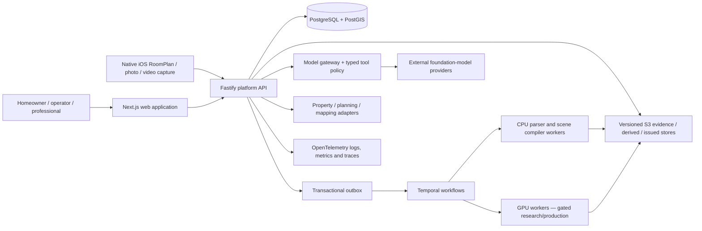

# AI-Native Architecture Platform: Master Implementation Plan

**Status:** amended execution baseline; the single active worktree plan is `08_ACTIVE_BLUE_SKY_M1_EXECUTION_PLAN.md`
**Prepared:** 16 July 2026; scope amended 17 July 2026
**Initial jurisdiction:** England; subsequent UK expansion only after jurisdiction-specific review
**Initial product milestone:** M1 — Complete Home Design System

## 1. Executive answer

The material describes a credible long-term company, but not a credible single-release software project. The company should become an integrated residential-transformation platform: one trusted path from a property and a homeowner's intent to an evidence-backed existing-condition model, professionally accountable design, approvals, procurement, delivery and, eventually, a living as-built home record. Its analogue to an integrated insurance operator is not “AI architecture software”; it is ownership of the information, decision, evidence and operating loops that currently fragment a residential project.

The first executable programme now builds the complete homeowner design loop rather than stopping at the trust kernel. A homeowner gives the product home details and evidence; the product constructs a source-aware digital twin from plans, native iOS capture, photographs and video; conducts a structured interior-design consultation; creates valid spatial and aesthetic variations; presents deterministic 2D/3D, photoreal stills and authoritative/illustrative videos; supports amendments and comparison; and produces an actionable implementation handoff.

The trust kernel remains the architectural centre—canonical model, provenance, typed operations, explicit uncertainty and deterministic outputs—but it is no longer the M1 stopping point. Native RoomPlan/ARKit capture, autonomous multi-source full-house proposal, design variants, still/video rendering and implementation information are all in M1. They remain separate checkpoints so convincing media can never silently become dimensional or professional truth.

## 2. What is being built

### 2.1 Company north star

> A professionally accountable residential-transformation platform that maintains one versioned, evidence-backed canonical home model from initial context through verified as-built condition.

The long-term system has three reinforcing layers:

- **Experience full stack:** a homeowner-facing visual journey that makes complex decisions understandable.
- **Information full stack:** a canonical property/project model with evidence, provenance, uncertainty, permissions, revisions and issued records.
- **Operating full stack:** professional appointments, design, approvals, procurement, delivery assurance, remediation and eventually selective design-and-build responsibility.

The information layer is the strategic centre. Rendering, conversational AI and generative media are replaceable interfaces. The durable moat is the accumulated relationship among property evidence, model revisions, professional decisions, predictions, costs, project events and delivered outcomes.

### 2.2 Initial target

The recommended first customer is an England-based homeowner or committed prospective buyer of a common low-rise freehold house who is considering one of a constrained set of projects:

- rear or side-return extension;
- loft conversion;
- garage conversion;
- internal reconfiguration; or
- a combined renovation/retrofit where geometry is still conventional.

The first service geography must be one or two dense local-authority clusters, chosen through the launch scorecard in `01_PRODUCT_REQUIREMENTS_AND_OPERATING_MODEL.md`. The dossier does not contain enough founder-network, professional-capacity or acquisition evidence to select the geography responsibly today.

### 2.3 The product ladder

| Stage | Customer promise | Platform capability | Operating responsibility |
|---|---|---|---|
| M1: complete home design | “Understand my home, show me coherent alternatives, help me decide and give me an implementation handoff.” | multimodal evidence, native iOS capture, autonomous reconstruction/fusion, canonical model/editor, design studio, 3D, still/video, decisions, schedules and export | software-led interior-design assistance; no regulated professional or construction issue |
| M2: professional design/approval | “Have the selected design reviewed and developed for a stated professional purpose.” | architect/interior-designer review, planning/technical workflows and issue controls | appropriately appointed/insured competent professionals |
| M3: managed delivery | “Help me buy and control the work.” | cost ranges, tenders, procurement, change control, evidence and payment milestones | managed tender/delivery; explicit contractual boundaries |
| M4: selective D&B | “Take accountable responsibility for a narrow project type.” | underwriting, supply network, delivery telemetry, remediation reserve | selectively integrated design-and-build, only where evidence supports it |
| M5: home OS | “Keep the verified record useful after completion.” | as-built ledger, maintenance, retrofit, warranties and future changes | lifecycle service and partner ecosystem |

Every stage is conditional. A stage is earned by measured accuracy, correction effort, professional capacity, customer comprehension, rights position and unit economics; it is not unlocked by calendar time.

## 3. Critical verdict

### 3.1 Strongest thesis

Residential architecture is fragmented because data and responsibility are fragmented. A canonical home model with strong provenance can reduce repeated surveys, redraws, handoffs and misunderstood decisions while giving professionals a controlled substrate for AI assistance. The initial address-to-context experience can acquire demand, while delivered projects create the evidence and outcome loop that pure software competitors lack.

### 3.2 Core assumption

For a narrow property and project box, a rights-cleared plan or scan plus a guided correction workflow can produce a trusted existing-condition model and useful first design branch faster and more cheaply than the current path, with calibrated abstention and enough customer willingness to pay to cover verification and professional review.

If this assumption fails, the full-stack thesis must narrow to workflow software, a professional-production tool or a marketplace/data product. It must not be hidden by better renders.

### 3.3 Fatal risks

1. **Correction economics:** model verification and manual correction may consume the time the product claims to save.
2. **False certainty:** polished geometry, cost or regulatory output may be understood as surveyed or professionally issued truth.
3. **Liability and working capital:** architecture, principal-designer duties and construction delivery can overwhelm margins and management capacity before underwriting evidence exists.
4. **Data rights:** floor plans, imagery, mapping, planning records, product data and customer submissions have different reuse and model-training rights.
5. **Feature commoditisation:** incumbents can copy image generation or simple plan tools; the company must compound controlled outcome data and operating quality instead.

### 3.4 Pressure-test scorecard

| Dimension | Score | Reason |
|---|---:|---|
| Pain intensity | 5/5 | Home projects are expensive, slow, risky and difficult to understand. |
| Buyer clarity | 3/5 | The broad market is clear, but the exact triggering moment and economic buyer require validation. |
| Urgency | 4/5 | Decisions are deadline- and budget-sensitive once a purchase or renovation is active. |
| Differentiation | 4/5 | Canonical evidence + accountability is differentiated; visual AI alone is not. |
| Speed to validate | 2/5 | Trust, geometry and professional outcomes need real properties and weeks of observation. |
| Founder advantage | 2/5 pending evidence | The dossier does not establish a proprietary customer channel, practice capacity, PII, data licence or specialist team. |

**Verdict:** proceed with the complete blue-sky M1 under sequential technical gates. The user has deliberately deferred paid-concierge and budget validation; those risks remain recorded but do not block product engineering. Build locally/provider-light first, preserve deterministic and no-key fallbacks, and require evidence-specific quality gates before reconstructed geometry or generated media is promoted.

## 4. M1 definition

### 4.1 Required user journey

1. Create an account, organisation and project.
2. Search or enter an address; select a property identity from an adapter or deterministic fixture.
3. See a property dossier that labels address-derived facts, context, estimates and unknowns separately.
4. Upload supported plans, documents, photographs and video with rights metadata and reference measurements.
5. Pass the asset through secure validation and immutable source storage.
6. Optionally use the native iOS app for guided single-room/multi-room RoomPlan capture and structured photo/video capture.
7. Run plan parsing, media reconstruction and multi-source registration/fusion to receive a full-house proposal, partial proposal or explicit abstention.
8. Inspect overlays, residuals, inferred/unknown regions and discrepancies; correct walls, openings, stairs, rooms and levels in 2D/3D.
9. Commit a canonical existing-condition version and open the deterministic 3D walkthrough compiled from it.
10. Conduct a structured interior-design consultation covering household needs, retained items, accessibility, style, lighting, storage and priorities.
11. Generate distinct spatial, furniture, finish, material and lighting options as valid design branches.
12. Preview, edit and validate typed operations; keep assumptions, constraints and provenance visible.
13. Produce reproducible geometry-safe photoreal stills and optional, separately labelled enhanced images.
14. Produce collision-checked deterministic walkthrough video and optional, separately labelled AI-enhanced video.
15. Compare options from synchronised cameras/views, record comments and decisions, and freeze a selected version without deleting alternatives.
16. Generate room/product/material schedules, indicative model-derived quantities, work packages and supplier/trade handoff.
17. Export versioned JSON/GLB/media/schedule/provenance packages tied to exact sources, models and tools.

### 4.2 M1 hard boundaries

M1 must not:

- call an address-derived shell an exact interior;
- issue planning, Building Regulations, structural, fire or cost advice;
- offer fixed prices or contractor commitments;
- permit a language model to write model state directly;
- overwrite or delete source evidence, prior model versions or issued records;
- describe a machine proposal as verified without attributable human review;
- train on customer or provider data by default; or
- imply that a rendered scene is surveyed truth.

### 4.3 M1 release gates

M1 is releasable to a controlled pilot only when:

- every mutation is a typed, authorised, idempotent operation with actor, reason and trace ID;
- property context, proposed model, committed current model and export are visibly distinct;
- deterministic replay yields the same canonical snapshot and hash;
- a committed model and its compiled GLB pass golden and bounds checks;
- native iOS capture passes simulator application-state tests and named physical-device RoomPlan field cases;
- photo/video reconstruction reports failed registration, drift and uncertainty rather than silently completing missing geometry;
- fused full-house proposals beat or safely abstain against the best single-source baseline on severe-error and calibration gates;
- geometry-safe stills and deterministic videos remain consistent with the selected model/camera/product configuration;
- enhanced images/video are visibly illustrative and pass geometry/product/temporal consistency checks;
- every implementation schedule and indicative quantity links to exact model elements, assumptions and version;
- cross-tenant and role-based access tests pass;
- unsafe or unsupported inputs abstain rather than fabricate;
- correction time, operator interventions and confidence calibration are recorded;
- the end-to-end journey passes in branded Chrome and Playwright's Chromium, Firefox and WebKit projects;
- privacy, consumer-language, professional-boundary and data-rights reviews are signed off; and
- backup restoration and incident rollback have been exercised in staging.

## 5. Recommended technical shape

The platform should be a TypeScript-first modular monolith with separate Python inference workers and an explicit spatial/compiler boundary. This gives one product team a coherent transactional core without committing prematurely to microservices or a new geometry language.

The concrete recommendation and alternatives are in `02_TECHNICAL_ARCHITECTURE_AND_STACK.md`. The important choices are:

- Node.js 24 LTS for production today, Next.js 16/React 19 for web, strict TypeScript and Fastify 5 for the platform API;
- Python 3.12+ for plan parsing, computer vision and future inference;
- PostgreSQL 18 + PostGIS, SQL-first migrations and typed queries;
- an append-only domain-operation stream plus immutable snapshots and an outbox, not universal event sourcing;
- integer millimetres and explicit coordinate reference systems;
- SVG 2D editing first, Three.js/React Three Fiber 3D, glTF/GLB 2.0 output;
- local-first containers and filesystem/object-store adapters for development, with AWS London modules disabled until a later deployment decision;
- native Swift/SwiftUI + RoomPlan/ARKit for iOS capture, Blender headless for baseline still/video rendering, and versioned COLMAP/Open3D/Nerfstudio adapters for reconstruction/appearance research;
- Temporal for durable multi-step workflows after a short adoption spike;
- OpenAPI 3.1 as the compatibility baseline, generated clients and contract tests;
- managed OIDC with server-owned project permissions; and
- OpenTelemetry, immutable audit records and explicit professional issue workflows.

## 6. Execution model

### 6.1 No worktrees until repository activation

The supplied directory is not a Git repository. Execution must therefore begin with a master-session activation checkpoint:

1. agree the repository root and whether the research corpus remains in the product repo;
2. initialise Git, establish `main`, ignore generated/secret files and commit the exact planning baseline;
3. add the package/toolchain skeleton and root ownership policy in the master session;
4. run the baseline verification suite; and only then
5. discover the project in Codex and create project-scoped worktree tasks.

Raw `git worktree` folders, hidden subagents and ad-hoc parallel edits are not substitutes for the orchestration workflow. The detailed mechanics are in `03_M1_CHECKPOINTED_WORKTREE_PLAN.md`.

### 6.2 Conflict-prevention rule

Across every checkpoint, the orchestrator owns:

- root package manifests and lockfile;
- root TypeScript/Python/tooling configuration;
- `.github`, `.codex`, `AGENTS.md`, `CODEOWNERS` and environment manifests;
- accepted ADRs;
- shared OpenAPI documents and generated clients;
- database migration sequence;
- cross-package barrel exports; and
- the orchestration ledger and release notes.

Workers receive already-created package boundaries and a frozen checkpoint contract. They may edit only their assigned directories. If a worker discovers a shared change, it records a change request; the orchestrator applies it between merges. This is more important than maximum parallelism.

### 6.3 Checkpoint map

M1 uses one active sequential implementation plan: `08_ACTIVE_BLUE_SKY_M1_EXECUTION_PLAN.md`. It contains C0 through C18 inclusive—nineteen checkpoints. Native capture, reconstruction, GPU-dependent visual work and the interior-design workflow are inside M1, but hardware-specific checkpoints stay isolated so Mac, physical Apple device and Windows/NVIDIA evidence can be collected without conflicting ownership.

Lane counts are deliberately adaptive and predefined by dependency shape. A checkpoint receives only enough parallel lanes to establish exclusive ownership: two where there are two coherent producers/consumers, three where a third independent substrate or release surface exists, and four where backend, specialist worker/kernel, UX and adversarial evaluation can proceed without shared-file edits.

| Checkpoint | Verifiable product outcome | Lanes | Parallel lanes after contract freeze |
|---|---|---:|---|
| C0 | Git/toolchain baseline is reproducible across web/API/iOS | 4 | API; web; native iOS; delivery infrastructure + QA/devex |
| C1 | Tenant-safe account, project and role shell | 3 | identity/project persistence; authorisation + security; onboarding + e2e |
| C2 | Rights-aware immutable evidence upload | 4 | asset/storage backend; secure processing; upload UI; adversarial tests |
| C3 | Property dossier with explicit unknowns | 2 | property backend + adapter; dossier UX + contract/e2e QA |
| C4 | Canonical 2.5D model can be created and validated | 4 | model/provenance schema; geometry kernel; persistence/API; fixtures/property tests |
| C5 | Model operations branch, replay and restore deterministically | 4 | operation store/reducer; audit/authz; editor state; concurrency/replay QA |
| C6 | Plan proposal can be calibrated and corrected in 2D | 4 | processing workflow; parser adapter; correction UI; benchmark/security QA |
| C7 | Native iOS RoomPlan/ARKit capture is usable | 4 | AR/RoomPlan; quality/sync; backend/converter; mobile/field QA |
| C8 | Photo/video/RGB-D reconstruction emits registered evidence | 4 | media prep; geometric reconstruction; neural appearance; GPU/evaluation |
| C9 | Multi-source evidence produces an explicit full-house proposal | 4 | registration/fusion; semantic fitting; discrepancy workflow; evaluation |
| C10 | The committed model compiles to deterministic browser 3D | 3 | scene compiler; scene backend; viewer/performance acceptance |
| C11 | A structured interior-design consultation produces an inspectable brief | 3 | brief domain; agent orchestration; consultation UX/evaluation |
| C12 | Valid spatial and aesthetic design variants can be generated and edited | 4 | constraint engine; asset placement; typed AI proposals; option UX/evaluation |
| C13 | Product/material selections become room specifications | 3 | catalog assets; specification domain; selection UX/QA |
| C14 | Reproducible geometry-safe photoreal stills can be generated | 4 | render scene; Blender renderer; enhancement adapter; visual evaluation |
| C15 | Deterministic and labelled enhanced walkthrough videos can be generated | 4 | camera path; frame/encode; enhancement/narration; temporal QA |
| C16 | Users can compare, collaborate and freeze a decision | 3 | decision backend; synchronised comparison UX; comprehension/e2e QA |
| C17 | The selected design produces an implementation handoff | 3 | scope/quantity compiler; handoff/export UX; provenance/quantity QA |
| C18 | The complete M1 is secure, recoverable and releaseable | 4 | security/privacy; observability/recovery; cross-surface UAT; support/release |

Each checkpoint is sequential at the integration level. Its independent lanes may run in parallel, but the next checkpoint does not begin until the current work is merged, reviewed, tested and documented.

## 7. Commercial validation status

### 7.1 Deferred and removed from the build register

The paid-concierge experiment is not part of the active checkpoint register and does not gate C0–C18. “Alongside C0–C3” previously meant a separate founder/product experiment occurring in calendar parallel with engineering; it did not mean a worktree or code dependency. The user has chosen to skip it and prioritise product development.

If commercial validation is run later, it may still measure:

- conversion from property intent to paid evidence/model session;
- plan availability and rights clarity;
- time to first proposal and time spent correcting;
- number and severity of unresolved unknowns;
- whether users understand “context”, “estimated”, “current”, “verified” and “issued”;
- usefulness to an architect or measured-survey workflow; and
- willingness to pay for the next professional step.

This is a recorded business risk only. It does not prevent canonical-model, capture, reconstruction, design or media engineering.

### 7.2 Later first-user work

Acquire the first ten through direct, inspectable channels:

- two independent residential architects or measured-survey partners;
- one local homeowner/community or estate-agent relationship with an active project trigger;
- founder-led interviews and paid concierge sessions; and
- no broad paid acquisition until qualification and service capacity are understood.

The first ten are research partners with clear service boundaries, not a soft public launch.

### 7.3 Later commercial gates

Expansion into paid professional or construction responsibility should still require evidence that:

- a useful model is produced for most accepted inputs rather than only showcase examples;
- median correction time and professional review cost show a credible downward path;
- severe geometric errors are detected or abstained from, not hidden;
- professionals reuse the model rather than redraw it;
- users pay for a trusted next step; and
- licences permit the intended production and learning use.

Pivot to professional workflow software if professionals value the model but homeowner acquisition or comprehension is poor. Pivot to a managed-survey/capture service if model value is high but self-service evidence is unreliable. Stop the architecture-practice expansion if PII, dutyholder capacity, complaints or review economics do not support it.

## 8. Hardware split inside M1

The Mac remains the main integration environment for web/API/domain/geometry, Xcode/simulator work, browser 3D, CPU/vector baselines and low-resolution Blender renders. M1 also contains hardware-specific checkpoints:

- a physical supported LiDAR iPhone/iPad for RoomPlan and ARKit field validation;
- a Windows/NVIDIA workstation for CUDA reconstruction, neural appearance and high-resolution rendering/video where the Mac baseline is insufficient; and
- provider/cloud adapters disabled by default until later rights, credentials and spend decisions.

All hardware lanes return versioned containers/configuration, artifact manifests and benchmark reports to the same repository. Raw media, datasets and model weights do not enter Git. Mac/simulator mocks cannot close physical-device or CUDA gates.

## 9. Documents in this package

1. `00_MASTER_IMPLEMENTATION_PLAN.md` — decision-first synthesis and execution map.
2. `01_PRODUCT_REQUIREMENTS_AND_OPERATING_MODEL.md` — users, requirements, service model, discovery and stage gates.
3. `02_TECHNICAL_ARCHITECTURE_AND_STACK.md` — concrete platform, domain, data, AI, spatial and infrastructure architecture.
4. `03_M1_CHECKPOINTED_WORKTREE_PLAN.md` — archived foundation-only plan retained for decision history.
5. `04_POST_M1_AND_GPU_ROADMAP.md` — historical stage analysis; capture/GPU/design/media portions have moved into active M1.
6. `05_VERIFICATION_SECURITY_RELEASE_PLAN.md` — automated, browser, computer-use, iOS, operational and regulatory verification.
7. `06_DECISIONS_RISKS_AND_OPEN_QUESTIONS.md` — decisions, ambiguities, assumptions, risks and required founder inputs.
8. `07_SOURCE_REGISTER.md` — local evidence map and official external verification sources.
9. `08_ACTIVE_BLUE_SKY_M1_EXECUTION_PLAN.md` — the single controlling C0–C18 worktree plan.

## 10. Immediate next action

The repository root is now resolved as `/Users/abhinavgupta/Desktop/Interior Design`, matching the saved Codex project. The immediate action is C0 master-only activation: initialise and link Git, preserve the dossier, freeze root/toolchain/contracts and create a committed base. Only then open the four project-scoped C0 worktree lanes. Geography, paid-provider and commercial-pilot decisions do not block local scaffolding; physical iOS hardware blocks only C7/C18 field gates.
