# Production Technical Architecture and Stack

## 1. Architecture principles

1. **The canonical model is authoritative.** UI state, renders, AI text and provider records are projections or evidence.
2. **Truth is typed and attributed.** Values retain provenance, method, confidence/uncertainty and verification status.
3. **Operations are the mutation boundary.** Clients and models request typed operations; the server authorises, validates and appends them.
4. **Determinism precedes generation.** Geometry validation, model replay, scene compilation and exports are deterministic for pinned inputs.
5. **Unknown is a valid value.** Missing or conflicting evidence is never replaced by a plausible default in an authoritative path.
6. **Professional decisions are human and purpose-specific.** AI may prepare; an attributable competent person issues.
7. **Start modular, split by evidence.** A modular monolith protects transactions and delivery speed; services split when scaling, security or team ownership justifies them.
8. **Source, derived and issued records differ.** Storage, immutability, retention, access and regeneration policies reflect those differences.
9. **Provider integrations are adapters.** No external API, model or file format becomes the internal domain model.
10. **Security and operability are product features.** Tenant isolation, recovery, audit and limitations ship with the workflow.

## 2. Recommended stack as of 16 July 2026

| Layer | Recommendation | Reason and constraint |
|---|---|---|
| Runtime | Node.js 24 LTS | Node 26 is Current, not LTS, on the planning date; use an LTS line for production. |
| Monorepo | pnpm workspaces + Turborepo | Fast shared TypeScript contracts and bounded package tasks; root manifests remain orchestrator-owned. Use Nx only if its graph/generator governance is needed. |
| Web | Next.js 16 App Router, React 19, strict TypeScript | Server-rendered product shell and mature web ecosystem; keep domain writes behind the platform API. |
| UI | Tailwind CSS + shadcn/Radix primitives | Accessible foundations and fast composition; build a project-specific design system rather than shipping defaults unchanged. |
| Client data | TanStack Query; small local reducer/store for editor sessions | Separate server state from transient selection, viewport and uncommitted operation state. |
| 2D | SVG-based editor first | Inspectable DOM, accessible overlays and sufficient M1 2.5D editing; consider Canvas/WebGL only after measured scale limits. |
| 3D | Three.js + React Three Fiber; glTF/GLB 2.0 | Broad browser support and interoperable derived scenes; canonical geometry remains independent. |
| API | Fastify 5, JSON Schema/TypeBox-style schemas, OpenAPI 3.1.x | Native validation/serialisation and generated clients. Freeze on OpenAPI 3.1.2 rather than immediately adopting 3.2 tooling. |
| Database | PostgreSQL 18 + PostGIS 3.6; SQL migrations; Kysely or equivalent typed query layer | Strong transactions, JSONB and geospatial operations; RDS currently supports the recommended extension versions. |
| Workflow | Temporal Cloud in production after spike; local Temporal for development | Durable jobs and human/provider waits without ad-hoc retry state. Keep domain truth in Postgres, not workflow history. |
| Objects | S3 with versioning; Object Lock governance for source/issued classes | Immutable evidence and reproducible derived artifacts. |
| ML/CV | Python 3.12+, FastAPI/Pydantic 2 adapter, PyTorch/OpenCV/PyMuPDF, uv/Ruff/type checking | Isolates model dependencies while retaining typed job contracts. |
| Infrastructure | AWS London (`eu-west-2`), ECS Fargate, RDS Multi-AZ, S3, CloudFront/WAF, AWS Batch EC2 for GPU | Managed, regionally coherent platform without premature Kubernetes. |
| IaC | OpenTofu/Terraform-compatible modules | Reviewable infrastructure and lower lock-in; pin providers and generate plans in CI. |
| Identity | Managed OIDC provider selected by procurement spike | Buy authentication; own authorisation. Compare Auth0, WorkOS and Cognito on UX, UK data terms, B2B roles and price. |
| Observability | OpenTelemetry -> managed logs/metrics/traces; error tracking with PII scrubbing | Cross-service correlation and safe operational diagnosis. |
| CI/CD | GitHub Actions, ephemeral preview/test environments, staged promotion | Contract, security, migration and browser gates before production. |

Version numbers above are a planning baseline, not an instruction to float dependencies. The execution checkpoint must pin exact versions in lockfiles/images and record upgrades through dependency pull requests and release notes.

## 3. Repository architecture

```text
/
├── apps/
│   ├── web/                    # homeowner/operator/professional web UI
│   └── ios-capture/            # post-M1 native SwiftUI/RoomPlan application
├── services/
│   ├── platform-api/           # Fastify modular monolith
│   ├── spatial-worker/         # deterministic plan/scene/export jobs
│   └── inference-worker/       # Python model adapters and inference
├── packages/
│   ├── domain-model/           # canonical schemas, value objects, invariants
│   ├── model-operations/       # operation registry, reducers and upcasters
│   ├── geometry-kernel/        # 2.5D primitives and validation
│   ├── scene-compiler/         # canonical model -> scene graph/GLB
│   ├── provenance/             # attribution, verification and issue semantics
│   ├── authz/                  # server policy and permission tests
│   ├── api-contracts/          # OpenAPI source and generated clients
│   ├── provider-adapters/      # ports and shared adapter contracts
│   ├── telemetry/              # event, log and trace conventions
│   ├── ui/                     # accessible design-system components
│   ├── editor-core/            # UI-independent editing session logic
│   └── test-fixtures/          # synthetic/rights-cleared golden cases
├── infrastructure/
│   ├── modules/                # reusable IaC
│   └── environments/           # dev, staging, production compositions
├── tests/
│   ├── contract/
│   ├── integration/
│   ├── e2e/
│   ├── geometry/
│   ├── security/
│   └── performance/
├── docs/
│   ├── adr/
│   ├── product/
│   ├── threat-models/
│   ├── runbooks/
│   └── evaluation/
└── tools/                      # deterministic generators and validation CLIs
```

### 3.1 Boundary rules

- `apps/*` may depend on generated API clients, UI and editor packages; they do not import API persistence code.
- `platform-api` owns transactions, policy enforcement and orchestration requests; domain packages remain framework-independent.
- `domain-model` cannot import web, database, provider or AI SDKs.
- `geometry-kernel` consumes/returns typed domain geometry and has no browser dependency.
- `scene-compiler` is pure for a pinned snapshot, asset set and compiler version.
- workers accept versioned job envelopes and never mutate domain tables directly without an API/domain command or controlled transaction boundary.
- provider SDKs are contained in adapter modules.
- root and shared schema files are orchestrator-owned during parallel checkpoints.

Enforce boundaries with dependency-cruiser/ESLint rules and CI graph checks.

## 4. Platform decomposition

### 4.1 Start with a modular monolith

The Fastify platform API contains modules for identity, projects, property, assets, models, operations, jobs, provenance, exports and audit. Each module owns:

- routes and request/response schemas;
- application commands/queries;
- domain services;
- repository interfaces and SQL implementations;
- emitted outbox events; and
- tests.

Do not create separate network services for every module. Split only if one of the following is measured:

- isolation is needed for hostile file processing or GPU dependencies;
- workload scaling is materially different;
- release/ownership boundaries are stable and independent;
- data residency/security requires a separate boundary; or
- the modular boundary repeatedly fails despite enforcement.

Spatial and inference workers are separate processes from the start because they have different dependency, resource and security profiles.

### 4.2 API contract

- HTTP/JSON is the public product API for M1.
- OpenAPI 3.1.2 is the canonical external contract; generated TypeScript and Swift clients are build artifacts checked for drift.
- Request and response JSON Schemas are shared with Fastify validation/serialisation.
- All mutation endpoints require an `Idempotency-Key`; model mutations also require `expectedRevision`.
- Errors use a versioned problem-details envelope with stable codes, trace ID, retryability and conflict recovery fields.
- Pagination is cursor-based for audit/operations/assets; never expose unbounded history.
- Dates use RFC 3339 UTC; units and CRS are explicit in schema names/fields.
- Long operations return a job resource; the client subscribes/polls with backoff rather than holding an HTTP request.
- Webhooks, when introduced, are signed, replay-protected and processed idempotently.

Do not use Next.js Server Actions as an alternative domain mutation path. They may call the platform client but cannot bypass it.

### 4.3 Identity and authorisation

Authentication flow:

1. managed OIDC authenticates the person;
2. the API maps the stable issuer/subject to a platform actor;
3. server session/token validation establishes current actor and authentication strength;
4. project/asset/model policy is evaluated against platform grants; and
5. the audit context is attached to the transaction and trace.

Authorisation should use explicit permissions such as `project.read`, `asset.upload`, `model.propose`, `model.commit`, `review.verify`, `record.issue` and `export.create`. Roles map to permission sets; high-consequence actions also require state/competency conditions. PostgreSQL row-level security may be added as defence in depth after the application policy is stable, but it cannot replace application tests or accidentally become the only documented policy.

## 5. Canonical data model

### 5.1 Aggregate map

- **Organisation:** membership and policy context.
- **Actor:** person, service, provider or machine identity.
- **Project:** client intent, property link, lifecycle and jurisdiction.
- **PropertyIdentity:** selected address/provider identities and asserted corrections.
- **EvidenceAsset:** immutable source object, rights/purpose, hash and derived representations.
- **CanonicalModel:** model lineage and current branches.
- **ModelBranch:** named line of development with head revision/snapshot.
- **ModelOperation:** typed, versioned, authorised mutation request and result.
- **ModelSnapshot:** immutable canonical state with deterministic hash.
- **ValidationFinding:** rule, location, severity, evidence and resolution.
- **ReviewDecision:** attributable acceptance/rejection/verification for a purpose.
- **IssuedRecord:** immutable document/model package with issuer, scope and source versions.
- **DerivedArtifact:** reproducible scene, preview, overlay or export tied to exact inputs/tool versions.
- **Job:** durable user-visible state for processing/compilation/export.
- **AuditEvent:** security/domain access and action record distinct from analytics.

### 5.2 Geometry profile

M1 is a **2.5D residential domain**, not a general CAD/BIM kernel:

- integer millimetres for authoritative linear values;
- planar levels with explicit elevations;
- wall paths/faces, thickness and height;
- openings hosted in walls with offsets and dimensions;
- spaces/room polygons derived or asserted with topology checks;
- slabs and simple roofs only where evidence supports them;
- explicit local model CRS and transform to geospatial context;
- stable element IDs across projections; and
- geometry method/uncertainty/provenance at element or attribute level.

Avoid unconstrained floating-point editing. Convert rendering coordinates at the boundary and round/validate typed operations deterministically.

### 5.3 Provenance envelope

Material attributes should support:

```ts
type AttributedValue<T> = {
  value: T | null;
  state: "unknown" | "estimated" | "observed" | "derived" | "verified";
  method: string;
  evidenceRefs: string[];
  actorId: string;
  recordedAt: string;
  confidence?: number;
  uncertainty?: { kind: string; lower?: number; upper?: number; note?: string };
  verification?: {
    purpose: string;
    verifierActorId: string;
    verifiedAt: string;
    scope: string;
  };
};
```

Do not wrap every implementation value blindly; identify material attributes and provide a common provenance link where a set of values shares the same method/evidence.

### 5.4 Operations and snapshots

Use an append-only operation stream for canonical model state, not event sourcing for the entire business.

Transaction for a model mutation:

1. authenticate and authorise;
2. validate operation schema/version and idempotency key;
3. lock/check branch head revision;
4. load the pinned snapshot and necessary operations;
5. run domain and geometry preview;
6. if confirmed and valid, append the operation/result;
7. reduce to a new canonical snapshot;
8. serialise canonically and hash it;
9. update branch head and write audit/outbox rows in one transaction; and
10. return new revision, snapshot ID, findings and trace ID.

Snapshots are periodically/materially persisted to bound replay time. Historical operation schemas are retained with upcasters or explicit migrations plus golden replay tests. “Undo” of a committed operation is a compensating operation/new snapshot; history is never rewritten.

### 5.5 Deterministic hashing

- Define a canonical JSON serialisation profile (for example RFC 8785-compatible semantics where applicable).
- Exclude volatile timestamps/trace IDs from the geometry-content hash; retain them in metadata.
- Sort maps/collections where domain order is not meaningful.
- Pin schema and compiler versions.
- Hash source objects at ingestion and derived outputs after generation.
- Store the input manifest alongside every derived artifact.

## 6. Persistence and storage

### 6.1 PostgreSQL

Use PostgreSQL for transactional domain state, permissions, job indexes, operation metadata, audit indexes and geospatial context. Use PostGIS for property/context geometry and spatial queries, not for the interactive 2.5D editor kernel.

Recommended practices:

- forward-compatible, transactional migrations where possible;
- expand/migrate/contract for breaking database changes;
- one migration owner per checkpoint;
- migration checks on a production-like snapshot and empty database;
- optimistic concurrency for branches and conventional constraints for relational invariants;
- an outbox table committed with domain mutations;
- read replicas/search stores only when measured; and
- no vector database in M1. Add pgvector or a retrieval store only with a defined corpus, permission filter and evaluation.

### 6.2 Object classes

Use distinct buckets or access points/prefixes with independently enforced policies:

| Class | Examples | Mutability/lifecycle |
|---|---|---|
| Source | uploaded PDF/image, scan session, provider response capture where licensed | immutable version; retention/legal deletion policy; Object Lock governance where appropriate |
| Derived | thumbnails, rasterised pages, parser overlays, GLB, previews | reproducible; lifecycle/caching allowed; exact input/tool manifest required |
| Issued | professional drawing/model/report package, verification record | immutable; restricted issue workflow; retention aligned to appointment/legal advice |
| Temporary/quarantine | upload staging, virus scan, failed conversion | isolated, short TTL, no downstream trust until promoted |

S3 Object Lock requires versioning. Use governance mode initially with tightly restricted bypass permission; compliance mode only after legal/retention review because it prevents deletion even by root for the retention period.

### 6.3 Audit versus analytics

- **Audit:** immutable, actor-attributable security/domain record; retained and access-controlled according to legal/operational need.
- **Product analytics:** minimised behavioural events with pseudonymous identifiers, purpose/retention and opt-out/consent treatment as advised.
- **Observability:** logs/metrics/traces with structured redaction and short operational retention.

Never send addresses, document content, prompts, model geometry or signed URLs into analytics/error tools by default.

## 7. Spatial processing and rendering

### 7.1 Plan ingestion pipeline

```mermaid
flowchart LR
    A["Quarantined upload"] --> V["MIME/signature/size/page/pixel validation"]
    V --> M["Malware and content scan"]
    M --> R["Sandboxed vector extraction / rasterisation"]
    R --> C["Calibration evidence"]
    C --> P["Parser adapter"]
    P --> Q["Typed proposal + confidence + unknowns"]
    Q --> H["Human correction"]
    H --> S["Committed canonical snapshot"]
```



Start in this order:

1. deterministic fixture/mock adapter;
2. vector PDF extraction and rule baseline;
3. raster line/opening/room baseline;
4. evaluated learned model behind the same adapter; and
5. fusion/advanced inference only when it beats the baseline on a rights-cleared holdout.

PDF/rendering libraries process hostile content. Run them without cloud credentials, with read-only containers, temp storage, CPU/memory/time/page/pixel limits and no outbound network.

### 7.2 Geometry kernel

Implement a stable interface around:

- integer point/segment/polygon primitives;
- snapping and tolerance policy;
- polygon validity and intersection;
- wall/opening hosting and clearance;
- room closure/connectivity;
- operation preview/impact bounds; and
- deterministic triangulation/mesh input.

Conduct a short library spike using representative adversarial fixtures. Prefer a mature integer polygon/robust-predicate library where licence and WASM/Node support fit. Avoid committing to Rust, CGAL or OpenCascade in M1 unless the spike demonstrates TypeScript cannot meet correctness/performance requirements. Preserve the interface so a Rust/WASM or isolated native kernel can replace internals later.

For M1 walls/openings, generate the correct mesh topology directly; do not rely on brittle general-purpose runtime CSG for every opening.

### 7.3 Scene compiler

The compiler receives:

- immutable snapshot ID/hash;
- referenced, authorised derived assets;
- compiler and material-library version;
- target profile; and
- requested quality/level options.

It emits:

- scene manifest;
- GLB 2.0 artifact;
- element-to-node mapping;
- bounds, triangle/material/texture counts;
- validation report; and
- output hash.

Use the Khronos glTF validator, golden screenshots only as supplemental checks and semantic/bounds assertions as primary checks. Do not use proposed/unratified glTF extensions in the M1 contract.

### 7.4 Web viewer

- Code-split the viewer from the property/evidence shell.
- Load signed, short-lived scene URLs only after authorisation.
- Use GPU capability checks and conservative quality defaults.
- Maintain element identity for selection/provenance.
- Budget geometry/material/texture size and dispose resources on route/change.
- Support keyboard/touch controls and a structured selected-element panel.
- Preserve a 2D/metadata path when WebGL is unavailable.

## 8. Workflow and jobs

### 8.1 Temporal adoption gate

Temporal fits parsing, compilation, export, provider calls, professional review waits and future project lifecycles because workflows resume after failures and can wait durably. It adds operational/conceptual cost. C0 must prove:

- local development and CI are reliable;
- workflow history payloads contain IDs, not large/sensitive documents;
- versioning/replay is understood;
- cancellation and retry boundaries are defined; and
- the team can observe and recover a failed workflow.

If the spike fails, use a Postgres-backed job queue with the same versioned job envelope and idempotent activities. Do not build bespoke distributed workflow semantics across application tables.

### 8.2 Job envelope

Every job includes:

- job ID/type/schema version;
- organisation/project and authorised actor context;
- input resource IDs and exact versions/hashes;
- requested tool/profile version;
- idempotency key and trace context;
- resource/time limits;
- output resource IDs/hashes;
- user-visible state and safe error code; and
- retry/cancellation policy.

Workers use scoped credentials and re-check resource access/purpose where a job may outlive the initiating request.

## 9. AI architecture

### 9.1 Model gateway

One internal gateway owns:

- provider/model selection and version pinning;
- prompt/template registry;
- data classification and provider routing;
- request/response redaction and retention policy;
- token/cost/latency/error metrics;
- tool registry and schema versions;
- evaluation hooks and shadow testing; and
- safe provider fallbacks.

External model SDKs must not spread across application modules.

### 9.2 Typed-tool execution

```mermaid
sequenceDiagram
    participant U as User
    participant UI as Web UI
    participant API as Platform API
    participant AI as Model gateway
    participant D as Domain/geometry
    U->>UI: Describe intent
    UI->>API: Request proposal on snapshot/revision
    API->>AI: Authorised, bounded context + tool schemas
    AI-->>API: Versioned tool call proposal
    API->>D: Validate permission, arguments, constraints, impact
    D-->>API: Preview + findings + expected result
    API-->>UI: Explainable proposal; no mutation yet
    U->>UI: Confirm or edit
    UI->>API: Typed operation + expected revision + idempotency key
    API->>D: Revalidate and append transactionally
    API-->>UI: New revision/snapshot + audit reference
```

The model never receives database credentials or direct mutation endpoints. Retrieved documents are untrusted data, not instructions. Professional issue, payment and safety-critical decisions stay outside machine authority.

### 9.3 Evaluation before provider changes

Maintain versioned evaluation sets for:

- valid/invalid tool selection;
- argument accuracy and units;
- unsupported-intent abstention;
- prompt/document injection;
- evidence citation and unknown handling;
- permission boundary attempts;
- cost/latency; and
- semantic equivalence across provider/model updates.

A model upgrade is a release with regression evidence, not a configuration flip.

## 10. iOS spatial capture (post-M1)

Use native SwiftUI and RoomPlan on supported LiDAR iPhone/iPad hardware. RoomPlan provides a parametric room representation and USD/USDZ output, but it remains evidence/proposal input rather than canonical truth.

Architecture:

- downloaded project/capture brief with short-lived credentials;
- local RoomPlan sessions and resumable encrypted upload;
- capture session manifest, device/OS/app versions and environmental notes;
- multi-room merge using a shared/relocalised AR session where possible;
- server-side conversion to a proposed canonical model;
- discrepancy review against plan/current model;
- human commit/verification workflow; and
- raw/derived retention policy.

The iOS Simulator cannot test the camera or ARKit. It tests navigation, forms, sync/error states and accessibility only. RoomPlan acceptance requires physical supported devices.

## 11. Cloud architecture

### 11.1 Production topology

- Route 53/DNS and CloudFront for the public web edge.
- AWS WAF/rate controls for public entry points.
- ECS Fargate services across at least two AZs for web/API and ordinary CPU workers.
- private subnets for RDS/worker internals; narrowly scoped egress.
- RDS PostgreSQL Multi-AZ with encryption, automated backups and point-in-time recovery.
- S3 versioned buckets/access points with lifecycle and Object Lock policies by class.
- KMS, Secrets Manager/Parameter Store and short-lived task roles.
- Temporal Cloud connectivity or self-hosted dev only; do not self-host production Temporal without operational capacity.
- AWS Batch on EC2 GPU families for gated GPU jobs; Fargate is not the GPU compute path.
- OpenTelemetry collector/export with tenant-data redaction.

### 11.2 Environments

| Environment | Data | Purpose |
|---|---|---|
| Local | synthetic fixtures only | fast development, deterministic replay and browser tests |
| CI | ephemeral DB/object emulator or scoped test resources | automated unit/contract/integration/e2e |
| Preview | synthetic fixtures; one branch/version | UI/product review, never customer data by default |
| Staging | controlled synthetic + specifically authorised test cases | production-like integration, recovery and user acceptance |
| Production | customer/provider data under approved terms | controlled pilot then service |

Do not copy production customer data into lower environments. Create synthetic and rights-cleared golden fixtures.

### 11.3 Deployment

- Build reproducible, signed container images and web artifacts.
- Generate SBOM and vulnerability/provenance attestations.
- Run migration compatibility checks before application promotion.
- Promote the same artifact from staging to production.
- Use feature flags for incomplete user-facing capability; flags do not bypass schema/security review.
- Run post-deploy read-only smoke checks and a synthetic M1 journey.
- Define automatic halt/rollback for error/SLO regressions; database changes use forward repair where rollback is unsafe.

## 12. Observability and SLO model

Attach organisation/project/resource IDs only when safe and access-controlled; use hashes/pseudonymous IDs in third-party tooling.

Minimum signals:

- request/job/workflow success, latency, retries and queue age;
- operation conflict, validation failure and deterministic replay mismatch;
- asset quarantine/rejection reason;
- parser abstention and correction effort;
- scene compile time/size/validator result and viewer capability/failure;
- provider rate/error/cost and circuit state;
- authorisation denials and anomalous export/support access;
- database connection/replication/backup health; and
- product funnel/comprehension measures in a separate analytics system.

Define service-level objectives after load baselines. Error-budget policy must stop feature release when the controlled pilot is unreliable or correctness alerts are unresolved.

## 13. Security architecture

### 13.1 Threat model priorities

- cross-tenant direct-object access;
- malicious PDFs/images and parser/library compromise;
- signed URL leakage or overly broad object roles;
- prompt/document injection causing unsafe tool calls or exfiltration;
- model-operation replay, race and idempotency bugs;
- false status/issue escalation;
- privileged support misuse;
- dependency/supply-chain compromise;
- provider outage/data-retention mismatch; and
- loss/corruption of evidence or operation history.

### 13.2 Controls

- OIDC best practices, secure HTTP-only sessions, CSRF protection where relevant and step-up auth for sensitive actions.
- Object-level policy checks at every API and job boundary.
- isolated upload processing with no secrets/network and strict limits.
- schema validation plus domain/geometry validation; never trust AI/tool arguments.
- short-lived scoped object URLs; no public buckets.
- append-only audit with restricted write/read and integrity monitoring.
- dependency pinning, review, scanning, secrets scanning, CodeQL/static analysis, container/SBOM scans.
- cloud guardrails, encryption, backup/restore exercises and incident runbooks.
- NCSC secure-AI lifecycle applied to design, development, deployment and operation.
- privacy by design/DPIA and consumer-claim review before production.

Commission independent penetration testing before a broader external beta and before professional/financial workflows materially expand the attack/impact surface.

## 14. Build, buy and partner boundaries

### Build and own

- canonical model/provenance/uncertainty semantics;
- typed operation/reducer/versioning system;
- geometry validation and deterministic compiler;
- professional review/issue and project-control workflows;
- evaluation harnesses and outcome-data schema;
- user experience that communicates status and limitations.

### Buy or license

- identity/authentication;
- cloud compute/storage/database;
- foundation models and commodity OCR where evaluated;
- email/SMS/payments/communications;
- address/mapping/planning/property/product data under explicit contracts;
- commodity security/observability tooling.

### Partner or keep independent

- registered architects, engineers, measured survey and specialist review until internal capability is justified;
- building control as an independent statutory function;
- finance/insurance initially;
- contractors/suppliers under controlled qualification rather than ownership.

Provider selection must consider licence/reuse/training rights, SLA, data location, deletion, auditability, rate/coverage, fallback and unit cost. API availability alone is not permission to build a product or training corpus.

## 15. Alternatives explicitly rejected for M1

| Alternative | Why not now | Revisit when |
|---|---|---|
| Kubernetes/many microservices | operational and coordination cost exceeds M1 need | sustained scale/team/security isolation justifies it |
| universal event sourcing | expands complexity beyond canonical model need | multiple business aggregates require temporal reconstruction |
| graph database | canonical relations and spatial data fit Postgres | measured traversal use cases cannot be served well |
| vector database by default | no governed corpus/evaluation yet | retrieval quality and permission-filter requirements are defined |
| Rust/native CAD kernel immediately | slows product iteration before requirements are proven | TS/WASM spike fails correctness/performance or advanced geometry is funded |
| IFC as internal model | complexity and semantics exceed wedge; risks external format dictating product | professional interoperability requirements are concrete |
| autonomous multi-agent mutation | unsafe, hard to evaluate and non-deterministic | never for direct issue; bounded planning may be evaluated later |
| AI video/photorealism in core | does not validate geometry or operating economics | acquisition hypothesis has a separate metric and budget |
| self-host every provider | security/ops cost and hardware burden | data/provider economics justify a controlled model deployment |

## 16. Architecture decision records required in C0

1. ADR-001 repository/monorepo and ownership policy.
2. ADR-002 canonical model operation stream + snapshot strategy.
3. ADR-003 units, coordinate systems, tolerance and canonical serialisation.
4. ADR-004 API/OpenAPI/error/idempotency convention.
5. ADR-005 authentication provider and platform authorisation.
6. ADR-006 Temporal adoption or fallback job queue.
7. ADR-007 storage classification, retention and Object Lock.
8. ADR-008 upload threat model/sandbox boundary.
9. ADR-009 geometry library/kernel spike result.
10. ADR-010 AWS topology, data region, recovery objectives and environment isolation.
11. ADR-011 model gateway/provider data policy.
12. ADR-012 professional verification/issue state machine (before M3).

An ADR records context, decision, alternatives, consequences, owner, date and reversal trigger. It is not a restatement of code.
