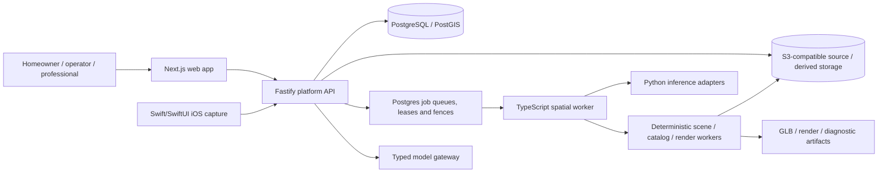

# Interior Design — Blue-Sky Vision and Current Product State Audit

**Audit date:** 11 August 2026
**Repository:** `Interior Design`
**Current branch:** `main`
**Close-out starting HEAD:** `7f4280273e0dd1c86e434e1555cbe6baafbcbf69` (`test(c14): bootstrap live storage integration`)
**Purpose:** factual product, architecture, implementation and evidence audit
**Status:** informative engineering report; not a release sign-off

This document separates four things that are easy to conflate:

1. the long-term blue-sky product vision;
2. the active M1 implementation target;
3. code that exists in the repository; and
4. capabilities that have actually been verified on real hardware, services, providers or customer-like data.

The conclusion is deliberately conservative: the repository contains a substantial C0–C13 product and architecture spine plus a locally integrated C14 render control plane, but it is not yet a complete, production-deployed M1 home-design agency or a release-ready system. C14 is `implementation-ready / hardware-gate-deferred`; no local fixture is real-render evidence.

## 1. Audit scope and source hierarchy

The audit inventoried **1,461 tracked files** across the research dossier, applications, services, workers, packages, infrastructure, tests and operational documentation. Dependency, build and generated-output directories were excluded from product conclusions.

The evidence hierarchy used was:

1. current source code, schemas, migrations, configuration and tests;
2. the active M1 plan and active checkpoint contract;
3. current Git state and direct runtime checks;
4. checkpoint evaluation records and the orchestration ledger;
5. older research, architecture and implementation documents.

Historical ledger statements were not accepted automatically. They were compared with current code, current tests, current configuration and the current hardware/provider state.

The controlling documents are:

- [Active M1 implementation plan](../ai_native_architecture_blue_sky/docs/implementation/08_ACTIVE_BLUE_SKY_M1_EXECUTION_PLAN.md)
- [Master implementation plan](../ai_native_architecture_blue_sky/docs/implementation/00_MASTER_IMPLEMENTATION_PLAN.md)
- [Canonical home model and architecture](../ai_native_architecture_blue_sky/06_CANONICAL_HOME_MODEL_AND_SYSTEM_ARCHITECTURE.md)
- [Feasibility, limitations and safety gates](../ai_native_architecture_blue_sky/11_FEASIBILITY_LIMITATIONS_RISK_AND_SAFETY_GATES.md)
- [Current orchestration ledger](orchestration/LEDGER.md)
- [C14 render contract](orchestration/checkpoints/C14_CONTRACT.md)

## 2. Executive conclusion

### What the product is today

It is a **local-first, production-shaped home-design platform foundation** with real domain boundaries, typed contracts, SQL persistence, tenant-aware authorization, durable Postgres-backed job runners, native iOS capture code, Python inference adapters, deterministic geometry, a browser viewer, design options, product specifications and a render control plane.

### What it is not today

It is not yet:

- a production-deployed SaaS product;
- a verified survey or as-built system;
- a real address-to-interior reconstruction service;
- a physically validated RoomPlan capture product;
- a GPU-validated reconstruction or rendering platform;
- a live product/pricing/availability catalogue;
- a professional architectural, structural, regulatory or construction service;
- a complete M1 journey through video, decisions, collaboration and implementation handoff.

### Strongest part of the build

The strongest implementation is the trust spine: canonical model, provenance, explicit unknowns, existing/proposed/as-built separation, typed operations, deterministic hashes, proposal-only AI/inference, immutable evidence, rights controls, tenant isolation and derived-output boundaries.

### Largest remaining gap

The largest gap is evidence and operational reality: physical devices, representative property data, GPU/provider execution, authorised-host rendering acceptance, professional review, production infrastructure and the later M1 surfaces have not been completed or proven.

## 3. Blue-sky company and product vision

The long-term vision is a professionally accountable residential-transformation platform: one trusted path from a homeowner’s property and intent to an evidence-backed existing-condition model, design, approvals, procurement, delivery and eventually a verified as-built home record.

The intended product is not primarily an image generator. Its durable value is the relationship between:

- property and project evidence;
- model revisions and uncertainty;
- design decisions and alternatives;
- professional review;
- cost, scope and delivery information;
- construction events and the final as-built record.

The intended initial customer is an England/UK homeowner or committed buyer of a conventional low-rise freehold house considering work such as:

- rear or side-return extensions;
- loft or garage conversions;
- internal reconfiguration;
- kitchen, utility or principal-suite redesign;
- renovation combined with energy improvement.

### Blue-sky horizons

| Horizon                                 | Intended capability                                                                                            |
| --------------------------------------- | -------------------------------------------------------------------------------------------------------------- |
| A — Design intelligence                 | Property dossier, plans/scans, editable 2D/3D, design exploration, browser walkthrough and AI-assisted review. |
| B — Approval and technical coordination | Planning context, technical coordination, professional review, specifications, quantities and BIM/IFC exports. |
| C — Managed delivery                    | Scope, tenders, procurement, change control, site evidence, payments, snagging, handover and warranties.       |
| D — Selective outcome ownership         | Narrow, underwritten design-and-build products with explicit exclusions, reserves and remediation.             |
| E — Property operating system           | Persistent as-built record, maintenance, retrofit, energy, insurance, financing and future-project workflows.  |

### Blue-sky homeowner journey

The intended full journey is:

`account/project → property context → evidence upload/capture → reconstruction/fusion → correction → canonical model → design brief → valid options → 2D/3D/stills/video → comparison and decision → schedules and handoff → professional/delivery workflow → as-built record`

The active plan explicitly includes multimodal evidence, native iOS RoomPlan/ARKit capture, autonomous proposed reconstruction, fusion and discrepancy review, a canonical editable model, design consultation, layout/furniture/material/lighting variants, geometry-safe stills, deterministic and illustrative video, comparison, room/product schedules and an actionable handoff.

### Non-negotiable product boundaries

The vision explicitly rejects:

- an exact interior inferred from an address alone;
- hidden geometry silently invented by AI;
- renders, splats, meshes or videos becoming dimensional truth;
- autonomous structural, regulatory or professional sign-off;
- fixed prices before verification and underwriting;
- customer data being used for training by default;
- a black-box chatbot directly mutating canonical model state;
- a photo-restyling product disguised as a renovation system.

These boundaries are implemented in the current code in varying degrees. The canonical contract, for example, requires evidence/provenance or an explicit unknown state for model values; see [C4 contracts](../packages/contracts/src/c4.ts).

## 4. Current architecture

### Logical flow

### Current implementation shape

- **Web:** Next.js 16, React 19, Three.js and React Three Fiber. It contains project, evidence, property, plan import, editor, reconstruction, fusion, viewer, consultation, design-options, materials/products and render-stills surfaces.
- **API:** Fastify modular monolith in `services/platform-api`. C1 through C14 are composed in the executable application path; C13 supplies catalog/specification repositories to C14 and C10 supplies scene repositories.
- **Database:** PostgreSQL/PostGIS with SQL migrations `0001` through `0014`. The current model is SQL-first with tenant/project foreign keys, RLS policies, append-only records, idempotency and lease-fenced jobs.
- **Object storage:** S3-compatible adapters. Local Compose defines SeaweedFS buckets for `source`, `derived`, `issued` and `quarantine` data classes.
- **Workers:** `services/spatial-worker` provides Postgres-backed polling, claims, heartbeats, retries, cancellation and publication fences for plan processing, RoomPlan, reconstruction, fusion, scene compilation, options, catalog ingestion and C14 rendering.
- **Inference:** `services/inference-worker` contains bounded Python adapters for plan parsing, scan-to-model fitting, COLMAP, Open3D, Nerfstudio, gsplat and image enhancement. Adapters fail closed when runtimes are unavailable.
- **Native:** `apps/ios-capture` contains Swift/SwiftUI capture, RoomPlan/ARKit, AVFoundation media capture, quality guidance, protected journals and background upload code.
- **Rendering:** `workers/blender-renderer` contains fixed-argument subprocess control, GLB inspection, EXR inspection, output validation and C14 host-acceptance tooling.
- **Infrastructure:** local Docker Compose defines Postgres, SeaweedFS and Temporal. Terraform/IaC is intentionally non-deploying and provider-disabled.

Temporal is present as a declared local dependency service, but the current source does not contain a Temporal SDK/workflow integration. Durable execution is implemented through Postgres queues, leases and fences.

### Current source composition

The API composes C14 as follows:

- C10 scene repository and C13 catalog/specification repositories are injected into C14;
- C14 resolves authoritative C10/C13 records server-side;
- request-body hashes are not treated as authority;
- C14 creates a declarative render-scene manifest;
- the worker imports the exact C10 GLB and exact C13 binding;
- artifacts are written content-addressably and exposed through an opaque access broker.

The implementation is visible in [platform composition](../services/platform-api/src/app.ts), [C14 API composition](../services/platform-api/src/c14.ts) and [C14 worker composition](../services/spatial-worker/src/render-stills/composition.ts).

## 5. Current product surfaces

### Web routes currently present

The current web application has pages for:

`/sign-in`, `/projects`, `/onboarding/[projectId]`, `/evidence/[projectId]`, `/property/[projectId]`, `/plan-import/[projectId]`, `/editor/[projectId]`, `/reconstruction/[projectId]`, `/fusion/[projectId]`, `/viewer/[projectId]`, `/design-consultation/[projectId]`, `/design-options/[projectId]`, `/materials-products/[projectId]` and `/render-stills/[projectId]`.

The project list now links through C1-C14 surfaces, including the labelled `Geometry-safe stills` destination. Desktop/mobile onboarding browser tests assert the link.

### API route groups currently present

- **C1:** session, projects and intake;
- **C2:** evidence upload sessions, parts, completion and access;
- **C3:** property resolution, dossier and source records;
- **C5:** model operations, branches, preview, commit and access;
- **C6:** plan jobs, calibration, proposals, correction and drafts;
- **C7:** capture sessions, artifacts, signing, completion and finalisation;
- **C8:** reconstruction jobs, results and capability state;
- **C9:** fusion jobs, proposals, discrepancy review and operation drafts;
- **C10:** scene jobs, scene access and compiled scenes;
- **C11:** briefs, consultation turns, proposals and confirmation;
- **C12:** design-option jobs, options and confirmation;
- **C13:** catalog releases/assets and room specifications;
- **C14:** render capabilities, jobs, results, artifacts and optional enhancement.

## 6. Checkpoint-by-checkpoint reality

The ledger marks C0–C13 as completed or code/integration-complete with explicit limitations. The status below distinguishes implementation from real-world evidence.

| Checkpoint | Intended outcome                                                          | Current factual state                                                                                                                                                                                                                                                                                               |
| ---------- | ------------------------------------------------------------------------- | ------------------------------------------------------------------------------------------------------------------------------------------------------------------------------------------------------------------------------------------------------------------------------------------------------------------- |
| C0         | Repository, local infrastructure, boundaries and multi-surface substrate. | Implemented. Local-first; IaC is deliberately non-deploying.                                                                                                                                                                                                                                                        |
| C1         | Identity, project and intake.                                             | Implemented with local fixture identity and production OIDC boundary. Current browser flow is synthetic.                                                                                                                                                                                                            |
| C2         | Immutable multimodal evidence ingestion.                                  | Implemented with rights metadata, default-denied training, multipart storage and derived assets. No malware scanner, cloud proof or customer data.                                                                                                                                                                  |
| C3         | Property/home dossier.                                                    | Implemented with fixture/manual property selection and explicit unknown interior. Live address/EPC/planning providers are disabled.                                                                                                                                                                                 |
| C4         | Canonical multilevel home model.                                          | Implemented as a deterministic TypeScript information/validation kernel using integer millimetres and provenance. It is not survey-grade solid geometry, IFC authoring, structural truth or professional certification.                                                                                             |
| C5         | Typed operations, versions, branches, replay and 2D editor.               | Implemented. Canonical mutation is operation-based, idempotent and profile-gated. Historical visible-browser evidence has an in-app Browser limitation.                                                                                                                                                             |
| C6         | Floor-plan understanding and correction.                                  | Implemented as a narrow vector/raster baseline with proposal, calibration and correction. It does not prove arbitrary-plan intelligence.                                                                                                                                                                            |
| C7         | Native physical RoomPlan/ARKit capture.                                   | Code and Simulator acceptance exist. Physical LiDAR RoomPlan, tracking, relocalisation, thermal behaviour and field accuracy remain **NOT RUN**.                                                                                                                                                                    |
| C8         | Photo/video/RGB-D reconstruction.                                         | Capture, media preparation and adapters exist. Actual camera/RGB-D, COLMAP, Open3D, PyTorch, CUDA, Nerfstudio and gsplat execution remain **NOT RUN**.                                                                                                                                                              |
| C9         | Autonomous multi-source fusion.                                           | Implemented as proposal-only deterministic registration, semantic fitting, discrepancy reporting and C5 operation-draft generation. Synthetic C6/C7 producer evidence exists; it cannot mutate canonical state directly.                                                                                            |
| C10        | Deterministic scene and browser walkthrough.                              | Implemented. C4 snapshots compile to validated GLB/scene manifests and can be viewed. Historical local production-composed evidence exists; actual WebGL performance acceptance was incomplete on this host.                                                                                                        |
| C11        | Interior-design brief and agency workspace.                               | Implemented with structured brief revisions, deterministic local gateway and typed proposal/confirmation flow. No external model provider was used.                                                                                                                                                                 |
| C12        | Valid, distinct design options and variant engine.                        | Implemented with deterministic constrained options, generic furnishing/material/light assets and isolated branch confirmation. No GPU, provider or customer study.                                                                                                                                                  |
| C13        | Rights-aware catalog and room specification.                              | Implemented with local creator-owned generic assets, immutable catalog releases, specification revisions and exact C12→C13→C5→C10 binding. No live supplier, price, stock, carbon or lead-time data.                                                                                                                |
| C14        | Reproducible geometry-safe still rendering.                               | Local implementation and integration are closed: exact scene/specification authority, durable jobs, fixed renderer boundary, artifact broker, diagnostic passes, navigation and UX passed fresh Postgres/S3 plus cross-browser acceptance with a frozen inert renderer. Authorised-host rendering remains deferred. |
| C15        | Deterministic and AI-enhanced walkthrough video.                          | No current implementation checkpoint or product surface was found. The ledger records the checkpoint as closed for the current run, not as delivered product capability.                                                                                                                                            |
| C16        | Compare, decide and collaborate.                                          | Not authorised in the ledger and not implemented as a current checkpoint.                                                                                                                                                                                                                                           |
| C17        | Implementation handoff.                                                   | Planned only. No current implementation compiler/export workflow was found.                                                                                                                                                                                                                                         |
| C18        | Hardening and controlled release.                                         | Planned only. Physical-device, GPU, backup/restore, observability, UAT and release gates remain outstanding.                                                                                                                                                                                                        |

## 7. Domain and trust model that is genuinely implemented

The repository has a stronger domain foundation than the UI alone suggests.

### Canonical model

The C4 contract defines:

- `existing`, `proposed` and `as-built` profiles;
- explicit `unknown` state;
- `observed`, `source-derived`, `fused`, `inferred` and `user-asserted` provenance states;
- evidence IDs, claim IDs, methods, confidence and verification purpose;
- integer millimetre coordinates;
- explicit local axes: east, north, up;
- levels, spaces, surfaces, walls, openings, stairs, furnishings, fixed objects, finishes, lights and cameras;
- canonical JSON and SHA-256 snapshot identity.

### Mutation model

Model changes use typed operations such as:

- level creation;
- wall creation and translation;
- opening insertion;
- space creation and renaming;
- metadata correction;
- provenance correction;
- design element create/replace/remove.

Operations are schema-validated, permission-checked, replayable and restricted by model profile. AI/inference produces proposals or drafts; it does not directly issue canonical state changes.

### Security and rights

The implementation contains:

- tenant/project scoping;
- role-based owner/editor/viewer rules;
- forced-RLS migrations for newer domains;
- append-only audit and publication records;
- idempotency keys;
- source/derived/issued/quarantine storage separation;
- short-lived artifact access;
- redacted structured logs;
- bounded uploads, parsers, subprocesses and artifacts;
- explicit service-processing and training permissions.

These controls are real code and test surfaces, but the current repository does not yet constitute a production security certification or completed privacy/legal review.

## 8. C14 render status and evidence discrepancy

### What is implemented

C14 contains:

- exact C10 scene-source resolution;
- exact C13 specification/catalog binding verification;
- GLB protected-bound inspection;
- declarative render-scene generation;
- fixed Blender argument arrays;
- factory-startup/offline subprocess restrictions;
- output limits and disk admission;
- EXR/PNG/depth/normal/segmentation validation;
- content-addressed immutable artifacts;
- fenced Postgres jobs and leases;
- opaque artifact-access brokerage;
- separately disabled optional enhancement;
- accessible render-stills UX and synthetic browser evaluation.

### Why C14 remains hardware-gate-deferred

The active [C14 contract](orchestration/checkpoints/C14_CONTRACT.md) requires an authorised-host real headless Blender Cycles render and pass bundle. The user’s recorded constraint prohibits Blender execution on this Mac. Every locally available implementation/control-plane gate is now green, but the formal state remains:

`implementation-ready / hardware-gate-deferred`

C14 defaults to unavailable unless all of the following are explicitly configured:

- exact render profile;
- Blender version and build;
- executable hash;
- renderer-script hash;
- host-fingerprint hash;
- authorised-host acceptance hash;
- verified hardware evidence.

### Local ignored artifact bundle

An ignored directory exists at:

`docs/evaluation/render-stills/artifacts/c14-local-host-acceptance-20260722/`

It contains PNG/EXR outputs, `render-scene.json`, `render-output-manifest.json` and `acceptance-evidence.json` with Blender 5.2.0 metadata. The tracked host-acceptance script says it invokes a real local Blender process, but the metadata labels the input as a **repository-owned synthetic exact C10/C13 render-scene fixture**.

This bundle is not formal release evidence because:

- it is ignored and untracked;
- it is not referenced by the current ledger;
- it contains no formal authorised-host/operator acceptance record;
- the committed C14 evaluation explicitly says no Blender acceptance run was counted;
- its synthetic fixture input cannot prove representative customer-property rendering;
- the current C14 contract still says the real renderer gate is deferred.

The correct conclusion is that C14 is locally implementation-ready and a historical local artifact bundle exists, but C14 must not be reported as renderer-hardware-complete.

## 9. Verification performed against the current tree

### Passing

- `UV_CACHE_DIR=.cache/uv pnpm verify`: passed formatting, lint, all 24 workspace typecheck tasks, unit suites, all 24 builds, Ruff, mypy (90 source files) and pytest (130 passed, two runtime-capability skips).
- Live `pnpm test:c14`: passed against brand-new disposable Postgres/S3 scopes. It applied migrations 0001-0014, ran the focused source/security suites, the C14 PostgreSQL security/concurrency suite and one production-composed C1-C14 journey using only `FrozenInertRenderer`.
- `pnpm test:contract`: platform API 54 files/233 passed/51 live-service skips; spatial worker 30 files/147 passed/three Postgres-capability skips.
- `pnpm test:integration`: passed with the same explicit package-level skips; live C14 evidence is supplied separately by the registered gate.
- `pnpm test:security`: 921 passed.
- `pnpm test:geometry`: 43 passed.
- `pnpm api:check`: four files/13 meaningful C14 API/BFF tests passed.
- `pnpm dependency:boundaries`: one file/three meaningful static boundary tests passed.
- Root onboarding Playwright: 6/6 passed on Chromium desktop/mobile with the corrected persona-order accessibility assertion and C14 navigation.
- C14 Playwright: 22/22 passed across Chromium, Firefox and WebKit desktop/mobile configurations; a final focused Chromium workflow rerun also passed 1/1.
- Final formatting and `git diff --check`: required immediately before commit and recorded in the integrated close-out evaluation.

### Non-evidence

- The disposable five-artifact bundle is 64×64 frozen synthetic PNG/EXR fixture data. It proves storage, validation, fencing, publication and access behavior only.
- The ignored 2026-07-22 bundle remains untracked and is not accepted.
- The in-app Browser controller failed during bootstrap before tab creation; it contributed no product evidence. Playwright supplied the complete engine/device matrix.
- No Blender, GPU, provider, physical-device, customer-data or production-deployment evidence was produced.

## 10. Runtime, provider and deployment state

Available and used during close-out:

- Node `22.22.2`;
- pnpm `10.33.0`;
- FFmpeg/ffprobe `8.1`;
- Docker `29.3.1`;
- Xcode `26.4`.

The audit deliberately did not query or invoke any Blender executable or version.

Not available or not proven:

- COLMAP executable;
- Open3D runtime;
- NVIDIA/CUDA/OptiX workstation;
- physical LiDAR iPhone/iPad evidence;
- external model/image/video providers;
- live property/address/EPC/planning providers;
- live vendor catalogue, pricing, stock or lead-time feeds;
- production cloud deployment;
- authorised renderer-host identity or acceptance.

Docker was available. An isolated `interior-design-c14-closeout-20260811` Compose project ran Postgres 18.4 and SeaweedFS 4.29 only for fresh evidence. Two databases applied exactly C1-C14 migrations, and the control-plane journey published and re-downloaded five content-addressed synthetic artifacts. The disposable services/volumes are removed after evidence capture; no persistent production runtime is claimed.

## 11. Repository and documentation state

Session A started on `main`, 21 commits ahead of `origin/main`, with an untracked audit, close-out plan and C14 integration directory. The close-out deliberately retained and incorporated those files without reset, rebase or overwrite. The final handoff records the exact pushed commit and clean-worktree result; the ledger now incorporates the four C14 lane outcomes and subsequent local integration.

## 12. Main risks and unfinished work

### Product and evidence

- No representative real homes or customer media have been used.
- Reconstruction accuracy, correction time and uncertainty calibration are not demonstrated.
- Physical RoomPlan and camera capture remain unverified.
- Photoreal rendering is not formally accepted on an authorised host.
- AI enhancement is disabled and provider quality is untested.

### Commercial and professional

- No professional architect, engineer, planning, building-control or construction workflow is implemented as an accountable service.
- No live product availability, pricing, procurement or supplier integration exists.
- No fixed-price, contractor-appointment or site-supervision capability exists.
- No implementation handoff compiler is present.

### Platform and operations

- No staging or production deployment topology is enabled.
- No current backup/restore or incident-recovery drill is evidenced.
- Temporal is not wired into the current worker execution path.
- Authorised-host C14 renderer acceptance remains outstanding.
- The full local gate does not replace staging/production operations, backup/restore or incident-recovery evidence.

### Scope

The active plan is materially broader than the delivered checkpoints. C15–C18 remain substantial work, not administrative cleanup. Completing the current code spine should not be confused with completing the “personal interior-design agency” moment promised by M1.

## 13. Recommended next actions

1. Run C14 Session B only on the authorised host permitted by the active contract, at the exact pushed Session A commit; do not use either local fixture bundle as a substitute.
2. Keep every production render profile unavailable until build/script/host/acceptance pins and real pass validation are recorded.
3. Treat C15-C18 as separately authorised implementation work: deterministic video, compare/decide/collaboration, implementation handoff and controlled release hardening. This close-out does not open C15.

## 14. Final status statement

The most accurate one-line description of the repository is:

> **A substantial local-first, security-conscious C0-C13 home-design platform spine with C14 locally implementation-ready and hardware-gate-deferred, but without physical/GPU/provider validation, production deployment, authorised-host renderer acceptance, later M1 delivery surfaces or release evidence.**

That is materially more advanced than a prototype scaffold, but materially short of the complete blue-sky M1 product.
